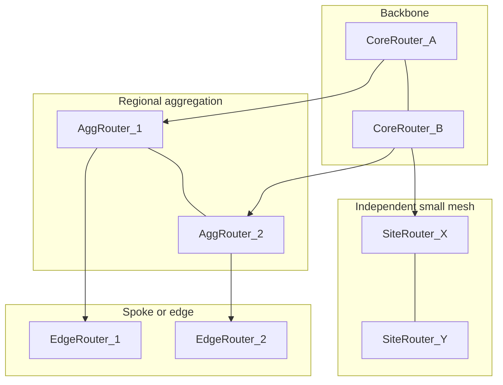
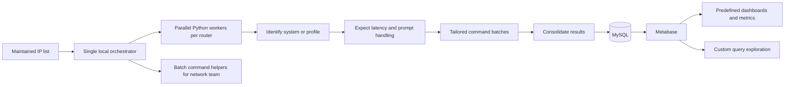

# 📡 Algar Telecom — network inventory (2017)

## 📇 Index

1. [🪪 Role snapshot](#-role-snapshot)
2. [🧩 Components and systems I touched](#-components-and-systems-i-touched)
3. [👥 Team and scope](#-team-and-scope)
4. [🔄 Sync model](#-sync-model)
5. [🗄️ Data stack](#-data-stack)
6. [📐 Diagrams](#-diagrams)
7. [✨ Stories and notable facts](#-stories-and-notable-facts)
8. [🔗 Related](#-related)

## 🪪 Role snapshot

**2017 · Algar Telecom · network inventory (primary IC, first job).** The org operated on the order of **~300** mixed-brand routers. Knowledge of the estate lived mostly in **people’s heads** and scattered notes—not everyone had equally **current** documentation—so the goal was an **automated, shared map**: poll from an **authoritative IP list**, classify each device, run **tailored command batches** over **SSH**, and land structured facts in **MySQL** with **Metabase** on top for dashboards.

It was my **first job** and I **owned the automation** end to end at first. As the project **grew in scope**, **other interns** sat close by and **joined to help**—same cohort energy, not a large formal team. I started with **C++ experiments** (my strongest language from competitive programming), including a router data extractor, but eventually saw that approach would not scale well for rapid iteration across many device profiles and SSH edge cases. I moved to **Python**, spawning **parallel local processes** where each process handled operations for a **distinct router**. Roughly **~3 months** in, there was **working Python** that could drive the end-to-end flow; after that, progress was mostly **back-and-forth with network engineers** on **which fields mattered** and **how to show them** in Metabase—not constant application churn.

Early on I leaned into **per-machine scripts** and kept outputs in ways that were **fast for me** but **hard to defend as a long-term system** (informal paths, easy to misplace or duplicate). A **fellow intern from the same university** helped **pull that mess toward real structure**: clearer **tables in MySQL** and **Metabase** views that were easier for stakeholders to read. I also **onboarded a younger apprentice** who wanted to **study for competitive programming**—pairing, problems, and habits more than shipping production inventory code for them.

## 🧩 Components and systems I touched

- **Inputs** — **Maintained router IP list** as the source of truth for what to visit (no separate discovery crawler as the primary gate).
- **Prototypes** — **C++ router data extractor** (early learning and credibility on real CLI output), before the main **Python** pipeline took over.
- **Execution model** — A **single local orchestrator process** fans out into **parallel Python worker processes** (effectively one active worker per router up to local limits); each worker **identifies system / profile**, runs **tailored command batches**, then returns parsed payloads for **batch consolidation**.
- **Integration surface** — **SSH** sessions and remote command execution (vendor-neutral in this write-up), with **`expect`** scripts to handle prompt variations and filter responses from routers with **variable latency**.
- **Ops utility** — Besides inventory collection, the network team benefited from **handy batch command helpers** to apply repetitive updates across groups of routers in sequence.
- **Outputs** — Normalized rows plus topology-oriented fields such as **name**, **brand**, **capacity**, and **edges** (adjacency / relationship cues—exact relational shape evolved with feedback).
- **Consumption** — **MySQL** as system of record; **Metabase** as the place where stakeholders **explored and negotiated** what “good” reporting looked like—see [Data stack](#-data-stack).

## 👥 Team and scope

- **Engineering:** I was the **primary builder** of the inventory tool and pipeline (**first job**). As needs grew, **other interns** worked **nearby** and **contributed**—especially on **wiring MySQL to Metabase** (dashboards and exploration) while I stayed heavier on **SSH orchestration**, **per-router command batches**, and early **per-machine scripting**.
- **Mentoring / side thread:** I **onboarded a young apprentice** focused on **competitive programming** study (structure, practice, mindset)—parallel to the telecom project, not the same deliverable.
- **Peer from university:** Another intern from the **same university** helped **translate** ad hoc outputs into **better relational organization** in the database and **more useful visualizations** on the dashboard side—where I had been optimizing for **local iteration**, they improved **shared, queryable shape**.
- **Domain partners:** roughly **5–10 network engineers**, **telecom-heavy** with **limited programming** background—sources for **requirements**, **validation**, and **operational truth**, not co-authors of the codebase.
- **Project scope:** Single-domain **router mapping / inventory** for **~300** devices; the **tool and estate changed slowly** (no story about rapid feature growth or continuous streaming telemetry). Headcount on the engineering side **expanded modestly** when the project **outgrew one-person glue**.

## 🔄 Sync model

- **Cadence:** **~daily** scheduled runs as the default heartbeat, plus **manual** runs when someone needed an on-demand refresh or to dig into a subset.
- **Why not “performance engineering”:** sync was **low frequency**; the win was **coverage and a consolidated map** the team could trust, not shaving wall-clock on every run.
- **Execution shape:** one **local worker host** ran many concurrent Python + SSH jobs; router results were **merged into MySQL** after each batch so reporting stayed aligned with reality **without** continuous polling or streaming.
- **CLI robustness tactic:** used **`expect`** wrappers to tolerate inconsistent prompt timing and delayed outputs from slower routers before parsing/storing.

## 🗄️ Data stack

- **MySQL** — Stored router-derived fields and metadata from the mapping workflow. Schema intent centered on a **core device record** (identity, **name**, **brand**, **capacity**, and related facts) plus **edges** or adjacency modeled so the map was queryable, not only a flat dump of show commands. In practice the design **matured** as we moved away from **machine-scattered script outputs** toward **tables** that Metabase could join and filter cleanly.
- **Metabase** — The network team mostly used **predefined dashboards** (graphs and key metrics), with the option to run **custom queries** when investigating specific routers or anomalies. **Intern collaboration** mattered here: I was not the only one thinking about how **dashboard consumers** would navigate the data.
- **Discovery with stakeholders:** **which columns** and **which charts** landed in Metabase **co-evolved** with engineer feedback—several iterations between “interesting in SQL” and “useful on the floor.”

## 📐 Diagrams

**Illustrative topology (not a literal customer map):** some routers act as **backbone**; others hang off aggregators as **spoke-ish** sites; a few **more independent** pairs or small meshes attach off the core. Heterogeneity and partial meshing were normal.

**Pipeline (logical data flow):** from the IP list through one local orchestrator with parallel SSH workers, then into SQL and BI/ops usage.

## ✨ Stories and notable facts

- **C++ to Python pivot:** I began with **C++ tests/extractors**, then moved to **parallel Python processes** because it was more practical for fast iteration and many router-specific SSH flows.
- **First job, ~3 months to working Python** after learning the problem with stakeholders and real-device behavior.
- **~300 routers**, **~daily** scheduled sync plus **manual** runs, in a **slow-changing** context where “fresh enough for ops” beat raw throughput.
- **Schema and Metabase co-design** with **telecom-first** engineers: repeated cycles to agree on **fields to collect** and **how dashboards should read** for day-to-day use.
- **Scope growth and interns:** The work **outgrew pure solo glue**; **other interns** joined **in the same space**, and I stayed closest to **automation and per-device SSH logic** while a **university peer** strengthened **database layout** and **Metabase ↔ DB integration** so reporting stayed **organized and visual**, not a pile of **one-off scripts per machine** and **questionable file habits**.
- **Apprentice for competitive programming:** I invested time **onboarding** a younger apprentice toward **CP study** (practice loop, resources, clarity on goals)—**adjacent** to Algar deliverables, honest about where my attention went alongside the inventory build.
- **Retrospective honesty:** For a first independent job, the result delivered value but was an **odd, low-resource approach** with limited experience behind it and a **messy repository** (too much machine-specific script detail, weak organization). With today’s experience I would keep the same core idea, but ship it with stronger **planning**, **operation abstractions**, and **data contracts** for **higher reliability and accuracy** across many router operations.

For full STAR drills, rehearse from [`../reference/rehearsal.md`](../reference/rehearsal.md) and [`../reference/domains/README.md`](../reference/domains/README.md) with anchors into other roles.

## 🔗 Related

- [Work experience index](./README.md)
- [System design hub](https://github.com/gardusig/gardusig/tree/main/public/interview/system-design/README.md)
- [Interview prep hub](../../README.md)
