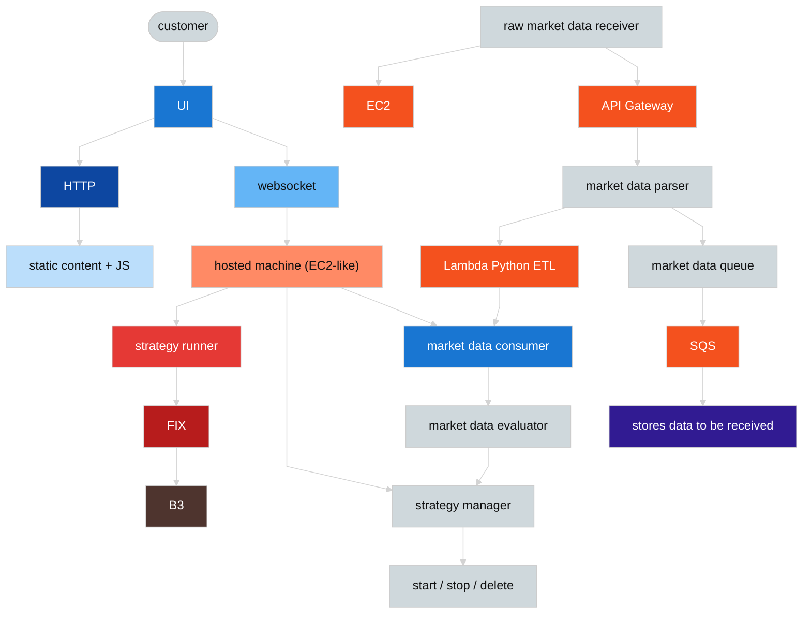

# 📈 Beyond — HFT platform (2019)

## 📇 Index

1. [🪪 Role snapshot](#-role-snapshot)
2. [🧩 Components and systems I touched](#-components-and-systems-i-touched)
3. [👥 Team and scope](#-team-and-scope)
4. [Diagram](#diagram)
5. [🧭 How the pieces fit](#how-the-pieces-fit)
6. [✨ Stories and notable facts](#-stories-and-notable-facts)

## 🪪 Role snapshot

**2019 · Beyond · high-frequency trading (RLP).** Work on a **C++ / Boost** performance-critical stack targeting **B3** over **FIX**, with **WebSocket** for operator UI and control. Two main surfaces: **live market data ingest** and **replay / strategy comparison** so a trading day could be re-run under alternative strategies and **P&L compared** side by side.

## 🧩 Components and systems I touched

- **Core path** — C++ trading / strategy runner, **FIX** session and orders to **B3**, **WebSocket** + **HTTP** operator UI, hosted **EC2-class** backend.
- **Market data pipeline** — ingest via **API Gateway**, **Lambda (Python ETL)**, **SQS**, parsers/queues into durable **stores for replay**; see [Diagram](#diagram) and [How the pieces fit](#how-the-pieces-fit).

## 👥 Team and scope

- **Team size (estimate):** *TBD — fill from memory.*
- **Project scope:** Exchange-integrated trading platform; AWS sidecars for **ETL, queuing, and persistence** of market data and replay artifacts.

## Diagram

**Palette:** `neutral*` — caller and control-plane modules; `read*` — UI and read-style transports; `write*` — order / session path to the venue; `ext*` — **B3**; `aws*` — **EC2**, **API Gateway**, **Lambda**, **SQS**; `db*` — durable buffer for received / replayable data.

### Legend

| Class family | Meaning |
| --- | --- |
| `neutral*` | Customer, strategy manager / evaluator, parsers and queues as **logic** (not the durable store) |
| `read*` | **UI**, **HTTP**, **WebSocket** — operator-facing surfaces and interactive transports |
| `write*` | **FIX** and **strategy runner** — session and order flow toward the exchange |
| `ext*` | External trading venue (**B3**) |
| `aws*` | **EC2**, **API Gateway**, **Lambda**, **SQS** |
| `db*` | **Stores data to be received** — durable buffer for downstream consumption and replay |

## How the pieces fit

- **Customer → UI:** operators configure and monitor strategies. **HTTP** serves **static content and JavaScript**; **WebSocket** carries interactive traffic to the **hosted** backend (an **EC2-class** deployment).
- **Strategy runner → FIX → B3:** the C++ execution path sends orders and session traffic over **FIX** to the exchange when deployed (the diagram shows the main outward data path; sessions are still request/response in practice).
- **Strategy manager** and **start / stop / delete** control strategy lifecycle without redeploying the whole stack.
- **Raw market data receiver → API Gateway → parser → Lambda ETL** feeds the **market data consumer**; the parser also lands data in the **market data queue → SQS → stores data to be received** path for persistence and replay.
- **Consumer → market data evaluator → strategy manager:** evaluated streams drive decisions; combined with stored day data, this supports **replaying a session with another strategy** and **comparing outcomes**.

## ✨ Stories and notable facts

### Accelerating Onboarding in a Large C++ Codebase

**Context**
A junior engineer joined the team with strong fundamentals but no prior exposure to either the financial trading domain or our large, performance-critical C++ codebase (hundreds of thousands of lines). The learning curve was steep, and inefficient onboarding risked slowing both individual productivity and team delivery.

**Goal**
Enable the engineer to become independently productive as quickly as possible, without creating long-term dependencies or requiring ongoing hand-holding.

**Approach**
- Started with structured pair programming on small, low-risk bug fixes to introduce:
 - Overall codebase architecture
 - Build and deployment system
 - Coding and review standards
- Gradually increased task complexity, transitioning to a small but end-to-end feature with a clearly defined scope.
- Aligned on design upfront to reduce rework and reinforce system-level thinking.
- Provided detailed code reviews focused on *why* changes were required, not just *what* to change.
- Used short, regular check-ins to unblock progress early while preserving ownership.

**Outcome**
- Within **~3 months**, the engineer was contributing independently to **core trading components**.
- Reduced ramp-up time compared to previous hires in the same codebase.
- Lowered review and rework overhead for the team after the initial onboarding phase.
- Established a repeatable onboarding approach reused for subsequent hires.

---

### Onboarding a Python engineer into market-data and strategy-evaluation

**Context**
A teammate joined with strong **Python** and analytical background and needed to contribute to the **data-heavy side** of the platform—how raw feeds became **durable, replayable inputs** and how **evaluated streams** fed strategy decisions—without first owning the **performance-critical C++ execution** path ([Accelerating Onboarding in a Large C++ Codebase](#accelerating-onboarding-in-a-large-c-codebase) is intentionally a **separate** arc).

**Goal**
Make them productive on the **Python and pipeline surfaces** that matched their strengths, with enough **system context** that changes did not break assumptions downstream of ETL and stores.

**Approach**
- Grounded ramp in the same mental model as [How the pieces fit](#how-the-pieces-fit): **raw receiver → API Gateway → parser → Lambda (Python ETL) → market data consumer → evaluator → strategy manager**, and where **replay** and **P&L comparison** expectations showed up.
- **Pairing on bounded tasks** (diagnostics, tests, small transformations) instead of asking them to map the full C++ tree first.
- **Review-as-teaching** on invariants that mattered for queues and persistence: ordering, idempotency, failure visibility, and what “good” looked like when data fed the consumer.
- **Short, regular check-ins** with explicit “read this next / try this next” so exploration time stayed directed.

**Outcome**
- They could own work in the **Python / market-data slice** with less repeated explanation from the core trading side.
- **Clear separation of mentoring stories:** this track is **pipeline and evaluation context**; the C++ story remains **core trading components and build/deploy** for a different hire profile.

---

### Building a Safe Testing Environment Without Exchange Access

**Context**
I joined a small company building a high-frequency trading system with **no prior finance or market microstructure background**. There was no access to a real exchange or sandbox—only a static PDF describing exchange rules—making safe development and validation a major risk.

**Goal**
Rapidly build domain understanding and enable safe development of an order-sending system without risking capital or deploying untested behavior to a live exchange.

**Approach**
- Invested early in learning core market concepts, including:
 - Order books and price levels
 - Order types and time-in-force semantics
 - Matching and execution rules
- Worked closely with the CTO to validate interpretations and resolve ambiguities in the exchange specification.
- Identified the primary risk as **lack of a realistic test environment**, rather than strategy logic itself.
- Designed and implemented a simplified exchange simulator directly from the PDF specification:
 - In-memory order book
 - Matching and execution logic
 - Basic latency modeling and state transitions
- Used the simulator as a local test harness to validate:
 - Order lifecycle behavior
 - Edge cases (partial fills, cancels, rejects)
 - Failure scenarios
 before building the production order sender.

**Outcome**
- Enabled safe, iterative development without access to a real exchange or risking capital.
- Converted an ambiguous, static PDF into executable behavior, uncovering multiple edge cases before production.
- Reduced integration risk by validating order flow early.
- Built sufficient domain expertise to actively contribute to system design discussions despite starting with **zero finance background**.

---

### Operating a Live Trading Bot Under Exchange Constraints

**Context**
As the system matured beyond experimentation, we needed a production-grade trading bot capable of operating during live market hours and interacting directly with the stock exchange. This required **low latency, high reliability, and strict correctness** under real market conditions.

**Goal**
Design and operate a trading bot capable of safely sending and managing **hundreds of orders per second** throughout the trading day while minimizing operational and financial risk.

**Approach**
- Implemented the core trading application in **C++**, deployed on **EC2**, communicating directly with the exchange via **WebSocket / FIX-based protocols**.
- Built extensive pre-deployment testing covering:
 - Full order lifecycle handling
 - Exchange error and reject scenarios
 - Network instability, reconnects, and session recovery
- Introduced layered safety mechanisms:
 - Rate limiting to prevent exchange throttling
 - Pre-send order validation
 - Kill-switches to immediately halt trading under abnormal conditions
- Gradually expanded functionality as confidence increased, adding support for new order types and strategy parameters without disrupting live trading.

**Outcome**
- Successfully operated a live trading bot throughout the trading day, reliably handling **hundreds of orders per second**.
- Maintained system stability under real market conditions with **zero critical production incidents**.
- Avoided trading halts or capital-impacting failures.
- Established a stable production foundation that allowed the team to focus on strategy iteration rather than infrastructure firefighting.

---

### Implementing FIX Protocol Integration and Custom Message Handling

**Context**
As part of direct exchange integration, I worked with the FIX protocol for the first time. Documentation was dense, tooling was limited, and the system also required real-time communication between the trading engine and a front-end interface via WebSockets.

**Goal**
Correctly implement FIX-based communication while extending standard messages to support internal strategy parameters and real-time observability.

**Approach**
- Studied FIX protocol fundamentals in depth, including:
 - Message framing, sequencing, and session management
 - Tag-based encoding and decoding
 - Differences between session-level and application-level messages
- Implemented FIX message parsing and serialization in C++, supporting:
 - Custom tags beyond the standard FIX specification
 - Non-standard field separators required by the exchange
- Designed a translation layer between FIX messages and internal domain models to isolate protocol complexity from strategy logic.
- Built WebSocket-based communication to the front end, enabling:
 - Real-time order and execution updates
 - Injection of additional parameters for monitoring and experimentation
- Validated correctness using recorded exchange traffic and simulated scenarios.

**Outcome**
- Successfully integrated with the exchange using FIX, including support for custom extensions.
- Enabled richer observability and strategy control without polluting core trading logic.
- Reduced operational risk by isolating protocol-specific complexity.
- Gained deep, hands-on experience with low-level financial protocols used in high-frequency trading systems.

---

### Navigating front-end ownership churn and an async replay handoff

**Context**
**2019 · Beyond.** On a small team, the operator UI was effectively a **single front-end seat** that **changed hands several times** while I stayed focused on the **backend**, **WebSockets**, and **API-level contracts** between services and the UI.

**What changed (external)**
Repeated **front-end ownership churn**—not a formal reorg I can name by title, but a practical “dance of chairs” on who owned the UI. Each new owner still had to wire into the same control and observability surfaces.

**What was de-prioritized / re-scoped**
Open-ended “re-explain the entire platform every rotation.” I **narrowed the next slice** the UI had to land and used **short, task-shaped summaries** so a new owner could start without my manager becoming the default bottleneck for every integration question.

**Approach**
- Kept **contracts and WebSocket behavior** explicit so the UI boundary did not depend on one person’s tacit knowledge.
- Prepared crisp briefs per rotation: what to call, what the stream carried, and what “done” looked like for that increment.
- Oriented each new owner to how **HTTP + static assets** and the **WebSocket client** attached to the **hosted** backend so local iteration had a clear integration target—not only “read the repo.”
- Where it unblocked people, walked through **build, run, and deploy expectations** for the UI slice they owned so environment setup was not tacit-only knowledge.
- Helped onboard engineers where I could; deeper structured ramps live in [Accelerating Onboarding in a Large C++ Codebase](#accelerating-onboarding-in-a-large-c-codebase) (core path) and [Onboarding a Python engineer into market-data and strategy-evaluation](#onboarding-a-python-engineer-into-market-data-and-strategy-evaluation) (pipeline / evaluation).

**Outcome**
- Less repeated rediscovery at the UI boundary and **more predictable handoffs** when the front-end owner changed.
- **Before leaving:** shifted part of the trading workflow from **live real-time venue interaction** to an **async, file-driven** path: ingest recorded market data and expose an **API to replay a day** under a chosen strategy—supporting iteration without that workflow depending on the live exchange. This is **distinct** from the early **PDF-based exchange simulator** in [Building a Safe Testing Environment Without Exchange Access](#building-a-safe-testing-environment-without-exchange-access) and from production **live bot** operations in [Operating a Live Trading Bot Under Exchange Constraints](#operating-a-live-trading-bot-under-exchange-constraints).

**Boundary (authenticity)**
This is **counterpart / ownership churn on a small team**, not a documented company-wide reorg. The replay API is an **additional** replay surface, not a retelling of the other stories in this file.

## 🔗 Related

- [Work experience index](./README.md)
- [System design hub](https://github.com/gardusig/gardusig/tree/main/public/interview/system-design/README.md)
- [Interview prep hub](../../README.md)
