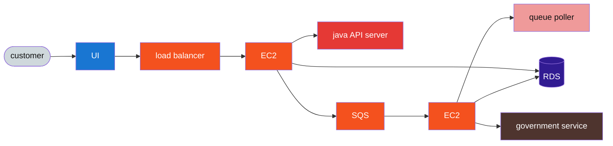

# 📦 Amazon FBA — Brazil shipment invoices (2021)

## 📇 Index

1. [🪪 Role snapshot](#-role-snapshot)
2. [🧩 Components and systems I touched](#-components-and-systems-i-touched)
3. [👥 Team and scope](#-team-and-scope)
4. [🇧🇷 Brazil-specific angle](#brazil-specific-angle)
5. [📐 Diagram](#diagram)
6. [🧭 How the pieces fit](#how-the-pieces-fit)
7. [✨ Stories and notable facts](#-stories-and-notable-facts)

## 🪪 Role snapshot

**2021 · Amazon · FBA Brazil (shipment invoices).** Reused **global FBA patterns** (internal APIs, queues, data stores) while adapting **invoice generation, validation, and persistence** for **Brazilian fiscal rules**. Day-to-day focus: **shipment invoices** so each seller→fulfillment leg carried **correct documentation per state crossed**.

## 🧩 Components and systems I touched

- **Web tier** — load-balanced **Java** services on **EC2**; **RDS** as system of record; **SQS** for async invoice and authority-facing work.
- **Brazil delta** — workers and payloads tuned for **SEFAZ-style** validation and multi-state routing; see [Brazil-specific angle](#brazil-specific-angle) and [Diagram](#diagram).

## 👥 Team and scope

- **Team size (estimate):** *TBD — fill from memory (e.g. SDE count on invoice slice + partner teams).*
- **Project scope:** High-volume **invoice and compliance** path for **FBA Brazil**; peak events such as **Black Friday** (see stories).

## Brazil-specific angle

- **Shared core:** load-balanced **Java API** on **EC2**, **RDS** for shipment and invoice state, **SQS** for asynchronous work—aligned with FBA elsewhere.
- **Brazil delta:** invoice payloads, timing, and retries had to satisfy **state-level requirements** and **government / tax authority** interfaces (e.g. SEFAZ-style validation), so the **async worker path** and **external “government service”** step dominated operational risk compared with markets with simpler VAT-style flows.

## Diagram

**Palette:** `neutral*` / `read*` — customer and UI; `ext*` — government compliance API; `aws*` — LB, **EC2**, **SQS**; `db*` — **RDS**; `write*` — synchronous API and async **poller** workers.

### Legend

| Class family | Meaning |
| --- | --- |
| `neutral*` / `read*` | **customer**, **UI** |
| `ext*` | **government service** (external compliance endpoint) |
| `aws*` | **Load balancer**, **EC2**, **SQS** |
| `db*` | **RDS** |
| `write*` | **Java API server** (sync path), **queue poller** (async worker) |

## How the pieces fit

1. **customer → UI → load balancer → EC2:** sellers and operators trigger flows that hit the same style of **web tier** as other FBA regions.
2. **EC2 → java API server:** synchronous **Java** services implement **shipment and invoice** orchestration, including Brazil-specific branching where global code paths were insufficient.
3. **EC2 → SQS** and **EC2 → RDS:** durable **queueing** for slow or fragile steps (authority calls, retries) and **RDS** as the system of record for shipments and invoice outcomes.
4. **SQS → second EC2 → queue poller:** workers **poll** the queue, normalize responses, and **write back** to **RDS**; **government service** is the right-hand integration for **validating or registering** invoices per Brazilian rules.

## ✨ Stories and notable facts

### Capacity Planning and Scaling for Black Friday Traffic

**Context**
Amazon FBA invoice services are a critical component of downstream financial workflows for sellers, processing a large share of Brazil-specific compliance data. Ahead of Black Friday, traffic projections showed up to a **10× increase in requests**, making reliability and latency under peak load a high-risk concern.

**Goal**
Validate that the service could safely handle Black Friday traffic and determine the **minimum required infrastructure** based on measured capacity, avoiding blind over-provisioning.

**Approach**
- Analyzed several months of historical traffic to identify:
 - Request distribution patterns (read vs. write, lightweight vs. heavy paths)
 - The top ~20% of endpoints responsible for the majority of CPU and DB usage
- Used logs and metrics to pick a **high-traffic window** (for example a prior peak such as Black Friday), then scaled counts down to a **shorter synthetic window** while preserving the implied **requests per second** and mix.
- Applied an **endpoint mix** aligned to production (a small share of paths carrying most of the volume) instead of uniform calls across APIs.
- Used a TPS generator to simulate **realistic peak traffic**, matching production request ratios instead of uniform load.
- Measured **sustainable throughput per host** (including local or single-instance runs) and iterated before extrapolating fleet size—reducing the problem to what one host could handle gracefully, then scaling out with headroom.
- Load-tested individual EC2 instances to measure:
 - Sustained TPS before latency degradation
 - CPU saturation points
 - Database connection pool limits
- Identified throughput bottlenecks driven primarily by CPU utilization and DB connection exhaustion.
- Modeled expected Black Friday capacity using measured per-host throughput, adding explicit safety headroom.
- Resized the EC2 fleet based on this model rather than static estimates.
- Implemented **dynamic auto-scaling policies** so the fleet could scale up during peak hours and scale back down automatically after traffic normalized.

**Outcome**
- Successfully handled Black Friday traffic with **99.99% uptime** and no customer-visible incidents.
- Peak traffic was absorbed without latency SLO violations.
- Capacity planning was grounded in empirical measurements rather than assumptions.
- Automatic scale-down after the event reduced ongoing infrastructure costs while maintaining reliability.

This work depended on **trustworthy, production-shaped load**; getting the internal TPS tool wired correctly for this service is covered in [Load testing integration: blocked path, expectation reset, and discovery](#load-testing-integration-blocked-path-expectation-reset-and-discovery) and [Making Load Testing a Mandatory Quality Gate](#making-load-testing-a-mandatory-quality-gate).

---

### Load testing integration: blocked path, expectation reset, and discovery

**Context**
The org had a **widely used internal** load-testing (TPS) tool and patterns, but onboarding it to **this** team’s deployment pipeline and repo layout did not “just work.” The blocker was **on my side first**: I did not yet know the integration surface well, and **documentation did not spell out** the path for our older layout—not a customer-facing outage, but a real risk to the reliability work we needed for peak (see [Capacity Planning and Scaling for Black Friday Traffic](#capacity-planning-and-scaling-for-black-friday-traffic)).

**What went wrong / what I underestimated**
I treated “standard tooling” as a shortcut for **knowing what to do first** when stuck. Without a clear map, I **flailed between actions** (tweaks, neighbor-team asks, partial reads) instead of a tight sequence: what to validate, what to rule out, where to look next. That slowed real progress more than the tool’s reputation implied.

**Ownership and immediate correction**
I **raised the risk early with my manager** instead of quietly slipping dates. We **renegotiated what “done” meant** for that task—an extended, explicitly fuzzy timeline—so expectations were visible rather than pretend precision. I **kept delivering other committed work in parallel** so the team was not single-threaded on an unknown integration, and I **organized the remainder as chunked research** (periodic probes, follow-ups when something might have changed) so the thread stayed honest instead of looking like continuous forward motion when it was not.

**Breakthrough**
I stopped relying on **nearby verbal answers alone** and went to **internal documentation and code**. A **repository from another team** with a similar structure to ours showed the pattern: a **small, correct integration** on existing infra, but our service sat on an **older configuration model** that required a **non-obvious custom setting** peers did not have in muscle memory. **Discovery dominated the timeline; implementation was fast once the pattern was known.**

**What I do differently after**
- Under a **knowledge + docs gap**, write down **one ordering of next actions** (smallest proof, then widen) instead of ad hoc tries.
- Treat **integration and “works elsewhere” tools** as first-class schedule risk with an explicit stakeholder loop when dates are fuzzy.
- Broaden discovery beyond immediate peers: **internal code and sibling-team repos** as primary evidence when runbooks stall.
- Separate **calendar time** from **engineering effort** in communication so “still researching” does not read as “no progress.”

---

### Making Load Testing a Mandatory Quality Gate

**Context**
The team had a TPS (transactions-per-second) generator available, but it was unreliable and not part of the standard development workflow. As a result, performance regressions could ship unnoticed.
This directly impacted the team’s **service reliability score**, a formal Amazon metric already trending low and triggering operational review pressure.
Once the tool was **correctly integrated** for our service (see [Load testing integration: blocked path, expectation reset, and discovery](#load-testing-integration-blocked-path-expectation-reset-and-discovery)), the remaining work shifted to **trust, repeatability, and enforcement**.

**Goal**
Make load testing reliable, trusted, and enforceable so performance became a measurable, non-optional part of the release process.

**Approach**
- Diagnosed why engineers avoided the TPS generator and found:
 - Default configurations produced unstable, misleading results
 - Results varied significantly between runs, eroding trust in the tool
- Iterated on configurations and validated results against known production behavior to stabilize measurements.
- Established a **production-aligned TPS baseline** that reflected real traffic patterns and latency expectations, building on the integration pattern above.
- Integrated load testing into the **CI/CD pipeline**, configuring builds to automatically fail when TPS or latency thresholds were not met.
- Aligned with the team to treat performance failures as **release blockers**, not advisory signals.

**Outcome**
- Load testing became a standard, automated quality gate for every deployment.
- Performance regressions were consistently caught in CI rather than in production.
- The team’s service reliability score improved over subsequent review cycles, reducing escalation risk.
- Release confidence increased, and performance ownership became part of the team’s normal engineering culture.

---

### Reducing On-Call Noise Through Root-Cause Fixes

**Context**
When I joined the on-call rotation as a shadow, the service generated a high volume of alerts, particularly recurring **disk space alarms**.
The common response was manual cleanup during incidents, which reduced immediate pressure but did not address the underlying issue.

**Goal**
Even in a shadow role, proactively identify the root cause of recurring alerts and reduce on-call noise through a permanent fix.

**Approach**
- Reviewed historical on-call tickets, logs, and disk usage metrics to identify alert frequency and patterns.
- Traced disk exhaustion to a specific invoice-generation workflow that:
 - Created temporary files during processing
 - Failed to reliably clean them up after completion
- Worked with the primary on-call engineer to implement a code fix ensuring temporary files were deleted as part of the normal execution path.
- Added targeted disk usage monitoring and alarms for the affected directories to enable early detection.
- Created a cleanup script for defensive recovery and updated runbooks to document:
 - Root cause
 - Expected steady-state behavior
 - Manual recovery steps if needed

**Outcome**
- Recurring disk space alerts were eliminated, significantly reducing on-call noise.
- Manual cleanup during incidents was no longer required.
- On-call tickets related to disk usage dropped by **~10%**.
- Improved observability and operational stability of the service.
- Enabled faster on-call ramp-up and reduced cognitive load for the rotation.

---

### Delivering Seller-Facing Invoice Improvements Under Tight Deadlines

**Context**
Brazilian FBA sellers needed clearer visibility into invoice expiration rules, which vary by state and affect both legal compliance and the ability to transport goods to Amazon storage facilities.
There was a **tight deadline to support two additional states**, while full nationwide coverage had no fixed timeline. I worked in pair with an engineer who had recently joined the team.

**Goal**
Deliver correct, state-specific invoice expiration dates for the highest-priority states under a tight deadline, without introducing new services or blocking future extensibility.

**Approach**
- Paired with the new team member to:
 - Transfer domain knowledge around Brazilian fiscal rules
 - Accelerate delivery under time pressure
 - Avoid knowledge silos and single-owner risk
- Made an explicit short-term tradeoff:
 - Optimized for speed and correctness over full generalization
- Implemented a **pragmatic interim solution**:
 - Extended existing **Java microservices** with state-specific expiration logic
 - Used hard-coded values where appropriate to meet the immediate deadline
 - Covered both invoicing and transport-to-fulfillment expiration constraints
- Updated the **React-based UI** to clearly surface state-specific expiration dates to sellers.
- Ensured strict consistency between backend validation and frontend presentation.
- After stabilizing the solution, proposed a **long-term system design**:
 - A dedicated invoice expiration manager service
 - Automatic discovery of seller state
 - Centralized ownership of state-specific rules and metadata
 - Simpler extensibility for adding new states without duplicating logic

**Outcome**
- Met the tight deadline for the two priority states without delaying dependent workflows.
- Sellers gained immediate, accurate visibility into invoice expiration rules.
- Reduced ambiguity around compliance and inbound shipment eligibility.
- Enabled the new engineer to ramp up quickly through pair programming and shared ownership.
- Established a clear migration path from hard-coded logic to a scalable, country-wide solution.
- Improved overall usability and correctness of FBA invoice tooling for Brazilian sellers.

---

### Adapting to a manager change mid-tenure

**Context**
**2021 · ~11 months** on FBA Brazil shipment invoices. One manager had been involved through interview and early onboarding; **partway through the same role**, my **reporting line moved to a different manager**. I was still ramping on how to run a steady management thread, and momentum from earlier 1:1s did not automatically carry over.

**What changed (external)**
A **manager handoff**, not an org-wide reorg or program cancellation I can fairly name—just a different person owning goals, context, and expectations for my work.

**What was de-prioritized / re-scoped**
Implicit continuity: verbal-only memory of what we had discussed, agreed to prioritize, and queued for follow-up. Without my own trail, it was easy to lose threads or repeat discovery after the switch.

**Approach**
- Kept a **running log** for myself: prior discussion topics and their goals, what I was actively delivering, and **next 1:1 topics** I wanted to drive.
- Refreshed it before meetings so I was not re-deriving the plan from scratch each time.

**Outcome**
- After the habit stuck, it felt almost trivial—but it directly reduced thrash when the management relationship reset mid-tenure.
- Engineering delivery on the same product area continued; concrete outcomes in this file include [Capacity Planning and Scaling for Black Friday Traffic](#capacity-planning-and-scaling-for-black-friday-traffic), [Load testing integration: blocked path, expectation reset, and discovery](#load-testing-integration-blocked-path-expectation-reset-and-discovery), [Making Load Testing a Mandatory Quality Gate](#making-load-testing-a-mandatory-quality-gate), and [Delivering Seller-Facing Invoice Improvements Under Tight Deadlines](#delivering-seller-facing-invoice-improvements-under-tight-deadlines).

**Boundary (authenticity)**
This story is about **reporting-line change**, not a described company reorg or a cancelled epic.

## 🔗 Related

- [Work experience index](./README.md)
- [System design hub](https://github.com/gardusig/gardusig/tree/main/public/interview/system-design/README.md)
- [Interview prep hub](../../README.md)
