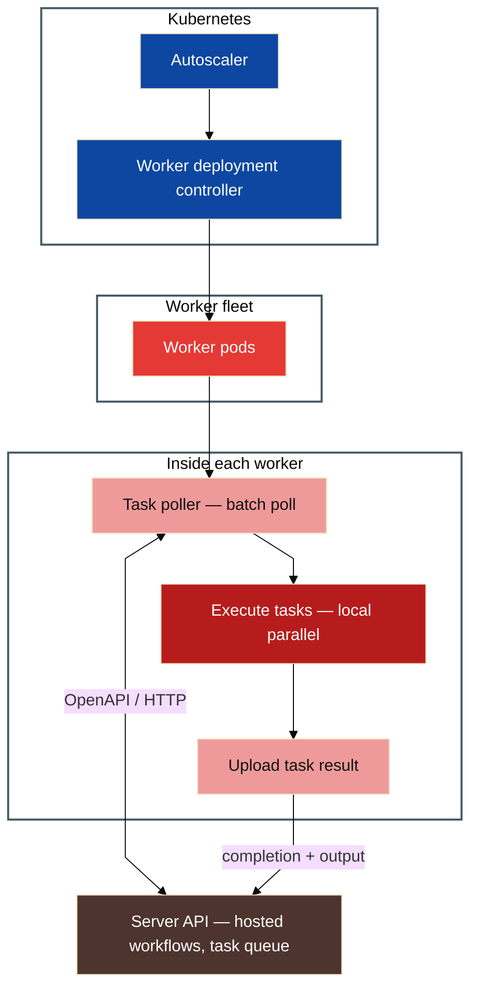

# 🔧 Orkes — Conductor SDKs (2022)

## 📇 Index

1. [🪪 Role snapshot](#-role-snapshot)
2. [🧩 Components and systems I touched](#-components-and-systems-i-touched)
3. [👥 Team and scope](#-team-and-scope)
4. [✨ Stories and notable facts](#-stories-and-notable-facts)

## 🪪 Role snapshot

**2022 · Orkes · Conductor SDKs.** Owned and extended **client SDKs** for **Netflix Conductor–class** workflow orchestration: idiomatic libraries on top of **OpenAPI**-described server contracts, used by **worker** fleets on **Kubernetes** (poll → execute → report).

## 🧩 Components and systems I touched

### How the orchestrator and workers fit together

The Conductor **server** hosts **workflow definitions**—graphs of steps, transitions, retries, and orchestration state that are **conceptually close to AWS Step Functions**: you describe *what* should run and in what order; the engine advances execution as tasks complete. **Workers** implement *how* each task runs: they are decoupled processes that **talk to the server only through its API**.

In practice I worked **mostly through the SDKs and the HTTP surface** documented in **Swagger/OpenAPI**. I had access to **server code** when debugging or validating behavior, but day-to-day design and integration **followed the public API contracts** (poll for work, execute, report completion, workflow CRUD).

**Typical worker loop:** **poll for tasks in batches** → **execute the batch locally in parallel** (threads or processes, depending on runtime and workload) → **upload task results** (status, output) back to the server so the workflow can schedule the next steps. **Kubernetes** scales the worker fleet: autoscalers and deployment controllers change replica counts while each pod runs that poll → execute → report cycle against the same **server API**.

The **SDKs** add **developer experience** on top of raw HTTP: idiomatic clients, configuration, auth, retries, and **shortcuts** so teams do not hand-roll polling protocols, payload shapes, and error handling for every service.

**Diagram:** each **subgraph** uses a **white** panel with a dark border. **Blue (`read*`)** — Kubernetes control plane; **red (`write*`)** — worker fleet and task execution; **brown (`ext*`)** — Conductor **server API** (hosted orchestration you call over HTTP).

## 👥 Team and scope

- **Team size (estimate):** *TBD — fill from memory (e.g. platform vs SDK split).*
- **Project scope:** **Multi-language SDK ecosystem** (Go, Python, Java, C#, JavaScript) with shared **OpenAPI** baseline, **CI/CD** to package managers, and **enterprise** adoption blockers removed through SDK delivery.

## ✨ Stories and notable facts

### Unblocking Enterprise Adoption by Delivering a Go SDK from Scratch

**Context**
A large enterprise prospect evaluating Orkes required a **Go SDK as a hard prerequisite** to proceed with adoption. At the time, Conductor officially supported only Java and Python SDKs, making Go support a **deal-blocking gap**.

**What changed (external)**
The prospect’s path to adoption made **Go SDK support a hard gate** while the supported SDK surface was still effectively **Java and Python**—a **deal-blocking gap** outside my prior Go depth.

**What was de-prioritized / re-scoped**
Staying only in familiar-language lanes until Go felt “comfortable”; the phased plan traded **broad internal polish first** for a **narrow, evaluation-ready Phase 1** API slice on a **~4-week** clock, then widened toward production parity on the **~3-month** horizon.

**Goal**
Unblock the customer evaluation within **~4 weeks** by delivering a stable Go SDK with core functionality, while designing a path to a **fully production-grade SDK within ~3 months**.

**Approach**
- Volunteered to own the Go SDK end-to-end despite limited prior Go experience.
- Defined and executed a **phased delivery plan**:
 - **Phase 1 (≈1 month):**
 - Core workflow and task APIs
 - Authentication and configuration
 - Basic error handling and retries
 - Stability sufficient for customer evaluation
 - **Phase 2 (≈3 months):**
 - Expanded API surface to match existing SDKs
 - Improved ergonomics and retries
 - Documentation and examples
 - Long-term maintainability and versioning
- Analyzed existing **Java and Python SDKs** to extract shared abstractions, error semantics, and API consistency.
- Ramped up in Go by building focused prototypes and adopting **Go-native idioms** instead of performing a direct port.
- Designed a **stable public interface** with explicit versioning and backward compatibility guarantees.
- Worked directly with the customer during Phase 1, incorporating real usage feedback into API design.
- Coordinated closely with the core platform team to validate backend compatibility as SDK coverage expanded.

**Outcome**
- Delivered a functional Go SDK within **~4 weeks**, unblocking the enterprise evaluation.
- Completed a **production-ready Go SDK within ~3 months**, covering the majority of platform APIs.
- The customer signed on, directly contributing to revenue.
- The Go SDK became an **official, supported integration** and a foundation for future customers.
- Demonstrated incremental delivery under customer pressure without sacrificing long-term SDK quality.

---

### Scaling from One SDK to a Cross-Language SDK Ecosystem

**Context**
As Orkes grew, enterprise customers required SDK support across multiple languages. The platform scaled from **1 SDK to 5 (Java, Python, Go, C#, JavaScript)**, but development, testing, and releases were largely **manual, inconsistent, and error-prone**.

**Goal**
Take ownership of the SDK ecosystem to:
- Maintain **feature parity** across languages
- Improve adoption and usability
- Optimize performance where relevant
- Eliminate manual friction in testing and releases

**Approach**
- Standardized SDK architecture using **Swagger/OpenAPI–generated code** as a shared baseline.
- Layered **language-specific customizations** to preserve idiomatic usage, annotations, concurrency models, and ergonomics.
- Coordinated development across languages to keep APIs and behavior consistent despite runtime differences.
- Designed and implemented a **unified CI/CD pipeline** that:
 - Automatically ran unit and integration tests
 - Built SDK artifacts
 - Published releases to package managers (e.g., PyPI, npm) on merge to main
- Improved developer experience with **Dockerized local workflows** and predictable tooling, enabling rapid context-switching across SDKs.

**Outcome**
- Scaled from **1 → 5 production SDKs** without increasing operational overhead.
- Release cycles became **fully automated**, significantly reducing manual errors and release latency.
- SDKs transitioned from a scaling bottleneck to a **repeatable, maintainable platform capability**.
- Customers onboarded more easily across diverse tech stacks, increasing platform adoption.

---

### Clojure SDK, calendar limits, and a mentoring handoff

**Context**
In my **first year** at Orkes I moved from early SDK friction to **shipping across several managed SDKs** in parallel (see [Unblocking enterprise adoption by delivering a Go SDK from scratch](#unblocking-enterprise-adoption-by-delivering-a-go-sdk-from-scratch) and [Scaling from One SDK to a Cross-Language SDK Ecosystem](#scaling-from-one-sdk-to-a-cross-language-sdk-ecosystem)). I was on the **on-call rotation** for long stretches with **few interrupt-driven pages**, so most of the bottleneck was **planned depth work**, not firefighting. The next stretch included a **sixth language track (Clojure)**: I was **not proficient** and **less comfortable** than with Go, where I had already learned to work slowly and deliberately.

**What went wrong**
I **stacked too many parallel bets**: deep SDK ownership plus a **personal side acquisition** outside work that demanded more calendar than I had modeled. **Time organization broke first**—not code quality in isolation. Clojure work **lost focus** relative to Go, where I could still sustain patient progress, and I **overestimated how much sustained deep work** I could commit across languages in the same season. That put **delivery confidence at risk** rather than inventing a production disaster.

**Ownership and immediate correction**
I **talked to my manager early** about the situation—capacity, language comfort, and side commitments—instead of silently hoping to catch up. I proposed an **alternate path**: **structured handoff and mentoring** to a **recently joined teammate** who was eager to contribute, with pairing and context transfer so Clojure ownership moved cleanly. Remote collaboration on that handoff worked well: explicit checkpoints, written artifacts, and shared ownership so the customer thread did not depend on me pretending I had unlimited focus.

**Outcome**
The work **completed through the mentoring path**; I kept accountability for outcomes while **sharing execution**. I internalized a durable rule: **cap parallel “hard learning” lanes** when calendar is already spoken for, and **reset commitments with the manager before the slip shows up in quality**. I **no longer run that side business** (clearer boundaries today); I would only take something similar again with an explicit capacity model—especially alongside high-context language work.

---

### Public API hygiene: assumed low adoption, fast cleanup, and upgrade pain

**Context**
While the Go SDK and broader SDK work were accelerating (see [Unblocking enterprise adoption by delivering a Go SDK from scratch](#unblocking-enterprise-adoption-by-delivering-a-go-sdk-from-scratch)), I treated one repository as **mostly internal**—**cleaning up** structure, tightening automation, and moving fast. I **assumed** relatively **few external consumers** and did not yet habitually treat **every public export** and **documentation link** as a **versioned contract**. I was less used to thinking in terms of **customers pinned on older releases**.

**What went wrong**
There **were** users already depending on the project. After changes shipped, **at least one upgrade broke** in ways that traced back to how the repo had been maintained—not a dramatic outage narrative, but **real integration pain** for someone on an older line. I had prioritized **speed** over **guardrails**: I did not systematically **review doc links** and **public API surfaces** before restructuring, and I used **maintainer permissions** to apply an **aggressive cleanup** that included **force-push / rebase rewriting history** on the shared default branch. That **removed or obscured commit-level detail** people relied on when reasoning about behavior across versions. The automation and permissions were **technically allowed**; the mistake was **judgment** about what a public SDK repo must never do casually.

**Ownership and immediate correction**
I **owned the customer impact** instead of defending the cleanup as “just internal.” I worked through **what broke on upgrade**, restored a **credible upgrade path** (including clarifying what semver meant for that surface), and stopped treating “fast repo hygiene” as neutral when consumers exist.

**What I do differently after**
- **Regression tests as a compatibility harness:** cover **each public function / exported entry point** with tests that represent how customers actually call the SDK—not only happy-path internals.
- **No abrupt public contract changes:** prefer a release that **supports both** the old and new shape, **deprecate** with a clear timeline, **then** remove—especially when adoption was underestimated once already.
- **Release checklist** explicitly includes **documentation links**, **generated doc paths**, and **API diff review**, not only code merge.
- **Branch and permission hygiene** on shared defaults: **no history rewrite** on lines customers track; use **protected branches**, **changelogs**, and processes that make “speed” impossible to trade against **silent breakage**.

---

### Improving Python SDK Throughput with Data-Driven Concurrency Decisions

**Context**
High-volume customers using the Python SDK experienced throughput limitations under load. An initial proposal focused on **multithreading with a single polling loop**, primarily optimizing I/O-bound behavior.

**Goal**
Maximize throughput for both **I/O- and CPU-heavy workflows** while preserving correctness and operational safety.

**Approach**
- Proposed an alternative design based on **multiprocessing with batch polling** to:
 - Bypass Python’s GIL for CPU-bound workloads
 - Reduce polling overhead by processing tasks in batches
- Built a proof of concept and ran load tests comparing:
 - Multithreading + single poll
 - Multiprocessing + batch poll
- During testing, detected anomalous behavior: queue size remained constant despite active workers.
- Investigated beyond the SDK layer and identified a **server-side bug**: missing acknowledgment logic caused batch-polled tasks to be requeued indefinitely.
- Validated the root cause with the backend team.
- Contributed with a fix to **Netflix OSS**, where the behavior originated.

**Outcome**
- Team aligned on **multiprocessing + batch polling**, backed by benchmark data.
- Achieved **~20% throughput improvement** in high-volume workflows.
- Prevented a latent production issue where queues could silently grow under load.
- Open-source contribution was accepted, reducing long-term maintenance risk.

---

### Reducing SDK Onboarding Friction Through Code-Driven Documentation

**Context**
Despite functional SDKs, support tickets and customer feedback consistently pointed to **confusing onboarding and unclear usage patterns**, increasing support load and slowing adoption.

**Goal**
Reduce customer friction and support volume by making SDK onboarding intuitive and consistent across languages.

**Approach**
- Reviewed support tickets, customer feedback, and recurring questions to identify common pain points.
- Proposed a **code-first documentation model**, prioritizing real, working examples over abstract explanations.
- Reused **integration and end-to-end tests** as the source of truth for documentation examples.
- Created **side-by-side, multi-language snippets** to help users map concepts across SDKs.
- Collaborated with the tech writing team to restructure documentation for clarity and consistency.
- Iterated continuously based on customer and internal feedback.

**Outcome**
- SDK-related onboarding and usage tickets dropped by **~75%**.
- Customers onboarded faster with fewer clarification cycles.
- Engineering time spent on repetitive support questions was significantly reduced.
- Documentation became a trusted reference for both customers and internal engineers.

## 🔗 Related

- [Work experience index](./README.md)
- [System design hub](https://github.com/gardusig/gardusig/tree/main/public/interview/system-design/README.md)
- [Interview prep hub](../../README.md)
