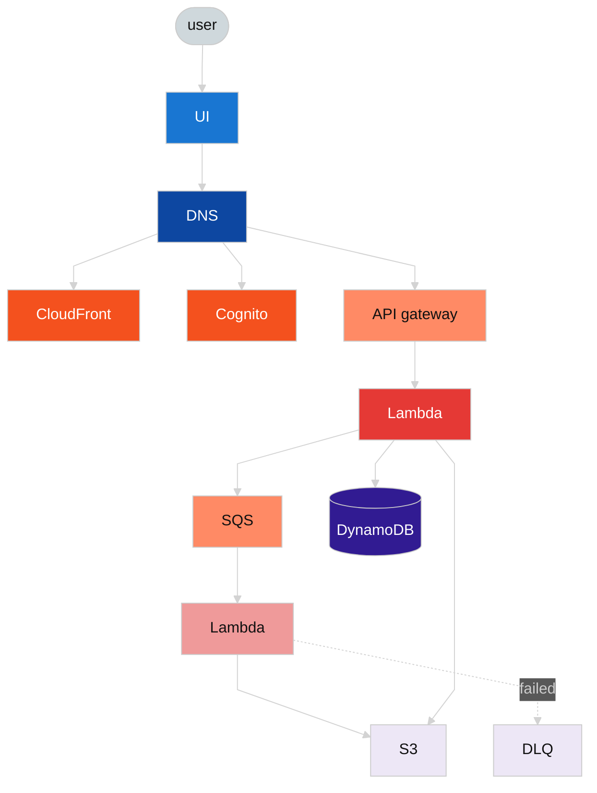

# 🎮 AWS: Game-Based Learning — Skill Builder (2024)

## 📇 Index

1. [🪪 Role snapshot](#-role-snapshot)
2. [🧩 Components and systems I touched](#-components-and-systems-i-touched)
3. [👥 Team and scope](#-team-and-scope)
4. [📐 Architecture](#architecture)
5. [✨ Stories and notable facts](#-stories-and-notable-facts)

## 🪪 Role snapshot

**2024 · AWS · Game-Based Learning (Skill Builder).** **Public user profile** and related flows on a **serverless AWS** stack, with **React + TypeScript** + **Tailwind** front end and infrastructure as code (**CDK**).

## 🧩 Components and systems I touched

- **Edge and auth** — **CloudFront**, **Cognito**, **API Gateway**.
- **Compute and data** — **Lambda** (sync + async), **DynamoDB**, **S3**, **SQS** + **DLQ** for poison messages.
- **Diagram and request path** — see [Architecture](#architecture).

## 👥 Team and scope

- **Team size (estimate):** *TBD — fill from memory.*
- **Project scope:** Public profile and catalog-adjacent flows on **serverless** AWS; cross-team catalog launch dependencies (see stories).
- **Reporting / org change (explicit):** This role file does **not** document a **team reorg** or a **manager / reporting-line handoff** arc for Game-Based Learning. Adaptation here is **cross-team dependency risk** and **scope expansion** (see stories). **Tenure-end / why leave / Brazil** public framing lives in [`./current-situation.md`](./current-situation.md); **Connect (2025)** technical stories in [`./2025-aws-connect.md`](./2025-aws-connect.md).

## Architecture

**Palette:** `neutral*` / `read*` — **user**, **UI**, **DNS**; `aws*` — managed AWS edge and messaging; `write*` — Lambdas on command/async paths; `db*` — **DynamoDB**, **S3**, **DLQ** as durable records.

### Legend

| Class family | Meaning |
| --- | --- |
| `neutral*` / `read*` | **user**, **UI**, **DNS** |
| `aws*` | **CloudFront**, **Cognito**, **API Gateway**, **SQS** |
| `write*` | **Lambda** (sync primary handler, async worker) |
| `db*` | **DynamoDB**, **S3**, **DLQ** |

### How the pieces fit

1. **user → UI → DNS:** the browser loads the app; **DNS** resolves the hostname to the right entry points.
2. **CloudFront:** serves **static assets** for the SPA (pages, JS, CSS).
3. **Cognito:** **validates credentials** and issues tokens for authenticated API calls.
4. **API Gateway:** routes HTTP APIs to the **primary Lambda**, mapping routes to functions.
5. **Primary Lambda:** short-lived handlers for synchronous work; can **write to DynamoDB** (authoritative state), **put objects to S3**, and **enqueue work to SQS** for slower or decoupled processing.
6. **SQS → secondary Lambda → S3:** async consumers process queue messages and persist results to **S3**; repeated failures land in a **DLQ** for inspection and replay.

---

## ✨ Stories and notable facts

### Unblocking Large-Scale Catalog Classification Under Cross-Team Dependencies

**Context**

Ahead of launching a new internal catalog, **100+ game-based learning courses** needed to be manually categorized with specific labels. The final classification depended on input from a product owner in a neighboring team, and repeated delays put the launch timeline at risk.

**What changed (external)**
Launch readiness depended on a **neighboring product owner**; **async follow-ups stalled** often enough that the **catalog timeline** was at real risk—not a leadership reprioritization narrative, but a **moving collaboration reality** mid-quarter.

**What was de-prioritized / re-scoped**
A workflow that assumed **full manual classification** for every course and **slow back-and-forth** as the primary coordination mode.

**What was still delivered**
**100+** courses categorized in time for launch via **automation + review**, with **lower manual effort** and **consistent labeling** (see **Outcome**).

**Goal**

Ensure catalog data was ready on time despite a high-risk, manual dependency on a non-engineering stakeholder.

**Approach**
- Built a script to collect and normalize metadata across all courses, generating a spreadsheet pre-filled with most required fields.
- Analyzed the dataset and identified **repeating patterns** across courses that made full manual classification unnecessary and error-prone.
- Aligned with my manager on defining **default classifications and shortcuts**, allowing labels to be suggested programmatically instead of filled manually.
- Reduced the remaining work from full data entry to **targeted review and adjustment**.
- When async follow-ups continued to stall progress, escalated early and switched to **short, synchronous working sessions**, staying available to unblock decisions in real time.

**Outcome**
- Completed categorization within a few focused sessions, unblocking the catalog launch on schedule.
- Reduced manual effort across **100+ items** to a review-driven workflow.
- Minimized risk of inconsistent or incorrect labeling.
- Demonstrated effective ownership in navigating cross-team, non-engineering dependencies through automation and timely escalation.

---

### Delivering a New Public User Profile Page as a Full-Stack Owner

**Context**
The team needed a new **public-facing user profile page** to showcase achievements across game-based learning courses. The existing UI was outdated, inconsistent, and not reusable, so the decision was made to replace it entirely.

**What changed (external)**
Product chose a **full replace** of the profile experience on a **tight timeline**, with a **modern front-end stack** (**React + TypeScript** + **Tailwind**) while **reusing existing APIs**—expanding what “done” meant for my slice of ownership.

**What was de-prioritized / re-scoped**
Staying **backend-only** for that outcome and **incremental patch** of the legacy UI; time went to **front-end depth** first where the gap was largest.

**What was still delivered**
A **production-ready public profile** and **full-stack delivery within ~3 months**, plus a **maintainable base** for later enhancements (see **Outcome**).

**Goal**
Deliver a production-ready profile page from **Figma design to deployment**, reusing existing APIs while adopting a modern frontend stack, within a tight timeline.

**Approach**
- Took end-to-end ownership despite a primarily backend background.
- Reused existing backend APIs, focusing effort where the gap was largest: frontend implementation.
- Ramped up quickly on the team’s frontend stack and translated Figma designs into a **React + TypeScript** application styled with **Tailwind CSS**.
- Integrated the frontend with AWS infrastructure (Cognito, CloudFront, API Gateway, Lambda, DynamoDB) defined via **CDK**.
- Iterated closely with design and product to validate layout, data presentation, and usability.

**Outcome**
- Delivered a new public profile experience that clearly visualized user progress across multiple courses.
- Replaced a legacy UI with a clean, maintainable frontend, improving usability and future extensibility.
- Expanded scope from backend-focused work to **full-stack delivery within 3 months**.
- Provided a reusable foundation for future Skill Builder profile enhancements.

---

### Enabling LinkedIn Sharing with Reliable Achievement Previews

**Context**
Users wanted to share learning achievements on LinkedIn, including a **badge image preview**. The profile page used a micro-frontend architecture where data was composed client-side, which conflicted with how social media crawlers generate previews.

**Goal**
Enable reliable LinkedIn previews (title, description, badge image) without introducing security risks or destabilizing the existing frontend architecture.

**Approach**
- Investigated LinkedIn’s preview mechanism and confirmed it relies on **server-generated Open Graph meta tags**, not client-side JavaScript.
- Identified a core limitation: achievement data was only available **after page load**, making it invisible to crawlers.
- Evaluated an event-based data propagation approach across micro-frontends, but rejected it due to added complexity and security concerns.
- Proposed and aligned on a simpler solution:
 - Consolidate the profile view into a **single server-rendered structure** for this page.
- Implemented server-side generation of Open Graph meta tags, embedding:
 - Badge image URL
 - Title
 - Description
 directly in the HTML response.

**Outcome**
- Enabled users to successfully share achievements on LinkedIn with correct badge image previews.
- Improved visibility and engagement for shared learning achievements.
- Simplified a complex micro-frontend interaction into a secure, maintainable solution.
- Avoided fragile client-side workarounds and ensured consistent behavior across social platforms relying on server-side metadata.

## 🔗 Related

- [Work experience index](./README.md)
- [System design hub](https://github.com/gardusig/gardusig/tree/main/public/interview/system-design/README.md)
- [Interview prep hub](../../README.md)
