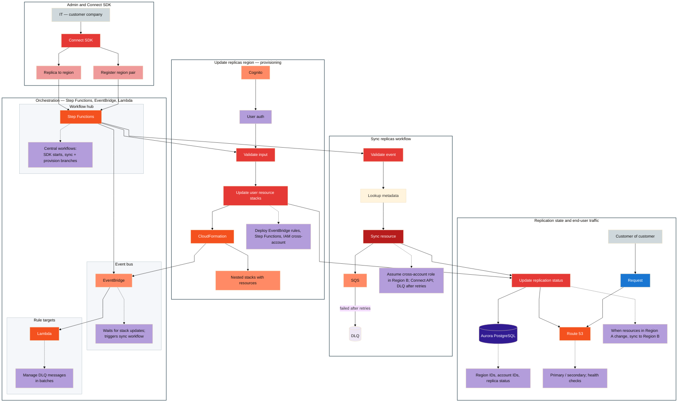
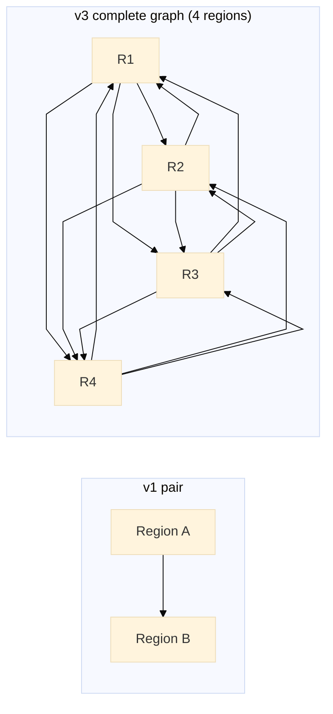
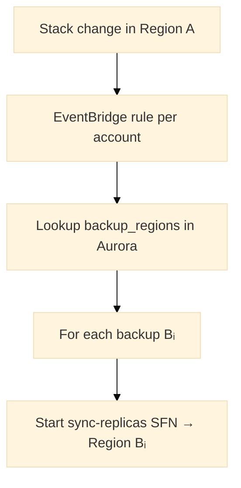

# ☎️ AWS: Amazon Connect — regional traffic and replication (2025)

## 📇 Index

1. [🪪 Role snapshot](#-role-snapshot)
2. [🧩 Components and systems I touched](#-components-and-systems-i-touched)
3. [👥 Team and scope](#-team-and-scope)
4. [📐 Architecture](#architecture)
5. [🔄 Design evolution](#-design-evolution)
6. [🗄️ Pairing metadata and CRUD](#️-pairing-metadata-and-crud)
7. [📡 Replication orchestration](#-replication-orchestration)
8. [🚦 Failover and traffic](#-failover-and-traffic)
9. [🚨 Failure handling](#-failure-handling)
10. [✨ Stories and notable facts](#-stories-and-notable-facts)
11. [🔗 Related](#-related)

## 🪪 Role snapshot

**2025 · AWS · Amazon Connect (multi-region).** Supported **paired-region expansion** (e.g. **Tokyo and Osaka**): **replication**, **event-driven sync** when resources change, and **DNS / traffic routing** for failover. Admins drive changes via the **Connect SDK**; control plane uses **Step Functions**, **SQS**, **EventBridge**, **CloudFormation**, **Cognito**, **Aurora PostgreSQL**, and **Route 53**; **CDK**-modeled infra deployed through **CloudFormation**.

## 🧩 Components and systems I touched

- **Orchestration** — **Step Functions** for **sync-replicas** and **update-replica-region** flows; **EventBridge** for stack-driven kicks; **SQS** + **DLQ** for cross-region apply and failure isolation.
- **Identity and data** — **Cognito** for admin flows; **Aurora PostgreSQL** for region/replica metadata; **Connect APIs** cross-account into peer regions.
- **Traffic and IaC** — **Route 53** health-checked routing; **CloudFormation** nested stacks; **CDK** source of truth. See [Architecture](#architecture).

## 👥 Team and scope

- **Team size (estimate):** *TBD — fill from memory.*
- **Project scope:** **Multi-region** Connect control plane; high-risk **SDK** and **deployment safety** work (see stories).
- **Reporting change:** **One manager handoff** during this engagement (same charter, new manager). Public-facing current-situation context lives in [`./current-situation.md`](./current-situation.md), separate from the technical stories above.

## Architecture

**Diagram:** each **subgraph** is a **white** panel with a dark border. **Orchestration** is laid out **left to right** in three inner panels (workflow hub → event bus → rule targets) so Step Functions, EventBridge, and Lambda read as one control plane instead of a tall empty strip. **Grey** — people and workflow steps; **amber** — AWS services; **lavender** — annotations.

### Legend

| Class family | Meaning |
| --- | --- |
| `neutral*` | **IT**, **end customer** (actors) |
| `read*` | **Request** toward Route 53; **lookup metadata** before a sync write |
| `write*` | **Connect SDK**, **validate** / **validate input**, **sync resource**, **update user resource stacks**, **replication status** |
| `aws*` | **Step Functions**, **EventBridge**, **Lambda**, **SQS**, **CloudFormation**, **Cognito**, **Route 53**, **nested stacks** |
| `db*` | **DLQ**, **Aurora** |
| `db2` | Notes (EventBridge behavior, DLQ batches, cross-account sync, DNS, DB fields) |

### How the pieces fit

1. **Admin ingestion:** customer **IT** uses the **Connect SDK** to **replicate to a region** or **register a region pair**, starting **Step Functions** executions.
2. **Orchestration:** **Step Functions** is the hub (SDK and both workflow branches land here); **EventBridge** carries **stack-update** events and **triggers the sync workflow**; **Lambda** runs **batch DLQ** handling and other rule targets—drawn as a single **SFN → EB → Lambda** pipeline with per-column notes.
3. **Sync path:** **Validate event** → **lookup metadata** → **sync resource**; workers use **cross-account roles** to call **Connect** in the peer region; **SQS** decouples work and **DLQ** captures poison messages after retries.
4. **Provisioning path:** **Cognito** establishes **user auth** before **validate input**; **update user resource stacks** drives **CloudFormation** and **nested stacks** (EventBridge rules, Step Functions, **IAM** for cross-account). **CloudFormation** events feed **EventBridge**, closing the loop with the sync workflow.
5. **State and traffic:** both paths converge on **update replication status**, which persists to **Aurora** and updates **Route 53** so **primary / secondary** and **health checks** match current replication. **End users** send **requests** through **Route 53** for regional routing and failover.

The sections below describe the **evolved** control-plane design (pair → backup list → complete graph) that the team targeted after the initial Tokyo/Osaka pair shipped.

---

## 🔄 Design evolution

| Stage | Topology | When |
| --- | --- | --- |
| **v1 — pair** | Region **A** replicates to single backup **B** | Shipped (e.g. Tokyo ↔ Osaka) |
| **v2 — backup list** | **A** → `[B, C, …]` per account configuration | More regions per customer without N× manual pairs |
| **v3 — complete graph** | Each region **R** replicates to every other registered region **≠ R** | Global availability; outage isolated to one region unless all regions fail |

**Why evolve:** a single pair is simple to reason about and deploy, but customers adding a third region need either many pairwise registrations or a single source-of-truth list. A **directed complete graph** (each node fans out to all peers except itself) means one stack change in **A** triggers replication to **all** backup regions in the account’s graph — the only total failure mode is simultaneous loss of every region.

*v3 shown for four regions — each node has three outbound replication edges.*

---

## 🗄️ Pairing metadata and CRUD

Admins manage replication through **Connect SDK** APIs backed by **Aurora PostgreSQL** (existing stack).

### Schema evolution

| Version | Columns | Notes |
| --- | --- | --- |
| v1 | `account_id`, `source_region`, `backup_region` | One row per pair |
| v2 | `account_id`, `source_region`, `backup_regions` (array/JSON) | One row per source |
| v3 | `account_id`, `source_region`, `backup_region` (edge table) | Normalized graph edges; easy to query “all targets from A” |

With **fewer than ten** AWS regions, precomputing allowed **region combinations** (at most ~2¹⁰ = 1024 subset patterns) is feasible for validation or admin UI — stored as reference data, not per-customer explosion.

### CRUD operations

| Operation | Effect |
| --- | --- |
| **Register** | Create source region + initial backup list; provision EventBridge rule in source |
| **Update** | Change `backup_regions`; diff drives add/remove replication targets |
| **Delete** | Tear down listeners and stop fanout from source |
| **List** | Return graph edges per account for support and SDK display |

### SQL vs NoSQL for backup-region lists

| Dimension | SQL (Aurora PostgreSQL) | NoSQL (e.g. DynamoDB) |
| --- | --- | --- |
| **Nested backup lists** | JSONB column or junction table | Native list attribute on partition key |
| **Referential integrity** | FK to region catalog | Application-enforced |
| **Transactions** | Register pairing + audit in one TX | Conditional writes per item |
| **Query “all backups for A”** | Indexed `source_region` | `GetItem` by `account_id` + `source_region` |
| **Audit / compliance** | Mature SQL audit patterns | Stream to audit log |
| **Team familiarity** | Already used for replica status | Extra store to operate |

**Recommendation:** stay on **Aurora** for v2/v3 — junction table `region_replication_edge (account_id, source_region, backup_region)` plus optional JSONB for UI snapshots. Consider DynamoDB only if pairing metadata QPS or item size outgrows relational comfort; the control plane is low-QPS and benefits from relational joins with replication status rows.

---

## 📡 Replication orchestration

For each **registered source region A** in an account’s graph:

1. **EventBridge rule** in **A** listens for **CloudFormation stack change** events (scoped to that account’s resources).
2. On event: **lookup** `backup_regions` for `(account_id, source_region=A)` in Aurora.
3. For **each** backup region **B** in the list: start **`sync-replicas`** Step Functions execution (cross-account role → Connect API in **B**).
4. **Provisioning path** (`update-replica-region`) still deploys nested stacks (EventBridge, Step Functions, IAM) when a new backup region is added.

Decoupling via **SQS** between orchestration and workers keeps SDK/API latency low; each target region can fail independently without blocking others.

---

## 🚦 Failover and traffic

**Globally available** end-user traffic uses **Route 53** with health checks on the **primary** region endpoint for each customer.

| Signal | Action |
| --- | --- |
| Primary region **healthy** | Route to primary; replication status `active` |
| Primary **unhealthy** (regional outage) | Failover DNS to **secondary** backup (or geo-nearest healthy region from graph) |
| Replication **lagging** | May keep traffic on primary with alarm; product policy defines cutover |

`update replication status` (existing path) writes Aurora + updates Route 53 weights/records so admin state and DNS stay aligned. Health checks provide the **traffic control** layer called out in design reviews — not only replication correctness but **request routing** when region A is down.

---

## 🚨 Failure handling

Replication workflows are **at-least-once**; handlers must be **idempotent** (same stack event + target region → safe replay).

| Stage | Behavior |
| --- | --- |
| **Transient error** | Step Functions retry with backoff; SQS visibility timeout redelivery |
| **Exhausted retries** | Message to **DLQ**; Lambda processes DLQ in **batches** (existing control plane) |
| **Operations** | CloudWatch alarm on DLQ depth → on-call engineer triages, fixes root cause, **replays** with idempotency keys |

Failed workflows are **not silent**: poison messages land in DLQ with correlation IDs tied to `account_id`, `source_region`, `target_region`, and stack event — enough context for manual replay or compensating cleanup. This matches the **golden rule** for async control planes: every queue has a DLQ and a runbook.

---

## ✨ Stories and notable facts

### Stabilizing a High-Risk Public SDK Release with Proactive Dependency Alignment

**Context**
A public-facing SDK used by external customers had a complex publish pipeline. While reviewing the upcoming release, I noticed the latest published model had an **unusually large diff** compared to the previous version, creating risk for regressions, difficult reviews, and loss of confidence in the release process.

**Goal**
Ensure the next SDK release could proceed smoothly while reducing friction and preventing recurring large-diff issues in future publications.

**Approach**
- Analyzed the diff and identified that several **required packages and dependencies were missing or misaligned** relative to the mainline commit.
- Traced the issue to gaps in how dependencies were selected during the publish workflow rather than to functional code changes.
- Collaborated with the SDK release manager to define a short-term workaround:
 - Created a formal exception request for the problematic components.
 - Compiled a **complete, authoritative list of required packages** and identified the **closest commit ID to mainline** that could be safely released.
- Documented the end-to-end workaround and decision points so future releases wouldn’t require rediscovery or ad-hoc debugging.

**Outcome**
- Unblocked the next SDK release, applying a **large set of changes in a single, controlled publication**.
- Reduced manual intervention and review overhead for subsequent releases.
- Prevented the large-diff issue from repeatedly blocking the SDK pipeline.
- Built trust with the team by proactively improving a critical backend release process early in my tenure.

---

### Improving Multi-Region Deployment Safety for Amazon Connect

**Context**
Amazon Connect was being expanded to support **Tokyo and Osaka regions**, including automated traffic redirection during regional outages. The deployment involved paired-region replication and complex infrastructure orchestration.

**Goal**
Ensure reliable, deterministic multi-region deployments while reducing operational risk and unnecessary duplication.

**Approach**
- Reviewed the existing deployment workflow and identified:
 - A **suboptimal deployment order** that increased the risk of partial or inconsistent state.
 - A **duplicated deployment region** that added unnecessary complexity and operational overhead.
- Reordered the deployment sequence to ensure foundational resources were created before dependent stacks.
- Removed the duplicated region from the deployment pipeline, simplifying the overall topology.
- Supported event-driven replication workflows that:
 - Replicated resources to the paired region on stack changes.
 - Automatically propagated DNS updates for failover.
- Worked within an infrastructure stack using **CDK, CloudFormation, Route 53, EventBridge, Step Functions, and Aurora PostgreSQL**.

**Outcome**
- Improved reliability of multi-region deployments across **Tokyo and Osaka**.
- Reduced deployment complexity by eliminating redundant regional deployments.
- Lowered the risk of misconfigured failover during outages.
- Contributed to a more maintainable and predictable regional expansion model for Amazon Connect.

## 🔗 Related

- [Work experience index](./README.md)
- [Current situation (public-safe)](./current-situation.md)
- [System design hub](https://github.com/gardusig/gardusig/tree/main/public/interview/system-design/README.md)
- [Interview prep hub](../../README.md)
