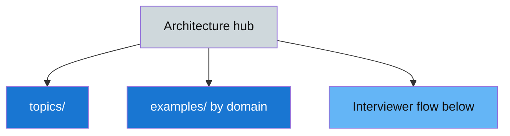
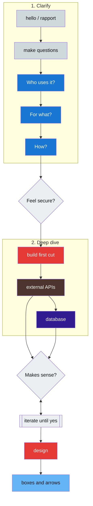

# gardusig/system-design

Public **system design interview** reference — architecture examples, AWS drills, and topic notes.

**Practice folder** — large-scale architecture, interview examples, AWS drills.

**Hub checkout:** [`public/interview/system-design/`](https://github.com/gardusig/gardusig/tree/main/public/interview/system-design) in [gardusig/gardusig](https://github.com/gardusig/gardusig) · **Interview index:** [`public/interview/`](../) · **Siblings:** [`problem-solving`](../problem-solving/) (coding) · [`professional-experiences`](../professional-experiences/) (behavioral)

## 📇 Index

1. [🧾 Folder summary](#-folder-summary)
2. [🗺️ Diagram](#-diagram)
3. [🧭 Where to open what](#-where-to-open-what)
4. [📚 Folder map](#-folder-map)
5. [🎤 Interaction flow with the interviewer](#-interaction-flow-with-the-interviewer)
6. [🔗 Related](#-related)

## 🧾 Folder summary

- **Conversation flow** on this page: clarify before you draw, validate assumptions, iterate.
- **Topic deep-dives** in [`topics/`](./topics/README.md) (indexed by [`topics-index.md`](./topics-index.md)).
- **Interview examples** under [`examples/`](./examples/) — product domains (`platform/`, `social/`, `commerce/`, …) and [`examples/aws/`](./examples/aws/) service drills.
- **Company / app index:** [`high-profit-app-coverage.md`](./topics/high-profit-app-coverage.md).
- **Patterns and templates** in this folder: [example authoring template](./topics/example-authoring-template.md), [AWS reference layout](./topics/aws-reference-layout.md), [event-driven architecture](./topics/event-driven-architecture.md), [60-minute runbook](./topics/interview-runbook-60m.md).
- **Study overlays**: [frequency tiers](./topics/topic-priority.md), [system catalog](./topics/system-catalog.md), [archetype matrix](./topics/archetype-coverage-matrix.md), [cloud capability matrix](./topics/cloud-capability-matrix.md).
- **Cross-cloud service names** in [`cloud-services.md`](./topics/cloud-services.md).
- **Role-level engineering stories** and cross-role behavioral prep: [professional-experiences](https://github.com/gardusig/gardusig/tree/main/public/interview/professional-experiences/README.md) (public).

## 🧰 Prep runbook

Use this split during system design prep:

- **What exists**: open [`topics-index.md`](./topics-index.md) for APIs, storage, messaging, reliability, and networking building blocks.
- **What to practice first**: open [`topic-priority.md`](./topics/topic-priority.md) for A/B/C interview topic prioritization.
- **What systems to build**: open [`system-catalog.md`](./topics/system-catalog.md) for the one-issue-per-system inventory.
- **Archetype coverage**: open [`archetype-coverage-matrix.md`](./topics/archetype-coverage-matrix.md) to choose drills by product shape.
- **60-minute cadence**: open [`interview-runbook-60m.md`](./topics/interview-runbook-60m.md) for timeboxed interview flow.
- **Cloud capability translation**: open [`cloud-capability-matrix.md`](./topics/cloud-capability-matrix.md) (comfort scores) and [`cloud-services.md`](./topics/cloud-services.md) (provider matrix).
- **Round simulation**: open [`examples/README.md`](./examples/README.md) and run one **product** example as a full interview round.
- **Reusable patterns**: [AWS reference layout](./topics/aws-reference-layout.md), [event-driven architecture](./topics/event-driven-architecture.md).
- **Authoring or reviewing an example**: [`example-authoring-template.md`](./topics/example-authoring-template.md) (v3 contract for files under `examples/`); diagram palette: [`architecture-diagram-conventions.md`](./topics/architecture-diagram-conventions.md).
- **Pull request CI** — external Docker pipelines (not in this repo)
- **Release** — résumé PDF artifact via external CI

## 🗺️ Diagram

## 🧭 Where to open what

| If I need… | Open |
| --- | --- |
| Behavioral stories and role files | [professional-experiences](https://github.com/gardusig/gardusig/tree/main/public/interview/professional-experiences/README.md) |
| Topic notes (APIs, stores, caching, messaging, …) | [`topics-index.md`](./topics-index.md) |
| Architecture prep priorities (A/B/C) | [`topic-priority.md`](./topics/topic-priority.md) |
| Cloud capability confidence matrix | [`cloud-capability-matrix.md`](./topics/cloud-capability-matrix.md) |
| System / example inventory | [`system-catalog.md`](./topics/system-catalog.md) |
| Interview examples (product systems) | [`examples/README.md`](./examples/README.md) |
| AWS topology pattern, multi-cloud tables | [`aws-reference-layout.md`](./topics/aws-reference-layout.md) |
| Event-driven pattern (outbox, contracts) | [`event-driven-architecture.md`](./topics/event-driven-architecture.md) |
| Example authoring template | [`example-authoring-template.md`](./topics/example-authoring-template.md) |
| AWS / GCP / Azure service name matrix | [`cloud-services.md`](./topics/cloud-services.md) |
| This page’s interview flow | [Interaction flow below](#-interaction-flow-with-the-interviewer) |

## 📚 Folder map

| Path | Contents |
| --- | --- |
| *This directory* | Hub + [`topics-index.md`](./topics-index.md) |
| [`topics/`](./topics/README.md) | Building blocks, AWS/EDA patterns, runbook, catalog, authoring templates |
| [`examples/`](./examples/README.md) | Product rounds by domain + [`examples/aws/`](./examples/aws/README.md) service drills |
| [`topics/high-profit-app-coverage.md`](./topics/high-profit-app-coverage.md) | Company / app → example routing (Meta, Uber, Amazon, …) |
| [professional-experiences](https://github.com/gardusig/gardusig/tree/main/public/interview/professional-experiences/README.md) | Per-role stories and behavioral interview hub |

## 🎤 Interaction flow with the interviewer

Use this as a **conversation map**, not a script: clarify before you draw, validate assumptions, then iterate until the problem and your design line up.

### 📊 Legend

| Style | Meaning |
| --- | --- |
| `read*` | Clarifying questions and readable outputs (diagram, contract). |
| `write*` | Commit to the next step (build, lock design). |
| `neutral*` | Rapport and checkpoints (feel secure, iterate). |
| `ext*` / `db*` | External APIs vs database in the deep dive. |

### 📝 Same flow in prose

1. **Open** — Brief rapport, then **drive clarification with questions** (do not jump straight to a diagram).
2. **Who** — Identify **actors and data types** (e.g. end user, operator, internal service; what each owns or sees).
3. **Why / how critical** — Map **data flow** and **latency or consistency expectations** (what must be real-time vs eventual vs best-effort).
4. **How (contract)** — Nail **reads, writes, and notifications** (what is queried, what is commanded, what is pushed).
5. **Checkpoint** — **Feel secure?** If requirements are still fuzzy, ask more; if aligned, **build** a first version.
6. **Deep dive** — **External APIs**: shape of **request/response** and failure modes. **Database**: **entities, access patterns, indexes**.
7. **Iterate** — **Does it make sense?** With the interviewer, **loop** until yes (adjust APIs, data model, or scale story as needed).
8. **Finish** — Lock in the **design** as **boxes and arrows** (clear boundaries and data paths).

For topic-level depth after the conversation is structured, use the [topics index](./topics-index.md) and the topic files linked from it.

## 🔗 Related

- Behavioral interview prep (stories + domains): [professional-experiences](https://github.com/gardusig/gardusig/tree/main/public/interview/professional-experiences/README.md)
- [Interview prep hub](https://github.com/gardusig/gardusig/tree/main/public/interview/professional-experiences/README.md)
