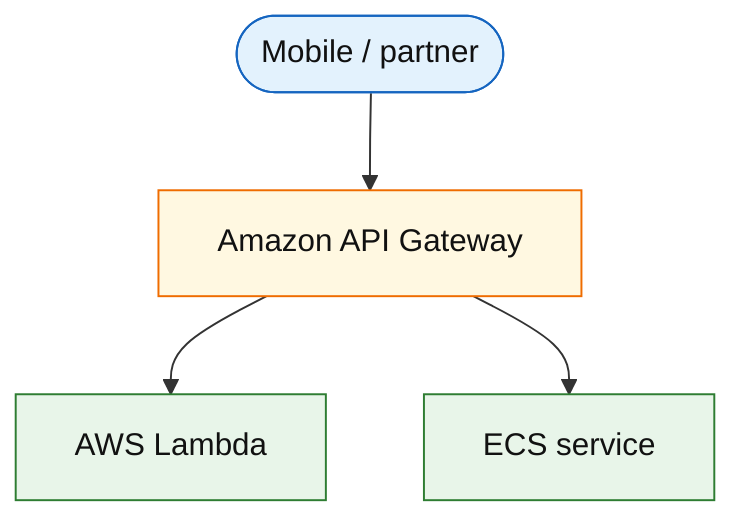

# Amazon API Gateway (service drill)

**Parent:** [`README.md`](./README.md) · **Topic:** [`../../topics/edge-and-ingress.md](../../topics/edge-and-ingress.md)

## When to use / when not

| Use when | Notes |
| --- | --- |
| Managed REST/HTTP API front door | Auth, throttling, request validation |
| Lambda/HTTP integration | Serverless BFF |
| Usage plans and API keys | Partner rate limits |

| Avoid when | Why |
| --- | --- |
| Ultra-low-latency internal east-west | ALB + service mesh |
| WebSocket at massive scale without design | API GW WS has limits; consider ALB |
| Replacing full L7 routing complexity | Often ALB + service for simpler internal |

## Mental model

- **HTTP API** cheaper/simpler than REST API v1.
- **Billing:** per million requests + optional cache.
- **Throttling:** account-level and stage-level burst.

## Architecture sketch

**Narrative:** **API Gateway** terminates TLS, enforces **throttle/auth**, routes to Lambda or VPC integration to VPC ECS.

## Capacity and cost (whiteboard)

| What to count | Meter | Ballpark |
| --- | --- | --- |
| Requests | million/mo | ~$1/M HTTP API |
| Cache | optional | reduces backend load |

## Interview talking points

1. Compare to **ALB** for long-lived connections and gRPC.
2. Cognito authorizer vs Lambda authorizer tradeoffs.
3. **Idempotency keys** still enforced in app layer.

## Product examples that use this service

| Example | How it shows up |
| --- | --- |
| [`platform/api-gateway-rate-limiting.md`](../platform/api-gateway-rate-limiting.md) | Auth + throttle chain |

## Related

- [AWS service drills index](./README.md)
- [AWS reference layout](../../topics/aws-reference-layout.md)
- [Topics index](../../topics-index.md)
- [Cloud capability matrix](../../topics/cloud-capability-matrix.md)
