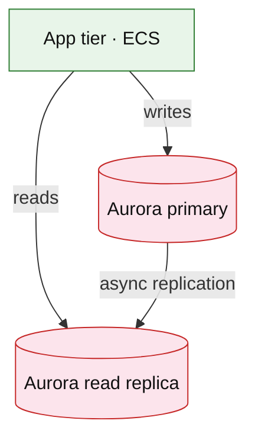

# Amazon Aurora and RDS (service drill)

**Parent:** [`README.md`](./README.md) · **Topic:** [`../../topics/data-stores.md](../../topics/data-stores.md)

## When to use / when not

| Use when | Notes |
| --- | --- |
| Relational OLTP, joins, transactions | Aurora: storage/compute separation |
| Strong consistency on primary | Read replicas for read scale |
| Ledger, orders, accounts | ACID across rows |

| Avoid when | Why |
| --- | --- |
| Massive key-only horizontal shard needs | DynamoDB or sharding app layer |
| Global write leader with multi-master unless Aurora Global | Clarify write region |
| Analytics on primary | Replica or warehouse export |

## Mental model

- **Aurora:** 6 copies storage across AZs; faster failover than vanilla RDS.
- **Scaling:** read replicas; Aurora Serverless v2 for spiky.
- **Billing:** instance hours + storage GB + IOPS.

## Architecture sketch

**Narrative:** Writes go to **primary**; read-heavy paths use **replicas** with replication lag called out in interview. Failover promotes replica or Aurora storage-backed recovery.

## Capacity and cost (whiteboard)

| What to count | Meter | Ballpark |
| --- | --- | --- |
| Instance | db.r6g.large × 730h | $50–200+/mo per instance |
| Storage | GB-mo | ~$0.10/GB Aurora |
| IOPS | provisioned or auto | spiky write workloads |

## Interview talking points

1. Explain **replication lag** on read-your-own-write vs eventual read replica.
2. **Connection pooling** (RDS Proxy) at high connection counts.
3. Migrations: expand/contract schema; backward compatible deploys.

## Product examples that use this service

| Example | How it shows up |
| --- | --- |
| [`fintech/core-banking-ledger.md`](../fintech/core-banking-ledger.md) | Ledger invariants |
| [`fintech/payment-workflow-platform.md`](../fintech/payment-workflow-platform.md) | Payment state rows |
| [`platform/rate-limiter.md`](../platform/rate-limiter.md) | Policy metadata OLTP |

## Related

- [AWS service drills index](./README.md)
- [AWS reference layout](../../patterns/aws-reference-layout.md)
- [Topics index](../../topics-index.md)
- [Cloud capability matrix](../../prep/cloud-capability-matrix.md)
