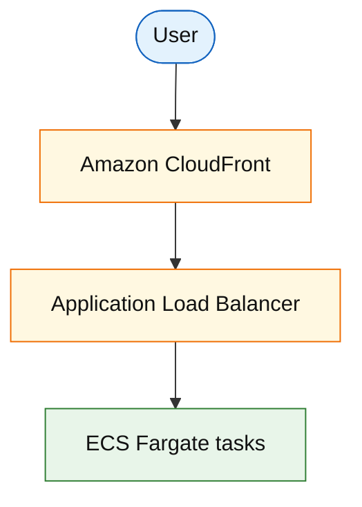

# Amazon CloudFront and Application Load Balancer (service drill)

**Parent:** [`README.md`](./README.md) · **Topic:** [`../../topics/edge-and-ingress.md](../../topics/edge-and-ingress.md)

## When to use / when not

| Use when | Notes |
| --- | --- |
| CloudFront: cache static/API at edge | Reduce origin egress and latency |
| ALB: L7 HTTP/gRPC to targets | Path/host routing, health checks |
| Together: CF → ALB → ECS | Common public web pattern |

| Avoid when | Why |
| --- | --- |
| CloudFront for highly dynamic personalized HTML every request | Low hit ratio |
| ALB for raw TCP ultra-performance | NLB |
| Terminating TLS only at ALB when you need edge WAF | CF + AWS WAF at edge |

## Mental model

- **CloudFront:** cache hit ratio drives $; signed URLs for restricted content.
- **ALB:** LCU billing (connections, rules, bytes).

## Architecture sketch

**Narrative:** **CloudFront** serves cacheable bytes close to users; dynamic API calls pass through to **ALB** which load-balances healthy **ECS** tasks.

## Capacity and cost (whiteboard)

| What to count | Meter | Ballpark |
| --- | --- | --- |
| CloudFront egress | GB | ~$0.085/GB US |
| ALB | LCU-h + hourly | ~$16–25/mo baseline + usage |

## Interview talking points

1. Cache **cache-control** headers consciously.
2. ALB **sticky sessions** vs stateless JWT.
3. Health checks and **connection draining** on deploy.

## Product examples that use this service

| Example | How it shows up |
| --- | --- |
| [`platform/url-shortener.md`](../platform/url-shortener.md) | Redirect edge cache |
| [`media/video-on-demand-platform.md`](../media/video-on-demand-platform.md) | CDN for segments |

## Related

- [AWS service drills index](./README.md)
- [AWS reference layout](../../topics/aws-reference-layout.md)
- [Topics index](../../topics-index.md)
- [Cloud capability matrix](../../topics/cloud-capability-matrix.md)
