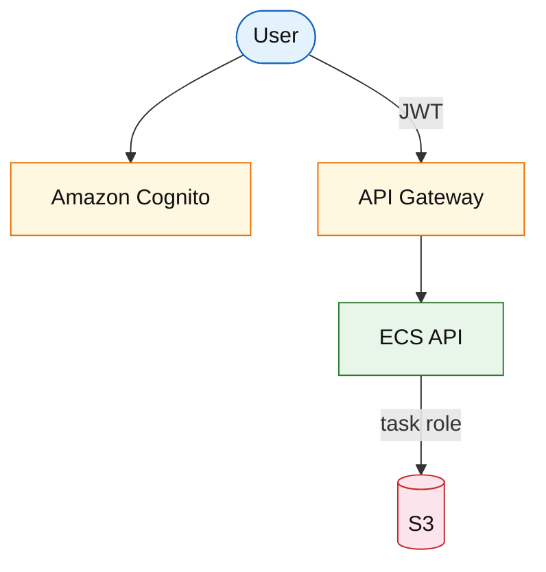

# Amazon Cognito and AWS IAM (service drill)

**Parent:** [`README.md`](./README.md) · **Topic:** [`../../topics/security-networking.md](../../topics/security-networking.md)

## When to use / when not

| Use when | Notes |
| --- | --- |
| Cognito: end-user sign-up/login | Hosted UI, social IdP federation |
| IAM: service-to-service permissions | Task roles for ECS/Lambda |
| JWT access tokens to APIs | API Gateway authorizer |

| Avoid when | Why |
| --- | --- |
| Cognito for complex B2B SAML-only without testing limits | May need custom IdP |
| Long-lived IAM user keys in app code | Roles + Secrets Manager |

**Deep rebuild:** [`identity-session-service.md`](../platform/identity-session-service.md)

## Mental model

- **Cognito:** user pools (directory) vs identity pools (AWS creds for mobile).
- **IAM:** least privilege policies; resource-based policies for S3/SQS.

## Architecture sketch

**Narrative:** Users authenticate with **Cognito**; APIs validate **JWT**. Backend uses **IAM task role** to access AWS resources — no static keys.

## Capacity and cost (whiteboard)

| What to count | Meter | Ballpark |
| --- | --- | --- |
| MAU | Cognito | tiered per monthly active users |
| IAM | no direct charge | indirect via accessed services |

## Interview talking points

1. **Refresh token** rotation and device tracking.
2. **IAM policy** size limits; prefer roles per service.
3. Cross-account access: roles + trust policy.

## Product examples that use this service

| Example | How it shows up |
| --- | --- |
| [`platform/identity-session-service.md`](../platform/identity-session-service.md) | Sessions + OAuth |
| [`platform/api-gateway-rate-limiting.md`](../platform/api-gateway-rate-limiting.md) | Auth chain |

## Related

- [AWS service drills index](./README.md)
- [AWS reference layout](../../patterns/aws-reference-layout.md)
- [Topics index](../../topics-index.md)
- [Cloud capability matrix](../../prep/cloud-capability-matrix.md)
