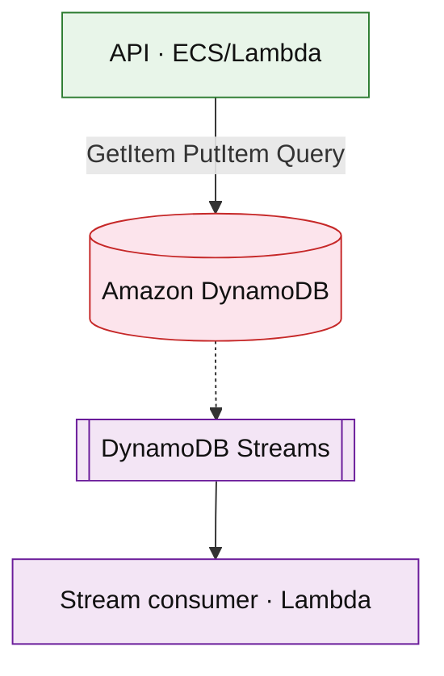

# Amazon DynamoDB (service drill)

**Parent:** [`README.md`](./README.md) · **Topic:** [`../../topics/data-stores.md](../../topics/data-stores.md)

## When to use / when not

| Use when | Notes |
| --- | --- |
| Key-value / wide-column at massive scale | Partition key + optional sort key |
| Predictable access by key | Single-digit ms at scale when keyed correctly |
| Session, cart, feed pointers | Item size limit 400 KB |

| Avoid when | Why |
| --- | --- |
| Ad-hoc analytics joins | Export to S3 + Athena or use Aurora |
| Unbounded hot partition on one key | Salting / write sharding |
| Complex multi-row transactions across many items | Prefer single-partition design or Aurora |

## Mental model

- **Partition key** determines shard; all items with same PK live together.
- **Modes:** on-demand (pay per R/W request unit) vs provisioned WCU/RCU.
- **Streams:** ordered change feed per shard → Lambda consumers.

## Architecture sketch

**Narrative:** Application issues **GetItem/Query** on a designed key. **Streams** enable CDC to search index or cache invalidation without dual-write in the request path.

## Capacity and cost (whiteboard)

| What to count | Meter | Ballpark |
| --- | --- | --- |
| On-demand writes | million WCU | ~$1.25/M (simplified) |
| On-demand reads | million RCU | ~$0.25/M |
| Storage | GB-mo | ~$0.25/GB |

## Interview talking points

1. Interview: draw **partition key** first; explain hot key mitigation.
2. **GSI** doubles write cost; use sparingly.
3. **Conditional writes** for optimistic locking (cart, inventory).

## Product examples that use this service

| Example | How it shows up |
| --- | --- |
| [`commerce/shopping-cart-checkout.md`](../commerce/shopping-cart-checkout.md) | Cart items by cart_id |
| [`social/news-feed.md`](../social/news-feed.md) | Feed pointers / celebrity index |
| [`commerce/event-ticketing.md`](../commerce/event-ticketing.md) | Inventory shards |

## Related

- [AWS service drills index](./README.md)
- [AWS reference layout](../../patterns/aws-reference-layout.md)
- [Topics index](../../topics-index.md)
- [Cloud capability matrix](../../prep/cloud-capability-matrix.md)
