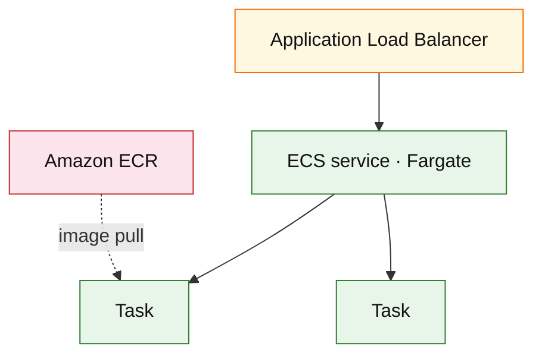

# Amazon ECS on Fargate (service drill)

**Parent:** [`README.md`](./README.md) · **Topic:** [`../../topics/compute.md](../../topics/compute.md)

## When to use / when not

| Use when | Notes |
| --- | --- |
| Long-running containers without managing EC2 | Task = unit of deploy |
| Microservices default on AWS | ALB target groups |
| Background workers + API in same cluster | Service autoscaling on CPU/RPS/custom |

| Avoid when | Why |
| --- | --- |
| Per-invocation millisecond billing only | Lambda |
| Kubernetes-specific tooling required | EKS instead |
| Bare-metal latency tuning | EC2 with ECS |

## Mental model

- **Task CPU/RAM** chosen per task definition; billed per second.
- **Services** maintain desired count; deployments rolling.

## Architecture sketch

**Narrative:** **Fargate** runs tasks without EC2 fleet management; **ALB** routes traffic; **ECR** stores images. Autoscale on CPU or custom metric (queue lag).

## Capacity and cost (whiteboard)

| What to count | Meter | Ballpark |
| --- | --- | --- |
| vCPU-h + GB-h | per task | ~$0.04/vCPU-h + $0.004/GB-h ballpark |

## Interview talking points

1. **Health checks** and graceful shutdown on deploy.
2. Sidecars for observability (FireLens, ADOT).
3. When interviewer says containers on AWS — default to **ECS Fargate** unless K8s required.

## Product examples that use this service

| Example | How it shows up |
| --- | --- |
| [examples index](../README.md) | App tier default |

## Related

- [AWS service drills index](./README.md)
- [AWS reference layout](../../topics/aws-reference-layout.md)
- [Topics index](../../topics-index.md)
- [Cloud capability matrix](../../topics/cloud-capability-matrix.md)
