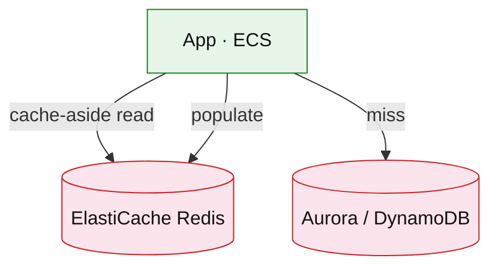

# Amazon ElastiCache for Redis (service drill)

**Parent:** [`README.md`](./README.md) · **Topic:** [`../../topics/caching.md](../../topics/caching.md)

## When to use / when not

| Use when | Notes |
| --- | --- |
| Sub-ms reads for hot keys | Sessions, rate counters, feed cache |
| TTL eviction | Cache-aside or write-through |
| Atomic INCR | Rate limiting token bucket |

| Avoid when | Why |
| --- | --- |
| Source of truth without DB behind | Cache is ephemeral |
| Huge values (> 512 MB per key practical limits) | Split or use S3 |
| Multi-region strong consistency | Redis Global Datastore has tradeoffs |

## Mental model

- **Cluster mode:** shards + replicas; hash slots.
- **Eviction:** volatile-lru etc. when memory full.
- **Billing:** node hours by instance type + memory.

## Architecture sketch

**Narrative:** **Cache-aside:** read Redis first; on miss load DB and set TTL. Rate limiters use **atomic** ops on counters without touching OLTP per check.

## Capacity and cost (whiteboard)

| What to count | Meter | Ballpark |
| --- | --- | --- |
| Nodes | cache.r6g.large × 730h | $100+/mo per node |
| Memory tier | total GB | size for working set |

## Interview talking points

1. **Stampede:** singleflight / probabilistic early expiration.
2. **Hot key:** client-side sharding of counter in Redis.
3. State **lost on failover** — design idempotent rebuild.

## Product examples that use this service

| Example | How it shows up |
| --- | --- |
| [`platform/url-shortener.md`](../platform/url-shortener.md) | Redirect cache |
| [`platform/rate-limiter.md`](../platform/rate-limiter.md) | Distributed counters |
| [`social/news-feed.md`](../social/news-feed.md) | Per-user feed materialization |

## Related

- [AWS service drills index](./README.md)
- [AWS reference layout](../../patterns/aws-reference-layout.md)
- [Topics index](../../topics-index.md)
- [Cloud capability matrix](../../prep/cloud-capability-matrix.md)
