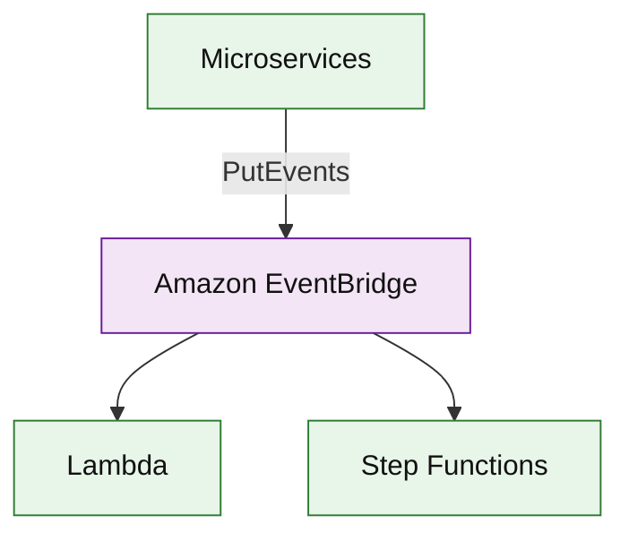

# Amazon EventBridge (service drill)

**Parent:** [`README.md`](./README.md) · **Topic:** [`../../topics/messaging-async.md](../../topics/messaging-async.md)

## When to use / when not

| Use when | Notes |
| --- | --- |
| Event bus routing with rules | Schema registry optional |
| SaaS integrations | AWS service events |
| Scheduled cron triggers | Serverless schedules |

| Avoid when | Why |
| --- | --- |
| Kafka-scale throughput on single bus | MSK for firehose logs |
| Ordering guarantees across all events | Use FIFO SQS or Kafka partition |

## Mental model

- **Rules:** pattern match on detail field → targets (Lambda, SQS, Step Functions).
- **Billing:** per million events published.

## Architecture sketch

**Narrative:** Services publish **domain events** to a bus; **rules** route to handlers without point-to-point coupling.

## Capacity and cost (whiteboard)

| What to count | Meter | Ballpark |
| --- | --- | --- |
| Events | million/mo | ~$1/M custom events |

## Interview talking points

1. **Event envelope** versioning for consumers.
2. Archive & replay (feature) for debugging.
3. Contrast with **SNS** topic fan-out.

## Product examples that use this service

| Example | How it shows up |
| --- | --- |
| [`event-driven/event-driven-order-pipeline.md`](../event-driven/event-driven-order-pipeline.md) | Domain choreography |

## Related

- [AWS service drills index](./README.md)
- [AWS reference layout](../../topics/aws-reference-layout.md)
- [Topics index](../../topics-index.md)
- [Cloud capability matrix](../../topics/cloud-capability-matrix.md)
