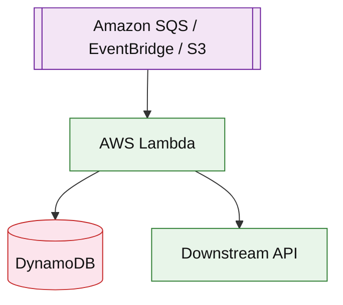

# AWS Lambda (service drill)

**Parent:** [`README.md`](./README.md) · **Topic:** [`../../topics/compute.md](../../topics/compute.md)

## When to use / when not

| Use when | Notes |
| --- | --- |
| Event-driven handlers | S3, SQS, API Gateway, EventBridge triggers |
| Bursty low-average CPU | Pay per invocation + duration |
| Glue code between managed services | Keep stateless; idempotent |

| Avoid when | Why |
| --- | --- |
| Long-running CPU-bound jobs (> 15 min) | ECS/Fargate or Batch |
| Persistent connections at huge scale | Cold start + concurrency limits |
| Tight sub-10ms synchronous fan-out | Provisioned concurrency costs money |

## Mental model

- **Concurrency:** account/region limits; reserved vs on-demand concurrency.
- **Billing:** requests + GB-seconds (memory × duration).
- **VPC:** adds ENI cold start latency.

## Architecture sketch

**Narrative:** Events invoke **Lambda** with at-least-once semantics — handlers must be **idempotent**. Scale is automatic until concurrency cap.

## Capacity and cost (whiteboard)

| What to count | Meter | Ballpark |
| --- | --- | --- |
| Invocations | million | ~$0.20/M |
| Duration | GB-s | dominates for 1GB RAM × seconds |
| Provisioned concurrency | per GB-s | baseline cost for low latency |

## Interview talking points

1. Say **idempotency** + DLQ for poison messages.
2. Cold start: minimize package size; provisioned concurrency for hot paths.
3. **Timeout** must be less than queue visibility timeout.

## Product examples that use this service

| Example | How it shows up |
| --- | --- |
| [`platform/notification-platform.md`](../platform/notification-platform.md) | Per-channel workers |
| [`event-driven/event-driven-order-pipeline.md`](../event-driven/event-driven-order-pipeline.md) | Outbox consumers |

## Related

- [AWS service drills index](./README.md)
- [AWS reference layout](../../topics/aws-reference-layout.md)
- [Topics index](../../topics-index.md)
- [Cloud capability matrix](../../topics/cloud-capability-matrix.md)
