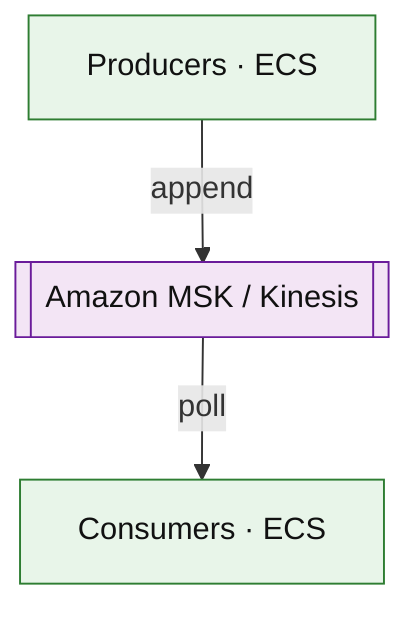

# Amazon MSK and Kinesis Data Streams (service drill)

**Parent:** [`README.md`](./README.md) · **Topic:** [`../../topics/messaging-async.md](../../topics/messaging-async.md)

## When to use / when not

| Use when | Notes |
| --- | --- |
| High-volume ordered event log | Partitions = parallelism unit |
| Replay for reprocessing | Retention hours–days (configurable) |
| Stream analytics pipelines | Consumers with consumer groups |

| Avoid when | Why |
| --- | --- |
| Simple task queue with few consumers | SQS cheaper/simpler |
| Many tiny messages if batching possible | Per-shard overhead |
| Exactly-once end-to-end without design | Idempotent consumers + offsets |

## Mental model

- **Kinesis:** shards provision throughput; hot shard problem.
- **MSK:** managed Kafka; broker hours + storage.
- **Consumers:** at-least-once; commit offset after side effect.

## Architecture sketch

**Narrative:** Producers append **ordered partitions**; consumer groups divide partitions for scale. **Lag** drives autoscaling policy.

## Capacity and cost (whiteboard)

| What to count | Meter | Ballpark |
| --- | --- | --- |
| Kinesis shards | shard-h | ~$0.015/h per shard |
| MSK brokers | broker-h + storage | dominates at scale |
| Ingress/egress | GB | cross-AZ adds up |

## Interview talking points

1. **Partition key** choice = interview core.
2. **Retention** vs disk cost; compaction in MSK.
3. Compare **Kinesis** (AWS-native) vs **MSK** (Kafka ecosystem).

## Product examples that use this service

| Example | How it shows up |
| --- | --- |
| [`event-driven/stream-processing-platform.md`](../event-driven/stream-processing-platform.md) | Windowed state |
| [`logistics/real-time-delivery-tracking.md`](../logistics/real-time-delivery-tracking.md) | Location events |
| [`platform/url-shortener.md`](../platform/url-shortener.md) | Click stream |

## Related

- [AWS service drills index](./README.md)
- [AWS reference layout](../../patterns/aws-reference-layout.md)
- [Topics index](../../topics-index.md)
- [Cloud capability matrix](../../prep/cloud-capability-matrix.md)
