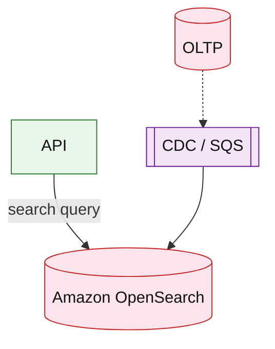

# Amazon OpenSearch Service (service drill)

**Parent:** [`README.md`](./README.md) · **Topic:** [`../../topics/data-stores.md](../../topics/data-stores.md)

## When to use / when not

| Use when | Notes |
| --- | --- |
| Full-text search, facets, autocomplete | Inverted index |
| Log analytics (historically ELK) | High ingest volume |
| Secondary index from OLTP via CDC | Eventually consistent search |

| Avoid when | Why |
| --- | --- |
| Primary transactional store | Aurora/Dynamo source of truth |
| Tiny datasets | Postgres full-text may suffice |

**Deep rebuild:** [`product-search.md`](../commerce/product-search.md)

## Mental model

- **Shards + replicas** for scale; query fan-out cost.
- **Billing:** instance hours + EBS storage.

## Architecture sketch

**Narrative:** OLTP remains source of truth; **CDC** updates search index. Queries hit **OpenSearch** for fuzzy match, filters, sort by relevance.

## Capacity and cost (whiteboard)

| What to count | Meter | Ballpark |
| --- | --- | --- |
| Instances | r6g.search × 730h | $100s+/mo small cluster |
| Storage | GB EBS | grows with index size |

## Interview talking points

1. **Index mapping** and analyzers for typeahead.
2. Reindex strategy on schema change.
3. Near-real-time lag acceptable for search.

## Product examples that use this service

| Example | How it shows up |
| --- | --- |
| [`commerce/product-search.md`](../commerce/product-search.md) | Catalog search |

## Related

- [AWS service drills index](./README.md)
- [AWS reference layout](../../patterns/aws-reference-layout.md)
- [Topics index](../../topics-index.md)
- [Cloud capability matrix](../../prep/cloud-capability-matrix.md)
