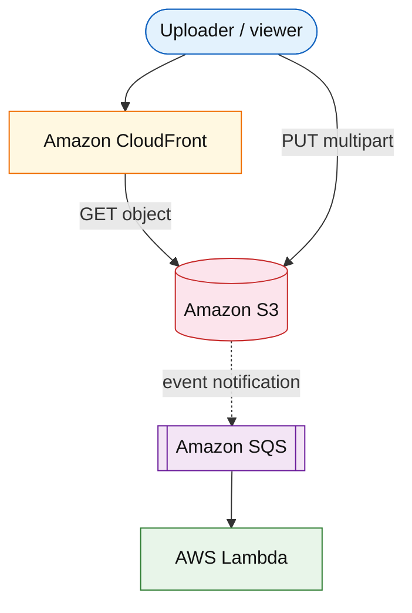

# Amazon S3 (service drill)

**Parent:** [`README.md`](./README.md) · **Topic:** [`../../topics/data-stores.md](../../topics/data-stores.md)

## When to use / when not

| Use when | Notes |
| --- | --- |
| Static assets, video, backups, data lake | Primary blob store; 11 nines durability for standard storage |
| Large sequential reads/writes | Multipart upload; range GET |
| Event-driven pipelines | S3 event notifications → SQS/Lambda |

| Avoid when | Why |
| --- | --- |
| Low-latency OLTP row updates | Use DynamoDB or Aurora |
| POSIX filesystem semantics | Use EFS or local disk |
| Strong listing at huge prefix QPS | LIST is expensive; design key layout |

**Deep rebuild:** [`object-storage.md`](../infra/object-storage.md)

## Mental model

- **Objects:** bucket + key + version; no partial update in place (replace whole object).
- **Consistency:** read-after-write for new objects; LIST eventually consistent.
- **Billing:** storage GB-mo, PUT/GET/LIST requests, egress (especially without CloudFront).

## Architecture sketch

**Narrative:** Hot path for reads: **CloudFront** caches bytes; origin fetch on miss. Writes land in **S3**; optional **events** trigger async processing without blocking upload ACK.

## Capacity and cost (whiteboard)

| What to count | Meter | Ballpark |
| --- | --- | --- |
| Steady storage | GB-mo | ~$0.023/GB Standard |
| GET rate | per 1k/1M requests | dominates read-heavy without CDN |
| Egress to internet | GB out | ~$0.09/GB (region-dependent) |

## Interview talking points

1. Mention **storage class** (Standard, IA, Glacier) for cost cliffs.
2. **Prefix design** affects LIST cost and hot partitions in downstream indexers.
3. **Multipart** for objects > 100 MB; abort stale uploads.

## Product examples that use this service

| Example | How it shows up |
| --- | --- |
| [`media/video-on-demand-platform.md`](../media/video-on-demand-platform.md) | Master + transcoded renditions in S3 |
| [`infra/object-storage.md`](../infra/object-storage.md) | Full durability/metadata deep dive |

## Related

- [AWS service drills index](./README.md)
- [AWS reference layout](../../topics/aws-reference-layout.md)
- [Topics index](../../topics-index.md)
- [Cloud capability matrix](../../topics/cloud-capability-matrix.md)
