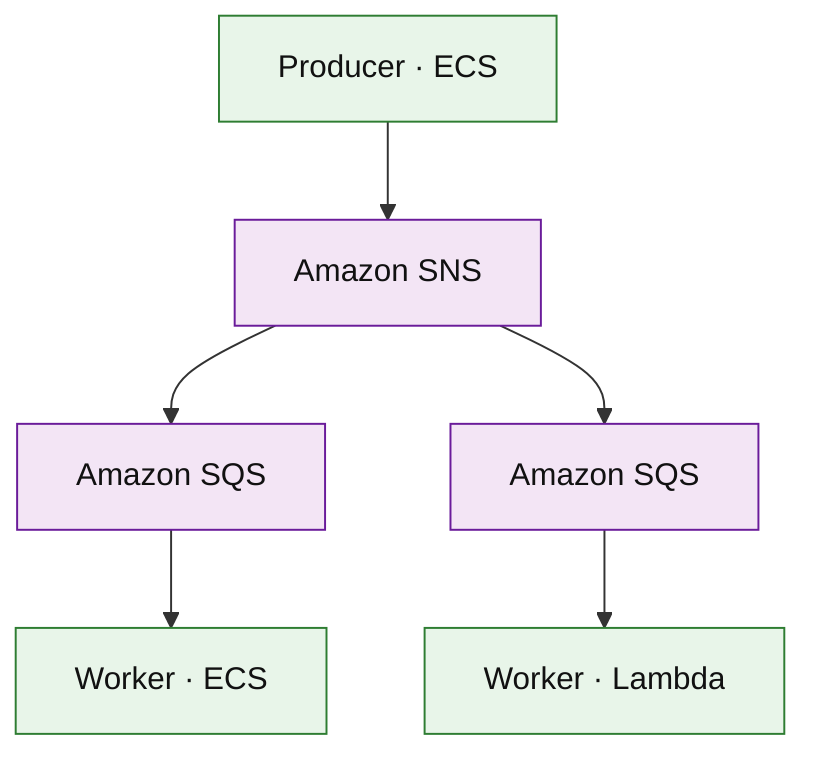

# Amazon SQS and SNS (service drill)

**Parent:** [`README.md`](./README.md) · **Topic:** [`../../topics/messaging-async.md](../../topics/messaging-async.md)

## When to use / when not

| Use when | Notes |
| --- | --- |
| SQS: buffer work, smooth spikes | Standard vs FIFO (ordering) |
| SNS: fan-out to many subscribers | Push to SQS, Lambda, HTTP |
| Decouple producers and consumers | At-least-once; visibility timeout |

| Avoid when | Why |
| --- | --- |
| Kafka-style log replay with long retention by default | Use MSK/Kinesis |
| Exactly-once without idempotent consumers | Design for at-least-once |
| Huge messages (> 256 KB) | Store payload in S3; pass pointer |

## Mental model

- **SQS:** pull-based; visibility timeout + DLQ; FIFO gives ordering per message group.
- **SNS:** pub/sub; filter policies; no persistence beyond retry to subs.
- **Billing:** per million requests (send/receive/delete).

## Architecture sketch

**Narrative:** **SNS** fans out domain events to multiple **SQS** queues so each consumer scales independently. Workers **delete** messages after successful processing.

## Capacity and cost (whiteboard)

| What to count | Meter | Ballpark |
| --- | --- | --- |
| SQS requests | million/mo | ~$0.40/M after free tier |
| SNS deliveries | million | per subscription fan-out multiplies cost |
| Long polling | reduces empty receives | still bills requests |

## Interview talking points

1. **Visibility timeout > p99 handler time** to avoid duplicate work storms.
2. **DLQ** + alarm on depth for poison messages.
3. SNS→SQS is common interview fan-out pattern.

## Product examples that use this service

| Example | How it shows up |
| --- | --- |
| [`platform/notification-platform.md`](../platform/notification-platform.md) | Per-channel queues |
| [`event-driven/event-driven-order-pipeline.md`](../event-driven/event-driven-order-pipeline.md) | Async domain events |

## Related

- [AWS service drills index](./README.md)
- [AWS reference layout](../../topics/aws-reference-layout.md)
- [Topics index](../../topics-index.md)
- [Cloud capability matrix](../../topics/cloud-capability-matrix.md)
