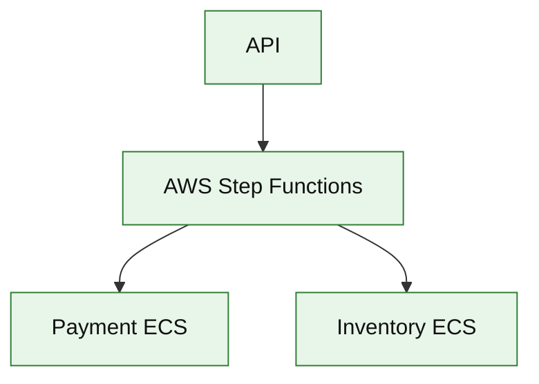

# AWS Step Functions (service drill)

**Parent:** [`README.md`](./README.md) · **Topic:** [`../../topics/messaging-async.md](../../topics/messaging-async.md)

## When to use / when not

| Use when | Notes |
| --- | --- |
| Long-running workflows with waits | Human approval, timers |
| Saga orchestration visibility | State machine per execution |
| Compensating transactions | Defined in ASL |

| Avoid when | Why |
| --- | --- |
| Millions of tiny 1-step workflows per second | Lambda direct or SQS |
| Complex branching better in code only | Operational visibility is the win |

**Deep rebuild:** [`workflow-orchestration.md`](../infra/workflow-orchestration.md)

## Mental model

- **Standard vs Express:** cost/latency tradeoff.
- **Billing:** state transitions per execution.

## Architecture sketch

**Narrative:** **Orchestrator** calls activities with retries/timeouts; state persisted between steps — good for **payment + inventory** sagas.

## Capacity and cost (whiteboard)

| What to count | Meter | Ballpark |
| --- | --- | --- |
| Transitions | million | ~$25/M Standard workflow |

## Interview talking points

1. Orchestration vs **choreography** (EventBridge).
2. **Idempotent** activity handlers required.
3. Link to **workflow-orchestration** rebuild for internals curiosity.

## Product examples that use this service

| Example | How it shows up |
| --- | --- |
| [`fintech/payment-workflow-platform.md`](../fintech/payment-workflow-platform.md) | Payment saga |
| [`platform/workflow-orchestration.md`](../platform/workflow-orchestration.md) | Deep rebuild |

## Related

- [AWS service drills index](./README.md)
- [AWS reference layout](../../patterns/aws-reference-layout.md)
- [Topics index](../../topics-index.md)
- [Cloud capability matrix](../../prep/cloud-capability-matrix.md)
