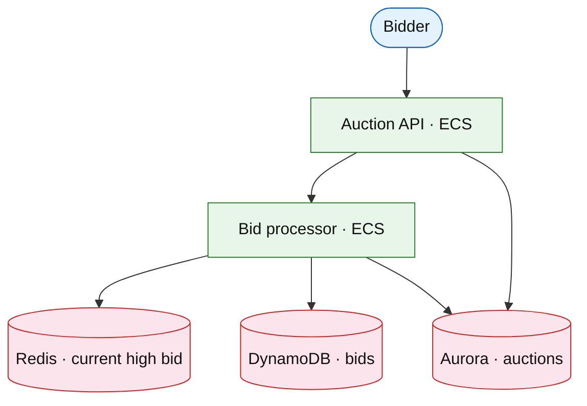

# Auction marketplace (eBay)

## Introduction

An auction marketplace runs **timed bids**, **proxy bidding**, and **anti-sniping** extensions — different from fixed-price [shopping cart](./shopping-cart-checkout.md) and [event ticketing](./event-ticketing.md) (inventory count).

**Company anchors:** eBay, Sotheby’s online.

## Requirements discovery

| Lock (target) |
| --- |
| 10M active auctions |
| Bid accepted p99 &lt; 50 ms |
| Strong ordering per `auction_id` |
| Snipe window: extend 2 min if bid in last 30 s |

## Architecture (user → database)

**Narrative:** **Bid processor** serializes per `auction_id` (shard lock). Compare amount to **Redis** high bid; persist row in **DynamoDB**; update **Aurora** auction state. **Scheduler** closes auction at `end_time` (+ extension rules).

## Deep dive

- **Proxy bid:** store max bid; engine raises to second-price + increment.
- **Idempotency:** `bid_id` from client.
- Hot auction: compare [event ticketing](./event-ticketing.md).

## Related

- [Event ticketing](./event-ticketing.md)
- [Marketplace listings](./marketplace-listings.md)
- [ElastiCache drill](../aws/elasticache-redis.md)
