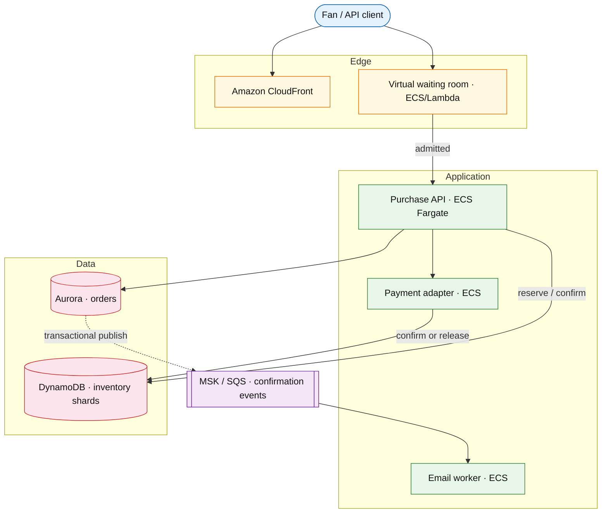

# Event ticketing

## Introduction

An event ticketing system sells **limited inventory** (GA quantity or assigned seats) during **on-sale spikes** without overselling. The write path coordinates **inventory reservation**, **payment capture**, and **confirm or release** in a saga; the read path serves event pages and coarse availability from CDN/cache.

**Primary users:** fans (purchase flow), event operators (inventory caps, on-sale timing), finance (reconciliation), SRE (bot traffic, hot-key incidents).

**Interview pacing:** Use [60-minute runbook](../../topics/interview-runbook-60m.md) — ~10 min requirements theater (below), ~18–32 min diagram + API/DB, ~46–56 min deep dive on **hot inventory + reservation saga**.

Payment orchestration detail: [payment workflow platform](../fintech/payment-workflow-platform.md). Regional pool variant: [multi-region inventory reservation](./multi-region-inventory-reservation.md). Edge throttling: [API gateway rate limiting](../platform/api-gateway-rate-limiting.md).

## Requirements discovery (interview theater)

### Question bank

| Topic | You ask | If they push back | Example answer (reasonable default) |
| --- | --- | --- | --- |
| Oversell | Zero tolerance? | "Rare oversell OK" | **Zero oversell** — compensation playbook only for ops bugs |
| Seat model | GA vs seated? | "Both" | **GA** for stadium; **assigned seats** for theater — shard inventory accordingly |
| Peak | On-sale RPS? | "Super Bowl" | **50k purchase attempts/s** for 2 minutes; queue before API |
| Hold TTL | Cart hold time? | "30 minutes" | **10 minutes** reservation TTL during checkout |
| Bots | Scalpers? | "Ignore" | Rate limits + queue-it token + device fingerprint (high level) |
| Payment | When charge? | "Pay later" | Authorize at reserve; **capture on confirm**; release on timeout |
| Geography | Multi-region? | "Single region" | Single primary region; CDN global for static |
| Out of scope | Resale marketplace, waitlist? | "Add resale" | Primary sale only; optional waitlist mention |

### Example dialogue

> **You:** Let's scope v1: one happy path and what's out of scope?
> **Them:** …
> **You:** For scale, prototype vs 12-month target?
> **Them:** …
> **You:** What does each actor do per day on the hot path?
> **Them:** …
> **You:** I'll lock the **target** column assumptions unless you want different numbers — next I'll map fleet totals to monthly AWS meters in **billable volume**.

### Parsed requirements

| Field | Source question | Parsed value (target) | Drives |
| --- | --- | --- | --- |
| `platform_dau_u` | Platform DAU (`U`) | **2M** (fans browsing/purchasing) | Scale tiers, input model, fleet totals |
| `monthly_active_buyers` | Monthly active buyers | **10M** | Scale tiers, input model, fleet totals |
| `orders_/_buyer_/_month` | Orders / buyer / month | **2** | Scale tiers, input model, fleet totals |
| `hot_event_inventory_i` | Hot event inventory (`I`) | **80k** tickets | Scale tiers, input model, fleet totals |
| `on-sale_attempt_peak_a_peak` | On-sale attempt peak (`A_peak`) | **50,000/s** for 120s | Scale tiers, input model, fleet totals |
| `successful_reserve_peak_s_peak` | Successful reserve peak (`S_peak`) | **2,000/s** (4% funnel) | Scale tiers, input model, fleet totals |
| `reservation_ttl_h` | Reservation TTL (`H`) | **10 min** | Storage steady-state |
| `inventory_shards` | Inventory shards | **80** × 1k tickets | Scale tiers, input model, fleet totals |
| `oversell_tolerance` | Oversell tolerance | **0** | Scale tiers, input model, fleet totals |
| `virtual_waiting_room` | Virtual waiting room | **top-tier events** | Scale tiers, input model, fleet totals |

### Locked assumptions

**Platform** scale uses DAU tiers; **on-sale burst** parameters are anchor scenarios (same across tiers — a stadium on-sale is absolute, not per-DAU).

| Assumption | Prototype (MVP) | Growth | Target (anchor) |
| --- | --- | --- | --- |
| Platform DAU (`U`) | 10k | 1M | **2M** (fans browsing/purchasing) |
| Monthly active buyers | 50k | 500k | **10M** |
| Orders / buyer / month | 2 | 2 | 2 |
| Hot event inventory (`I`) | 80k GA | 80k | **80k** tickets |
| On-sale attempt peak (`A_peak`) | 50k/s | 50k/s | **50,000/s** for 120s |
| Successful reserve peak (`S_peak`) | 2k/s | 2k/s | **2,000/s** (4% funnel) |
| Reservation TTL (`H`) | 10 min | 10 min | 10 min |
| Inventory shards | 80 | 80 | **80** × 1k tickets |
| Oversell tolerance | 0 | 0 | 0 |
| Virtual waiting room | on | on | top-tier events |

*After ~10 minutes, proceed with **target** platform + **hot on-sale** row unless scope changes.*

### Interview Q&A cheat sheet

Say aloud in order (~10 min). Write locks into **parsed requirements** before capacity math.

| Step | You ask | Lock if vague (target) |
| --- | --- | --- |
| 1 — Oversell | Zero tolerance? | **Zero oversell** — compensation playbook only for ops bugs |
| 2 — Seat model | GA vs seated? | **GA** for stadium; **assigned seats** for theater — shard inventory accordingly |
| 3 — Peak | On-sale RPS? | **50k purchase attempts/s** for 2 minutes; queue before API |
| 4 — Hold TTL | Cart hold time? | **10 minutes** reservation TTL during checkout |
| 5 — Bots | Scalpers? | Rate limits + queue-it token + device fingerprint (high level) |
| 6 — Payment | When charge? | Authorize at reserve; **capture on confirm**; release on timeout |
| 7 — Geography | Multi-region? | Single primary region; CDN global for static |
| 8 — Out of scope | Resale marketplace, waitlist? | Primary sale only; optional waitlist mention |

## Capacity sketch

### User input model

| Action | % of DAU | Per user / day | API | ~Req size | Durable write / user / day |
| --- | --- | --- | --- | --- | --- |
| Browse event (CDN) | 100% | 3 page views | static + API | 200 KB CDN | 0 |
| Check availability | 40% | 2 | `GET /v1/events/{id}/availability` | 0.5 KB | 0 (cached) |
| Purchase attempt | 5% | 0.5 | `POST /v1/purchase` | 1 KB | **~300 B** reservation |
| Complete purchase | 0.2% | 0.1 | confirm + pay | 1 KB | **~500 B** order |

**On-sale burst (anchor — not scaled by `U`):**

| Metric | Value |
| --- | --- |
| Attempts at gateway | **50,000/s** × 120s |
| Through queue to API | **~5,000/s** |
| Successful reserves | **~2,000/s** |
| Payment auths at peak | **~2,000/s** |

### Fleet totals (target platform, steady state)

| Metric | Formula | Value |
| --- | --- | --- |
| Orders / day | `10M buyers × 2 / 30` | **~670k** |
| Browse API / day | `U × 3` | **6M** |
| Platform OLTP ingest / day | orders + churn | **~500 GB** (incl. reservation churn) |

### Traffic profile (target tier)

| Metric | Value |
| --- | --- |
| **Read:write (API requests)** | **~10:1** (browse + availability vs reserve/checkout) |
| **Read:write (durable bytes)** | CDN-heavy browse; OLTP writes on reserve/confirm |
| **Requests / day (fleet, steady)** | **~8.3M** (6M browse + 1.6M availability + ~670k orders) |
| **Avg RPS** | **~96/s** (`8.3M / 86,400`) |
| **Peak RPS** | **50,000/s** gateway attempts (on-sale); **2,000/s** successful reserves |

| User / actor | Action | R/W | Per user (or actor) / day | % of fleet requests |
| --- | --- | --- | --- | --- |
| Fan | Browse event (CDN + API) | R | 3 | **~72%** |
| Fan | Check availability | R | 2 | **~19%** |
| Fan | Purchase / reserve | W | 0.5 attempt | **~6%** |
| Fan | Complete purchase | W | 0.1 | **~3%** |

*On-sale burst (`A_peak`, `S_peak`) is absolute — not scaled by platform `U`. Per-user steady rates fixed across tiers.*

### AWS service map (target deployment)

| AWS service | Role in this design |
| --- | --- |
| Amazon CloudFront | Event pages, static assets, cached metadata |
| Amazon S3 | Origin for static event content |
| AWS WAF | Bot/scalper mitigation at edge |
| Amazon API Gateway | Virtual waiting room + purchase API edge |
| Application Load Balancer | Purchase API target group |
| Amazon ECS on Fargate | Purchase API, email worker |
| Amazon DynamoDB | Sharded `inventory_shards` (atomic decrement) |
| Amazon Aurora PostgreSQL | `orders`, reservations, seat map |
| Amazon ElastiCache for Redis | Availability summary cache + queue tokens |
| Amazon EventBridge / Amazon SQS | Outbox → notification fan-out |
| AWS Step Functions | Reserve → pay → confirm/release saga (optional orchestration) |
| Amazon CloudWatch | Sell-through, queue depth, shard hot-key alarms |
| Amazon VPC | Regional purchase + inventory isolation |

### Scale tiers

| Tier | `U` | Orders/day | Browse API/day | Hot on-sale `S_peak` | Notes |
| --- | --- | --- | --- | --- | --- |
| Prototype | 10k | 3.3k | 30k | 2k/s | single-region |
| Growth | 1M | 33k | 3M | 2k/s | CDN + queue |
| Target | 2M | 670k | 6M | 2k/s | + **10M** MAU catalog |

### Symbols

| Symbol | Meaning |
| --- | --- |
| `U` | Platform DAU (browsing + buying) |
| `I` | Tickets for hot GA event |
| `A_peak` | Peak purchase attempts/s at edge |
| `S_peak` | Successful reserves/s |
| `H` | Reservation TTL (minutes) |
| `Shards` | Inventory shard count |

### Derivation (traffic)

**Attempt storm:** `A_peak = 50,000/s` — gateway + [virtual waiting room](../platform/api-gateway-rate-limiting.md); **~5k/s** hits PurchaseAPI.

**Successful reserve:** `S_peak = 2,000/s` — atomic decrement + order row + payment auth.

**Hot key:** one counter for 80k tickets → **2k updates/s** on one row — **shard** to `Shards = 80` → **~25/s/shard**.

**Open reservations:** `S_peak × H × 60 = 2,000 × 10 × 60 = **1.2M**` concurrent holds max.

**Reads:** event pages via CDN; availability summary **1–3s** stale OK.

**Payment:** **2k auth/s** peak — aligns with [payment workflow platform](../fintech/payment-workflow-platform.md).

### Storage and growth over time

| Table / store | ~Row size | New rows/day (target) | Retention | Steady-state | Per purchaser |
| --- | --- | --- | --- | --- | --- |
| `inventory_shards` | 64 B | rare | event lifetime | **80 shards** / hot event | — |
| `reservations` | 300 B | peak 2k/s | 10 min TTL | **~1.2M** concurrent | transient |
| `orders` | 500 B | 670k platform | 7y | **~10 KB/buyer-year** | 1–6 tickets |
| `seat_map` | 1 KB/seat | static | permanent | **80k → ~80 MB** | — |

**Hot concert (`I` = 80k, sellout ~40 min):**

- Reservation churn: `2,000/s × 600s × 300 B ≈ **360 MB**` transient.
- Final orders: `80k × 500 B ≈ **40 MB**` per event.

### Per-user economics (target)

| Metric | Value | Notes |
| --- | --- | --- |
| Orders / DAU / day | **~0.34** | `670k / 2M` |
| Browse CDN / DAU / day | **~600 KB** | 3 × 200 KB |
| Order history / buyer / year | **~10 KB** | `20 × 500 B` |
| Per hot event OLTP | **&lt; 100 MB** | 80k GA sellout |

### Service footprint (instances)

| Service | Scales with | Prototype | Growth | Target |
| --- | --- | --- | --- | --- |
| CDN + static | browse | 1 | multi-PoP | **global** |
| Waiting room + gateway | `A_peak` | 2 | 20 | **~100** edge |
| Purchase API | `S_peak` | 2 | 20 | **~80** pods |
| Inventory shards DB | `S_peak` | 1 | 4 | **80** logical shards |
| Payment handoff | 2k auth/s | shared | shared | PSP pool |

**First scale cliff:** **on-sale** — inventory shard count and queue **before** platform DAU.

### Billable volume (target month)

Convert **fleet totals** to AWS billing meters before dollar math. *List-price ballparks — not a quote.*

| Design quantity (target) | Formula | Monthly billable unit |
| --- | --- | --- |
| API requests | `requests_day × 30` | **derive from fleet** (**~8.3M** (6M browse + 1.6M availability + ~670k orders)) |
| OLTP storage steady | storage table | **___ GB-mo** |
| Cache / Redis RAM | footprint | **___ GB** (node tier) |
| Egress / CDN | `egress_day × 30` | **___ GB / mo** |
| Stream / queue events | `events_day × 30` | **___ million events / mo** |
| Log ingest (if full capture) | `log_GB_day × 30` | **___ GB ingest / mo** |
| **Per unit** | `total / scale driver` | **$…/unit/mo** |

*Reconcile rows in **Cloud cost ballpark** (9a) with these meters.*

### Cost at a glance

Interview sound bite — reconcile with **billable volume** and **cloud cost** below.

| Tier | Scale | ~Monthly $ (core) | Per unit |
| --- | --- | --- | --- |
| Prototype (MVP) | see locked assumptions | **~$2k** | platform tax dominates |
| Target (anchor) | `U` or `Q` = **see locked assumptions** | **see cloud cost** | **~$0.037/DAU/mo** |

**First payment block:** smallest prod footprint (load balancer + database + compute) before per-million traffic dominates.

### Cloud cost ballpark (target)

| Line item | Driver | ~Monthly |
| --- | --- | --- |
| CDN | browse traffic | **~$40k** |
| Gateway + queue | 50k/s bursts | **~$15k** |
| Purchase + inventory | 80 pods | **~$10k** |
| OLTP + orders | platform-wide | **~$8k** |
| **Total** | | **~$73k/mo** |
| **Per DAU** | `73k / 2M` | **~$0.037/DAU/mo** |
| **Per order** | `73k / 20M/mo` | **~$0.0036/order/mo** |

CDN dominates steady state; on-sale is **compute + DB write** spike.

### Timeline (platform `U` grows; on-sale params fixed)

| Milestone | `U` | Orders/day | CDN-heavy $ | ~Monthly $ |
| --- | --- | --- | --- | --- |
| Launch | 10k | 3.3k | low | **~$2k** |
| Month 3 | 80k | 27k | rising | **~$8k** |
| Month 6 | 320k | 107k | rising | **~$25k** |
| Month 12 | 1.3M | 435k | yes | **~$55k** |

Target **2M DAU** + **10M MAU** is post year-1; mega on-sales stress-test queue before then.

### Sensitivity

- **Single shard GA** — queue writers or split inventory.
- **Assigned seats** — row locks; lower throughput than GA shards.
- **10× bots** — gateway + queue token before inventory.
- **10× `U` steady traffic** — CDN cost rises; on-sale burst unchanged.

## High-level design

### Architecture (user → database)



**Narrative:** Static event pages from **CDN**. High-demand on-sales pass through **virtual waiting room** (tokened admission). **Purchase API** runs saga: **reserve** inventory (shard-aware) → create order **PENDING** → **authorize payment** → on success **confirm** (decrement permanent, capture funds); on failure/timeout **release** reservation. **Outbox** emits confirmation events post-commit.

## User-visible surface

- **Fan:** pick tickets/seats → checkout → confirmation or sold-out; countdown on hold timer.
- **Operator:** cap inventory per section; watch sell-through; kill switch pause sales.
- **Queue UX:** estimated wait position; refresh when admitted.

## API contract and input model

### UX → API traceability

| UX / UI action | User intent | API or event | Sync/async | Idempotent? | Validates |
| --- | --- | --- | --- | --- | --- |
| **Fan:** pick tickets/seats → checkout → confirmation or sol | Event metadata (CDN-cacheable) | `GET` `/v1/events/{event_id}` | async | read | domain rules |
| **Operator:** cap inventory per section; watch sell-through; | Coarse availability (cached) | `GET` `/v1/events/{event_id}/availab | sync | read | domain rules |
| **Queue UX:** estimated wait position; refresh when admitted | Hold tickets (idempotent) | `POST` `/v1/events/{event_id}/reserva | sync | yes | domain rules |
| See user-visible surface | Payment + confirm | `POST` `/v1/reservations/{reservation | sync | yes | domain rules |
| See user-visible surface | Release hold | `DELETE` `/v1/reservations/{reservation | sync | yes | domain rules |
| See user-visible surface | Order status | `GET` `/v1/orders/{order_id}` | sync | read | domain rules |
### Endpoints

| Method | Path | Purpose |
| --- | --- | --- |
| `GET` | `/v1/events/{event_id}` | Event metadata (CDN-cacheable) |
| `GET` | `/v1/events/{event_id}/availability` | Coarse availability (cached) |
| `POST` | `/v1/events/{event_id}/reservations` | Hold tickets (idempotent) |
| `POST` | `/v1/reservations/{reservation_id}/checkout` | Payment + confirm |
| `DELETE` | `/v1/reservations/{reservation_id}` | Release hold |
| `GET` | `/v1/orders/{order_id}` | Order status |

### Example payloads

`POST /v1/events/evt_arena_01/reservations`

```http
Idempotency-Key: res-user-9912-001
```

```json
{
 "section_id": "sec_A",
 "quantity": 2,
 "seat_ids": null
}
```

Response `201 Created`:

```json
{
 "reservation_id": "res_7k2m",
 "event_id": "evt_arena_01",
 "quantity": 2,
 "expires_at": "2026-05-23T10:10:00Z",
 "total_cents": 18000,
 "state": "HELD"
}
```

Sold out `409 Conflict`:

```json
{
 "error": "sold_out",
 "section_id": "sec_A",
 "available_qty": 0
}
```

`POST /v1/reservations/res_7k2m/checkout`

```json
{
 "payment_method_token": "pm_tok_abc",
 "customer_id": "cust_9912"
}
```

Response `200 OK`:

```json
{
 "order_id": "ord_ticket_8f2a",
 "reservation_id": "res_7k2m",
 "state": "CONFIRMED",
 "tickets": [
 { "ticket_id": "tkt_001", "section_id": "sec_A" },
 { "ticket_id": "tkt_002", "section_id": "sec_A" }
 ]
}
```

Seated example (`seat_ids` provided): reservation locks specific seats with `UNIQUE(event_id, seat_id)`.

### Input validation

- `quantity` ≤ per-user max (e.g. 8).
- Reservation single-use; checkout idempotent with `Idempotency-Key`.
- Expired hold → `410 Gone`; must reserve again.
- Queue token required in header during on-sale window for tier-1 events.

## Database model

### Tables

| Table | Key fields | Notes |
| --- | --- | --- |
| `events` | `event_id`, metadata, `on_sale_at` | Catalog |
| `inventory_shards` | `event_id`, `section_id`, `shard_id`, `available_qty` | GA sharding |
| `seats` | `event_id`, `seat_id`, `section_id`, `state` | AVAILABLE/HELD/SOLD |
| `reservations` | `reservation_id`, `event_id`, `user_id`, `qty`, `seat_ids`, `state`, `expires_at` | HELD → CONFIRMED/RELEASED |
| `orders` | `order_id`, `reservation_id`, `payment_id`, `state` | |
| `outbox` | standard outbox | Post-confirm email/search |

Indexes:

- `inventory_shards(event_id, section_id, shard_id)` — atomic UPDATE
- `seats(event_id, seat_id)` UNIQUE state transitions
- `reservations(expires_at)` where `state=HELD` — sweeper

### Reservation saga

```text
HELD + payment_authorized → CONFIRMED (inventory permanent, seats SOLD)
HELD + payment_failed | timeout | release → RELEASED (inventory restored)
```

### Read/write paths

1. **Availability read** — sum `available_qty` shards + cache 2s; CDN for static.
2. **Reserve** — txn: decrement shard or mark seats HELD → insert `reservations` → start TTL timer.
3. **Checkout** — authorize payment → on OK confirm: finalize inventory, `orders` CONFIRMED, outbox event → on fail release.
4. **Expiry sweeper** — release HELD past `expires_at`.
5. **Payment webhook** — idempotent confirm aligned with [payment workflow](../fintech/payment-workflow-platform.md).

## Interview deep dive: Hot inventory + reservation saga

### Avoiding hot keys (GA)

| Technique | Mechanism |
| --- | --- |
| **Shard counters** | 80 shards × partial quota; random shard pick on reserve |
| **Queue admission** | Token bucket admits 5k/s to API — protects DB |
| **Redis lease per shard** | Lua decrement with TTL hold — fast path |

Interview: single `available=80000` row dies at 2k/s — **must shard or queue**.

### Seated inventory

- `SELECT ... FOR UPDATE` on seat rows — correct but **lower throughput**.
- Hold phase: seat `AVAILABLE → HELD`; confirm → `SOLD`.
- Double-book prevention: `UNIQUE(event_id, seat_id)` + state guards.

### Saga: reserve → pay → confirm/release

| Step | Inventory | Payment |
| --- | --- | --- |
| Reserve | Decrement / HELD | Optional auth |
| Confirm | Permanent sold | Capture |
| Release | Restore | Void auth |

**Why not 2PC with PSP:** external payment — use saga + idempotent webhooks ([payment workflow](../fintech/payment-workflow-platform.md).

**Timeout:** sweeper + payment TTL; customer sees “hold expired” — inventory returns to pool.

### Oversell prevention

- Atomic decrement only if `available_qty > 0`.
- Confirm transitions idempotent on `reservation_id`.
- Reconciliation job: `sum(sold) == cap` per event — alert mismatch.

### Bot / fairness

- Virtual waiting room randomizes admission.
- Per-user purchase limits enforced at reserve.
- Rate limit at [API gateway](../platform/api-gateway-rate-limiting.md).

## Scale and failure

### Correctness model

- No confirmed ticket without successful payment + inventory commit in one logical saga outcome.
- HELD inventory excluded from available count in cache (or slight staleness OK for display only, not for reserve).
- Idempotent reserve/checkout retries safe.

### Failure cases

| Failure | Symptom | Mitigation |
| --- | --- | --- |
| Hot shard exhaustion | Uneven sell-through | Random shard selection; rebalance caps pre-sale |
| Payment auth OK, confirm crash | Orphan auth | Reconcile job; complete or release |
| Cache stale availability | User sees tickets, reserve fails | Reserve path hits authoritative store |
| Sweeper lag | Ghost holds | Monitor expired HELD; fast sweeper |
| Queue bypass | Inventory spike | Require signed queue token |
| Double webhook confirm | Duplicate order | Idempotent `reservation_id` confirm |

### Key metrics

- Sell-through rate; time to sell out
- Reserve success vs 409 sold_out at peak
- Saga completion time; payment failure release rate
- Hot shard QPS; queue admission rate
- Oversell detector (target 0); reconciliation diffs

### Interview deep dive talking points

- **50k attempts/s → queue → 2k reserves/s** — layer defenses before DB.
- Shard GA inventory; seated uses row locks — compare throughput.
- Walk **HELD → pay → CONFIRMED/RELEASED** saga on one whiteboard.
- Zero oversell: atomic dec + idempotent confirm + reconciliation.
- CDN for read; authoritative write on reserve path.

## Related

- [Examples hub](./README.md)
- [Payment workflow platform](../fintech/payment-workflow-platform.md)
- [Multi-region inventory reservation](./multi-region-inventory-reservation.md)
- [Shopping cart checkout](./shopping-cart-checkout.md)
- [API gateway rate limiting](../platform/api-gateway-rate-limiting.md)
- [Concurrency ](../../topics/concurrency.md)
- [60-minute runbook](../../topics/interview-runbook-60m.md)
