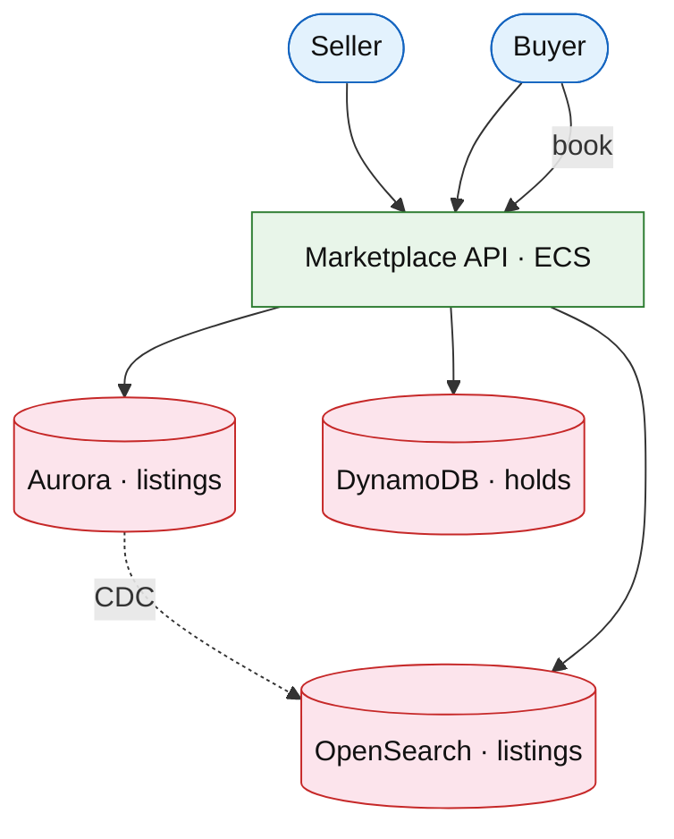

# Two-sided marketplace listings

## Introduction

Marketplace connects **sellers** listing goods/services with **buyers** searching and booking. Core challenges: **listing CRUD**, **geo search**, **availability holds**, and **trust** (reviews link).

**Primary users:** sellers (listings), buyers (search/book), ops (fraud, featured slots).

**Interview pacing:** Deep dive **listings index + geo search + booking hold**.

## Requirements discovery

| Lock (target) |
| --- |
| 10M active listings |
| 1M searches / day |
| Hold TTL 15 min for booking |
| Geo radius search p99 &lt; 300 ms |

## Architecture (user → database)

**Narrative:** **Listings** in Aurora indexed to **OpenSearch** with geo_point. **Booking** creates TTL **hold** in DynamoDB before payment capture.

## Deep dive: geo + hold

- **Geo filter** + sort by distance/score.
- **Hold** conditional write prevents double booking.
- Link [reviews](./reviews-ratings.md) and [product search](./product-search.md).

## Related

- [Event ticketing](./event-ticketing.md) (hot inventory contrast)
- [Product search](./product-search.md)
- [Payment workflow](../fintech/payment-workflow-platform.md)
