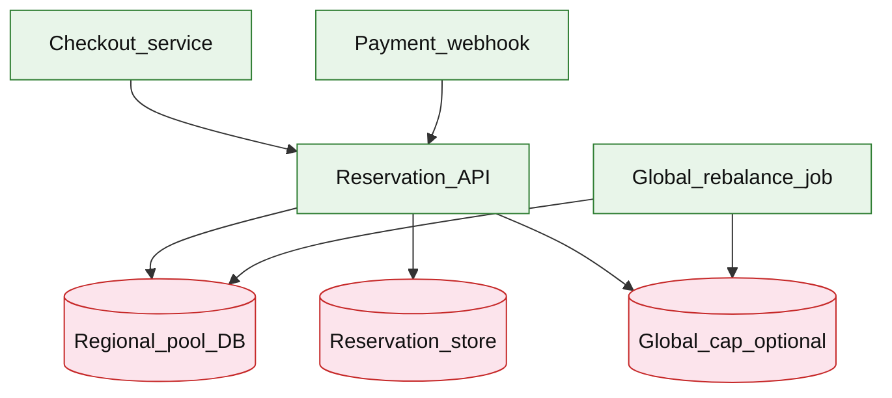

# Multi-region inventory reservation

## Introduction

A multi-region inventory reservation service holds **stock pools per region**, grants **time-bound holds** during checkout, and **confirms or releases** capacity after payment. The central design tension is **region-local quotas** (low latency, partition tolerance) versus a **globally consistent** view (no oversell across regions).

**Primary users:** checkout and cart services (reserve/confirm), warehouse/ops (pool adjustments), finance (oversell audits), operators (rebalance jobs, partition runbooks).

**Interview pacing:** Use [60-minute runbook](../../prep/interview-runbook-60m.md) — ~10 min requirements theater (below), ~18–32 min diagram + API/DB, ~46–56 min deep dive on **region quota vs global consistency**.

Checkout flow context: [shopping cart checkout](./shopping-cart-checkout.md) validates at checkout; this service owns **hold → confirm/release**. Hot-SKU patterns overlap [event ticketing](./event-ticketing.md).

## Requirements discovery (interview theater)

### Question bank

| Topic | You ask | If they push back | Example answer (reasonable default) |
| --- | --- | --- | --- |
| Oversell | Zero oversell globally or soft? | "Never oversell" | **Zero oversell** for sellable SKU; compensation only for ops mistakes |
| Reservation TTL | How long is a hold? | "Until payment" | **15 minutes** default; extend once on payment in-flight |
| Region model | Active-active all regions? | "US only" | 3 regions (US-East, US-West, EU); customer routed to **nearest region** |
| Consistency | Global truth or regional? | "Strong everywhere" | **Regional pools** with quotas; async **global rebalance**; optional strict mode for hero SKUs |
| Partition | Region isolated from others? | "Always available" | **Local safety quota** — region stops selling below floor when partition detected |
| Confirm path | Who confirms? | "Order service" | Payment success → `confirm`; failure/timeout → `release` |
| Out of scope | Full WMS, shipment routing? | "Add forecasting" | Pool CRUD via ops API; defer demand forecasting, pick/pack |

### Example dialogue

> **You:** Let's scope v1: one happy path and what's out of scope?
> **Them:** …
> **You:** For scale, prototype vs 12-month target?
> **Them:** …
> **You:** What does each actor do per day on the hot path?
> **Them:** …
> **You:** I'll lock the **target** column assumptions unless you want different numbers — next I'll map fleet totals to monthly AWS meters in **billable volume**.

### Parsed requirements

| Field | Source question | Parsed value (target) | Drives |
| --- | --- | --- | --- |
| `shopper_dau_u` | Shopper DAU (`U`) | **50M** | Scale tiers, input model, fleet totals |
| `active_skus` | Active SKUs | **500k** | Scale tiers, input model, fleet totals |
| `regions_r` | Regions (`R`) | **3** | Scale tiers, input model, fleet totals |
| `peak_reserve_rps_q_peak` | Peak reserve RPS (`Q_peak`) | **3,000/s** global | Scale tiers, input model, fleet totals |
| `peak_confirm_rps` | Peak confirm RPS | **~500/s** | Scale tiers, input model, fleet totals |
| `reservation_ttl` | Reservation TTL | **15 min** | Storage steady-state |
| `model` | Model | **async rebalance** | Scale tiers, input model, fleet totals |
| `oversell_tolerance` | Oversell tolerance | **0** | Scale tiers, input model, fleet totals |
| `partition_behavior` | Partition behavior | **pause cross-region rebalance** | Scale tiers, input model, fleet totals |

### Locked assumptions

Reserve spikes track [shopping cart checkout](./shopping-cart-checkout.md) flash checkout (**500/s** peak at **50M** DAU). SKU catalog size is constant across tiers.

| Assumption | Prototype (MVP) | Growth | Target (anchor) |
| --- | --- | --- | --- |
| Shopper DAU (`U`) | 10k | 1M | **50M** |
| Active SKUs | 50k | 200k | **500k** |
| Regions (`R`) | 1 | 2 | **3** |
| Peak reserve RPS (`Q_peak`) | ~0.6/s | ~60/s | **3,000/s** global |
| Peak confirm RPS | ~0.01/s | ~1/s | **~500/s** |
| Reservation TTL | 15 min | 15 min | 15 min |
| Model | regional pool + global cap | same | async rebalance |
| Oversell tolerance | 0 | 0 | 0 |
| Partition behavior | local `safety_floor` | same | pause cross-region rebalance |

*After ~10 minutes, proceed with the **target** column unless the interviewer changes scope.*

### Interview Q&A cheat sheet

Say aloud in order (~10 min). Write locks into **parsed requirements** before capacity math.

| Step | You ask | Lock if vague (target) |
| --- | --- | --- |
| 1 — Oversell | Zero oversell globally or soft? | **Zero oversell** for sellable SKU; compensation only for ops mistakes |
| 2 — Reservation TTL | How long is a hold? | **15 minutes** default; extend once on payment in-flight |
| 3 — Region model | Active-active all regions? | 3 regions (US-East, US-West, EU); customer routed to **nearest region** |
| 4 — Consistency | Global truth or regional? | **Regional pools** with quotas; async **global rebalance**; optional strict mode for hero SKUs |
| 5 — Partition | Region isolated from others? | **Local safety quota** — region stops selling below floor when partition detected |
| 6 — Confirm path | Who confirms? | Payment success → `confirm`; failure/timeout → `release` |
| 7 — Out of scope | Full WMS, shipment routing? | Pool CRUD via ops API; defer demand forecasting, pick/pack |

## Capacity sketch

### User input model

| Action | Actor | Per day (target) | API | ~Size | Durable write |
| --- | --- | --- | --- | --- | --- |
| Reserve hold | checkout | **~260M** churn | `POST /v1/reservations` | 0.3 KB | **~150 B** hold row |
| Confirm | payment webhook | **~750k** | `POST .../confirm` | 0.2 KB | decrement pool |
| Release / expire | system | matches churn | `POST .../release` | 0.2 KB | delete hold |
| Pool adjust | ops | 5k | `PATCH /v1/pools` | 0.5 KB | **64 B** pool row |

### Fleet totals (target)

| Metric | Formula | Value |
| --- | --- | --- |
| Peak reserve RPS | from checkout flash | **3,000/s** |
| Per-region reserve | `Q_peak / R` | **1,000/s** |
| Active holds (upper bound) | `Q_peak × 900s` | **~2.7M** rows |
| Pool rows | `500k × 3` | **1.5M** |
| Audit events / day | sustained reserve churn | **~260M** |

### Traffic profile (target tier)

| Metric | Value |
| --- | --- |
| **Read:write (API requests)** | **~1:350** (availability GETs vs reserve/confirm/release churn) |
| **Read:write (durable bytes)** | Ephemeral holds **~400 MB** active; audit **~10–40 GB**/day |
| **Requests / day (fleet)** | **~261M** (~260M reserve + ~750k confirm + ops) |
| **Avg RPS** | **~3,020/s** (`261M / 86,400`) |
| **Peak RPS** | **3,000/s** reserve; **500/s** confirm |

| User / actor | Action | R/W | Per user (or actor) / day | % of fleet requests |
| --- | --- | --- | --- | --- |
| Checkout service | Reserve hold | W | ~5.2 | **~99%** |
| Payment webhook | Confirm | W | 0.015 | **~0.3%** |
| System | Release / expire | W | matches churn | **~0.5%** |
| Ops | Pool adjust | W | — | **&lt;0.01%** |

*Per-checkout reserve rates track [shopping cart checkout](./shopping-cart-checkout.md); `U` scales fleet totals.*

### AWS service map (target deployment)

| AWS service | Role in this design |
| --- | --- |
| Amazon API Gateway | Reservation + availability REST |
| Application Load Balancer | Multi-region Reservation API |
| Amazon ECS on Fargate | Reservation API (region-routed) |
| Amazon Aurora PostgreSQL | Regional `inventory_pools` (per-region shards) |
| Amazon ElastiCache for Redis | Active `reservations` holds + TTL |
| Amazon DynamoDB | Optional `Global_cap` coordinator for hero SKUs |
| Amazon ECS on Fargate / AWS Batch | Global rebalance job (async quota shifts) |
| Amazon Kinesis Data Firehose | Reservation audit stream (compliance) |
| Amazon S3 | Cold audit archive |
| Amazon CloudWatch | Oversell alerts, hold backlog, partition health |
| Amazon VPC | Per-region pools; cross-region via VPC endpoint |

### Scale tiers

| Tier | `U` | `Q_peak` | Confirm peak | Active holds (max) | Regions |
| --- | --- | --- | --- | --- | --- |
| Prototype | 10k | **~0.6/s** | **~0.01/s** | **~540** | 1 |
| Growth | 1M | **~60/s** | **~1/s** | **~54k** | 2 |
| Target | 50M | **3,000/s** | **500/s** | **~2.7M** | 3 |

### Symbols

| Symbol | Meaning |
| --- | --- |
| `U` | Shopper DAU (checkout driver) |
| `Q_peak` | Peak reservation creates per second (global) |
| `R` | Number of regions |
| `ttl` | Hold duration (900 s) |
| `H` | Active concurrent holds |
| `S_pool` | Bytes per `inventory_pool` row (~64 B) |

### Derivation (traffic)

**Per-region reserve:** `Q_peak / R` → target **1,000/s** — hash `(sku, region)` for shard locality.

**Active holds:** `Q_peak × ttl` → **~2.7M** rows at sustained peak → **~400 MB** at 150 B/row + indexes.

**Confirm/release:** tracks checkout completion — **~500/s** peak at target (lower than reserve).

**Global rebalance:** batch every 5–15 min — not on hot path.

**Hot SKU:** single-row counter anti-pattern — shard pools (see [event ticketing](./event-ticketing.md).

### Storage and growth over time

| Table / store | ~Row size | New rows/day (target) | Retention | Steady-state (target) | Per unit |
| --- | --- | --- | --- | --- | --- |
| `inventory_pools` | 64 B | rare | permanent | **1.5M → ~100 MB** | 1/SKU/region |
| `reservations` | 150 B | 260M churn | 15 min TTL | **2–3M** active | transient |
| `reservation_audit` | 200 B | 260M | 90d hot | **~4.7B/quarter** | per attempt |
| Global quota ledger | 48 B | 500k SKUs | permanent | **~24 MB** | — |

**Daily durable ingest:** hot holds **~500 MB** rotating; audit **~10–40 GB/day** (policy-dependent).

**5-year audit (cold tier):** **~95 TB** if all attempts logged — tier to object storage.

### Per-user economics (target)

| Metric | Value | Notes |
| --- | --- | --- |
| Reserve attempts / DAU / day | **~5.2** | `260M / 50M` (checkout funnel) |
| Ephemeral bytes / DAU / day | **~780 B** | hold churn amortized |
| Pool metadata / SKU | **~192 B** | 3 regions × 64 B |
| Audit bytes / DAU / day | **~1 KB** | if full audit enabled |

### Service footprint (instances)

| Service | Scales with | Prototype | Growth | Target |
| --- | --- | --- | --- | --- |
| Reservation API | `Q_peak` | 2 | 15 | **~100** pods |
| Regional pool DB | shards + hot SKU | 1 | 4 shards | **~24** shards |
| Hold store | active `H` | 1 Redis | cluster | **~500 MB–1 GB** RAM |
| Rebalance job | SKU count | cron | cron | **batch fleet** |

**First scale cliff:** **~1M DAU** — hot SKU row on single shard; split pools before hero-SKU flash events.

### Billable volume (target month)

Convert **fleet totals** to AWS billing meters before dollar math. *List-price ballparks — not a quote.*

| Design quantity (target) | Formula | Monthly billable unit |
| --- | --- | --- |
| API requests | `requests_day × 30` | **derive from fleet** (**~261M** (~260M reserve + ~750k confirm + ops)) |
| OLTP storage steady | storage table | **___ GB-mo** |
| Cache / Redis RAM | footprint | **___ GB** (node tier) |
| Egress / CDN | `egress_day × 30` | **___ GB / mo** |
| Stream / queue events | `events_day × 30` | **___ million events / mo** |
| Log ingest (if full capture) | `log_GB_day × 30` | **___ GB ingest / mo** |
| **Per unit** | `total / scale driver` | **$…/unit/mo** |

*Reconcile rows in **Cloud cost ballpark** (9a) with these meters.*

### Cost at a glance

Interview sound bite — reconcile with **billable volume** and **cloud cost** below.

| Tier | Scale | ~Monthly $ (core) | Per unit |
| --- | --- | --- | --- |
| Prototype (MVP) | see locked assumptions | **~$400** | platform tax dominates |
| Target (anchor) | `U` or `Q` = **see locked assumptions** | **see cloud cost** | **~$0.00032/DAU/mo** |

**First payment block:** smallest prod footprint (load balancer + database + compute) before per-million traffic dominates.

### Cloud cost ballpark (target)

| Line item | Driver | ~Monthly |
| --- | --- | --- |
| Reservation API | ~100 pods | **~$8k** |
| Pool + hold OLTP/Redis | ~1 GB hot | **~$3k** |
| Audit pipeline | 10–40 GB/day | **~$5k** |
| **Total (hot path)** | | **~$16k/mo** |
| **Per DAU** | `16k / 50M` | **~$0.00032/DAU/mo** |

Audit cold storage excluded — discuss **$/1M reserve attempts** if interviewer focuses on compliance logging.

### Timeline (same checkout ratios; `U` doubles ~monthly)

| Milestone | `U` | `Q_peak` (est.) | Active holds max | ~Monthly $ |
| --- | --- | --- | --- | --- |
| Launch | 10k | **~0.6/s** | **~540** | **~$400** |
| Month 3 | 80k | **~5/s** | **~4.5k** | **~$1.5k** |
| Month 6 | 320k | **~19/s** | **~18k** | **~$5k** |
| Month 12 | 1.3M | **~78/s** | **~70k** | **~$18k** |

Target-tier **3k/s** reserve requires **50M DAU** flash-sale posture — month 12 is still growth footprint.

### Sensitivity

- **10× reserve RPS** — shard `inventory_pool` and hold store; hot SKU rows first.
- **Strict global consistency** — coordinator latency + partition fragility.
- **Longer TTL** — active holds grow linearly (`Q_peak × ttl`).

## High-level design

### Architecture (user → database)



**Narrative:** `Reservation_API` routes by **customer region** (or SKU home region). **Reserve** decrements `available_qty` in the regional pool and inserts a `reservation` with `expires_at`. **Confirm** after payment marks hold consumed; **release** restores qty. `Global_rebalance_job` shifts quota between regions using sales signals. For **hero SKUs**, optional `Global_cap` coordinator enforces hard ceiling across regions (higher latency path).

## User-visible surface

- **Checkout:** reserve → receive `reservation_id` + expiry; on payment success, inventory stays sold; on failure, stock returns.
- **Shopper messaging:** `409` / `422` with `out_of_stock` vs `reservation_expired` vs `region_unavailable`.
- **Ops:** adjust regional pools, set safety floors, trigger manual rebalance, view oversell alerts (should be zero).

## API contract and input model

### UX → API traceability

| UX / UI action | User intent | API or event | Sync/async | Idempotent? | Validates |
| --- | --- | --- | --- | --- | --- |
| **Checkout:** reserve → receive `reservation_id` + expiry; o | Create hold (idempotent) | `POST` `/v1/reservations` | sync | yes | domain rules |
| **Shopper messaging:** `409` / `422` with `out_of_stock` vs | Finalize after payment | `POST` `/v1/reservations/{reservation | sync | yes | domain rules |
| **Ops:** adjust regional pools, set safety floors, trigger m | Explicit or payment-failure release | `POST` `/v1/reservations/{reservation | sync | yes | domain rules |
| See user-visible surface | Read approximate availability by region | `GET` `/v1/inventory/{sku}/availabil | sync | read | domain rules |
| See user-visible surface | Operator-triggered quota shift (internal) | `POST` `/v1/admin/pools/rebalance` | sync | yes | domain rules |
### Endpoints

| Method | Path | Purpose |
| --- | --- | --- |
| `POST` | `/v1/reservations` | Create hold (idempotent) |
| `POST` | `/v1/reservations/{reservation_id}/confirm` | Finalize after payment |
| `POST` | `/v1/reservations/{reservation_id}/release` | Explicit or payment-failure release |
| `GET` | `/v1/inventory/{sku}/availability` | Read approximate availability by region |
| `POST` | `/v1/admin/pools/rebalance` | Operator-triggered quota shift (internal) |

### Example payloads

`POST /v1/reservations`

```http
Idempotency-Key: res-ord-8f2a1c-001
```

```json
{
 "sku": "SKU-42",
 "quantity": 2,
 "region": "us-east",
 "order_id": "ord_8f2a1c",
 "ttl_seconds": 900
}
```

Response `201 Created`:

```json
{
 "reservation_id": "res_7k2m9p",
 "sku": "SKU-42",
 "quantity": 2,
 "region": "us-east",
 "status": "HELD",
 "expires_at": "2026-05-22T16:15:00Z"
}
```

Insufficient stock `409 Conflict`:

```json
{
 "error": "out_of_stock",
 "sku": "SKU-42",
 "region": "us-east",
 "available_qty": 1,
 "requested_qty": 2
}
```

`POST /v1/reservations/res_7k2m9p/confirm`

```json
{
 "payment_id": "pay_7d3e9b"
}
```

Response `200 OK`:

```json
{
 "reservation_id": "res_7k2m9p",
 "status": "CONFIRMED",
 "confirmed_at": "2026-05-22T16:05:00Z"
}
```

`POST /v1/reservations/res_7k2m9p/release`

```json
{
 "reason": "payment_failed"
}
```

Response `200 OK`:

```json
{
 "reservation_id": "res_7k2m9p",
 "status": "RELEASED",
 "released_at": "2026-05-22T16:04:30Z"
}
```

`GET /v1/inventory/SKU-42/availability`

```json
{
 "sku": "SKU-42",
 "global_available": 1200,
 "regions": [
 { "region": "us-east", "available_qty": 400, "safety_floor": 50 },
 { "region": "us-west", "available_qty": 500, "safety_floor": 50 },
 { "region": "eu-west", "available_qty": 300, "safety_floor": 40 }
 ],
 "as_of": "2026-05-22T16:00:00Z"
}
```

### Input validation

- `quantity` ≥ 1; max per reservation (e.g. 20) unless B2B flag.
- `region` must be in allowlist; reserve only against that pool.
- `Idempotency-Key` on `POST /reservations` — same key returns same hold if still active.
- Confirm/release only from `HELD` (or `HELD_EXTENDED`); idempotent if already terminal.

## Database model

### Tables / stores

| Table | Key fields | Notes |
| --- | --- | --- |
| `inventory_pool` | `sku`, `region` (PK), `available_qty`, `reserved_qty`, `safety_floor`, `version` | Regional sellable capacity |
| `global_sku_cap` | `sku` (PK), `total_cap`, `allocated_sum` | Optional strict ceiling |
| `reservation` | `reservation_id` (PK), `sku`, `qty`, `region`, `order_id`, `status`, `expires_at`, `idempotency_key` | Hold lifecycle |
| `rebalance_log` | `run_id`, `sku`, `from_region`, `to_region`, `qty`, `at` | Audit |

Indexes:

- `reservation(expires_at)` where `status='HELD'` — expiry sweeper
- `reservation(order_id)` — confirm by order
- `reservation(idempotency_key)` UNIQUE
- `inventory_pool(sku)` — cross-region admin views

### Reservation state machine

```text
HELD → CONFIRMED
HELD → RELEASED (explicit, payment fail, or expiry)
HELD → HELD_EXTENDED (optional one-time TTL bump during payment)
```

### Read/write paths

1. **Reserve (happy path)** — txn: `SELECT available_qty FROM inventory_pool WHERE sku=? AND region=? FOR UPDATE` → if `available_qty >= qty`, decrement, increment `reserved_qty`, insert `reservation` `HELD` → commit.
2. **Expiry sweeper** — cron: `UPDATE reservation SET status=RELEASED` where `expires_at < now` → txn restore `available_qty`.
3. **Confirm** — txn: set `reservation` `CONFIRMED`; decrement `reserved_qty` (qty leaves sellable pool permanently).
4. **Release** — txn: restore `available_qty`, clear `reserved_qty` portion, `RELEASED`.
5. **Rebalance** — job: compute target quotas from velocity; `UPDATE inventory_pool` move qty between regions if `global_sku_cap` allows.

## Interview deep dive: Region quota vs global consistency

### Model comparison

| Model | Latency | Partition behavior | Oversell risk |
| --- | --- | --- | --- |
| **Regional pools + rebalance** | Low (local row lock) | Region sells local stock; may **undersell** globally when maldistributed | Near zero if `sum(regional) ≤ global_cap` |
| **Global strong coordinator** | +1 RTT (or leader region) | Hard stop when coordinator unavailable | Lowest oversell |
| **Eventual global counter (CRDT)** | Low | Complex merge rules | Risk without careful bounds |
| **Single global DB** | Cross-region RTT | Partition hurts all regions | Low oversell, poor availability |

**Interview default:** regional pools with **`global_sku_cap`** invariant: `Σ region.available_qty ≤ total_cap`. Rebalance fixes **undersell**, not oversell.

### Partition and safety floor

When region A loses contact with global control plane:

- Continue **reserve/confirm** using **local** `inventory_pool` only.
- Enforce `available_qty - reserved_qty ≥ safety_floor` before selling — preserves emergency stock.
- Pause inbound rebalance from other regions until partition heals.
- **Risk:** if quotas were stale, region A might oversell vs true global — mitigate with conservative `safety_floor` and pre-provisioned quotas.

### Hero SKU path

Flash SKU (single row hot spot)

- Split into **sub-pools** (`SKU-42#0..#N`) hashed by cart/session.
- Or route reserves through **global coordinator** with short TTL — accept latency for correctness.
- Compare to [event ticketing](./event-ticketing.md) shard-per-section pattern.

### Confirm vs reserve separation

- **Reserve** is reversible (TTL).
- **Confirm** is irreversible inventory consumption — must be **idempotent** with payment webhook (`payment_id` dedupe).
- Never confirm without payment signal or operator override (audit).

## Scale and failure

### Correctness model

- Per `(sku, region)` pool updates are transactional — no negative `available_qty` under row lock.
- `CONFIRMED` reservations cannot be released by expiry sweeper.
- Idempotent reserve returns same `reservation_id` for duplicate checkout retries.
- Global cap: rebalance never increases `Σ available` above `total_cap` without ops inbound shipment event.

### Failure cases

| Failure | Symptom | Mitigation |
| --- | --- | --- |
| Hot SKU row lock | p99 reserve latency spike | Sub-pools; queue reserves; coordinator shard |
| Expiry sweeper lag | Ghost shortage (qty tied in expired holds) | Dedicated sweeper; metric `held_past_expiry` |
| Double confirm | Duplicate webhook | `UNIQUE(payment_id)` on confirm side effect |
| Payment slow | Hold expires mid-charge | One-time `HELD_EXTENDED`; payment service requests extension |
| Rebalance during spike | Wrong regional split | Cooldown; velocity window; manual override lock |
| Partition | Cross-region oversell drift | Safety floor; stop rebalance; reconcile on heal |
| Global cap drift | Sum(regional) > cap | Reconciliation alert; clamp pools |

### Key metrics

- Reserve success vs `out_of_stock` rate by `sku` / `region`
- Active holds count; mean time in `HELD`
- Expiry vs confirm vs release ratio
- Rebalance volume; **global cap violation** alerts (target 0)
- p99 reserve latency; row lock wait time on hot SKUs
- Post-partition reconciliation mismatches

### Interview deep dive talking points

- State problem: **latency/partition** vs **zero oversell** — pick regional pools + cap, not silent oversell.
- Draw **reserve → confirm/release** lifecycle before regional diagram.
- Explain **undersell** from quota maldistribution vs **oversell** from partition — different fixes.
- Hero SKU: sub-pool or coordinator — tie to ticketing.
- Close with expiry sweeper + payment idempotent confirm.

## Related

- [Examples hub](./README.md)
- [Shopping cart checkout](./shopping-cart-checkout.md)
- [Event ticketing](./event-ticketing.md)
- [Event-driven order pipeline](../event-driven/event-driven-order-pipeline.md)
- [Real-time delivery tracking](../logistics/real-time-delivery-tracking.md)
- [60-minute runbook](../../prep/interview-runbook-60m.md)
