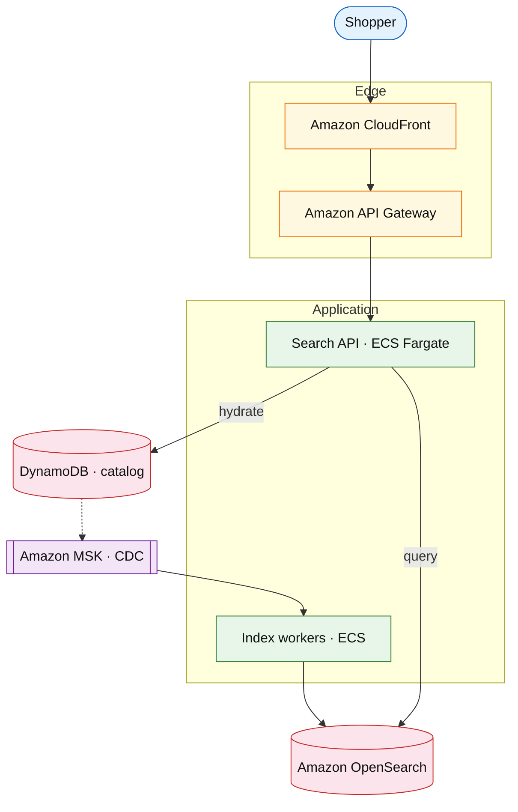

# Product search and typeahead

## Introduction

Product search returns ranked results and typeahead suggestions for a large catalog. The design separates **write indexing** (eventually consistent) from **low-latency read** (cached top queries) and supports **facets**, **spelling tolerance**, and **merchandising boosts** without blocking checkout.

**Primary users:** shoppers (search, filters), merchandising (boost rules), operators (index lag, reindex jobs).

**Interview pacing:** Use [60-minute runbook](../../prep/interview-runbook-60m.md) — ~10 min requirements, ~18–32 min diagram + API/DB, ~46–56 min deep dive on **inverted index + ranking + typeahead**.

## Requirements discovery

### Interview Q&A cheat sheet

| Step | You ask | Lock if vague (target) |
| --- | --- | --- |
| 1 — Scale | DAU? Searches per user per day? Catalog size? | 50M DAU; 5 searches/user/day; 100M SKUs |
| 2 — Latency | p99 for search and typeahead? | Search p99 &lt; 200 ms; suggest p99 &lt; 80 ms |
| 3 — Freshness | How stale can results be after price change? | Index lag &lt; 60 s acceptable; badge if older |
| 4 — Personalization | Per-user rank? | v1: global rank + boosts; optional user segment |
| 5 — Out of scope | Training platform, visual search? | Defer ML platform; lexical + facets v1 |

### Parsed requirements

| Field | Target | Drives |
| --- | --- | --- |
| `U` | 50M DAU | QPS |
| `S` | 5 searches / user / day | ~250M searches/day |
| `C` | 100M active SKUs | Index size, shard count |
| `p99_search` | &lt; 200 ms | OpenSearch + hydration batch |
| `index_lag` | &lt; 60 s | CDC pipeline |

## Capacity sketch

### AWS service map (target)

| AWS service | Role | Design metric |
| --- | --- | --- |
| Amazon OpenSearch | Index + query | ~2–5 TB index; query QPS |
| Amazon DynamoDB | Catalog source of truth | 100M items |
| Amazon MSK | CDC events | ~500M change events/day |
| Amazon CloudFront | Cache hot queries / suggest | egress GB |
| Amazon ECS Fargate | Search API + indexers | scale on QPS / lag |

### Cost at a glance

| Tier | Scale | ~Monthly $ |
| --- | --- | --- |
| Prototype | 5M DAU | ~$2k |
| Target | 50M DAU | ~$25k (OpenSearch-heavy) |

## High-level design

### Architecture (user → database)

**Narrative:** Catalog writes land in **DynamoDB**; **CDC** updates **OpenSearch**. **Search API** queries the index, applies ranking boosts, batch-hydrates display fields from catalog. **CloudFront** caches popular queries and typeahead prefixes.

## API contract

| UX | API | Notes |
| --- | --- | --- |
| Typeahead | `GET /v1/search/suggest?q=` | Prefix cache at edge |
| Search | `GET /v1/search?q=&facet=` | Paginated, facet filters |
| Admin reindex | `POST /v1/admin/reindex` | Async job |

## Interview deep dive: index + rank + typeahead

- **Bulk indexing** with version field; reject stale writes.
- **Ranking:** BM25 + business boosts; sponsored slots as separate lane.
- **Typeahead:** top-prefix cache; rate limit abusive IPs.
- **Degrade:** index lag → stale badge; fallback category browse.

## Related

- [OpenSearch drill](../aws/opensearch.md)
- [Shopping cart](./shopping-cart-checkout.md)
- [Topics index](../../topics-index.md)
