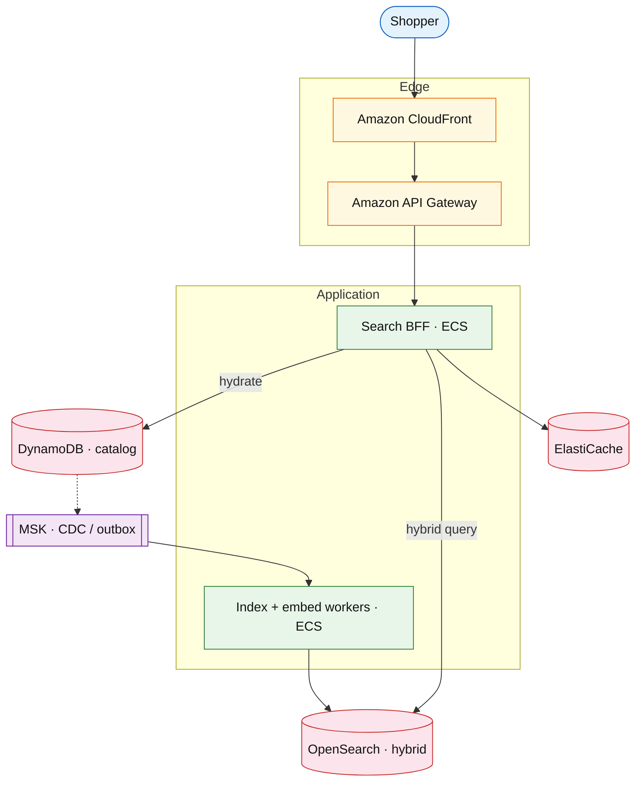

# Product search and typeahead

## Introduction

Product search returns ranked results and typeahead for a large catalog. **Nowadays** this is rarely “OpenSearch alone”: production stacks use **hybrid retrieval** (lexical + vector), a **BFF** for hydration, **edge cache** for suggest, **CDC/outbox** for indexing, and **feature-flagged** ranking experiments.

**Primary users:** shoppers, merchandising (boosts), operators (index lag, reindex).

**Interview pacing:** [60-minute runbook](../../topics/interview-runbook-60m.md) — deep dive **hybrid index + ranking + typeahead**.

## Requirements discovery

### Interview Q&A cheat sheet

| Step | You ask | Lock if vague (target) |
| --- | --- | --- |
| 1 — Scale | DAU? Searches/user/day? Catalog size? | 50M DAU; 5 searches/user/day; 100M SKUs |
| 2 — Latency | p99 search / suggest? | Search p99 &lt; 200 ms; suggest p99 &lt; 80 ms |
| 3 — Freshness | Staleness after price change? | Index lag &lt; 60 s; show “may be stale” badge |
| 4 — Relevance | Lexical only or semantic? | **Hybrid** BM25 + kNN embeddings v1 |
| 5 — Personalization | Per-user rank? | Global + segment boosts; full personalization behind flag |
| 6 — Out of scope | Training platform, visual search? | Defer full ML platform; keep embedding **batch/stream** job |

### Parsed requirements

| Field | Target | Drives |
| --- | --- | --- |
| `U` | 50M DAU | QPS |
| `S` | 5 searches / user / day | ~250M searches/day ≈ ~3k QPS avg, higher peak |
| `C` | 100M active SKUs | Shard count, embedding store size |
| `p99_search` | &lt; 200 ms | OpenSearch + BFF hydrate |
| `index_lag` | &lt; 60 s | CDC / outbox pipeline |

## Capacity sketch

### AWS service map (target)

| AWS service | Role | Design metric |
| --- | --- | --- |
| Amazon OpenSearch | Lexical + **kNN** hybrid query | ~2–5 TB index; query QPS |
| Amazon DynamoDB | Catalog source of truth | 100M items |
| Amazon MSK | CDC / outbox events | ~500M change events/day |
| Amazon S3 | Embedding model artifacts / offline features | GB |
| Amazon CloudFront | Cache hot queries / suggest | egress GB |
| Amazon ECS Fargate | Search BFF + indexers + embed workers | scale on QPS / lag |
| Amazon ElastiCache | Prefix suggest + query result cache | hit ratio |

### Store comparison (say this out loud)

| Store | Why |
| --- | --- |
| DynamoDB | Source of truth for SKU; key access for hydrate |
| OpenSearch | Facets, BM25, typo tolerance, **vector kNN** |
| Redis | Hot suggest prefixes; stampede control on popular `q` |
| S3 | Model blobs / offline features — not query path |

### Cost at a glance

| Tier | Scale | ~Monthly $ |
| --- | --- | --- |
| Prototype | 5M DAU | ~$2–4k |
| Target | 50M DAU | ~$25–40k (OpenSearch + vectors dominate) |

## High-level design

### Architecture (user → database)

**Narrative:** Writes commit to **DynamoDB** with a **transactional outbox** (or CDC) onto **MSK**. Indexers update **OpenSearch** documents and embeddings. **BFF** runs hybrid query, applies merch boosts (flag-gated), batch-hydrates from catalog, caches hot responses. **CloudFront** caches public suggest GETs with short TTL.

## API contract

| UX | API | Notes |
| --- | --- | --- |
| Typeahead | `GET /v1/search/suggest?q=` | Edge + Redis; rate limit |
| Search | `GET /v1/search?q=&facet=&cursor=` | Cursor pagination; `trace_id` |
| Admin reindex | `POST /v1/admin/reindex` | Async; canary shard first |

## Interview deep dive: hybrid index + rank + typeahead

- **Lexical:** BM25 + synonyms + fuzzy; facets as aggregations.
- **Semantic:** query + document embeddings; **kNN** recall set merged with BM25 (RRF or weighted).
- **Ranking:** blend scores + business boosts; **sponsored** lane separate; experiment via [feature flags](../platform/feature-flag-platform.md).
- **Typeahead:** top-prefix lists; single-flight on cache miss ([caching](../../topics/caching.md)).
- **Freshness:** version field rejects stale index writes; lag metric + “stale” UI badge.
- **Degrade:** OpenSearch unhealthy → category browse / Redis-only hot queries.

## Scale, failure, and modern ops

| Failure | Detection | Mitigation |
| --- | --- | --- |
| Index lag &gt; SLO | Lag gauge + burn alert | Page if auto-pause of noncritical reindex fails ([on-call](../../topics/oncall-operations.md)) |
| Query p99 spike after deploy | Canary 5% traffic | Auto-rollback task def ([deployment](../../topics/deployment.md)) |
| Hot query stampede | Redis miss storm | Lock + jittered TTL |
| Bad ranking experiment | Flag kill switch | Disable treatment without redeploy |

**Observability:** OpenTelemetry from API Gateway → BFF → OpenSearch; RED metrics; SLO on p99 + index lag ([observability](../../topics/observability.md)).

## Related

- [OpenSearch drill](../aws/opensearch.md)
- [Shopping cart](./shopping-cart-checkout.md)
- [Caching](../../topics/caching.md)
- [Data stores](../../topics/data-stores.md)
- [Frontend strategies](../../topics/frontend-strategies.md)
- [Messaging / async](../../topics/messaging-async.md)
- [Topics index](../../topics-index.md)
