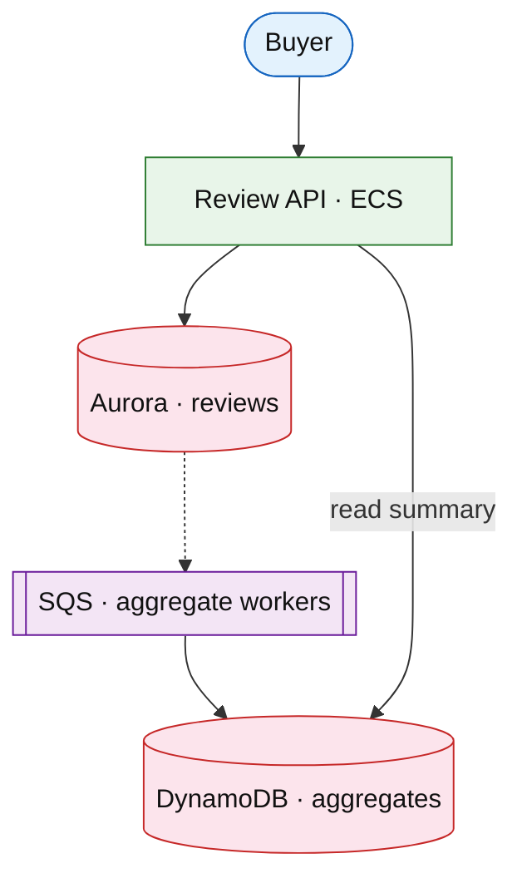

# Reviews and ratings aggregation

## Introduction

Product **reviews** accept text + star ratings; the system maintains **aggregates** (histogram, average), **helpful votes**, and **fraud** signals for display on PDP and search.

**Primary users:** buyers (submit/read), moderators (flag), merchandising (sort order).

**Interview pacing:** Deep dive **aggregate consistency + fraud + read path**.

## Requirements discovery

| Lock (target) |
| --- |
| 100M products with reviews |
| 10M new reviews / month |
| Display aggregate stale &lt; 60 s |
| Helpful vote idempotent |

## Architecture (user → database)

**Narrative:** Writes append to **Aurora**; async workers recompute **histogram + average** in DynamoDB. Reads hit precomputed aggregate for fast PDP.

## Deep dive: aggregates under concurrency

- **Atomic increment** per star bucket; recompute average from histogram.
- **Fraud:** velocity limits, device graph, hold suspicious for moderation.
- **Eventual** display OK with “pending moderation” state.

## Related

- [Product search](./product-search.md)
- [Shopping cart](./shopping-cart-checkout.md)
- [SQS/SNS drill](../aws/sqs-sns.md)
