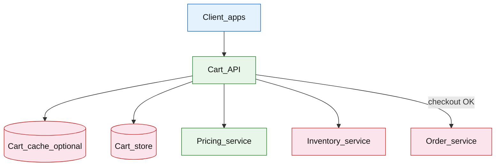

# Shopping cart checkout service

## Introduction

A shopping cart service holds **mutable basket state** (SKUs, quantities, price snapshots) until the customer checks out. The hard problems are **concurrent edits** across devices, **guest-to-login merge**, and **checkout validation** against live inventory and pricing before handing off to the order pipeline.

**Primary users:** shoppers (guest and logged-in), checkout web/mobile apps, order service (downstream), operators (cart abandonment metrics, merge failure rates).

**Interview pacing:** Use [60-minute runbook](../../topics/interview-runbook-60m.md) — ~10 min requirements theater (below), ~18–32 min diagram + API/DB, ~46–56 min deep dive on **concurrency + merge + checkout validation**.

Hot inventory reservation at checkout overlaps with [event ticketing](./event-ticketing.md); order placement after validation is covered in [event-driven order pipeline](../event-driven/event-driven-order-pipeline.md).

## Requirements discovery (interview theater)

### Question bank

| Topic | You ask | If they push back | Example answer (reasonable default) |
| --- | --- | --- | --- |
| Users & scale | DAU? Cart mutations per day? Checkout conversion? | "Big retailer" | 50M DAU; 30% add to cart → **~15M active carts/day**; **~5% checkout** → ~750k checkouts/day |
| Identity | Guest carts? Session TTL? | "Login required" | Guest `session_id` cart 14-day TTL; logged-in `user_id` cart persistent |
| Merge | What happens on sign-in? | "Discard guest" | **Merge** guest into user cart (union SKUs, sum qty, cap per-SKU max) |
| Pricing | Price frozen at add or at checkout? | "Always latest" | Store `price_snapshot` on add/update; **re-fetch current price at checkout** |
| Inventory | Reserve on add or checkout? | "Reserve in cart" | Validate availability at checkout only (no long hold) — mention optional short TTL hold |
| Consistency | Lost updates OK? | "Last write wins" | **Optimistic locking** on cart `version`; 409 on stale write |
| Out of scope | Wishlist, recommendations, tax engine? | "Add coupons" | Basic promo code field; defer full tax/VAT service, recommendations |

### Example dialogue

> **You:** Let's scope v1: one happy path and what's out of scope?
> **Them:** …
> **You:** For scale, prototype vs 12-month target?
> **Them:** …
> **You:** What does each actor do per day on the hot path?
> **Them:** …
> **You:** I'll lock the **target** column assumptions unless you want different numbers — next I'll map fleet totals to monthly AWS meters in **billable volume**.

### Parsed requirements

| Field | Source question | Parsed value (target) | Drives |
| --- | --- | --- | --- |
| `dau_u` | DAU (`U`) | **50M** | Scale tiers, input model, fleet totals |
| `active_cart_rate_%_of_dau` | Active cart rate (% of DAU) | **30%** | Scale tiers, input model, fleet totals |
| `cart_mutations_per_active_cart_/_day_m` | Cart mutations per active cart / day (`M`) | **8** | Scale tiers, input model, fleet totals |
| `checkout_rate_%_of_active_carts` | Checkout rate (% of active carts) | **5%** | Scale tiers, input model, fleet totals |
| `checkouts_/_day` | Checkouts / day | **750k** | Scale tiers, input model, fleet totals |
| `peak_checkout_rps_x_peak` | Peak checkout RPS (`X_peak`) | **~500/s** | Scale tiers, input model, fleet totals |
| `cart_ttl_guest` | Cart TTL (guest) | **14 days** | Storage steady-state |
| `concurrency` | Concurrency | **same** | Scale tiers, input model, fleet totals |
| `checkout_validation` | Checkout validation | **same** | Scale tiers, input model, fleet totals |
| `merge_policy` | Merge policy | **same** | Scale tiers, input model, fleet totals |

### Locked assumptions

| Assumption | Prototype (MVP) | Growth | Target (anchor) |
| --- | --- | --- | --- |
| DAU (`U`) | 10k | 1M | **50M** |
| Active cart rate (% of DAU) | 30% | 30% | 30% |
| Cart mutations per active cart / day (`M`) | 8 | 8 | 8 |
| Checkout rate (% of active carts) | 5% | 5% | 5% |
| Checkouts / day | 15 | 1.5k | **750k** |
| Peak checkout RPS (`X_peak`) | ~0.01/s | ~1/s | **~500/s** |
| Cart TTL (guest) | 14 days | 14 days | 14 days |
| Concurrency | optimistic `version` | same | same |
| Checkout validation | inventory + price + order handoff | same | same |
| Merge policy | union SKUs; cap per-SKU max | same | same |

*After ~10 minutes, proceed with the **target** column unless the interviewer changes scope.*

### Interview Q&A cheat sheet

Say aloud in order (~10 min). Write locks into **parsed requirements** before capacity math.

| Step | You ask | Lock if vague (target) |
| --- | --- | --- |
| 1 — Users & scale | DAU? Cart mutations per day? Checkout conversion? | 50M DAU; 30% add to cart → **~15M active carts/day**; **~5% checkout** → ~750k checkouts/day |
| 2 — Identity | Guest carts? Session TTL? | Guest `session_id` cart 14-day TTL; logged-in `user_id` cart persistent |
| 3 — Merge | What happens on sign-in? | **Merge** guest into user cart (union SKUs, sum qty, cap per-SKU max) |
| 4 — Pricing | Price frozen at add or at checkout? | Store `price_snapshot` on add/update; **re-fetch current price at checkout** |
| 5 — Inventory | Reserve on add or checkout? | Validate availability at checkout only (no long hold) — mention optional short TTL hold |
| 6 — Consistency | Lost updates OK? | **Optimistic locking** on cart `version`; 409 on stale write |
| 7 — Out of scope | Wishlist, recommendations, tax engine? | Basic promo code field; defer full tax/VAT service, recommendations |

## Capacity sketch

### User input model

| Action | % of DAU | Per user / day | API | ~Req size | Durable write / user / day |
| --- | --- | --- | --- | --- | --- |
| Add / update cart | 30% (active) | 8 mutations | `PATCH /v1/carts/{id}` | 1 KB | **~2 KB** (`carts` + items) |
| Read cart | 30% | 4 | `GET /v1/carts/{id}` | 2 KB resp | 0 |
| Checkout | 1.5% of DAU | 1 | `POST /v1/carts/{id}/checkout` | 2 KB | triggers order pipeline |
| Merge on login | 5% | 0.2 | `POST /v1/carts/merge` | 1 KB | rewrite cart row |

### Fleet totals (target, `U` = 50M)

| Metric | Formula | Value |
| --- | --- | --- |
| Active carts / day | `0.3 × U` | **15M** |
| Mutations / day | `15M × 8` | **120M** |
| Checkouts / day | `15M × 5%` | **750k** |
| Cart API requests / day | mutations + reads + checkout | **~180M** |
| Durable cart bytes / day | `15M × 2 KB` | **~30 GB** |

### Traffic profile (target tier)

| Metric | Value |
| --- | --- |
| **Read:write (API requests)** | **~1:2** (mutations + checkout vs cart reads) |
| **Read:write (durable bytes)** | **~2:1** writes (cart rows) vs reads (no OLTP on GET) |
| **Requests / day (fleet)** | **~180M** |
| **Avg RPS** | **~2,100/s** (`180M / 86,400`) |
| **Peak RPS** | **~21k/s** cart API; **500/s** checkout |

| User / actor | Action | R/W | Per user (or actor) / day | % of fleet requests |
| --- | --- | --- | --- | --- |
| Shopper (active cart) | Add / update cart | W | 8 | **~67%** |
| Shopper (active cart) | Read cart | R | 4 | **~33%** |
| Shopper | Checkout | W | 1 | **~0.4%** |
| Shopper | Merge on login | W | 0.2 | **~0.2%** |

*Per-user rates stay fixed across prototype → target; only `U` scales fleet totals.*

### AWS service map (target deployment)

| AWS service | Role in this design |
| --- | --- |
| Amazon API Gateway | Public cart + checkout REST |
| Application Load Balancer | Cart API service routing |
| Amazon ECS on Fargate | Cart API + checkout orchestrator |
| Amazon Aurora PostgreSQL | `carts`, `cart_items` (optimistic `version`) |
| Amazon ElastiCache for Redis | Optional cart read cache + version checks |
| Amazon ECS on Fargate / AWS Lambda | Downstream pricing + inventory clients |
| Amazon SQS | Async cart audit events (optional) |
| Amazon EventBridge | Checkout success → order pipeline handoff |
| Amazon CloudWatch | 409 conflict rate, checkout rejection reasons |
| AWS X-Ray | Checkout validation chain latency |
| Amazon VPC | Internal service mesh to inventory/pricing/order peers |

### Scale tiers

| Tier | `U` | Active carts/day | Mutations/day | Checkouts/day | Avg cart RPS | Peak cart RPS | Peak checkout RPS |
| --- | --- | --- | --- | --- | --- | --- | --- |
| Prototype | 10k | 3k | 24k | 15 | **~0.3** | **~3** | **~0.01** |
| Growth | 1M | 300k | 2.4M | 1.5k | **~28** | **~280** | **~1** |
| Target | 50M | 15M | 120M | 750k | **~2.1k** | **~21k** | **500** |

### Symbols

| Symbol | Meaning |
| --- | --- |
| `U` | Daily active users |
| `p_cart` | Share of DAU with active cart (0.3) |
| `M` | Mutations per active cart per day (8) |
| `p_chk` | Checkout conversion of active carts (0.05) |
| `K_peak` | Peak cart API RPS |
| `X_peak` | Peak checkout RPS |
| `S_cart` | Bytes per cart + items (~2 KB) |

### Derivation (traffic)

**Mutations:** `C_day × M = 0.3 × U × 8` → target **120M/day** → **~1,400/s** avg, **`K_peak ≈ 10×` → ~14k RPS** (reads + writes).

**Checkouts:** `0.3 × U × 0.05` → target **750k/day** → **~8.7/s** avg, **`X_peak = 500/s`** flash sales.

**Downstream at checkout peak:** 3 calls (inventory, pricing, order) × **500/s** → **~1.5k dependency RPS**.

**Egress:** cart reads `15M × 4 × 2 KB` ≈ **120 GB/day** API JSON (CDN not used for cart API).

### Storage and growth over time

| Table / store | ~Row size | New rows/day (target) | Retention | Steady-state (target) | Per DAU |
| --- | --- | --- | --- | --- | --- |
| `carts` | 400 B header | 15M | 14d guest TTL | **50–100M** live → **20–40 GB** | **~0.8 B** |
| `cart_items` | 150 B/line | 75M lines | with cart | **~250M** lines → **~35 GB** | — |
| `cart_events` (audit) | 200 B | 120M | 30d | **~7 GB** hot | optional |

**Cumulative (no TTL thought experiment):**

| Horizon | New cart rows | Data (`× 2 KB`) |
| --- | --- | --- |
| 1 year | 5.5B | **~11 TB** |
| 5 years | 27B | **~54 TB** |

With **14-day TTL**, steady state **~100–200 GB** live cart data at target.

### Per-user economics (target)

| Metric | Value | Notes |
| --- | --- | --- |
| Requests / DAU / day | **~3.6** | `180M / 50M` |
| Cart bytes / DAU / day (writers) | **~600 B** | `30 GB / 50M` |
| Live cart footprint / DAU | **~4 KB** | `200 GB / 50M` |
| Checkouts / DAU / day | **0.015** | 1.5% of all DAU |
| Egress / DAU / day | **~2.4 KB** | cart read responses |

### Service footprint (instances)

| Service | Scales with | Prototype | Growth | Target |
| --- | --- | --- | --- | --- |
| Cart API | `K_peak` | 2 | 15 | **~120** pods |
| Cart DB / cache | live GB + write RPS | 1 primary | 2 + Redis | **~8** shards + **~50 GB** Redis |
| Checkout orchestrator | `X_peak` | 2 | 5 | **~40** |
| Inventory / pricing deps | `3 × X_peak` | stub | shared | **capacity plan with peers** |

**First scale cliff:** **~1M DAU** — optimistic conflict rate and cart DB writes; Redis cart cache with version before **10M DAU**.

### Billable volume (target month)

Convert **fleet totals** to AWS billing meters before dollar math. *List-price ballparks — not a quote.*

| Design quantity (target) | Formula | Monthly billable unit |
| --- | --- | --- |
| API requests | `requests_day × 30` | **derive from fleet** (**~180M**) |
| OLTP storage steady | storage table | **___ GB-mo** |
| Cache / Redis RAM | footprint | **___ GB** (node tier) |
| Egress / CDN | `egress_day × 30` | **___ GB / mo** |
| Stream / queue events | `events_day × 30` | **___ million events / mo** |
| Log ingest (if full capture) | `log_GB_day × 30` | **___ GB ingest / mo** |
| **Per DAU** | `total / U` (`U` = 50M) | **$…/DAU/mo** |

*Reconcile rows in **Cloud cost ballpark** (9a) with these meters.*

### Cost at a glance

Interview sound bite — reconcile with **billable volume** and **cloud cost** below.

| Tier | Scale | ~Monthly $ (core) | Per unit |
| --- | --- | --- | --- |
| Prototype (MVP) | see locked assumptions | **~$400** | platform tax dominates |
| Target (anchor) | `U` or `Q` = **50M** | **see cloud cost** | **$…/DAU/mo** |

**First payment block:** smallest prod footprint (load balancer + database + compute) before per-million traffic dominates.

### Cloud cost ballpark (target)

| Line item | Driver | ~Monthly |
| --- | --- | --- |
| Cart API | ~120 pods | **~$9k** |
| Cart OLTP + Redis | ~200 GB | **~$4k** |
| Audit events | 7 GB hot | **~$500** |
| **Total** | | **~$14k/mo** |
| **Per DAU** | `14k / 50M` | **~$0.00028/DAU/mo** |

Checkout spikes are mostly **downstream** cost (inventory, orders) — call out in interview.

### Timeline (same per-user rates; `U` doubles ~monthly)

| Milestone | `U` | Live cart data | Requests/day | ~Monthly $ |
| --- | --- | --- | --- | --- |
| Launch | 10k | **~4 MB** | 180k | **~$400** |
| Month 3 | 80k | **~32 MB** | 1.4M | **~$2k** |
| Month 6 | 320k | **~130 MB** | 5.8M | **~$6k** |
| Month 12 | 1.3M | **~520 MB** | 23M | **~$20k** |

### Sensitivity

- **10× mutations** — cart store write IOPS and 409 conflict rate; Redis summary + version.
- **10× checkouts** — inventory and pricing saturate before cart DB.
- **Strict reservation in cart** — TTL holds on add-to-cart; moves complexity off checkout path.

## High-level design

### Architecture (user → database)



**Narrative:** `Cart_API` owns cart CRUD with version checks. Optional `Cart_cache` serves read-heavy cart pages; writes go through DB as source of truth. **Checkout** loads cart, revalidates **inventory** and **pricing**, then calls `Order_service` with an idempotency key; on success, cart moves to `CHECKED_OUT` or is deleted. Sign-in **merge** runs as a dedicated transaction comparing guest and user carts.

## User-visible surface

- **Shopper:** add/update/remove lines; see subtotal from snapshots; on checkout, clear errors for out-of-stock or price change with “update cart” prompt.
- **Guest → login:** guest cart merges into account; conflicts shown if qty exceeds max.
- **Client apps:** handle `409 Conflict` with refresh-and-retry UX for concurrent edits.
- **Operator:** metrics on merge failures, checkout rejection reasons, abandoned carts by age.

## API contract and input model

### UX → API traceability

| UX / UI action | User intent | API or event | Sync/async | Idempotent? | Validates |
| --- | --- | --- | --- | --- | --- |
| **Shopper:** add/update/remove lines; see subtotal from snap | Read cart (requires `If-None-Match` / version opti | `GET` `/v1/carts/{cart_id}` | sync | read | domain rules |
| **Guest → login:** guest cart merges into account; conflicts | Add line (or bump qty) | `POST` `/v1/carts/{cart_id}/items` | sync | yes | domain rules |
| **Client apps:** handle `409 Conflict` with refresh-and-retr | Update qty | `PATCH` `/v1/carts/{cart_id}/items/{li | sync | yes | domain rules |
| **Operator:** metrics on merge failures, checkout rejection | Remove line | `DELETE` `/v1/carts/{cart_id}/items/{li | sync | yes | domain rules |
| See user-visible surface | Merge guest cart into user cart | `POST` `/v1/carts/merge` | sync | yes | domain rules |
| See user-visible surface | Validate and create order | `POST` `/v1/carts/{cart_id}/checkout` | sync | yes | domain rules |
### Endpoints

| Method | Path | Purpose |
| --- | --- | --- |
| `GET` | `/v1/carts/{cart_id}` | Read cart (requires `If-None-Match` / version optional) |
| `POST` | `/v1/carts/{cart_id}/items` | Add line (or bump qty) |
| `PATCH` | `/v1/carts/{cart_id}/items/{line_id}` | Update qty |
| `DELETE` | `/v1/carts/{cart_id}/items/{line_id}` | Remove line |
| `POST` | `/v1/carts/merge` | Merge guest cart into user cart |
| `POST` | `/v1/carts/{cart_id}/checkout` | Validate and create order |

All mutating cart routes require `If-Match: <version>` (or `version` in body) for optimistic concurrency.

### Example payloads

`POST /v1/carts/cart_guest_9f2/items`

```http
If-Match: 3
```

```json
{
 "sku": "SKU-42",
 "quantity": 2
}
```

Response `200 OK`:

```json
{
 "cart_id": "cart_guest_9f2",
 "version": 4,
 "currency": "USD",
 "items": [
 {
 "line_id": "line_001",
 "sku": "SKU-42",
 "quantity": 2,
 "price_snapshot_cents": 1999,
 "title": "Wireless mouse"
 }
 ],
 "subtotal_snapshot_cents": 3998,
 "updated_at": "2026-05-22T16:00:00Z"
}
```

Stale version → `409 Conflict`:

```json
{
 "error": "version_conflict",
 "current_version": 7,
 "message": "Cart was modified on another device. Refresh and retry."
}
```

`POST /v1/carts/merge`

```json
{
 "guest_cart_id": "cart_guest_9f2",
 "user_cart_id": "cart_user_4412"
}
```

Response `200 OK` (merged into user cart)

```json
{
 "cart_id": "cart_user_4412",
 "version": 12,
 "merged_from": "cart_guest_9f2",
 "items": [ "... combined lines ..." ]
}
```

`POST /v1/carts/cart_user_4412/checkout`

```http
Idempotency-Key: checkout-7b3c9e2a-001
If-Match: 12
```

```json
{
 "shipping_address_id": "addr_2201",
 "payment_method_token": "pm_tok_abc"
}
```

Response `201 Created` (validation passed)

```json
{
 "order_id": "ord_8f2a1c",
 "cart_id": "cart_user_4412",
 "total_cents": 4198,
 "price_adjustments": [
 {
 "sku": "SKU-42",
 "snapshot_cents": 1999,
 "charged_cents": 2099,
 "reason": "price_refresh"
 }
 ]
}
```

Validation failure `422 Unprocessable`:

```json
{
 "error": "checkout_validation_failed",
 "issues": [
 { "sku": "SKU-99", "code": "out_of_stock", "requested_qty": 1, "available_qty": 0 }
 ]
}
```

### Input validation

- `quantity`: integer 1–99 per line; `max_qty_per_sku` enforced at merge and add.
- `sku`: must exist in catalog service (or cached catalog); reject unknown SKU at add.
- `If-Match` / `version`: required on PATCH, DELETE, checkout; reject if mismatch.
- `Idempotency-Key` on checkout: 24h TTL; same key returns same `order_id`.
- Guest cart: bound to `session_id` cookie; merge requires authenticated user token.

## Database model

### Tables

| Table | Key fields | Notes |
| --- | --- | --- |
| `carts` | `cart_id` (PK), `user_id`, `session_id`, `status`, `version`, `currency`, `expires_at`, `updated_at` | `status`: `ACTIVE`, `CHECKED_OUT`, `MERGED` |
| `cart_items` | `cart_id`, `line_id`, `sku`, `quantity`, `price_snapshot_cents`, `updated_at` | Unique `(cart_id, sku)` |
| `checkout_attempts` | `idempotency_key`, `cart_id`, `order_id`, `status`, `created_at` | Checkout dedupe |
| `cart_merge_log` | `merge_id`, `guest_cart_id`, `user_cart_id`, `result`, `at` | Audit / debug |

Indexes:

- `carts(user_id)` where `status='ACTIVE'`
- `carts(session_id)` where `status='ACTIVE'`
- `carts(expires_at)` for guest TTL sweeper
- `cart_items(cart_id)`

### Read/write paths

1. **Add item** — `BEGIN` → read `carts.version` → upsert `cart_items` → `UPDATE carts SET version=version+1` → `COMMIT`; return new version.
2. **Read cart** — `SELECT` cart + items; optional cache keyed by `cart_id:version`.
3. **Merge** — load guest + user carts → compute union (SKU dedupe, qty sum with cap) → write user cart in one txn → mark guest `MERGED` → increment version once.
4. **Checkout** — verify `If-Match` → parallel inventory + pricing calls → if fail, `422` without order → if OK, `POST` order service → `checkout_attempts` + set cart `CHECKED_OUT` in txn with idempotency key.

## Interview deep dive: Concurrency + merge + checkout validation

### Optimistic concurrency

| Approach | When to use | Tradeoff |
| --- | --- | --- |
| Last-write-wins | Low contention, simple UX | **Lost updates** on multi-device |
| **Optimistic `version`** | Interview default for carts | 409 conflicts; client must refresh |
| Pessimistic row lock | High contention single cart | Blocks parallel edits; deadlock risk |
| CRDT / op-based merge | Collaborative carts (rare) | Complex; overkill for retail |

**Pattern:** single `carts.version` incremented on any line change; client sends `If-Match`. Conflict rate is a product metric — high rate means UX or session model issue.

### Guest merge semantics

| Rule | Behavior |
| --- | --- |
| SKU only in guest | Copy line to user cart |
| SKU only in user | Keep user line |
| SKU in both | `qty = min(qty_guest + qty_user, max_qty_per_sku)` |
| Price snapshot | Prefer **newer `updated_at`** or re-fetch price on merge (state in interview) |
| Guest cart after merge | `status=MERGED`; stop serving writes |

**Edge cases:** merge while checkout in flight → reject merge or lock cart (`checkout_in_progress` flag). Two tabs merge same guest twice → idempotent merge by `guest_cart_id` status.

### Checkout validation (not just DB read)

1. **Inventory** — batch `available_qty` per SKU; no long-lived reservation unless interviewer adds TTL hold.
2. **Pricing** — current price vs `price_snapshot`; return `price_adjustments` if different (transparent UX).
3. **Promo/rules** — optional; apply after price refresh.
4. **Order handoff** — idempotent `POST /orders` with cart snapshot hash in request body so order matches validated view.

**Why validate at checkout:** cart is **intent**, not commitment; inventory changes continuously; price promotions update.

### vs event ticketing

- Cart: **optimistic**, soft validation, many edits, lower peak write contention per SKU.
- Ticketing: **pessimistic hold** or inventory lock at purchase time; zero oversell; hotter keys per event.

## Scale and failure

### Correctness model

- Serializable cart updates per `cart_id` via DB transaction + version increment.
- No checkout without passing inventory and pricing checks at commit time.
- Duplicate checkout with same `Idempotency-Key` returns same `order_id` without double order.
- Merge is atomic; guest cart cannot be checked out after `MERGED`.

### Failure cases

| Failure | Symptom | Mitigation |
| --- | --- | --- |
| Version conflict | 409 on PATCH | Client refresh cart, replay mutation |
| Inventory stale at checkout | 422 out of stock | User updates qty; show available count |
| Price drift | 422 or 201 with adjustments | Display new total; require confirm if delta &gt; threshold |
| Pricing service timeout | Checkout fails open? | **Fail closed** on checkout (do not place order); retry |
| Order service OK, cart not marked checked out | Orphan order risk | Outbox or txn: mark cart only after order ack; reconcile job |
| Merge during checkout | Race | Cart lock flag or status `CHECKING_OUT` |
| Guest TTL sweep | Cart deleted mid-session | Extend TTL on activity; warn before expiry |
| Hot SKU flash sale | Inventory always 422 | Rate limit adds; queue checkout (ticketing pattern) |

### Key metrics

- Cart mutation RPS; **409 conflict rate** per endpoint
- Merge success/failure; lines dropped due to `max_qty`
- Checkout attempts vs `201` vs `422` breakdown by reason
- Time from add-to-cart to checkout; abandonment by cart age
- Price adjustment frequency; inventory rejection rate at checkout

### Interview deep dive talking points

- Walk **locked assumptions → ~14k cart RPS / ~500 checkout RPS** before diagram.
- Defend **optimistic version** over last-write-wins with two-device story.
- Specify **merge rules** line by line; mention checkout lock.
- Separate **snapshot for display** vs **refresh at checkout** for pricing.
- Close with checkout **fail closed** and handoff idempotency to order service.

## Related

- [Examples hub](./README.md)
- [Event-driven order pipeline](../event-driven/event-driven-order-pipeline.md)
- [Event ticketing](./event-ticketing.md)
- [Multi-region inventory reservation](./multi-region-inventory-reservation.md)
- [Payment workflow platform](../fintech/payment-workflow-platform.md)
- [Concurrency ](../../topics/concurrency.md)
- [60-minute runbook](../../topics/interview-runbook-60m.md)
