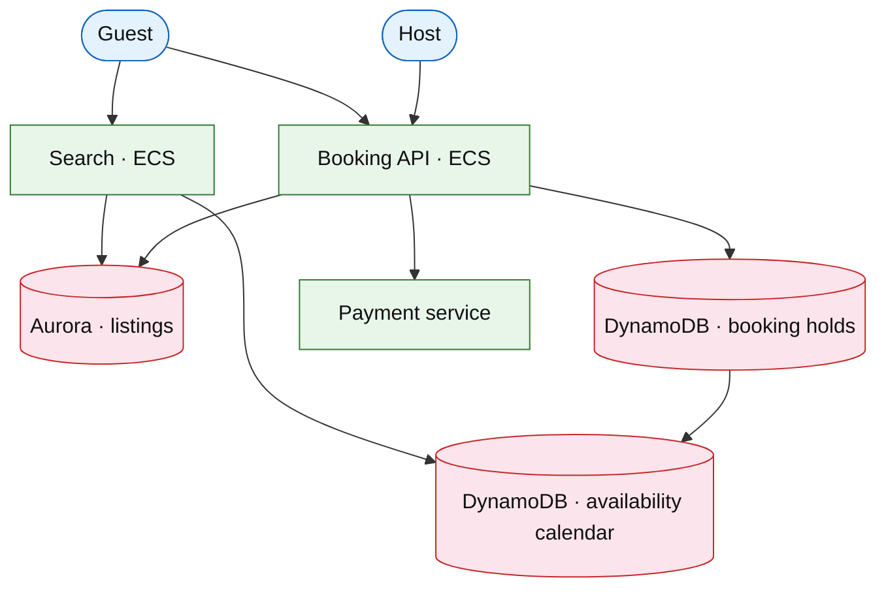

# Travel booking platform (Airbnb / Booking.com)

## Introduction

Travel booking combines **search** (geo + dates), **inventory holds**, and **payment capture** — extends [marketplace listings](./marketplace-listings.md) with **date-range availability** and **cancellation policies**.

**Company anchors:** Airbnb, Booking.com, Expedia.

## Requirements discovery

| Lock (target) |
| --- |
| 50M listings |
| Search p99 &lt; 400 ms (city + dates) |
| Hold 15 min during checkout |
| Double-booking must be impossible |

## Architecture (user → database)

**Narrative:** **Calendar** stores per-listing day bitmap or interval tree. **Hold** is conditional write on date range. **Search** filters geo index then availability intersection.

## Deep dive

- **Hold TTL** + sweep for expired holds.
- **Pricing** dynamic per night (defer ML).
- Link [payment workflow](../fintech/payment-workflow-platform.md).

## Related

- [Marketplace listings](./marketplace-listings.md)
- [Event ticketing](./event-ticketing.md) (inventory pressure)
- [Product search](./product-search.md)
