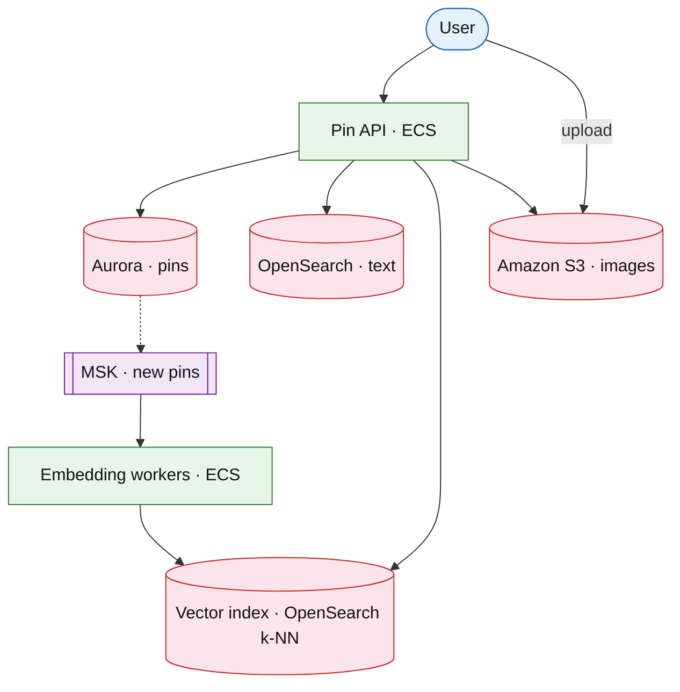

# Visual discovery platform (Pinterest)

## Introduction

Visual discovery lets users **pin** images to boards and search by **image similarity** + text — combines [product search](./product-search.md) with embedding index and social graph of boards/follows.

**Company anchors:** Pinterest, Google Lens (search-only variant).

## Requirements discovery

| Lock (target) |
| --- |
| 500M pins |
| Image search p99 &lt; 300 ms |
| Home feed: boards + recommendations |
| Upload: async embedding pipeline |

## Architecture (user → database)

**Narrative:** **Upload** stores image in **S3**; **MSK** triggers **embedding** job → **vector index**. **Search** blends text (OpenSearch) + nearest-neighbor on embedding. **Home feed** uses follow graph + similar pins.

## Deep dive

- **k-NN** shard sizing vs recall.
- **Safe search** classifier on upload path.
- Compare [feed ranking](../social/feed-ranking-service.md).

## Related

- [Product search](./product-search.md)
- [OpenSearch drill](../aws/opensearch.md)
- [Feed ranking](../social/feed-ranking-service.md)
