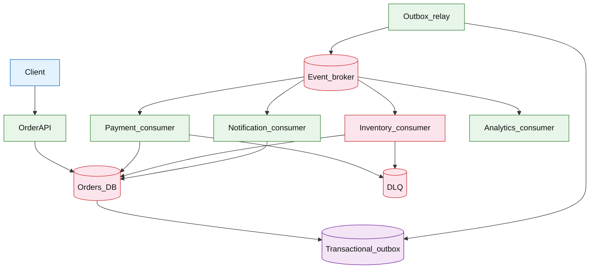

# Event-driven order pipeline

## Introduction

An event-driven order pipeline accepts **order placement** synchronously, then completes payment, inventory, and notification work **asynchronously** via domain events. The API returns quickly with a durable `order_id`; downstream consumers advance status without blocking the client on every dependency.

**Primary users:** shoppers (place order, track status), internal domain services (payment, inventory, notification), operators (replay DLQ, inspect stuck orders).

**Interview pacing:** Use [60-minute runbook](../../topics/interview-runbook-60m.md) — ~10 min requirements theater (below), ~18–32 min diagram + API/DB, ~46–56 min deep dive on **outbox + idempotency + replay**.

For reusable event-driven patterns (contracts, versioning, choreography vs orchestration), see [event-driven architecture reference](../../topics/event-driven-architecture.md).

## Requirements discovery (interview theater)

### Question bank

| Topic | You ask | If they push back | Example answer (reasonable default) |
| --- | --- | --- | --- |
| Users & scale | Orders per day? Peak multiplier? | "Moderate e-commerce" | 5M orders/day; 5× peak at lunch; ~300 order creates/s sustained, ~1.5k/s peak |
| Consistency | When can customer see `PAID`? | "Strong everywhere" | **Read-your-writes** on order status API; cross-service effects eventual within seconds |
| Transport | Kafka, SQS, Rabbit? | "Pick one" | Kafka-style log; partitions by `order_id`; at-least-once delivery |
| Failure handling | Retry forever? Manual replay? | "Auto-heal" | Bounded retries → DLQ; operator replay with idempotency guard |
| Idempotency | Duplicate `POST /orders`? Duplicate events? | "Clients are sloppy" | `Idempotency-Key` on API; consumer dedupe on `event_id` + business keys |
| Ordering | Strict per order? | "Global order" | **Per-`order_id` partition** preserves causal order for that aggregate |
| Out of scope | Full cart, search, fraud ML? | "Add checkout UI" | Single `POST /orders`; defer catalog search, chargeback ML, multi-cart merge |

### Example dialogue

> **You:** Let's scope v1: one happy path and what's out of scope?
> **Them:** …
> **You:** For scale, prototype vs 12-month target?
> **Them:** …
> **You:** What does each actor do per day on the hot path?
> **Them:** …
> **You:** I'll lock the **target** column assumptions unless you want different numbers — next I'll map fleet totals to monthly AWS meters in **billable volume**.

### Parsed requirements

| Field | Source question | Parsed value (target) | Drives |
| --- | --- | --- | --- |
| `shopper_dau_u` | Shopper DAU (`U`) | **50M** | Scale tiers, input model, fleet totals |
| `orders_per_dau_per_day_l_o` | Orders per DAU per day (`L_o`) | **0.1** | Scale tiers, input model, fleet totals |
| `orders_per_day_o_day` | Orders per day (`O_day`) | **5M** | Scale tiers, input model, fleet totals |
| `peak_create_rps_c_peak` | Peak create RPS (`C_peak`) | **1,500/s** (lunch + sale spike) | Scale tiers, input model, fleet totals |
| `downstream_consumers` | Downstream consumers | **Payment, inventory, notification, analytics** | Scale tiers, input model, fleet totals |
| `events_per_order_e` | Events per order (`E`) | **6 (publish + status fanout)** | Scale tiers, input model, fleet totals |
| `broker` | Broker | **key = `order_id`; retention 7 days** | Scale tiers, input model, fleet totals |
| `api_consistency` | API consistency | **transactional outbox** | Scale tiers, input model, fleet totals |
| `delivery` | Delivery | **effectively-once** business side | Scale tiers, input model, fleet totals |
| `retry_policy` | Retry policy | **same** | Scale tiers, input model, fleet totals |
| `status_visibility_sla` | Status visibility SLA | **terminal state visible to customer** | Scale tiers, input model, fleet totals |

### Locked assumptions

Commerce scale aligns with [shopping cart checkout](../commerce/shopping-cart-checkout.md) (**50M** shopper DAU at target). Use **target** for the interview anchor.

| Assumption | Prototype (MVP) | Growth | Target (anchor) |
| --- | --- | --- | --- |
| Shopper DAU (`U`) | 10k | 1M | **50M** |
| Orders per DAU per day (`L_o`) | 0.1 | 0.1 | 0.1 |
| Orders per day (`O_day`) | 1k | 100k | **5M** |
| Peak create RPS (`C_peak`) | ~0.3/s | ~30/s | **1,500/s** (lunch + sale spike) |
| Downstream consumers | 4 | 4 | Payment, inventory, notification, analytics |
| Events per order (`E`) | 6 | 6 | 6 (publish + status fanout) |
| Broker | partitioned log | same | key = `order_id`; retention 7 days |
| API consistency | outbox + `orders` txn | same | transactional outbox |
| Delivery | at-least-once + dedupe | same | **effectively-once** business side |
| Retry policy | 5× backoff → DLQ | same | same |
| Status visibility SLA | 30s p99 | same | terminal state visible to customer |

*After ~10 minutes, proceed with the **target** column unless the interviewer changes scope.*

### Interview Q&A cheat sheet

Say aloud in order (~10 min). Write locks into **parsed requirements** before capacity math.

| Step | You ask | Lock if vague (target) |
| --- | --- | --- |
| 1 — Users & scale | Orders per day? Peak multiplier? | 5M orders/day; 5× peak at lunch; ~300 order creates/s sustained, ~1.5k/s peak |
| 2 — Consistency | When can customer see `PAID`? | **Read-your-writes** on order status API; cross-service effects eventual within seconds |
| 3 — Transport | Kafka, SQS, Rabbit? | Kafka-style log; partitions by `order_id`; at-least-once delivery |
| 4 — Failure handling | Retry forever? Manual replay? | Bounded retries → DLQ; operator replay with idempotency guard |
| 5 — Idempotency | Duplicate `POST /orders`? Duplicate events? | `Idempotency-Key` on API; consumer dedupe on `event_id` + business keys |
| 6 — Ordering | Strict per order? | **Per-`order_id` partition** preserves causal order for that aggregate |
| 7 — Out of scope | Full cart, search, fraud ML? | Single `POST /orders`; defer catalog search, chargeback ML, multi-cart merge |

## Capacity sketch

### User input model

| Action | % of DAU | Per user / day | API | ~Req size | Durable write / user / day |
| --- | --- | --- | --- | --- | --- |
| Place order | 10% (buyers) | 1 | `POST /v1/orders` | 3 KB req | **~800 B** (`orders` row) |
| Poll order status | 10% | 3 | `GET /v1/orders/{id}` | 1 KB | read-mostly |
| List orders (account) | 5% | 1 | `GET /v1/orders` | 5 KB | read-mostly |
| Operator / DLQ replay | — | — | internal | — | outbox relay (system) |

### Fleet totals (target, `U` = 50M, `O_day` = 5M)

| Metric | Formula | Value |
| --- | --- | --- |
| Orders / day | `0.1 × U` | **5M** |
| Status reads / day | `0.1 × U × 3` | **15M** |
| API requests / day | orders + reads + lists | **~22M** |
| OLTP bytes / day | `5M × 800 B` | **~4 GB** |
| Broker events / day | `5M × 6` | **30M** (~**15 GB** at 500 B/event) |

### Traffic profile (target tier)

| Metric | Value |
| --- | --- |
| **Read:write (API requests)** | **~3.5:1** (status poll + list vs place order) |
| **Read:write (durable bytes)** | **~4:1** (OLTP **~4 GB**/day vs broker **~15 GB**/day) |
| **Requests / day (fleet)** | **~22M** |
| **Avg RPS** | **~255/s** (`22M / 86,400`) |
| **Peak RPS** | **~1,500/s** creates; **~3k/s** API (status + lists at lunch spike) |

| User / actor | Action | R/W | Per user (or actor) / day | % of fleet requests |
| --- | --- | --- | --- | --- |
| Shopper (buyer) | Place order | W | 1 | **~23%** |
| Shopper (buyer) | Poll order status | R | 3 | **~68%** |
| Shopper (account) | List orders | R | 1 | **~11%** |
| Operator | DLQ replay | W | — | **&lt;1%** (internal) |

*Per-user rates stay fixed across prototype → target; only `U` scales fleet totals.*

### AWS service map (target deployment)

| AWS service | Role in this design |
| --- | --- |
| Amazon API Gateway | Public REST edge for `POST/GET /v1/orders` |
| Application Load Balancer | Internal routing to Order API pods (if not API Gateway-only) |
| Amazon ECS on Fargate | Order API + outbox relay workers |
| Amazon Aurora PostgreSQL | `orders` + transactional `outbox` (single txn) |
| Amazon MSK | Partitioned event log (`order_id` key) |
| Amazon ElastiCache for Redis | Idempotency keys + hot `order_id` status cache |
| Amazon SQS | DLQ for failed consumer messages |
| Amazon ECS on Fargate | Payment, inventory, notification, analytics consumer groups |
| Amazon CloudWatch | Lag, outbox age, consumer error alarms |
| AWS X-Ray | Trace create → publish → consumer paths |
| AWS Secrets Manager | DB and broker credentials |
| Amazon VPC | Internal subnets for API, DB, MSK |

### Scale tiers

| Tier | `U` | `O_day` | Broker events/day | Avg create RPS | Peak create RPS |
| --- | --- | --- | --- | --- | --- |
| Prototype | 10k | 1k | 6k | **~0.01** | **~0.3** |
| Growth | 1M | 100k | 600k | **~1.2** | **~30** |
| Target | 50M | 5M | 30M | **~58** | **1,500** |

### Symbols

| Symbol | Meaning |
| --- | --- |
| `U` | Shopper DAU (tier-dependent) |
| `L_o` | Orders per buying DAU per day (1; 10% of `U` buy) |
| `O_day` | `0.1 × U` orders created per day |
| `C_peak` | Peak `POST /orders` RPS |
| `E` | Downstream events per order (~6) |
| `P` | Broker partitions (order-keyed) |
| `S_order` | Bytes per `orders` row (~800 B) |
| `S_outbox` | Bytes per outbox row (~500 B) |

### Derivation (traffic)

**Creates:** `O_day = 0.1 × U` → target **5M/day** → **~58/s** avg, **`C_peak = 1,500/s`** at target (scales linearly with `O_day` on lower tiers).

**Broker ingress:** `publish_qps_peak ≈ C_peak × E` → target **1,500 × 6 ≈ 9k msg/s** (plan **~12k msg/s** with relay/ack overhead).

**Partitions:** `P = 64` → **~24 creates/s** per partition at target peak (per-`order_id` ordering).

**Status API:** `15M reads/day` → **~170/s** avg — cache hot `order_id` rows; DB on miss.

**Egress:** order responses + events to consumers — dominated by broker fanout, not client JSON.

### Storage and growth over time

| Table / store | ~Row size | New rows/day (target) | Retention | Steady-state (target) | Per order |
| --- | --- | --- | --- | --- | --- |
| `orders` | 800 B | 5M | 7y (+ archive) | **~10 TB** 7y ballpark | 1 row |
| `outbox_events` | 500 B | 20M relayed | until published | ephemeral backlog | ~4/order |
| `consumer_offsets` | 64 B | — | compacted | KB | — |
| Kafka log | 500 B/event | 30M | 7–30d hot | **~15 GB/day** ingress | 6 messages |

**Cumulative orders (target `O_day`):**

| Horizon | Orders | `orders` table (`× 800 B`) |
| --- | --- | --- |
| 1 year | 1.8B | **~1.4 TB** |
| 5 years | 9.1B | **~7.3 TB** |

### Per-user economics (target)

| Metric | Value | Notes |
| --- | --- | --- |
| Orders / DAU / day | **0.1** | 10% buyers × 1 order |
| API requests / DAU / day | **~0.44** | mostly status polls |
| OLTP bytes / DAU / day | **~80 B** | writers only (`800 B × 10%`) |
| OLTP bytes / order (steady) | **~800 B** | single `orders` row |
| Event log bytes / order | **~3 KB** | `6 × 500 B` amortized |

### Service footprint (instances)

| Service | Scales with | Prototype | Growth | Target |
| --- | --- | --- | --- | --- |
| Order API + outbox relay | `C_peak` | 2 | 10 | **~80** pods |
| Primary DB (orders) | create RPS + TB | 1 | 2 | **8–16** shards |
| Broker cluster | `C_peak × E` | 1 broker | 3-node | **~12k msg/s** ingress |
| Consumer groups (×4) | lag age | 4 workers | 40 | **~200** workers |
| Idempotency store | dedupe writes | 1 Redis | cluster | **~10 GB** |

**First scale cliff:** **~1M shopper DAU** — single DB primary + outbox relay lag; add read replicas and broker partitions before **10M DAU**.

### Billable volume (target month)

Convert **fleet totals** to AWS billing meters before dollar math. *List-price ballparks — not a quote.*

| Design quantity (target) | Formula | Monthly billable unit |
| --- | --- | --- |
| API requests | `requests_day × 30` | **derive from fleet** (**~22M**) |
| OLTP storage steady | storage table | **___ GB-mo** |
| Cache / Redis RAM | footprint | **___ GB** (node tier) |
| Egress / CDN | `egress_day × 30` | **___ GB / mo** |
| Stream / queue events | `events_day × 30` | **___ million events / mo** |
| Log ingest (if full capture) | `log_GB_day × 30` | **___ GB ingest / mo** |
| **Per unit** | `total / scale driver` | **$…/unit/mo** |

*Reconcile rows in **Cloud cost ballpark** (9a) with these meters.*

### Cost at a glance

Interview sound bite — reconcile with **billable volume** and **cloud cost** below.

| Tier | Scale | ~Monthly $ (core) | Per unit |
| --- | --- | --- | --- |
| Prototype (MVP) | see locked assumptions | **~$300** | platform tax dominates |
| Target (anchor) | `U` or `Q` = **see locked assumptions** | **see cloud cost** | **~$0.0005/DAU/mo** |

**First payment block:** smallest prod footprint (load balancer + database + compute) before per-million traffic dominates.

### Cloud cost ballpark (target)

| Line item | Driver | ~Monthly |
| --- | --- | --- |
| Order API compute | ~80 pods | **~$6k** |
| OLTP (orders) | ~1.4 TB/yr growth | **~$8k** |
| Kafka | 30M events/day | **~$5k** |
| Consumers | 4 groups × workers | **~$8k** |
| **Total (core pipeline)** | | **~$25k–30k/mo** |
| **Per DAU** | `27k / 50M` | **~$0.0005/DAU/mo** |
| **Per order** | `27k / (5M×30)` | **~$0.00018/order/mo** |

### Timeline (same per-user rates; `U` doubles ~monthly)

| Milestone | `U` | `O_day` | OLTP ingest/day | ~Monthly $ |
| --- | --- | --- | --- | --- |
| Launch | 10k | 1k | **~800 KB** | **~$300** |
| Month 3 | 80k | 8k | **~6 MB** | **~$1.5k** |
| Month 6 | 320k | 32k | **~25 MB** | **~$5k** |
| Month 12 | 1.3M | 130k | **~100 MB** | **~$18k** |

Month 12 is **growth tier** — broker cluster + DB sharding land before **10M DAU**.

### Sensitivity

- **10× peak creates** — API DB write IOPS and outbox relay first; then broker partition count.
- **10× consumers per order** — broker egress and idempotency store writes scale linearly.
- **Strict global ordering** — single-partition bottleneck; keep **per-`order_id`** partitions.

## High-level design

### Architecture (user → database)



**Narrative:** `OrderAPI` validates the request, writes `orders` and an `outbox` row in **one database transaction**, then returns `201` with `order_id`. `Outbox_relay` polls or tails unpublished outbox rows and publishes to `Event_broker` with `order_id` as the partition key. Domain consumers update aggregate state and emit follow-on events; failures retry with backoff, then land in `DLQ` for operator replay. Analytics consumes the same stream with weaker latency requirements.

## User-visible surface

- **Shopper:** submit order with idempotency key; poll or subscribe to `GET /orders/{id}` for status (`PENDING` → `PAYMENT_PENDING` → `CONFIRMED` / `FAILED`).
- **Operator:** list DLQ messages, replay with dry-run, pause consumer group, inspect outbox backlog age.
- **Internal services:** consume typed events (`OrderCreated`, `PaymentCaptured`, `InventoryReserved`, …) with schema version in envelope.

## API contract and input model

### UX → API traceability

| UX / UI action | User intent | API or event | Sync/async | Idempotent? | Validates |
| --- | --- | --- | --- | --- | --- |
| **Shopper:** submit order with idempotency key; poll or subs | Create order (idempotent) | `POST` `/v1/orders` | sync | yes | domain rules |
| **Operator:** list DLQ messages, replay with dry-run, pause | Read order status and line summary | `GET` `/v1/orders/{order_id}` | sync | read | domain rules |
| **Internal services:** consume typed events (`OrderCreated`, | Request cancellation (async via events) | `POST` `/v1/orders/{order_id}/cancel` | async | yes | domain rules |
| See user-visible surface | Operator replay (guarded) | `POST` `/v1/admin/dlq/{message_id}/re | sync | yes | domain rules |
### Endpoints

| Method | Path | Purpose |
| --- | --- | --- |
| `POST` | `/v1/orders` | Create order (idempotent) |
| `GET` | `/v1/orders/{order_id}` | Read order status and line summary |
| `POST` | `/v1/orders/{order_id}/cancel` | Request cancellation (async via events) |
| `POST` | `/v1/admin/dlq/{message_id}/replay` | Operator replay (guarded) |

### Example payloads

`POST /v1/orders`

Request:

```http
Idempotency-Key: 7b3c9e2a-4f1d-4a8b-9c2e-1a0b3c4d5e6f
Content-Type: application/json
```

```json
{
 "customer_id": "cust_9912",
 "currency": "USD",
 "lines": [
 { "sku": "SKU-42", "quantity": 2, "unit_price_cents": 1999 }
 ],
 "shipping_address_id": "addr_2201"
}
```

Response `201 Created` (first request)

```json
{
 "order_id": "ord_8f2a1c",
 "status": "PENDING",
 "total_cents": 3998,
 "created_at": "2026-05-22T14:00:00Z"
}
```

Duplicate `Idempotency-Key` with same body → `200 OK` with identical body (stored response ref).

`GET /v1/orders/ord_8f2a1c`

```json
{
 "order_id": "ord_8f2a1c",
 "customer_id": "cust_9912",
 "status": "CONFIRMED",
 "total_cents": 3998,
 "version": 4,
 "timeline": [
 { "status": "PENDING", "at": "2026-05-22T14:00:00Z" },
 { "status": "PAYMENT_PENDING", "at": "2026-05-22T14:00:01Z" },
 { "status": "CONFIRMED", "at": "2026-05-22T14:00:04Z" }
 ]
}
```

### Event envelope (published)

```json
{
 "event_id": "evt_01HZXK9Q2M3N4P5Q6R7S8T9U0",
 "event_type": "OrderCreated",
 "schema_version": 2,
 "aggregate_id": "ord_8f2a1c",
 "correlation_id": "7b3c9e2a-4f1d-4a8b-9c2e-1a0b3c4d5e6f",
 "trace_id": "trace_abc123",
 "occurred_at": "2026-05-22T14:00:00.123Z",
 "payload": {
 "order_id": "ord_8f2a1c",
 "customer_id": "cust_9912",
 "total_cents": 3998,
 "lines": [{ "sku": "SKU-42", "quantity": 2 }]
 }
}
```

### Input validation

- `Idempotency-Key`: required on `POST /orders`; UUID or opaque string ≤ 128 chars; TTL 24h on stored response.
- `lines`: non-empty; `quantity` ≥ 1; `unit_price_cents` ≥ 0; max 50 lines per order.
- `currency`: ISO 4217; must match payment provider config.
- Status transitions enforced in domain layer (no direct client jump to `CONFIRMED`).

## Database model

### Tables / stores

| Table / store | Key fields | Notes |
| --- | --- | --- |
| `orders` | `order_id` (PK), `customer_id`, `status`, `total_cents`, `version`, `created_at`, `updated_at` | Aggregate root; optimistic locking via `version` |
| `order_lines` | `order_id`, `line_no`, `sku`, `quantity`, `unit_price_cents` | 1:N with `orders` |
| `outbox` | `id` (PK), `aggregate_id`, `event_type`, `payload`, `status`, `attempt_count`, `created_at`, `published_at` | Written in same txn as order insert |
| `idempotency_keys` | `key`, `route`, `request_hash`, `response_ref`, `expires_at` | API dedupe |
| `processed_events` | `consumer_group`, `event_id`, `processed_at` | Consumer dedupe (or unique index on business effect) |
| `dlq_messages` | `message_id`, `source_topic`, `payload`, `error`, `replay_count`, `created_at` | Operator replay source |

Indexes:

- `outbox(status, created_at)` where `status = 'pending'` — relay polling.
- `orders(customer_id, created_at DESC)` — customer history.
- `processed_events(consumer_group, event_id)` UNIQUE — idempotent consume.

### Read/write paths

1. **Create order** — begin txn → insert `orders` + `order_lines` → insert `outbox` (`OrderCreated`) → insert/update `idempotency_keys` → commit → return `201`.
2. **Outbox relay** — batch `SELECT … FROM outbox WHERE status='pending' ORDER BY created_at LIMIT N` → publish to broker → `UPDATE outbox SET status='published', published_at=now` (or delete after retention policy).
3. **Payment consumer** — consume `OrderCreated` → check `processed_events` → call PSP → insert `PaymentCaptured` effect + update `orders.status` + optional new outbox row for downstream → ack offset.
4. **Inventory consumer** — on `PaymentCaptured`, reserve stock; on failure emit `InventoryFailed` → compensation flow.
5. **Replay** — operator loads `dlq_messages` → re-publish with same `event_id` or wrapped `replay_of` metadata → consumer dedupes if already applied.

## Interview deep dive: Outbox + idempotency + replay

### Transactional outbox

| Approach | Pros | Cons |
| --- | --- | --- |
| Dual write (DB + broker) | Simple mental model | **Lost or duplicate events** if one side fails |
| Transactional outbox | **Atomic** with aggregate write | Relay lag; must operate relay HA |
| Change Data Capture (CDC) | No app relay loop | Infra complexity; ordering guarantees vary |

**Interview default:** outbox in the same DB transaction as `orders`. Relay is a separate process with idempotent publish (track `outbox.id` or use broker idempotence key).

### Idempotency layers

| Layer | Key | Guarantees |
| --- | --- | --- |
| API | `Idempotency-Key` + route + request hash | Same response for duplicate client retries |
| Producer | `event_id` UUID in envelope | Broker may dedupe if supported |
| Consumer | `UNIQUE(consumer_group, event_id)` or business key (`order_id` + `event_type`) | Safe under at-least-once delivery |

**Effectively-once:** transport is at-least-once; business handlers must be **idempotent** or use unique constraints (e.g. one `PaymentCaptured` per `order_id`).

### Replay and DLQ

- **Bounded retries** for transient errors (network, 503 from PSP); exponential backoff with jitter.
- **Poison messages** (schema mismatch, bad SKU) → DLQ without infinite retry.
- **Operator replay:** require approval; replay preserves `event_id` so dedupe prevents double charge; or emit compensating `PaymentRefunded` if effect already applied.
- **Ordering on replay:** re-publish to same `order_id` partition; consumers still process in offset order per partition.

### Choreography vs orchestration (talking point)

This design is **choreography**: each consumer reacts to events without a central orchestrator DB. Tradeoff: visibility is harder (trace across consumers); benefit: independent scaling and failure domains. Mention saga orchestrator only if interviewer wants centralized state machine visibility.

## Scale and failure

### Correctness model

- Order row and outbox row appear together or not at all (single DB transaction).
- Customer sees monotonic `version` on `orders` for read-your-writes polling.
- Duplicate broker delivery does not double-charge or double-reserve when consumer dedupe and unique business constraints hold.
- Cross-service invariants (payment succeeded, inventory failed) resolved via **compensation events**, not distributed locks on the hot path.

### Failure cases

| Failure | Symptom | Mitigation |
| --- | --- | --- |
| Relay stalled | Outbox backlog age grows; events delayed | Scale relay; alert on `max(created_at) WHERE pending`; multi-instance relay with row locking (`SKIP LOCKED`) |
| Duplicate publish | Same `event_id` twice | Broker idempotence key; consumer `processed_events` |
| Consumer crash mid-handler | Message redelivered | Idempotent handler; transactional consumer offset with effect write |
| Payment success, inventory fail | `CONFIRMED` stuck or inconsistent | Emit `InventoryFailed` → `PaymentRefunded` compensation; operator queue |
| Poison payload | Deserialization error | DLQ; fix schema; replay with version bump |
| Partition hot spot | One `order_id` flood | Rare for orders; flash sales may shard pre-order id; discuss celebrity SKU separately |
| Broker outage | API still accepts orders; downstream paused | Outbox accumulates; drain when broker returns; monitor backlog |

### Key metrics

- Outbox backlog age (p99) and publish lag
- Consumer lag per group (seconds behind log end)
- DLQ depth and replay success rate
- Order status funnel time (`PENDING` → `CONFIRMED` p99)
- Idempotency hit rate on API; duplicate event rate at consumers
- Compensation count (`PaymentRefunded`, `InventoryReleased`)

### Interview deep dive talking points

- Walk **locked assumptions → ~1.5k create RPS / ~9k events/s / partition by `order_id`** before drawing boxes.
- Defend **transactional outbox** over dual-write with a concrete failure story.
- Separate **API idempotency** vs **consumer dedupe** — two layers, one goal (effectively-once).
- Explain **replay**: same `event_id`, DLQ guardrails, compensation when effect already applied.
- Close with **choreography + compensation** vs central orchestrator when interviewer asks for visibility.

## Related

- [Examples hub](./README.md)
- [Event-driven architecture reference](../../topics/event-driven-architecture.md)
- [Distributed job scheduler](../platform/distributed-job-scheduler.md) (scheduled work vs continuous events)
- [Payment workflow platform](../fintech/payment-workflow-platform.md) (payment domain detail)
- [60-minute runbook](../../topics/interview-runbook-60m.md)
