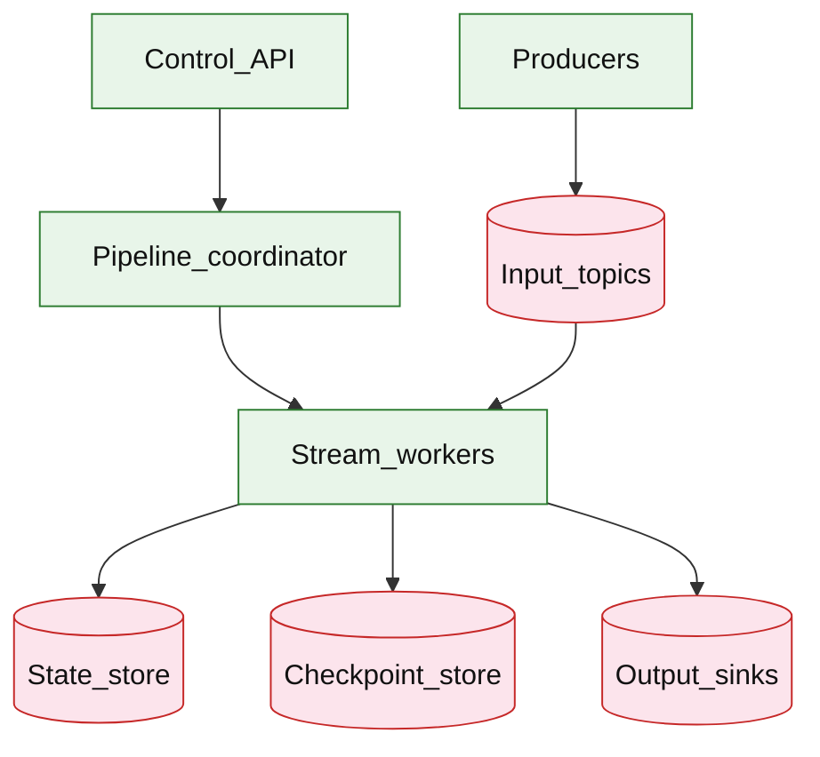

# Stream processing platform

## Introduction

A stream processing platform lets teams deploy **continuous pipelines** over partitioned logs: **stateless maps**, **windowed aggregations**, **stream joins**, and **sinks** to databases or topics. Workers checkpoint state for **crash recovery** and support **replay** from offsets for reprocessing.

**Primary users:** data/engineering teams (author pipelines), operators (lag, checkpoints, replay), downstream consumers (materialized views, derived topics).

**Interview pacing:** Use [60-minute runbook](../../topics/interview-runbook-60m.md) — ~10 min requirements theater (below), ~18–32 min diagram + API/DB, ~46–56 min deep dive on **windowed state + replay + backpressure**.

Distinct from [event-driven order pipeline](./event-driven-order-pipeline.md) (business saga example) and [distributed job scheduler](../platform/distributed-job-scheduler.md) (discrete scheduled runs). **Pattern reference:** [event-driven architecture](../../topics/event-driven-architecture.md).

## Requirements discovery (interview theater)

### Question bank

| Topic | You ask | If they push back | Example answer (reasonable default) |
| --- | --- | --- | --- |
| Throughput | Events/s? | "Big data" | **5M events/s** ingress fleet-wide |
| Partitions | How many? | "Auto" | **2,048** input partitions; scale consumers with partitions |
| State | Stateful ops? | "Filter only" | **Tumbling 1m windows**, **session windows**, **stream-stream join** (bounded) |
| Semantics | Exactly-once? | "At-least-once fine" | **Exactly-once** at sink via idempotent writes + transactional offsets |
| Latency | End-to-end? | "Batch hourly" | **p99 &lt; 30s** for 1m windows (processing time) |
| Replay | Required? | "Never" | **Offset replay** for bug fix redeploys |
| Out of scope | Batch Spark replacement? | "Everything" | Continuous streaming; batch export optional |

### Example dialogue

> **You:** Let's scope v1: one happy path and what's out of scope?
> **Them:** …
> **You:** For scale, prototype vs 12-month target?
> **Them:** …
> **You:** What does each actor do per day on the hot path?
> **Them:** …
> **You:** I'll lock the **target** column assumptions unless you want different numbers — next I'll map fleet totals to monthly AWS meters in **billable volume**.

### Parsed requirements

| Field | Source question | Parsed value (target) | Drives |
| --- | --- | --- | --- |
| `peak_ingress_e_peak` | Peak ingress (`E_peak`) | **5M/s** | Scale tiers, input model, fleet totals |
| `avg_event_size_b` | Avg event size (`B`) | **500 B** | Scale tiers, input model, fleet totals |
| `partitions_p` | Partitions (`P`) | **2,048** | Scale tiers, input model, fleet totals |
| `stateful_share_of_traffic` | Stateful share of traffic | **40%** | Scale tiers, input model, fleet totals |
| `checkpoint_interval` | Checkpoint interval | **10s** | Scale tiers, input model, fleet totals |
| `downsampled_sink_rate` | Downsampled sink rate | **1M/s** | Scale tiers, input model, fleet totals |
| `topic_retention_hot` | Topic retention (hot) | **7d** | Storage steady-state |
| `producer_devices_illustrative` | Producer devices (illustrative) | **100M** | Scale tiers, input model, fleet totals |

### Locked assumptions

**Reference workload** — scale by **events/s** and **partitions**, not consumer DAU. Use **target** in interviews.

| Assumption | Prototype (MVP) | Growth | Target (anchor) |
| --- | --- | --- | --- |
| Peak ingress (`E_peak`) | 50k/s | 500k/s | **5M/s** |
| Avg event size (`B`) | 500 B | 500 B | **500 B** |
| Partitions (`P`) | 64 | 512 | **2,048** |
| Stateful share of traffic | 30% | 35% | **40%** |
| Checkpoint interval | 30s | 15s | **10s** |
| Downsampled sink rate | 10k/s | 100k/s | **1M/s** |
| Topic retention (hot) | 3d | 5d | **7d** |
| Producer devices (illustrative) | 1M | 10M | **100M** |

*After ~10 minutes, proceed with the **target** column unless the interviewer changes scope.*

### Interview Q&A cheat sheet

Say aloud in order (~10 min). Write locks into **parsed requirements** before capacity math.

| Step | You ask | Lock if vague (target) |
| --- | --- | --- |
| 1 — Throughput | Events/s? | **5M events/s** ingress fleet-wide |
| 2 — Partitions | How many? | **2,048** input partitions; scale consumers with partitions |
| 3 — State | Stateful ops? | **Tumbling 1m windows**, **session windows**, **stream-stream join** (bounded) |
| 4 — Semantics | Exactly-once? | **Exactly-once** at sink via idempotent writes + transactional offsets |
| 5 — Latency | End-to-end? | **p99 &lt; 30s** for 1m windows (processing time) |
| 6 — Replay | Required? | **Offset replay** for bug fix redeploys |
| 7 — Out of scope | Batch Spark replacement? | Continuous streaming; batch export optional |

## Capacity sketch

### User input model

| Action | Actor | Per day (target) | Unit | ~Size | Durable write |
| --- | --- | --- | --- | --- | --- |
| Publish event | producers | **~432T** | Kafka produce | 500 B | topic bytes |
| Stateless map/filter | workers | = ingress | in-flight | — | none |
| Windowed aggregate | workers | 40% ingress | state update | 10–50 KB/key | RocksDB |
| Checkpoint snapshot | workers | `P/10s` | S3 upload | MB–GB | checkpoint blob |
| Sink to OLAP | workers | 1M/s | batch insert | 200 B row | ClickHouse |
| Sink to Redis MV | workers | 200k/s | SET | 100 B | TTL key |

### Fleet totals (target)

| Metric | Formula | Value |
| --- | --- | --- |
| Ingress bandwidth | `E_peak × B` | **2.5 GB/s** |
| Events / day | `5M × 86,400` | **~432T** |
| Raw topic bytes / day | `× 500 B` | **~216 TB/day** |
| RF=3 cluster write / day | ×3 | **~650 TB/day** |
| 7d hot retention | steady | **~300 TB** |
| Per producer / day | `216 TB / 100M` | **~2.2 KB** |

### Traffic profile (target tier)

Locked **target** assumptions: **5M/s** event peak (`E_peak`), **2048** partitions (`P`), **100M** producers.

| Metric | Value |
| --- | --- |
| **Read:write (API requests)** | N/A — data plane **write-heavy**; control API **&lt;0.1%** |
| **Read:write (durable bytes)** | **1:3** (7d hot retention **~300 TB** : **~216 TB/day** ingress) |
| **Requests / day (fleet)** | **~432B** events/day (**5M/s** × 86,400) |
| **Avg RPS** | **~5M/s** events |
| **Peak RPS** | **5M/s** ingress; **2.5 GB/s** bandwidth |

| User / actor | Action | R/W | Per actor / day | % of fleet events |
| --- | --- | --- | --- | --- |
| Producer service | Publish event | W | **~4,320** (avg) | **100%** ingress |
| Stream worker | Map / filter / window | R/W | = ingress | internal |
| Engineer | Deploy / replay pipeline | W | rare | control plane |
| Sink consumer | Read output topic / MV | R | **1M/s** OLAP + **200k/s** Redis | downstream |

*Per-producer rate (**~2.2 KB**/day) fixed; fleet scales with producer count and `E_peak`.*

### AWS service map (target deployment)

| Diagram component | AWS service | Role in this design | Monthly meter (target) |
| --- | --- | --- | |
| Producers | **Amazon ECS** / **AWS Lambda** (MSK producers) | Write to input topics at **5M/s** |
| Input_topics | **Amazon MSK** (Kafka) | **~300 TB** 7d hot retention; RF=3 |
| Pipeline_coordinator | **Amazon ECS on Fargate** | Partition assignment; deploy / canary groups |
| Stream_workers | **Amazon ECS on Fargate** (or **Amazon Managed Service for Apache Flink**) | **~512** workers; DAG operators |
| State_store | **Amazon EBS** (RocksDB on workers) | Windowed state **10–50 KB**/key |
| Checkpoint_store | **Amazon S3** | Checkpoint every **10s**; **~50 TB**/mo |
| Output_sinks | **Amazon MSK** + **Amazon ElastiCache** + **Amazon OpenSearch** | Topics, materialized views, OLAP |
| Control_API | **Amazon API Gateway** + **ECS** | Register pipeline; lag dashboards |
| Observability | **Amazon CloudWatch**, **AWS X-Ray** | Per-partition lag, checkpoint age |

### Scale tiers

| Tier | `E_peak` | `P` | Per-partition | Ingress GB/s | Workers (ballpark) |
| --- | --- | --- | --- | --- | --- |
| Prototype | 50k/s | 64 | 780/s | **0.025** | **8** |
| Growth | 500k/s | 512 | 980/s | **0.25** | **64** |
| Target | 5M/s | 2048 | 2,400/s | **2.5** | **~512** |

### Symbols

| Symbol | Meaning |
| --- | --- |
| `E_peak` | Peak events per second |
| `P` | Input topic partitions |
| `B` | Bytes per event |
| `f_state` | Fraction stateful (0.4) |
| `E_sink` | Aggregated sink events/s (1M) |
| `RF` | Replication factor (3) |

### Derivation (traffic)

**Ingress:** `E_peak × B = 5M × 500 B = **2.5 GB/s**`.

**Per partition:** `5M / 2048 ≈ **2,400 events/s/partition**`.

**Stateful subset:** `0.4 × 5M = **2M events/s**` through windowed operators.

**Checkpoint:** staggered `P / 10s ≈ **200 uploads/s**` to object storage.

**Sinks:** OLAP **1M/s** aggregated rows; Redis MV **200k updates/s**.

### Storage and growth over time

| Tier / store | ~Unit | Rate (target) | Retention | Steady-state (target) | Notes |
| --- | --- | --- | --- | --- | --- |
| Kafka ingress | 500 B | 5M/s | 7d | **~300 TB** hot | RF3 |
| Stateful KV | varies | 2M/s | checkpoints | **50–200 TB** | RocksDB |
| ClickHouse sink | 200 B | 1M/s | 2y | **~12 PB** | compressed |
| Redis MV | 100 B | 200k/s | TTL | **~20 GB** | materialized |

**Daily raw ingress:** **~216 TB/day**; **OLAP sink ~17 TB/day** aggregated.

**5-year OLAP:** **~12 PB** with **10:1** compression vs raw.

### Per-unit economics (target tier)

| Metric | Formula | Target value |
| --- | --- | --- |
| Raw bytes / event | `B` | **500 B** |
| Cluster bytes / event (RF3) | `B × RF` | **1.5 KB** |
| Aggregated row / event (sink) | 200 B @ 1M/s | **0.2 KB** effective |
| State bytes / key (window) | design range | **10–50 KB** |
| Bytes / producer / day | `216TB/100M` | **~2.2 KB** |

### Service footprint (instance count ballpark)

| Service | Scales with | Prototype | Growth | Target |
| --- | --- | --- | --- | --- |
| Kafka brokers | GB/s ingress | 3 | 9 | **~30** |
| Stream workers | `P` | 8 | 64 | **~512** |
| Coordinator | pipelines | 2 | 4 | **~8** |
| Checkpoint store | `P/10s` | 1 | 3 | **S3** |
| ClickHouse cluster | `E_sink` | 3 | 12 | **~48** |

**First scale cliff:** **Growth (500k/s)** — partition count and state store compaction before **5M/s**.

### Billable volume (target month)

Convert **fleet totals** to AWS billing meters before dollar math. *List-price ballparks — not a quote.*

| Design quantity (target) | Formula | Monthly billable unit |
| --- | --- | --- |
| API requests | `requests_day × 30` | **derive from fleet** (**~432B** events/day (**5M/s** × 86,400)) |
| OLTP storage steady | storage table | **___ GB-mo** |
| Cache / Redis RAM | footprint | **___ GB** (node tier) |
| Egress / CDN | `egress_day × 30` | **___ GB / mo** |
| Stream / queue events | `events_day × 30` | **___ million events / mo** |
| Log ingest (if full capture) | `log_GB_day × 30` | **___ GB ingest / mo** |
| **Per unit** | `total / scale driver` | **$…/unit/mo** |

*Reconcile rows in **Cloud cost ballpark** (9a) with these meters.*

### Cost at a glance

Interview sound bite — reconcile with **billable volume** and **cloud cost** below.

| Tier | Scale | ~Monthly $ (core) | Per unit |
| --- | --- | --- | --- |
| Prototype (MVP) | see locked assumptions | **~$15k** | platform tax dominates |
| Target (anchor) | `U` or `Q` = **see locked assumptions** | **see cloud cost** | **see cloud cost** |

**First payment block:** smallest prod footprint (load balancer + database + compute) before per-million traffic dominates.

### Cloud cost ballpark (target tier)

| Line item | Driver | ~Monthly |
| --- | --- | --- |
| Kafka (300 TB hot) | RF3 | **~$90k** |
| Stream workers | 512 pods | **~$120k** |
| RocksDB / EBS state | 200 TB | **~$40k** |
| ClickHouse (12 PB 2y) | storage+compute | **~$200k** |
| Checkpoints S3 | 50 TB/mo | **~$1k** |
| **Total (platform)** | | **~$450k/mo** |
| **Per TB raw ingress/mo** | `450k / (216×30)` | **~$70/TB** |
| **Per million events** | amortized | **~$0.000003** |

### Timeline (prototype → early growth)

| Milestone | `E_peak` | Hot topic | Workers | ~Monthly $ |
| --- | --- | --- | --- | --- |
| Launch | 50k/s | **3 TB** | 8 | **~$15k** |
| Month 3 | 100k/s | **6 TB** | 16 | **~$30k** |
| Month 6 | 250k/s | **15 TB** | 40 | **~$75k** |
| Month 12 | 500k/s | **30 TB** | 64 | **~$150k** |

Month 12 is **growth tier** — partition rebalance and state store tuning before **5M/s** target.

### Sensitivity

| Change | Effect | Response |
| --- | --- | --- |
| **10× keys in window** | State store blow-up | TTL; compaction; salting keys |
| **Join two large streams** | Alignment + state | Bounded join; partition co-location |
| **Exactly-once sink** | 2× write path | Idempotent sink + txn offsets |
| **10× `E_peak`** | Broker/partition limit | Add partitions; scale workers 1:1 |

## High-level design

### Architecture (user → database)



**Narrative:** **Producers** write to **input topics** (Kafka-class log). **Pipeline coordinator** assigns partition ranges to **stream workers** (consumer group). Workers execute DAG operators, persist **state** locally with periodic **checkpoints** to durable store, emit to **sinks**. **Control API** registers/deploys/replays pipelines.

## User-visible surface

- **Engineer:** YAML/DSL pipeline definition; deploy version; canary consumer group.
- **Operator:** per-partition lag dashboard; checkpoint age; replay job progress.
- **Consumer:** read output topic or query materialized view (Redis/OLAP).

## API contract and input model

### UX → API traceability

| UX / UI action | User intent | API or event | Sync/async | Idempotent? | Validates |
| --- | --- | --- | --- | --- | --- |
| **Engineer:** YAML/DSL pipeline definition; deploy version; | Register pipeline config | `POST` `/v1/pipelines` | sync | yes | domain rules |
| **Operator:** per-partition lag dashboard; checkpoint age; r | Roll out version | `POST` `/v1/pipelines/{id}/deploy` | sync | yes | domain rules |
| **Consumer:** read output topic or query materialized view ( | Lag + health | `GET` `/v1/pipelines/{id}/status` | sync | read | domain rules |
| See user-visible surface | Reset offsets / reprocess | `POST` `/v1/pipelines/{id}/replay` | sync | yes | domain rules |
| See user-visible surface | Change parallelism | `POST` `/v1/pipelines/{id}/scale` | sync | yes | domain rules |
### Endpoints

| Method | Path | Purpose |
| --- | --- | --- |
| `POST` | `/v1/pipelines` | Register pipeline config |
| `POST` | `/v1/pipelines/{id}/deploy` | Roll out version |
| `GET` | `/v1/pipelines/{id}/status` | Lag + health |
| `POST` | `/v1/pipelines/{id}/replay` | Reset offsets / reprocess |
| `POST` | `/v1/pipelines/{id}/scale` | Change parallelism |

### Example payloads

`POST /v1/pipelines`

```json
{
 "name": "orders_per_minute_by_region",
 "owner_team": "data-platform",
 "source_topic": "orders.events",
 "operators": [
 { "type": "filter", "expr": "event_type == 'OrderCreated'" },
 { "type": "key_by", "field": "region" },
 { "type": "tumbling_window", "duration_sec": 60 },
 { "type": "aggregate", "fn": "count" }
 ],
 "sink": {
 "type": "kafka",
 "topic": "orders.aggr.1m"
 },
 "parallelism": 128,
 "processing_guarantee": "exactly_once"
}
```

Response `201 Created`:

```json
{
 "pipeline_id": "pipe_8f2a1c",
 "version": 1,
 "status": "REGISTERED"
}
```

`POST /v1/pipelines/pipe_8f2a1c/deploy`

```json
{
 "version": 1,
 "canary_percent": 5
}
```

`GET /v1/pipelines/pipe_8f2a1c/status`

```json
{
 "pipeline_id": "pipe_8f2a1c",
 "status": "RUNNING",
 "consumer_lag_sec_p99": 12,
 "partitions": 2048,
 "workers": 128,
 "checkpoint_age_sec_p99": 8
}
```

`POST /v1/pipelines/pipe_8f2a1c/replay`

```json
{
 "from_offsets": "earliest",
 "target_sink_topic": "orders.aggr.1m.v2",
 "reason": "fix_aggregate_bug"
}
```

Response `202 Accepted`:

```json
{
 "run_id": "run_replay_01",
 "state": "STARTED"
}
```

### Input validation

- `parallelism` ≤ partition count for max throughput.
- Join operators require compatible `key_by` on both inputs.
- Replay requires isolated sink or idempotent sink contract.

## Database model

### Control plane metadata

| Table | Key fields | Notes |
| --- | --- | --- |
| `pipelines` | `pipeline_id`, `name`, `config_json`, `version`, `status` | |
| `pipeline_runs` | `run_id`, `pipeline_id`, `type`, `state`, `started_at` | deploy/replay |
| `checkpoints` | `pipeline_id`, `partition`, `offset`, `state_uri`, `at` | Recovery |
| `worker_assignments` | `pipeline_id`, `worker_id`, `partitions` | Rebalance |

### Runtime state (per worker)

| Store | Content |
| --- | --- |
| Local RocksDB | Window buffers, join state |
| Remote checkpoint | S3 snapshot of RocksDB + offset |

### Read/write paths

1. **Deploy** — coordinator rebalances partitions → workers load checkpoint or earliest offset → start consume loop.
2. **Process** — for each record: update state → emit downstream → periodic checkpoint (offset + state flush).
3. **Sink** — transactional write: idempotent key `(pipeline, window, key)` + commit offset with two-phase sink connector.
4. **Replay** — new consumer group or reset offsets → write to new sink topic.
5. **Scale** — stop workers, rebalance, resume from checkpoint.

## Interview deep dive: Windowed state + replay + backpressure

### Window types

| Type | State | Use |
| --- | --- | --- |
| **Tumbling** | Fixed buckets | Metrics per minute |
| **Sliding** | More state | Moving avg — expensive |
| **Session** | Gap timeout | User sessions |

**Event time vs processing time:** watermarks handle late events — `allowed_lateness=1m` drops or side outputs late data.

### State and checkpoints

- Local state per partition — **no cross-partition state** without shuffle (repartition topic).
- Checkpoint = **offset + state snapshot** — on failure, restore snapshot, rewind to offset+1.
- Changelog topic backup (Kafka streams pattern) optional interview detail.

### Exactly-once to sink

1. Idempotent sink keys (window end + group key).
2. **Transactional consumer:** commit offsets with sink write in one transaction (Kafka-DB connect pattern).
3. At-least-once + dedupe table at sink if simpler.

### Backpressure

| Signal | Action |
| --- | --- |
| Consumer lag rising | Scale workers (≤ partitions) |
| State store slow | Increase checkpoint interval; optimize RocksDB |
| Sink throttling | Pause consumption (stop poll) — lag grows but no OOM |
| Hot key | Skew partition — salt keys (trade exact aggregation without reduce) |

**Backpressure** protects workers from unbounded in-memory buffers — block upstream poll when sink behind.

### Replay semantics

- **New deploy bug** — replay from `T-24h` offsets to **v2 sink topic**.
- Do not mutate prior sink in place — immutability for downstream.
- Replay run isolated consumer group to avoid clobbering production offsets.

### vs order pipeline / scheduler

| Stream platform | Order pipeline | Job scheduler |
| --- | --- | --- |
| Continuous unbounded | Discrete business events | Cron fire times |
| Window state | Outbox per order | Lease per run |

## Scale and failure

### Correctness model

- Per-partition ordering preserved from log.
- Window aggregates correct for event-time within lateness bound.
- After recovery, no duplicate sink side effects (exactly-once contract) or duplicates detectable (at-least-once).

### Failure cases

| Failure | Symptom | Mitigation |
| --- | --- | --- |
| Worker crash | Partition lag spike | Restore checkpoint |
| Rebalance storm | Duplicate processing | Cooperative rebalance; idempotent sink |
| Hot partition | Lag skew | Key salting; more partitions |
| Late events | Wrong counts | Watermark + lateness side output |
| Checkpoint fail | Long recovery | Retry; alert checkpoint age |
| Sink outage | Lag unbounded | Pause poll; alert |
| State disk full | Worker die | Expand disk; TTL state |

### Key metrics

- Consumer lag per partition p99
- Checkpoint age; restore time
- Events/s in/out; drop rate (late)
- State store size; compaction lag
- Sink error rate; end-to-end latency
- Rebalance duration

### Interview deep dive talking points

- **5M/s, 2048 partitions** — partition-bound parallelism.
- Watermarks + **tumbling windows** + allowed lateness.
- Checkpoint = offset + state; recovery story in 30s.
- Exactly-once sink — idempotent keys or transactional commit.
- Backpressure: pause consume when sink slow.
- Replay to **new sink** — never silent overwrite.

## Related

- [Examples hub](./README.md)
- [Event-driven architecture](../../topics/event-driven-architecture.md)
- [Event-driven order pipeline](./event-driven-order-pipeline.md)
- [Sequential replica digestion](../platform/sequential-replica-digestion.md)
- [Distributed job scheduler](../platform/distributed-job-scheduler.md)
- [AWS reference layout](../../topics/aws-reference-layout.md)
- [60-minute runbook](../../topics/interview-runbook-60m.md)
