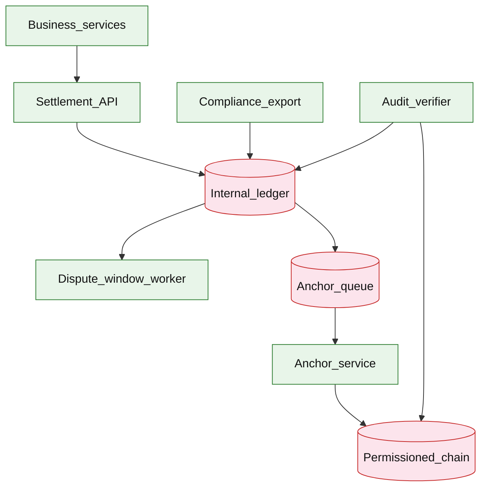

# Blockchain settlement and audit anchoring

## Introduction

This design combines an **internal authoritative ledger** for day-to-day settlement with **periodic blockchain anchoring** of cryptographic digests for **tamper-evident audit**. Business apps never put PII on-chain; the chain provides **third-party attestability**, not the primary transaction database.

**Primary users:** business services (settlements), compliance/auditors (verify anchors), settlement ops (confirmation windows), platform SRE (anchor queue, chain fees).

**Interview pacing:** Use [60-minute runbook](../../topics/interview-runbook-60m.md) — ~10 min requirements theater (below), ~18–32 min diagram + API/DB, ~46–56 min deep dive on **trust boundaries + anchoring strategy**.

Ledger truth: [core banking ledger](./core-banking-ledger.md). Immutable audit logs: [cross-service audit logging](../platform/cross-service-audit-logging.md). Payment rails: [payment workflow platform](./payment-workflow-platform.md).

## Requirements discovery (interview theater)

### Question bank

| Topic | You ask | If they push back | Example answer (reasonable default) |
| --- | --- | --- | --- |
| Trust model | Who distrusts whom? | "Trust bank IT" | **Counterparties** want proof bank did not rewrite history; regulators want **independent verify** |
| Chain type | Public vs permissioned? | "Ethereum public" | **Permissioned consortium** chain (Hyperledger-class) for cost/privacy; public hash optional for extra attest |
| Throughput | TPS needed on-chain? | "All txs on chain" | **Off-chain ledger** handles 50k settlements/day; **anchor batch hourly** |
| Latency | Finality when? | "Instant on chain" | Business **finality** on internal ledger minutes; anchor is **audit lag** hours OK |
| Privacy | PII on chain? | "Encrypt on chain" | **No PII** — only Merkle root + metadata hash on chain |
| Disputes | Chargeback window? | "None" | **24h** dispute window before settlement `FINAL` |
| Out of scope | Full crypto custody, DeFi | "Smart contracts pay" | Anchor + verify only; settlements in core ledger |

### Example dialogue

> **You:** Let's scope v1: one happy path and what's out of scope?
> **Them:** …
> **You:** For scale, prototype vs 12-month target?
> **Them:** …
> **You:** What does each actor do per day on the hot path?
> **Them:** …
> **You:** I'll lock the **target** column assumptions unless you want different numbers — next I'll map fleet totals to monthly AWS meters in **billable volume**.

### Parsed requirements

| Field | Source question | Parsed value (target) | Drives |
| --- | --- | --- | --- |
| `active_accounts_driver` | Active accounts (driver) | **80M** (ledger ecosystem) | Scale tiers, input model, fleet totals |
| `settlements_/_day_s_day` | Settlements / day (`S_day`) | **500k** | Storage steady-state |
| `peak_settlement_api_s_peak` | Peak settlement API (`S_peak`) | **2,000/s** | Storage steady-state |
| `anchor_frequency` | Anchor frequency | **hourly batches** | Scale tiers, input model, fleet totals |
| `entry_hashes_/_batch_b` | Entry hashes / batch (`B`) | **~50k–100k** | Scale tiers, input model, fleet totals |
| `chain` | Chain | **~500 TPS burst headroom** | Scale tiers, input model, fleet totals |
| `finality` | Finality | **internal `FINAL` then anchor** | Scale tiers, input model, fleet totals |
| `on-chain_payload` | On-chain payload | **no PII** | Scale tiers, input model, fleet totals |

### Locked assumptions

Settlement volume scales with [core banking ledger](./core-banking-ledger.md) activity — **~1.25%** of internal transfers become `FINAL` settlements. Chain is **audit rail**, not primary DB.

| Assumption | Prototype (MVP) | Growth | Target (anchor) |
| --- | --- | --- | --- |
| Active accounts (driver) | 10k | 1M | **80M** (ledger ecosystem) |
| Settlements / day (`S_day`) | 63 | 6.3k | **500k** |
| Peak settlement API (`S_peak`) | ~0.25/s | ~25/s | **2,000/s** |
| Anchor frequency | hourly | hourly | hourly batches |
| Entry hashes / batch (`B`) | ~2.6k | ~26k | **~50k–100k** |
| Chain | permissioned | same | ~500 TPS burst headroom |
| Finality | 24h dispute window | same | internal `FINAL` then anchor |
| On-chain payload | Merkle root only | same | no PII |

*After ~10 minutes, clarify chain is audit rail—not primary database.*

### Interview Q&A cheat sheet

Say aloud in order (~10 min). Write locks into **parsed requirements** before capacity math.

| Step | You ask | Lock if vague (target) |
| --- | --- | --- |
| 1 — Trust model | Who distrusts whom? | **Counterparties** want proof bank did not rewrite history; regulators want **independent verify** |
| 2 — Chain type | Public vs permissioned? | **Permissioned consortium** chain (Hyperledger-class) for cost/privacy; public hash optional for extra attest |
| 3 — Throughput | TPS needed on-chain? | **Off-chain ledger** handles 50k settlements/day; **anchor batch hourly** |
| 4 — Latency | Finality when? | Business **finality** on internal ledger minutes; anchor is **audit lag** hours OK |
| 5 — Privacy | PII on chain? | **No PII** — only Merkle root + metadata hash on chain |
| 6 — Disputes | Chargeback window? | **24h** dispute window before settlement `FINAL` |
| 7 — Out of scope | Full crypto custody, DeFi | Anchor + verify only; settlements in core ledger |

## Capacity sketch

### User input model

| Action | Actor | Per day (target) | API / job | ~Size | Durable write |
| --- | --- | --- | --- | --- | --- |
| Record settlement | business service | 500k | `POST /v1/settlements` | 0.5 KB | **500 B** row |
| Dispute window tick | worker | 500k | internal | — | status update |
| Anchor batch | anchor service | 24 | chain tx | 1 KB | **32 B** root + metadata |
| Auditor verify | compliance | 10 | offline Merkle recompute | export | read-only |

### Fleet totals (target, `S_day` = 500k)

| Metric | Formula | Value |
| --- | --- | --- |
| Settlement API calls / day | `S_day` | **500k** |
| Entry hashes / day | `S_day × 2` legs | **~1M** |
| OLTP bytes / day | `500k × 500 B` | **~250 MB** |
| On-chain anchors / day | 24 | **~24 KB** payload |

### Traffic profile (target tier)

| Metric | Value |
| --- | --- |
| **Read:write (API requests)** | **~1:5** (auditor verify + GET vs settlement POST) |
| **Read:write (durable bytes)** | **~250 MB**/day OLTP; **~24 KB**/day on-chain anchors |
| **Requests / day (fleet)** | **~500k** settlement API |
| **Avg RPS** | **~6/s** (`500k / 86,400`) |
| **Peak RPS** | **2,000/s** settlement API |

| User / actor | Action | R/W | Per user (or actor) / day | % of fleet requests |
| --- | --- | --- | --- | --- |
| Business service | Record settlement | W | — | **~100%** (API) |
| Dispute worker | Finalize after window | W | 1× per settlement | internal |
| Anchor service | Merkle batch + chain tx | W | 24 batches | **24 anchors/day** |
| Auditor | Verify proof | R | 10 | read-only export |

*Settlement volume scales with ledger adoption; chain load is **not** request-path bound.*

### AWS service map (target deployment)

| AWS service | Role in this design |
| --- | --- |
| Amazon API Gateway | Settlement + audit anchor REST |
| Amazon ECS on Fargate | Settlement API + dispute window worker |
| Amazon Aurora PostgreSQL | Internal `settlements` + `ledger_entry_hashes` (source of truth) |
| Amazon SQS | `pending_anchors` queue |
| Amazon ECS on Fargate | Anchor service (Merkle build + chain submit) |
| Amazon Managed Blockchain / self-hosted on EC2 | Permissioned consortium chain |
| Amazon S3 | Compliance export bundles for auditors |
| AWS Batch | Offline Merkle recompute jobs |
| Amazon CloudWatch | Anchor job status, chain connectivity |
| AWS KMS | Signing keys for anchor transactions |
| Amazon VPC | Isolated ledger; chain nodes in isolated subnet |

### Scale tiers

| Tier | `S_day` | Avg API RPS | Peak API RPS | Anchors/day | Hashes/batch (avg) |
| --- | --- | --- | --- | --- | --- |
| Prototype | 63 | **~0.001** | **~0.25** | 24 | **~2.6k** |
| Growth | 6.3k | **~0.07** | **~25** | 24 | **~26k** |
| Target | 500k | **~6** | **2,000** | 24 | **~100k** |

### Symbols

| Symbol | Meaning |
| --- | --- |
| `S_day` | Settlements finalized per day |
| `S_peak` | Peak settlement API RPS |
| `B` | Entry hashes per anchor batch |
| `H` | Hash size (32 B) |
| `L` | Legs per settlement (~2) |

### Derivation (traffic)

**Internal ledger:** `S_peak = 2,000/s` at target — bursts align with [payment workflow platform](./payment-workflow-platform.md) / ledger posting; settlement API is subset.

**Anchor batch:** `S_day / 24 ≈ 21k settlements/hour` → **`21k × L ≈ 42k–100k`** leaves → Merkle build **minutes** offline.

**Chain load:** **1 tx/hour** → negligible TPS — blockchain is **not** the bottleneck.

**Verifier:** auditors recompute Merkle from export — CPU scales with `B`, not chain.

**Queue:** `pending_anchors` drained with backoff on rare permissioned congestion.

### Storage and growth over time

| Table / store | ~Row size | New rows/day (target) | Retention | Steady-state (target) | Per settlement |
| --- | --- | --- | --- | --- | --- |
| `settlements` | 500 B | 500k | 7y | **~650 GB** / 7y | 1 row |
| `ledger_entry_hashes` | 32 B | 50k/batch | anchored | **16 MB/batch** | hashes only |
| `anchor_batches` | 2 KB | 24 | 7y | **~120 MB** | hourly |
| On-chain anchor | ~1 KB/tx | 24 | permanent | **~9 MB/year** | Merkle root |

**Cumulative settlements:**

| Horizon | Rows | Size (`× 500 B`) |
| --- | --- | --- |
| 1 year | 182M | **~91 GB** |
| 5 years | 912M | **~456 GB** |

### Per-unit economics (target)

| Metric | Value | Notes |
| --- | --- | --- |
| OLTP bytes / settlement | **~500 B** | metadata only |
| Hashes / settlement | **~2** | anchor batch input |
| Chain bytes / settlement / day | **~0.05 B** | 24 roots / 500k |
| Auditor CPU / batch | **~100k** leaves | minutes on laptop class |

### Service footprint (instances)

| Service | Scales with | Prototype | Growth | Target |
| --- | --- | --- | --- | --- |
| Settlement API | `S_peak` | 2 | 5 | **~40** pods |
| Anchor worker | `B` Merkle CPU | 1 | 1 | **2** (HA pair) |
| Settlement OLTP | `S_day` | 1 primary | 2 | **4** shards |
| Chain validators | 24 tx/day | 3-node | 3-node | **consortium** |

**First scale cliff:** **Growth** — Merkle build for **26k** leaves should stay &lt; **5 min**; optimize batching before **100k** leaves at target.

### Billable volume (target month)

Convert **fleet totals** to AWS billing meters before dollar math. *List-price ballparks — not a quote.*

| Design quantity (target) | Formula | Monthly billable unit |
| --- | --- | --- |
| API requests | `requests_day × 30` | **derive from fleet** (**~500k** settlement API) |
| OLTP storage steady | storage table | **___ GB-mo** |
| Cache / Redis RAM | footprint | **___ GB** (node tier) |
| Egress / CDN | `egress_day × 30` | **___ GB / mo** |
| Stream / queue events | `events_day × 30` | **___ million events / mo** |
| Log ingest (if full capture) | `log_GB_day × 30` | **___ GB ingest / mo** |
| **Per unit** | `total / scale driver` | **$…/unit/mo** |

*Reconcile rows in **Cloud cost ballpark** (9a) with these meters.*

### Cost at a glance

Interview sound bite — reconcile with **billable volume** and **cloud cost** below.

| Tier | Scale | ~Monthly $ (core) | Per unit |
| --- | --- | --- | --- |
| Prototype (MVP) | see locked assumptions | **~$600** | platform tax dominates |
| Target (anchor) | `U` or `Q` = **see locked assumptions** | **see cloud cost** | **see cloud cost** |

**First payment block:** smallest prod footprint (load balancer + database + compute) before per-million traffic dominates.

### Cloud cost ballpark (target)

| Line item | Driver | ~Monthly |
| --- | --- | --- |
| Settlement API | ~40 pods | **~$3k** |
| OLTP | 91 GB/yr | **~$2k** |
| Anchor + chain ops | 24 tx/day | **~$1k** |
| Compliance export | batch | **~$1k** |
| **Total** | | **~$7k/mo** |
| **Per settlement** | `7k / 15M/mo` | **~$0.0005/settlement/mo** |

Chain **gas** on public Ethereum would dominate — permissioned consortium keeps cost flat.

### Timeline (settlement rate scales with ledger adoption)

| Milestone | `S_day` | OLTP ingest/day | Anchors/day | ~Monthly $ |
| --- | --- | --- | --- | --- |
| Launch | 63 | **~32 KB** | 24 | **~$600** |
| Month 3 | 500 | **~250 KB** | 24 | **~$1k** |
| Month 6 | 2k | **~1 MB** | 24 | **~$2k** |
| Month 12 | 8k | **~4 MB** | 24 | **~$3k** |

Target **500k/day** assumes full retail-bank settlement volume — typically years after month 12.

### Sensitivity

- **Anchor every minute** — 60× chain txs — still low; Merkle CPU rises.
- **Public Ethereum** — gas dominates — batch less often; store calldata hash only.
- **10× settlements** — OLTP and anchor batch size grow; chain still not bottleneck.

## High-level design

### Architecture (user → database)



**Narrative:** **Settlement API** records obligations in **internal ledger** (source of truth). After **dispute window**, state → `FINAL`. **Anchor service** batches hashes of final entries into a **Merkle root**, submits **anchor transaction** to **permissioned chain**. **Auditors** recompute Merkle from ledger export and compare to on-chain root. Apps never wait on chain confirmation for user-facing success.

## User-visible surface

- **Business user:** normal app flows; settlement status `PENDING` → `FINAL` in minutes/hours.
- **Counterparty:** portal shows settlement proof ID; optional on-chain tx link for auditors.
- **Auditor:** upload/export bundle → verification report `MATCH` / `MISMATCH`.
- **Ops:** anchor job status; chain fee dashboard; replay anchor on failure.

## API contract and input model

### UX → API traceability

| UX / UI action | User intent | API or event | Sync/async | Idempotent? | Validates |
| --- | --- | --- | --- | --- | --- |
| **Business user:** normal app flows; settlement status `PEND | Create settlement intent | `POST` `/v1/settlements` | sync | yes | domain rules |
| **Counterparty:** portal shows settlement proof ID; optional | Status | `GET` `/v1/settlements/{id}` | sync | read | domain rules |
| **Auditor:** upload/export bundle → verification report `MAT | Trigger manual anchor (ops) | `POST` `/v1/audit-anchors` | sync | yes | domain rules |
| **Ops:** anchor job status; chain fee dashboard; replay anch | Anchor metadata | `GET` `/v1/audit-anchors/{id}` | sync | read | domain rules |
| See user-visible surface | Verify ledger vs chain | `GET` `/v1/audit-anchors/{id}/verifi | sync | read | domain rules |
| See user-visible surface | Merkle proof for one entry | `GET` `/v1/settlements/{id}/proof` | sync | read | domain rules |
### Endpoints

| Method | Path | Purpose |
| --- | --- | --- |
| `POST` | `/v1/settlements` | Create settlement intent |
| `GET` | `/v1/settlements/{id}` | Status |
| `POST` | `/v1/audit-anchors` | Trigger manual anchor (ops) |
| `GET` | `/v1/audit-anchors/{id}` | Anchor metadata |
| `GET` | `/v1/audit-anchors/{id}/verification` | Verify ledger vs chain |
| `GET` | `/v1/settlements/{id}/proof` | Merkle proof for one entry |

### Example payloads

`POST /v1/settlements`

```http
Idempotency-Key: sett-partnerA-20260523-001
```

```json
{
 "payer_account_id": "acct_1001",
 "payee_account_id": "acct_partner_88",
 "amount_cents": 125000000,
 "currency": "USD",
 "reference": "daily-net-2026-05-22"
}
```

Response `201 Created`:

```json
{
 "settlement_id": "sett_8f2a1c",
 "state": "PENDING",
 "dispute_until": "2026-05-24T12:00:00Z",
 "ledger_txn_id": "txn_7k2m9p"
}
```

`GET /v1/audit-anchors/anchor_4412/verification`

```json
{
 "anchor_id": "anchor_4412",
 "merkle_root": "sha256:merkle_root_hex...",
 "chain_tx_hash": "0xabc123...",
 "anchored_at": "2026-05-23T13:00:00Z",
 "verification": "MATCH",
 "entries_checked": 98421,
 "checked_at": "2026-05-23T14:00:00Z"
}
```

Merkle proof for auditor (`GET /v1/settlements/sett_8f2a1c/proof`)

```json
{
 "settlement_id": "sett_8f2a1c",
 "entry_hash": "sha256:entry_hex...",
 "merkle_proof": ["hash_sibling_1", "hash_sibling_2"],
 "anchor_id": "anchor_4412",
 "root": "sha256:merkle_root_hex..."
}
```

On-chain anchor record (conceptual)

```json
{
 "anchor_id": "anchor_4412",
 "merkle_root": "0xmerkle...",
 "batch_start": "2026-05-23T12:00:00Z",
 "batch_end": "2026-05-23T13:00:00Z",
 "entry_count": 98421
}
```

### Input validation

- Settlement obeys ledger rules (funds, limits).
- Anchor batch only includes `FINAL` entries with `entry_hash` precomputed at post time.
- Verification requires auditor role.

## Database model

### Tables

| Table | Key fields | Notes |
| --- | --- | --- |
| `settlements` | `settlement_id`, parties, `amount`, `state`, `ledger_txn_id`, `dispute_until` | |
| `ledger_entries` | `entry_id`, `settlement_id`, `entry_hash`, `at` | From core ledger |
| `anchors` | `anchor_id`, `merkle_root`, `chain_tx_hash`, `entry_count`, `anchored_at`, `state` | |
| `anchor_queue` | `batch_id`, `entry_hashes`, `status` | Pending publish |
| `verification_runs` | `run_id`, `anchor_id`, `result`, `at` | Audit trail |

**Off-chain payload store:** full entry JSON in ledger DB / export bucket — chain stores **root only**.

### Read/write paths

1. **Settlement** — post to internal ledger → `settlements` PENDING → dispute timer.
2. **Finalize** — worker moves to FINAL after window → eligible for next anchor batch.
3. **Anchor job** — collect FINAL entry hashes → build Merkle → submit chain TX → store `chain_tx_hash`.
4. **Verify** — export entries in batch window → recompute root → compare chain + ledger metadata.
5. **Proof** — serve Merkle path from stored tree or recomputed for auditor tool.

## Interview deep dive: Trust boundaries + anchoring strategy

### What the chain is (and is not)

| Chain is | Chain is NOT |
| --- | --- |
| Tamper-evident **witness** | Primary transaction database |
| Slow, costly notary | Real-time balance source |
| Public/ consortium attest | PII store |

**Trust boundary:** counterparties trust **math + consortium validators** for immutability of **roots**, not bank UI alone.

### Why not put settlements on-chain

| Issue | Off-chain ledger |
| --- | --- |
| TPS | 500k/day easy |
| Privacy | PII stays internal |
| Cost | No gas per payment |
| Reversals | Dispute window + reversing entries |

### Anchoring strategies

| Strategy | Frequency | Cost | Proof |
| --- | --- | --- | --- |
| **Hourly Merkle batch** | 24/day | Low | Inclusion proof per entry |
| **Daily notary** | 1/day | Lowest | Weaker timeliness |
| **Per-tx on-chain** | Continuous | Prohibitive at scale | Overkill |

**Interview default:** hourly Merkle over `entry_hash` list.

### Hashing model

- `entry_hash = SHA256(canonical_json(entry_fields))` at ledger post time.
- Merkle tree over sorted hashes — deterministic rebuild for auditors.
- Optional **hash chain** (`prev_hash`) in internal ledger before Merkle — extra tamper detect off-chain.

### Permissioned vs public

| Permissioned consortium | Public chain |
| --- | --- |
| Known validators; cheaper | Strongest external attest |
| Good for B2B finance | Gas + privacy concerns |

Hybrid: anchor root to permissioned; **optional** mirror hash to public chain weekly.

### Verification when chain API down

- Cached anchor metadata in DB.
- Verification uses **local copy** of chain block header (light client) or exported validator attestation.
- Business **settlements continue** — anchoring queues until chain healthy.

### Relation to audit logging

[Cross-service audit logging](../platform/cross-service-audit-logging.md) = operational events.
**Blockchain anchor** = periodic cryptographic seal on **financial ledger entries** for regulatory dispute.

## Scale and failure

### Correctness model

- User-facing settlement truth = internal ledger `FINAL`.
- Anchor does not change balances; only attests history snapshot.
- Verifier `MATCH` means recomputed root equals on-chain root for batch scope.

### Failure cases

| Failure | Symptom | Mitigation |
| --- | --- | --- |
| Anchor TX fail | Delayed attest | Retry backoff; alert unpublished batch |
| Wrong batch in tree | VERIFY mismatch | Re-anchor; incident process |
| Chain fork (rare permissioned) | Confusion | Wait finality confirmations (k blocks) |
| Ledger edited before FINAL | Trust break | Immutable entries; only reversals via new txn |
| PII leaked on-chain | Compliance incident | Schema review; only root on chain |
| Verifier offline | Audit delayed | Use exported snapshots + cached roots |

### Key metrics

- Settlements/s; time to FINAL
- Anchor job success rate; chain TX latency
- Batch size; Merkle build duration
- Verification MATCH rate (target 100%)
- Anchor lag (FINAL → anchored)
- Chain fees per day

### Interview deep dive talking points

- **Internal ledger first** — chain is not the database.
- Hourly **Merkle root** — 32 bytes on-chain seals 100k entries.
- No PII on-chain — hashes only.
- Dispute window before FINAL — then anchor.
- Permissioned vs public — cost/privacy/attest tradeoff.
- Verifier path when chain API unavailable.

## Related

- [Examples hub](./README.md)
- [Core banking ledger](./core-banking-ledger.md)
- [Cross-service audit logging](../platform/cross-service-audit-logging.md)
- [Payment workflow platform](./payment-workflow-platform.md)
- [Event-driven architecture](../../topics/event-driven-architecture.md)
- [60-minute runbook](../../topics/interview-runbook-60m.md)
