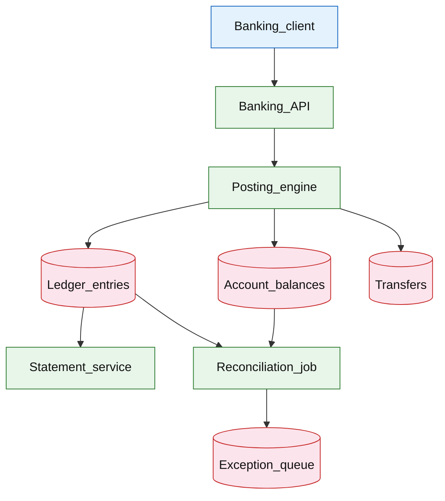

# Core banking ledger

## Introduction

A core banking ledger is the **system of record** for customer accounts: **double-entry** postings, immutable **ledger entries**, derived **balances**, and **statements**. Transfers move money between accounts with strong consistency and auditability; this is not PSP payment orchestration—that lives in [payment workflow platform](./payment-workflow-platform.md).

**Primary users:** account holders (balance, history, transfers), finance (GL reconciliation), compliance (immutable audit), operators (posting failures, exception queue).

**Interview pacing:** Use [60-minute runbook](../../prep/interview-runbook-60m.md) — ~10 min requirements theater (below), ~18–32 min diagram + API/DB, ~46–56 min deep dive on **ledger invariants + reconciliation**.

## Requirements discovery (interview theater)

### Question bank

| Topic | You ask | If they push back | Example answer (reasonable default) |
| --- | --- | --- | --- |
| Products | Checking only? | "Full bank" | **Demand deposit** accounts (checking/savings); internal transfers |
| Currency | Multi-currency? | "USD only" | **USD** v1; FX as separate ledger extension |
| Consistency | Balance read how fresh? | "Real-time always" | **Read-your-writes** after transfer; balance = sum(entries) or materialized with txn |
| Immutability | Edit/delete entries? | "Fix mistakes" | **Append-only** ledger; corrections via **reversing entries** |
| Posting | Sync or async? | "Async OK" | **Synchronous posting** for transfers — user sees final or failed |
| Audit | Retention? | "1 year" | **7+ years** entry retention; statements materialized monthly |
| Out of scope | Loans, cards, KYC? | "Add cards" | Ledger + transfers; card auth via payment platform posts settlement entries |

### Example dialogue

> **You:** Let's scope v1: one happy path and what's out of scope?
> **Them:** …
> **You:** For scale, prototype vs 12-month target?
> **Them:** …
> **You:** What does each actor do per day on the hot path?
> **Them:** …
> **You:** I'll lock the **target** column assumptions unless you want different numbers — next I'll map fleet totals to monthly AWS meters in **billable volume**.

### Parsed requirements

| Field | Source question | Parsed value (target) | Drives |
| --- | --- | --- | --- |
| `active_accounts_a` | Active accounts (`A`) | **80M** | Scale tiers, input model, fleet totals |
| `transfers_/_account_/_day` | Transfers / account / day | **0.5 (50% of accounts transfer daily)** | Scale tiers, input model, fleet totals |
| `transfers_per_day_x_day` | Transfers per day (`X_day`) | **40M** | Scale tiers, input model, fleet totals |
| `peak_transfers/s_x_peak` | Peak transfers/s (`X_peak`) | **5,000/s** | Scale tiers, input model, fleet totals |
| `entries_per_transfer_e` | Entries per transfer (`E`) | **2–4 (double-entry + fees)** | Scale tiers, input model, fleet totals |
| `peak_posting_rps` | Peak posting RPS | **~15k entries/s** | Scale tiers, input model, fleet totals |
| `balance_model` | Balance model | **`account_balances` + entries** | Scale tiers, input model, fleet totals |
| `idempotency` | Idempotency | **on transfers** | Scale tiers, input model, fleet totals |

### Locked assumptions

Scale by **active accounts** (`A`) — same per-account behavior across tiers (not consumer DAU). Use **target** in interviews.

| Assumption | Prototype (MVP) | Growth | Target (anchor) |
| --- | --- | --- | --- |
| Active accounts (`A`) | 10k | 1M | **80M** |
| Transfers / account / day | 0.5 | 0.5 | 0.5 (50% of accounts transfer daily) |
| Transfers per day (`X_day`) | 5k | 500k | **40M** |
| Peak transfers/s (`X_peak`) | ~0.06/s | ~6/s | **5,000/s** |
| Entries per transfer (`E`) | 3 | 3 | 2–4 (double-entry + fees) |
| Peak posting RPS | ~0.2/s | ~18/s | **~15k entries/s** |
| Balance model | materialized in txn | same | `account_balances` + entries |
| Idempotency | `Idempotency-Key` | same | on transfers |

*After ~10 minutes, proceed with the **target** column unless the interviewer changes scope.*

### Interview Q&A cheat sheet

Say aloud in order (~10 min). Write locks into **parsed requirements** before capacity math.

| Step | You ask | Lock if vague (target) |
| --- | --- | --- |
| 1 — Products | Checking only? | **Demand deposit** accounts (checking/savings); internal transfers |
| 2 — Currency | Multi-currency? | **USD** v1; FX as separate ledger extension |
| 3 — Consistency | Balance read how fresh? | **Read-your-writes** after transfer; balance = sum(entries) or materialized with txn |
| 4 — Immutability | Edit/delete entries? | **Append-only** ledger; corrections via **reversing entries** |
| 5 — Posting | Sync or async? | **Synchronous posting** for transfers — user sees final or failed |
| 6 — Audit | Retention? | **7+ years** entry retention; statements materialized monthly |
| 7 — Out of scope | Loans, cards, KYC? | Ledger + transfers; card auth via payment platform posts settlement entries |

## Capacity sketch

### User input model

| Action | % of accounts | Per account / day | API | ~Req size | Durable write / account / day |
| --- | --- | --- | --- | --- | --- |
| Transfer | 50% active | 1 | `POST /v1/transfers` | 0.5 KB | **~1.2 KB** (transfer + 3 entries) |
| Balance read | 80% | 2 | `GET /v1/accounts/{id}/balance` | 0.2 KB | 0 |
| History read | 30% | 1 | `GET /v1/accounts/{id}/entries` | 4 KB | 0 |
| Statement (monthly) | 100% / 30 | 0.03 | batch PDF | — | object store |

### Fleet totals (target, `A` = 80M, `X_day` = 40M)

| Metric | Formula | Value |
| --- | --- | --- |
| Transfers / day | `0.5 × A` | **40M** |
| Ledger entries / day | `40M × 3` | **120M** |
| Balance reads / day | `0.8 × A × 2` | **128M** |
| OLTP bytes / day | entries + transfers | **~40 GB** |

### Traffic profile (target tier)

| Metric | Value |
| --- | --- |
| **Read:write (API requests)** | **~4:1** (balance + history reads vs transfers) |
| **Read:write (durable bytes)** | **~3:1** reads (cached balances) vs **~40 GB**/day ledger append |
| **Requests / day (fleet)** | **~192M** |
| **Avg RPS** | **~2,220/s** (`192M / 86,400`) |
| **Peak RPS** | **5,000/s** transfers; **~50k/s** balance reads |

| User / actor | Action | R/W | Per user (or actor) / day | % of fleet requests |
| --- | --- | --- | --- | --- |
| Account holder | Transfer | W | 0.5 | **~21%** |
| Account holder | Balance read | R | 1.6 | **~67%** |
| Account holder | History read | R | 0.3 | **~12%** |
| Statement job | Monthly statement | R | 0.03 | **&lt;1%** |

*Per-account rates stay fixed across prototype → target; only `A` scales fleet totals.*

### AWS service map (target deployment)

| AWS service | Role in this design |
| --- | --- |
| Amazon API Gateway | Banking REST (transfers, balance, history) |
| Application Load Balancer | Banking API + posting engine |
| Amazon ECS on Fargate | Banking API + synchronous posting engine |
| Amazon Aurora PostgreSQL | `ledger_entries`, `account_balances`, `transfers` (sharded by `account_id`) |
| Amazon ElastiCache for Redis | Hot `account_balances` read cache |
| Amazon S3 | Monthly statement PDFs / exports |
| AWS Batch | Nightly reconciliation (`sum(entries)` vs balances) |
| Amazon SQS | Exception queue for reconciliation mismatches |
| AWS KMS | Encryption at rest for ledger data |
| Amazon CloudWatch | Posting failures, shard lag, reconcile gaps |
| AWS X-Ray | Transfer → double-entry txn trace |
| Amazon VPC | Isolated banking network; no public DB |

### Scale tiers

| Tier | `A` | `X_day` | Avg transfer RPS | Peak transfer RPS | Peak entry RPS |
| --- | --- | --- | --- | --- | --- |
| Prototype | 10k | 5k | **~0.06** | **~0.6** | **~2** |
| Growth | 1M | 500k | **~5.8** | **~58** | **~175** |
| Target | 80M | 40M | **~460** | **5,000** | **15,000** |

### Symbols

| Symbol | Meaning |
| --- | --- |
| `A` | Active accounts |
| `X_day` | Transfers per day (`0.5 × A`) |
| `X_peak` | Peak transfers per second |
| `E` | Ledger entries per transfer (~3) |
| `S_entry` | Bytes per `ledger_entries` row (~200 B) |

### Derivation (traffic)

**Transfers:** `X_day / 86,400` → target **~460/s** avg, **`X_peak = 5,000/s`**.

**Posting:** `X_peak × E` → **~15k ledger appends/s** peak — sync path; shard by `account_id`.

**Balance reads:** **~10×** transfer rate at peak → **~50k reads/s** — cache hot `account_balances`.

**Posting locks:** two-account transfer orders `min(id), max(id)` to avoid deadlock.

**Reconciliation:** nightly `sum(entries)` vs balances — distributed scan; intraday exception queue.

### Storage and growth over time

| Table / store | ~Row size | New rows/day (target) | Retention | Steady-state (target) | Per account |
| --- | --- | --- | --- | --- | --- |
| `accounts` | 256 B | 50k net | permanent | **80M → ~20 GB** | **256 B** |
| `account_balances` | 64 B | 40M updates | permanent | **~5 GB** | 1 row |
| `ledger_entries` | 200 B | 120M | 7y online | **~8.8 TB** / 7y | **~3/transfer** |
| `transfers` | 400 B | 40M | 7y | **~10 TB** / 7y | **0.5/day** |

**Cumulative ledger entries:**

| Horizon | Entries | Size (`× 200 B`) |
| --- | --- | --- |
| 1 year | 44B | **~8.8 TB** |
| 5 years | 219B | **~44 TB** (monthly partitions + cold) |

### Per-user economics (target)

| Metric | Value | Notes |
| --- | --- | --- |
| Transfers / account / day | **0.5** | half of accounts active daily |
| Ledger bytes / account / day | **~500 B** | `40 GB / 80M` |
| Steady ledger / account / year | **~110 KB** | 7y amortized |
| Balance reads / account / day | **~1.6** | `128M / 80M` |

### Service footprint (instances)

| Service | Scales with | Prototype | Growth | Target |
| --- | --- | --- | --- | --- |
| Banking API + posting engine | `X_peak` | 2 | 20 | **~200** pods |
| Ledger DB shards | entry RPS + TB | 1 | 8 | **~40** shards |
| Balance cache | read RPS | 1 Redis | cluster | **~20 GB** |
| Reconciliation batch | `A` | 1 job | 2 | **distributed** |

**First scale cliff:** **~1M accounts** — single posting primary; co-locate linked accounts or settlement account pattern.

### Billable volume (target month)

Convert **fleet totals** to AWS billing meters before dollar math. *List-price ballparks — not a quote.*

| Design quantity (target) | Formula | Monthly billable unit |
| --- | --- | --- |
| API requests | `requests_day × 30` | **derive from fleet** (**~192M**) |
| OLTP storage steady | storage table | **___ GB-mo** |
| Cache / Redis RAM | footprint | **___ GB** (node tier) |
| Egress / CDN | `egress_day × 30` | **___ GB / mo** |
| Stream / queue events | `events_day × 30` | **___ million events / mo** |
| Log ingest (if full capture) | `log_GB_day × 30` | **___ GB ingest / mo** |
| **Per unit** | `total / scale driver` | **$…/unit/mo** |

*Reconcile rows in **Cloud cost ballpark** (9a) with these meters.*

### Cost at a glance

Interview sound bite — reconcile with **billable volume** and **cloud cost** below.

| Tier | Scale | ~Monthly $ (core) | Per unit |
| --- | --- | --- | --- |
| Prototype (MVP) | see locked assumptions | **~$800** | platform tax dominates |
| Target (anchor) | `U` or `Q` = **see locked assumptions** | **see cloud cost** | **see cloud cost** |

**First payment block:** smallest prod footprint (load balancer + database + compute) before per-million traffic dominates.

### Cloud cost ballpark (target)

| Line item | Driver | ~Monthly |
| --- | --- | --- |
| Posting compute | ~200 pods | **~$15k** |
| Ledger OLTP | 8.8 TB/yr new | **~$60k** |
| Balance cache | 20 GB | **~$1k** |
| Reconciliation | batch | **~$3k** |
| **Total** | | **~$79k/mo** |
| **Per account** | `79k / 80M` | **~$0.001/account/mo** |
| **Per transfer** | `79k / 1.2B/mo` | **~$0.00007/transfer/mo** |

### Timeline (same per-account rates; `A` doubles ~monthly)

| Milestone | `A` | `X_day` | Ledger ingest/day | ~Monthly $ |
| --- | --- | --- | --- | --- |
| Launch | 10k | 5k | **~6 MB** | **~$800** |
| Month 3 | 80k | 40k | **~48 MB** | **~$3k** |
| Month 6 | 320k | 160k | **~190 MB** | **~$10k** |
| Month 12 | 1.3M | 650k | **~780 MB** | **~$35k** |

### Sensitivity

- **Cross-shard transfer** — co-locate linked accounts or internal settlement account vs 2PC.
- **10× peak transfers** — posting shards and hot account row locks.
- **Async posting** — violates sync transfer SLA if offered to retail users.

## High-level design

### Architecture (user → database)



**Narrative:** **Banking API** accepts transfer with idempotency key. **Posting engine** validates accounts, enforces **double-entry** in one DB transaction: append `ledger_entries`, update `account_balances`, set `transfers` state `POSTED`. **Statement service** generates periodic snapshots from entries. **Reconciliation job** verifies invariants; mismatches go to **exception queue** for ops.

## User-visible surface

- **Customer:** view balance and transaction list; initiate transfer; see `PENDING` → `POSTED` or `FAILED`.
- **Finance:** GL export; trial balance reports.
- **Ops:** work exception queue; reverse posting via compensating entries (controlled API).

## API contract and input model

### UX → API traceability

| UX / UI action | User intent | API or event | Sync/async | Idempotent? | Validates |
| --- | --- | --- | --- | --- | --- |
| **Customer:** view balance and transaction list; initiate tr | Move funds | `POST` `/v1/transfers` | sync | yes | domain rules |
| **Finance:** GL export; trial balance reports. | Current balance | `GET` `/v1/accounts/{account_id}/bal | sync | read | domain rules |
| **Ops:** work exception queue; reverse posting via compensat | Entry history | `GET` `/v1/accounts/{account_id}/tra | sync | read | domain rules |
| See user-visible surface | PDF/JSON statement | `GET` `/v1/accounts/{account_id}/sta | sync | read | domain rules |
| See user-visible surface | Compensating entry (ops) | `POST` `/v1/admin/postings/reverse` | sync | yes | domain rules |
### Endpoints

| Method | Path | Purpose |
| --- | --- | --- |
| `POST` | `/v1/transfers` | Move funds |
| `GET` | `/v1/accounts/{account_id}/balance` | Current balance |
| `GET` | `/v1/accounts/{account_id}/transactions` | Entry history |
| `GET` | `/v1/accounts/{account_id}/statements/{period}` | PDF/JSON statement |
| `POST` | `/v1/admin/postings/reverse` | Compensating entry (ops) |

### Example payloads

`POST /v1/transfers`

```http
Idempotency-Key: xfer-cust9912-20260523-001
```

```json
{
 "from_account_id": "acct_1001",
 "to_account_id": "acct_2002",
 "amount_cents": 25000,
 "currency": "USD",
 "memo": "Rent split"
}
```

Response `200 OK` (posted)

```json
{
 "transfer_id": "xfer_8f2a1c",
 "state": "POSTED",
 "txn_id": "txn_7k2m9p",
 "posted_at": "2026-05-23T21:00:00Z"
}
```

Insufficient funds `422`:

```json
{
 "error": "insufficient_funds",
 "from_account_id": "acct_1001",
 "available_cents": 10000,
 "requested_cents": 25000
}
```

Duplicate idempotency key → same `transfer_id` / `txn_id` response.

`GET /v1/accounts/acct_1001/balance`

```json
{
 "account_id": "acct_1001",
 "currency": "USD",
 "available_cents": 125000,
 "ledger_balance_cents": 125000,
 "as_of": "2026-05-23T21:00:01Z"
}
```

`GET /v1/accounts/acct_1001/transactions?cursor=...&limit=20`

```json
{
 "entries": [
 {
 "entry_id": "ent_001",
 "txn_id": "txn_7k2m9p",
 "direction": "debit",
 "amount_cents": 25000,
 "balance_after_cents": 125000,
 "memo": "Rent split",
 "at": "2026-05-23T21:00:00Z"
 }
 ],
 "next_cursor": "eyJlbnRyeV9pZCI6ImVudF8wMDAifQ"
}
```

### Input validation

- Same currency; accounts `ACTIVE`; not same account.
- Amount &gt; 0; within daily velocity limits (anti-fraud).
- Holds/reserves reduce `available` vs ledger balance (extension).

## Database model

### Tables

| Table | Key fields | Notes |
| --- | --- | --- |
| `accounts` | `account_id`, `owner_id`, `currency`, `status` | |
| `account_balances` | `account_id`, `ledger_cents`, `available_cents`, `version` | Materialized |
| `transfers` | `transfer_id`, `idempotency_key`, `from`, `to`, `amount`, `state`, `txn_id` | |
| `ledger_entries` | `entry_id`, `txn_id`, `account_id`, `direction`, `amount_cents`, `balance_after`, `at` | Append-only |
| `txn` | `txn_id`, `type`, `metadata` | Groups legs |

Indexes:

- `ledger_entries(account_id, at DESC)` — statements
- `transfers(idempotency_key)` UNIQUE
- `ledger_entries(txn_id)` — audit trail

### Double-entry example (transfer $250)

| account | direction | amount |
| --- | --- | --- |
| `acct_1001` (customer) | debit | 25000 |
| `acct_2002` (customer) | credit | 25000 |

Optional fee leg: credit `acct_fee_income`, debit `acct_1001`.

**Invariant:** for each `txn_id`, `sum(debits) = sum(credits)` per currency.

### Read/write paths

1. **Transfer** — begin txn → lock accounts ordered by id → check `available` → insert `txn` + 2+ `ledger_entries` → update balances → `transfers` POSTED → commit.
2. **Balance read** — read `account_balances` (or sum entries if paranoid mode).
3. **History** — page `ledger_entries` by account.
4. **Statement** — batch job aggregates month per account from entries.
5. **Reconcile** — compare materialized vs sum(entries); flag drift.

## Interview deep dive: Ledger invariants + reconciliation

### Core invariants

1. **Double-entry:** every `txn_id` balances to zero (per currency).
2. **Immutability:** no UPDATE on `ledger_entries` — only append.
3. **No negative available** (unless explicit overdraft product).
4. **Idempotent client retries** — same `Idempotency-Key` → same `txn_id`.

### Posting engine (single txn)

- All legs + balance updates **atomic** — partial transfer impossible.
- Lock ordering prevents deadlock on A→B and B→A concurrent transfers.

### Corrections

- **Reversal txn** posts opposite legs referencing `reverses_txn_id`.
- Never delete history — audit requirement.

### Reconciliation layers

| Layer | Checks |
| --- | --- |
| **Intra-day** | `account_balances.ledger_cents == sum(entries)` sample |
| **Nightly** | Full account population; trial balance |
| **External** | Settlement files from [payment platform](./payment-workflow-platform.md) vs cash GL accounts |

**Exception queue:** posting succeeded in app but replica lag read — or rare bug — ops tool generates adjusting entry after approval.

### vs payment workflow platform

| Core ledger | Payment platform |
| --- | --- |
| Account balances | PSP auth/capture |
| Double-entry truth | External money movement |
| Customer transfers | Merchant checkout |

Payment settlement **posts** to ledger via controlled integration (credit settlement account).

## Scale and failure

### Correctness model

- Posted transfer visible in balance immediately (read-your-writes).
- `txn_id` appears zero or more times in entries but always balanced when POSTED.
- Idempotent transfers do not double-post.

### Failure cases

| Failure | Symptom | Mitigation |
| --- | --- | --- |
| DB txn timeout | Transfer failed | Client retry idempotent |
| Balance drift | Recon alert | Stop-the-line; repair entry |
| Hot account lock | p99 latency | Shard; queue not for sync UX — split accounts |
| Duplicate idempotency bug | Double spend | UNIQUE key; txn id check |
| Statement job fail | Late statement | Retry; entries source of truth |
| Cross-currency attempt | Reject | Validation |

### Key metrics

- Transfer POSTED rate; insufficient funds rate
- Posting txn p99; lock wait time
- Reconciliation mismatch count (target 0)
- Ledger append rate; storage growth
- Exception queue age
- Statement generation SLA

### Interview deep dive talking points

- **Double-entry in one transaction** — debit/credit legs + balances.
- Append-only + **reversal** not delete.
- Idempotent transfers; lock ordering on two accounts.
- Materialized balance vs sum(entries) reconciliation.
- Clear boundary from [payment workflow](./payment-workflow-platform.md).

## Related

- [Examples hub](./README.md)
- [Payment workflow platform](./payment-workflow-platform.md)
- [Blockchain settlement and audit](./blockchain-settlement-audit.md)
- [Cross-service audit logging](../platform/cross-service-audit-logging.md)
- [Event-driven order pipeline](../event-driven/event-driven-order-pipeline.md)
- [60-minute runbook](../../prep/interview-runbook-60m.md)
