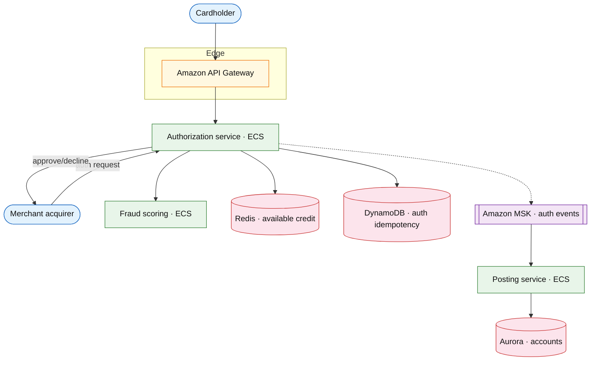

# Credit card platform

## Introduction

A credit card platform covers **issuing**, **authorization** (hold funds), **clearing/settlement**, **statements**, and **fraud** — distinct from generic [payment workflow](./payment-workflow-platform.md) (merchant checkout) and [core banking ledger](./core-banking-ledger.md) (account balances).

**Primary users:** cardholders (spend, limits), issuers (BIN programs), merchants (via networks), risk (decline rules).

**Interview pacing:** [60-minute runbook](../../prep/interview-runbook-60m.md) — deep dive **auth hold → capture → ledger posting + idempotency**.

**Company anchors:** Chase / Amex / Capital One issuing stack; Apple Card; Stripe Issuing.

## Requirements discovery

### Interview Q&A cheat sheet

| Lock (target) |
| --- |
| 20M active cards |
| Auth p99 &lt; 100 ms (approve/decline) |
| Holds expire in 7 days if not captured |
| Strong consistency on available credit |
| PCI: card data tokenized; PAN never in app logs |

## Architecture (user → database)

**Narrative:** **Authorization** checks idempotency key, runs **fraud rules**, atomically decrements **available credit** in Redis (backed by Aurora). Approved auth returns auth code; **capture** later posts to **ledger**. Declines are fast-fail with reason codes.

## Deep dive: auth hold lifecycle

| State | Behavior |
| --- | --- |
| `AUTHORIZED` | Hold placed; available credit reduced |
| `CAPTURED` | Final amount posted; hold released |
| `EXPIRED` | Hold TTL; credit restored |

- **Idempotency:** `network_transaction_id` unique in DynamoDB.
- **Race:** compare-and-set on available credit; serial per `account_id`.
- **Settlement:** batch file to network; reconcile with [core banking ledger](./core-banking-ledger.md).

## Related

- [Payment workflow](./payment-workflow-platform.md) (merchant PSP)
- [Core banking ledger](./core-banking-ledger.md)
- [Step Functions drill](../aws/step-functions.md)
- [ElastiCache drill](../aws/elasticache-redis.md)
