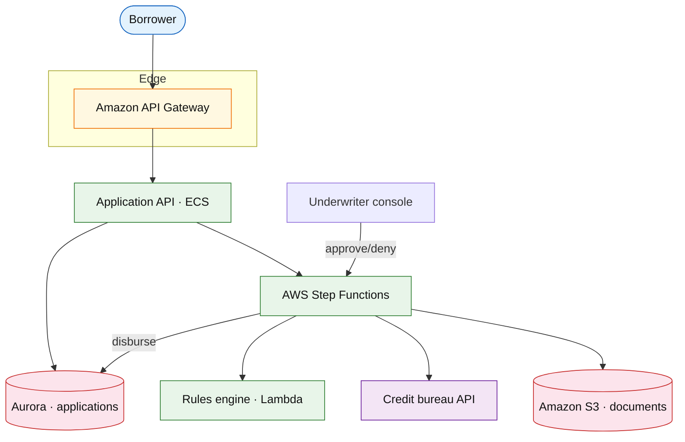

# Loan origination platform

## Introduction

Loan origination covers **application intake**, **credit underwriting**, **offer generation**, **disbursement**, and handoff to **servicing** — a workflow-heavy fintech surface (mortgage, personal loan, BNPL).

**Primary users:** borrowers (apply, sign), underwriters (manual review), partners (income verification APIs).

**Interview pacing:** [60-minute runbook](../../topics/interview-runbook-60m.md) — deep dive **long-running workflow + human-in-the-loop + audit trail**.

**Company anchors:** SoFi, LendingClub, Affirm, bank mortgage desks.

## Requirements discovery

### Interview Q&A cheat sheet

| Lock (target) |
| --- |
| 2M applications / year |
| p99 decision API &lt; 2 s for pre-qual (rules-only) |
| Full underwriting up to 48 h with human step |
| Immutable audit per state transition |
| PII encrypted; least-privilege doc access |

## Architecture (user → database)

**Narrative:** **Step Functions** orchestrates stages: `SUBMITTED → KYC → BUREAU_PULL → MANUAL_REVIEW → APPROVED → FUNDED`. **Rules engine** auto-decides simple cases; **human task** waits on callback. Documents land in **S3** with virus scan queue.

## Deep dive: underwriting workflow

- **Compensation:** human step uses task token; timeout → escalate.
- **Idempotency:** bureau pull keyed by `application_id + pull_type`.
- **Servicing handoff:** funded loan emits event to servicing system (out of scope v1).

## Related

- [Core banking ledger](./core-banking-ledger.md) (funded balance)
- [Workflow orchestration rebuild](../infra/workflow-orchestration.md)
- [Cross-service audit logging](../platform/cross-service-audit-logging.md)
- [Payment workflow](./payment-workflow-platform.md) (disbursement rail)
