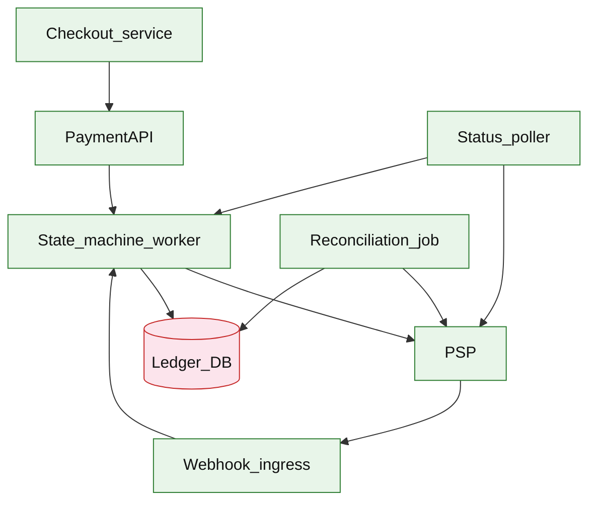

# Payment workflow platform

## Introduction

A payment workflow platform orchestrates **authorize → capture → settle → refund** against external payment service providers (PSPs), while keeping an internal **ledger** aligned for finance and audit. Checkout services call a stable payment API; PSP webhooks and reconciliation jobs resolve ambiguous or delayed outcomes.

**Primary users:** checkout services (initiate/capture/refund), finance (settlement reports), operators (reconciliation dashboards, manual review queue), compliance (immutable audit trail).

**Interview pacing:** Use [60-minute runbook](../../prep/interview-runbook-60m.md) — ~10 min requirements theater (below), ~18–32 min diagram + API/DB, ~46–56 min deep dive on **payment state machine + reconciliation**.

Distinct from [core banking ledger](./core-banking-ledger.md): this doc is **payment orchestration + PSP integration**, not full account/ledger domain modeling.

## Requirements discovery (interview theater)

### Question bank

| Topic | You ask | If they push back | Example answer (reasonable default) |
| --- | --- | --- | --- |
| Methods & PSPs | Cards only? Multiple PSPs? | "One Stripe-like PSP" | Cards + wallets; primary PSP + failover PSP for DR discussion |
| Money movement | Auth only or auth+capture? | "Instant charge" | Auth at checkout, capture on shipment; partial capture supported |
| Settlement | When is money "ours"? | "Real-time" | PSP settlement T+2; internal `Settled` after reconciliation batch |
| Idempotency | Duplicate charge attempts? | "Rare" | `Idempotency-Key` on all mutating APIs; webhook dedupe by `provider_ref` |
| Compliance | PCI scope? Audit retention? | "We're PCI compliant" | Card data tokenized at PSP; store tokens only; 7-year audit log retention |
| Failure | Timeout after PSP accepted? | "Refund manually" | Ambiguous → `PENDING_PROVIDER` + poll + nightly reconcile |
| Out of scope | Full fraud ML, FX treasury? | "Add crypto" | Basic risk rules; defer crypto, cross-border FX desk, chargeback automation |

### Example dialogue

> **You:** Let's scope v1: one happy path and what's out of scope?
> **Them:** …
> **You:** For scale, prototype vs 12-month target?
> **Them:** …
> **You:** What does each actor do per day on the hot path?
> **Them:** …
> **You:** I'll lock the **target** column assumptions unless you want different numbers — next I'll map fleet totals to monthly AWS meters in **billable volume**.

### Parsed requirements

| Field | Source question | Parsed value (target) | Drives |
| --- | --- | --- | --- |
| `payer_dau_u` | Payer DAU (`U`) | **50M** | Scale tiers, input model, fleet totals |
| `payment_attempts_/_dau_/_day` | Payment attempts / DAU / day | **0.4 (auth + capture + refunds)** | Scale tiers, input model, fleet totals |
| `attempts_per_day_a_day` | Attempts per day (`A_day`) | **20M** | Scale tiers, input model, fleet totals |
| `peak_authorize_rps_a_peak` | Peak authorize RPS (`A_peak`) | **2,000/s** | Scale tiers, input model, fleet totals |
| `capture_delay` | Capture delay | **shipment-triggered capture** | Scale tiers, input model, fleet totals |
| `refund_window` | Refund window | **post-capture** | Scale tiers, input model, fleet totals |
| `psp` | PSP | **no 2PC with PSP** | Scale tiers, input model, fleet totals |
| `ledger` | Ledger | **per state change** | Scale tiers, input model, fleet totals |
| `reconciliation` | Reconciliation | **ambiguous-status recovery** | Scale tiers, input model, fleet totals |

### Locked assumptions

Tied to commerce DAU in [shopping cart checkout](../commerce/shopping-cart-checkout.md) (**50M** at target). Use **target** for the interview anchor.

| Assumption | Prototype (MVP) | Growth | Target (anchor) |
| --- | --- | --- | --- |
| Payer DAU (`U`) | 10k | 1M | **50M** |
| Payment attempts / DAU / day | 0.4 | 0.4 | 0.4 (auth + capture + refunds) |
| Attempts per day (`A_day`) | 4k | 400k | **20M** |
| Peak authorize RPS (`A_peak`) | ~0.4/s | ~40/s | **2,000/s** |
| Capture delay | 2h median | same | shipment-triggered capture |
| Refund window | 90 days | same | post-capture |
| PSP | REST + webhooks | same | no 2PC with PSP |
| Ledger | append-only transitions | same | per state change |
| Reconciliation | nightly + poller | same | ambiguous-status recovery |

*After ~10 minutes, proceed with the **target** column unless the interviewer changes scope.*

### Interview Q&A cheat sheet

Say aloud in order (~10 min). Write locks into **parsed requirements** before capacity math.

| Step | You ask | Lock if vague (target) |
| --- | --- | --- |
| 1 — Methods & PSPs | Cards only? Multiple PSPs? | Cards + wallets; primary PSP + failover PSP for DR discussion |
| 2 — Money movement | Auth only or auth+capture? | Auth at checkout, capture on shipment; partial capture supported |
| 3 — Settlement | When is money "ours"? | PSP settlement T+2; internal `Settled` after reconciliation batch |
| 4 — Idempotency | Duplicate charge attempts? | `Idempotency-Key` on all mutating APIs; webhook dedupe by `provider_ref` |
| 5 — Compliance | PCI scope? Audit retention? | Card data tokenized at PSP; store tokens only; 7-year audit log retention |
| 6 — Failure | Timeout after PSP accepted? | Ambiguous → `PENDING_PROVIDER` + poll + nightly reconcile |
| 7 — Out of scope | Full fraud ML, FX treasury? | Basic risk rules; defer crypto, cross-border FX desk, chargeback automation |

## Capacity sketch

### User input model

| Action | % of DAU | Per user / day | API | ~Req size | Durable write / user / day |
| --- | --- | --- | --- | --- | --- |
| Authorize | 35% payers | 0.25 | `POST /v1/payments` | 1 KB | **~600 B** (`payments`) |
| Capture / void | system + merchant | — | `POST .../capture` | 0.5 KB | **~200 B** ledger |
| Refund | 2% | 0.02 | `POST .../refund` | 0.5 KB | **~400 B** |
| Webhook ingest | PSP | 2–3× attempts | `POST /webhooks` | 0.3 KB | inbox row |

### Fleet totals (target, `U` = 50M, `A_day` = 20M)

| Metric | Formula | Value |
| --- | --- | --- |
| Payment API calls / day | `U × 0.4` | **20M** |
| Webhooks / day | `2.5 × A_day` | **~50M** |
| OLTP bytes / day | `20M × 1.4 KB` | **~28 GB** |
| Webhook inbox / day | `50M × 300 B` | **~15 GB** |

### Traffic profile (target tier)

| Metric | Value |
| --- | --- |
| **Read:write (API requests)** | **~1:6** (status GETs vs authorize/capture/refund) |
| **Read:write (durable bytes)** | **~1:1** (`payments` + ledger **~28 GB**/day; webhook inbox **~15 GB**/day) |
| **Requests / day (fleet)** | **~20M** payment API (+ **~50M** webhook ingest) |
| **Avg RPS** | **~230/s** (`20M / 86,400`) |
| **Peak RPS** | **2,000/s** payment API |

| User / actor | Action | R/W | Per user (or actor) / day | % of fleet requests |
| --- | --- | --- | --- | --- |
| Payer | Authorize | W | 0.25 | **~63%** |
| Merchant / system | Capture / void | W | — | **~25%** (lifecycle) |
| Payer | Refund | W | 0.02 | **~5%** |
| Checkout client | Poll payment status | R | 0.13 | **~7%** |
| PSP | Webhook callback | W | 2.5× attempts | separate **50M**/day path |

*Per-user rates stay fixed across prototype → target; only `U` scales fleet totals.*

### AWS service map (target deployment)

| AWS service | Role in this design |
| --- | --- |
| Amazon API Gateway | Payment REST + signed webhook ingress |
| Application Load Balancer | Payment API + webhook handler targets |
| Amazon ECS on Fargate | Payment API + state machine worker |
| Amazon Aurora PostgreSQL | `payments`, append-only `ledger_entries` |
| Amazon SQS | Webhook inbox queue (fast ack, async apply) |
| Amazon ECS on Fargate | Status poller for `PENDING_PROVIDER` |
| AWS Batch / Amazon EMR | Nightly PSP reconciliation files |
| AWS Secrets Manager | PSP API keys + webhook signing secrets |
| Amazon CloudWatch | State transition failures, reconcile mismatches |
| AWS X-Ray | Authorize → PSP → ledger trace |
| Amazon VPC | Egress to PSP; no card data in VPC (tokens only) |

### Scale tiers

| Tier | `U` | `A_day` | Avg API RPS | Peak API RPS | Webhooks/day |
| --- | --- | --- | --- | --- | --- |
| Prototype | 10k | 4k | **~0.05** | **~0.4** | 10k |
| Growth | 1M | 400k | **~4.6** | **~40** | 1M |
| Target | 50M | 20M | **~230** | **2,000** | 50M |

### Symbols

| Symbol | Meaning |
| --- | --- |
| `U` | Payer DAU |
| `A_day` | Payment attempts per day (`0.4 × U`) |
| `A_peak` | Peak combined payment API RPS |
| `W_day` | Webhook deliveries per day |
| `S_pay` | Bytes per `payments` row (~600 B) |
| `S_ledger` | Bytes per `ledger_entries` row (~200 B) |

### Derivation (traffic)

**API:** `A_day / 86,400` → target **~230/s** avg, **`A_peak = 2,000/s`** (flash sale + capture bursts).

**Webhooks:** `W_day ≈ 2.5 × A_day` → **~580/s** avg; batch settlement files spike higher.

**Ledger:** ~4 transitions per happy path → **~1k inserts/s** at peak when transitions cluster.

**Reconciliation:** PSP file vs `payments` — batch, **4h SLA** after file arrival; not on hot path.

**PSP outbound:** `A_peak` concurrent HTTPS — pool size and rate limits dominate before DB.

### Storage and growth over time

| Table / store | ~Row size | New rows/day (target) | Retention | Steady-state (target) | Per payment |
| --- | --- | --- | --- | --- | --- |
| `payments` | 600 B | 20M | 7y + archive | **~3 TB** 7y ballpark | 1 row |
| `ledger_entries` | 200 B | 40–80M | 7y | **~4–8 TB** | 2–4 legs |
| `webhook_inbox` | 300 B | 50M | 30d | **~1.2B/mo** window | idempotent |
| `reconciliation_runs` | 1 KB | 1 | 2y | **&lt; 1 GB** | nightly |

**Cumulative (payments + ledger):**

| Horizon | Payment rows | OLTP size (order of) |
| --- | --- | --- |
| 1 year | 7.3B | **~4.4 TB** |
| 5 years | 36.5B | **~22 TB** (tiered archive) |

### Per-user economics (target)

| Metric | Value | Notes |
| --- | --- | --- |
| Payment attempts / DAU / day | **0.4** | includes lifecycle ops |
| OLTP bytes / DAU / day | **~560 B** | `28 GB / 50M` |
| Bytes / payment attempt | **~1.4 KB** | payment + ledger amortized |
| Webhook bytes / DAU / day | **~300 B** | inbox churn |

### Service footprint (instances)

| Service | Scales with | Prototype | Growth | Target |
| --- | --- | --- | --- | --- |
| Payment API + state worker | `A_peak` | 2 | 20 | **~150** pods |
| Ledger DB | append RPS + TB | 1 | 4 shards | **~20** shards |
| Webhook ingress | `W_day` | 2 | 20 | **~80** handlers |
| Reconciliation batch | file rows | 1 job | 2 | **Spark/Batch** cluster |

**First scale cliff:** **~1M payer DAU** — PSP connection pool + single ledger primary; shard payments by `merchant_id` before **10M DAU**.

### Billable volume (target month)

Convert **fleet totals** to AWS billing meters before dollar math. *List-price ballparks — not a quote.*

| Design quantity (target) | Formula | Monthly billable unit |
| --- | --- | --- |
| API requests | `requests_day × 30` | **derive from fleet** (**~20M** payment API (+ **~50M** webhook ingest)) |
| OLTP storage steady | storage table | **___ GB-mo** |
| Cache / Redis RAM | footprint | **___ GB** (node tier) |
| Egress / CDN | `egress_day × 30` | **___ GB / mo** |
| Stream / queue events | `events_day × 30` | **___ million events / mo** |
| Log ingest (if full capture) | `log_GB_day × 30` | **___ GB ingest / mo** |
| **Per unit** | `total / scale driver` | **$…/unit/mo** |

*Reconcile rows in **Cloud cost ballpark** (9a) with these meters.*

### Cost at a glance

Interview sound bite — reconcile with **billable volume** and **cloud cost** below.

| Tier | Scale | ~Monthly $ (core) | Per unit |
| --- | --- | --- | --- |
| Prototype (MVP) | see locked assumptions | **~$500** | platform tax dominates |
| Target (anchor) | `U` or `Q` = **see locked assumptions** | **see cloud cost** | **~$0.00086/DAU/mo** |

**First payment block:** smallest prod footprint (load balancer + database + compute) before per-million traffic dominates.

### Cloud cost ballpark (target)

| Line item | Driver | ~Monthly |
| --- | --- | --- |
| Payment compute | ~150 pods | **~$12k** |
| OLTP (payments + ledger) | multi-TB | **~$25k** |
| Webhook + queue | 50M/day | **~$4k** |
| Reconciliation batch | nightly | **~$2k** |
| **Total** | | **~$43k/mo** |
| **Per DAU** | `43k / 50M` | **~$0.00086/DAU/mo** |
| **Per payment** | `43k / 600M attempts/mo` | **~$0.00007/attempt/mo** |

### Timeline (same per-user rates; `U` doubles ~monthly)

| Milestone | `U` | `A_day` | OLTP ingest/day | ~Monthly $ |
| --- | --- | --- | --- | --- |
| Launch | 10k | 4k | **~5.6 MB** | **~$500** |
| Month 3 | 80k | 32k | **~45 MB** | **~$2.5k** |
| Month 6 | 320k | 128k | **~180 MB** | **~$8k** |
| Month 12 | 1.3M | 520k | **~730 MB** | **~$28k** |

### Sensitivity

- **10× peak auth** — PSP rate limits and outbound connections first; DB state writes second.
- **Webhook storm** — dedupe inbox + handler backpressure.
- **Long refund window** — `payments` storage growth; partition by `created_at`.

## High-level design

### Architecture (user → database)



**Narrative:** `PaymentAPI` accepts idempotent commands and persists desired transitions. `State_machine_worker` executes PSP calls, records `ledger_entries`, and advances `payments.state`. `Webhook_ingress` verifies signatures and applies provider-confirmed transitions idempotently. `Status_poller` resolves timeouts. `Reconciliation_job` matches PSP settlement files to internal `Captured`/`Settled` rows and opens mismatches for operators.

## User-visible surface

- **Checkout:** create payment, capture when shipped, refund with reason; poll `GET /payments/{id}` for timeline.
- **Finance:** export settlement batches; view mismatch report from reconciliation.
- **Operator:** retry failed capture, force status poll, approve manual adjustment linked to audit ticket.
- **PSP:** webhook endpoint with signature verification and fast `200` ack (async processing).

## API contract and input model

### UX → API traceability

| UX / UI action | User intent | API or event | Sync/async | Idempotent? | Validates |
| --- | --- | --- | --- | --- | --- |
| **Checkout:** create payment, capture when shipped, refund w | Authorize (idempotent) | `POST` `/v1/payments` | sync | yes | domain rules |
| **Finance:** export settlement batches; view mismatch report | Capture funds | `POST` `/v1/payments/{payment_id}/cap | sync | yes | domain rules |
| **Operator:** retry failed capture, force status poll, appro | Full or partial refund | `POST` `/v1/payments/{payment_id}/ref | sync | yes | domain rules |
| **PSP:** webhook endpoint with signature verification and fa | Status + timeline | `GET` `/v1/payments/{payment_id}` | sync | read | domain rules |
| See user-visible surface | Provider callbacks (internal) | `POST` `/v1/webhooks/psp` | sync | yes | domain rules |
### Endpoints

| Method | Path | Purpose |
| --- | --- | --- |
| `POST` | `/v1/payments` | Authorize (idempotent) |
| `POST` | `/v1/payments/{payment_id}/capture` | Capture funds |
| `POST` | `/v1/payments/{payment_id}/refund` | Full or partial refund |
| `GET` | `/v1/payments/{payment_id}` | Status + timeline |
| `POST` | `/v1/webhooks/psp` | Provider callbacks (internal) |

### Example payloads

`POST /v1/payments`

```http
Idempotency-Key: pay-req-8f2a1c-001
```

```json
{
 "order_id": "ord_8f2a1c",
 "amount_cents": 3998,
 "currency": "USD",
 "payment_method_token": "pm_tok_abc",
 "customer_id": "cust_9912"
}
```

Response `201 Created`:

```json
{
 "payment_id": "pay_7d3e9b",
 "order_id": "ord_8f2a1c",
 "state": "AUTHORIZED",
 "amount_cents": 3998,
 "currency": "USD",
 "provider_ref": "pi_3NxYz",
 "authorized_at": "2026-05-22T15:00:00Z"
}
```

`POST /v1/payments/pay_7d3e9b/capture`

```json
{ "amount_cents": 3998 }
```

Response `200 OK`:

```json
{
 "payment_id": "pay_7d3e9b",
 "state": "CAPTURED",
 "captured_at": "2026-05-22T17:00:00Z"
}
```

`POST /v1/webhooks/psp` (provider → platform)

```json
{
 "type": "payment_intent.succeeded",
 "provider_ref": "pi_3NxYz",
 "event_id": "evt_wh_001",
 "occurred_at": "2026-05-22T17:00:01Z"
}
```

Response: `200 OK` with empty body (process async).

### Input validation

- `Idempotency-Key` required on `POST` mutating routes; 24h TTL.
- `amount_cents` &gt; 0; capture ≤ authorized amount; partial refund ≤ captured.
- State guards: capture only from `AUTHORIZED`; refund from `CAPTURED` or `SETTLED`.
- Webhook: verify HMAC signature; reject stale timestamps (&gt; 5 min skew).

## Database model

### Tables

| Table | Key fields | Notes |
| --- | --- | --- |
| `payments` | `payment_id` (PK), `order_id`, `state`, `amount_cents`, `currency`, `provider_ref`, `version`, `updated_at` | Aggregate |
| `payment_attempts` | `attempt_id`, `payment_id`, `operation`, `status`, `psp_response`, `created_at` | Per PSP call |
| `ledger_entries` | `entry_id`, `payment_id`, `debit_account`, `credit_account`, `amount_cents`, `transition`, `at` | Append-only |
| `webhook_events` | `webhook_id` (PK), `provider_ref`, `event_type`, `payload_hash`, `processed_at` | Dedupe |
| `reconciliation_runs` | `run_id`, `psp_date`, `matched_count`, `mismatch_count`, `completed_at` | Batch metadata |
| `idempotency_keys` | `key`, `route`, `request_hash`, `response_ref`, `expires_at` | API dedupe |

Indexes:

- `payments(order_id)`, `payments(state, updated_at)`, `payments(provider_ref)` UNIQUE
- `webhook_events(provider_ref, event_type, payload_hash)` UNIQUE
- `ledger_entries(payment_id, at)`

### State machine

```text
Requested → RiskChecked → Authorized → Captured → Settled → Refunded
 ↓ ↓ ↓
 Failed Failed/PENDING_PROVIDER → (poll/reconcile) → terminal
```

Failure side path: `CompensationPending` when capture succeeded internally but ledger write failed (retry + alert).

### Read/write paths

1. **Authorize** — insert `payments` (`Requested`) → risk rules → PSP authorize → `Authorized` + `ledger_entries` + `payment_attempts`.
2. **Capture** — validate state → PSP capture → `Captured` + ledger → emit domain event for order pipeline.
3. **Webhook** — insert `webhook_events` if new → map provider event → idempotent state advance → ack.
4. **Reconcile** — ingest PSP file → compare totals and row-level `provider_ref` → flag mismatches → operator tool.

## Interview deep dive: Payment state machine + reconciliation

### Why saga, not 2PC

PSPs do not participate in distributed transactions. Use **orchestrated saga**: each transition is a local transaction (update `payments` + append `ledger_entries`) plus external PSP call with compensating actions (`Refund`) on failure.

| Pattern | Fit |
| --- | --- |
| 2PC across app + PSP | Not available |
| Choreography only | Hard to see global payment state |
| **Orchestrator (payment service)** | Clear state machine, audit trail, retry policy |

### Ambiguous outcomes

| Scenario | Detection | Resolution |
| --- | --- | --- |
| Timeout after PSP accepted auth | `payment_attempts` timeout; PSP shows success | `PENDING_PROVIDER` + poller → `Authorized` |
| Duplicate webhook | Unique `webhook_id` / `provider_ref` | Ignore second; metric `webhook_dedupe_hit` |
| Capture succeeded, ledger failed | `CompensationPending` | Retry ledger; alert if stuck; never double-capture |
| Settlement file mismatch | Reconciliation job | Operator ticket; adjust or dispute with PSP |

### Reconciliation depth

- **Row-level:** match `provider_ref`, amount, currency, date.
- **Aggregate:** daily totals per merchant account vs sum(`ledger_entries`).
- **Timing:** internal `Settled` lags PSP settlement T+2 — do not conflate `Captured` with cash in bank.

### Idempotency

- API: `Idempotency-Key` stores response snapshot.
- Webhook: `UNIQUE(provider_ref, event_type)` or provider `event_id`.
- PSP calls: pass idempotency key to PSP where supported (`Idempotency-Key` header).

## Scale and failure

### Correctness model

- At most one terminal success path per `payment_id` for authorize/capture (state guards + unique constraints).
- Ledger entries are append-only; corrections via compensating entries, not silent updates.
- Webhook processing is at-least-once; business effect is effectively-once via dedupe table.
- Reconciliation detects drift between PSP truth and internal state — does not auto-fix large mismatches without review.

### Failure cases

| Failure | Symptom | Mitigation |
| --- | --- | --- |
| PSP rate limit | 429 from PSP; elevated latency | Exponential backoff; queue capture jobs; multi-PSP failover |
| Webhook replay storm | Handler CPU high | Dedupe; scale consumers; fast ack + async worker |
| Double capture attempt | Second capture rejected | State machine guard; idempotent capture API |
| Ledger DB outage | Payments stuck mid-transition | Pause outbound transitions; retry; `CompensationPending` playbook |
| Settlement file delay | `Settled` lags | SLA alert; finance uses `Captured` + expected settlement date |
| Partial refund race | Over-refund risk | Serialize refunds per `payment_id`; sum(refunds) ≤ captured |

### Key metrics

- Auth/capture/refund success rate and latency by PSP
- Count in `PENDING_PROVIDER` and mean time to resolve
- Webhook dedupe hit rate; webhook processing lag
- Reconciliation mismatch count and amount delta
- Ledger write failure rate; `CompensationPending` age

### Interview deep dive talking points

- State machine diagram first; **no 2PC with PSP** — saga + compensation.
- Walk **ambiguous timeout** → poll + reconcile (concrete story).
- Separate **Captured** (customer charged) vs **Settled** (cash in bank).
- Webhook idempotency keys and ledger append-only audit.
- Close with nightly reconciliation as the **source of truth backstop**.

## Related

- [Examples hub](./README.md)
- [Event-driven order pipeline](../event-driven/event-driven-order-pipeline.md)
- [Core banking ledger](./core-banking-ledger.md)
- [Event ticketing](../commerce/event-ticketing.md) (commerce + payment saga)
- [60-minute runbook](../../prep/interview-runbook-60m.md)
