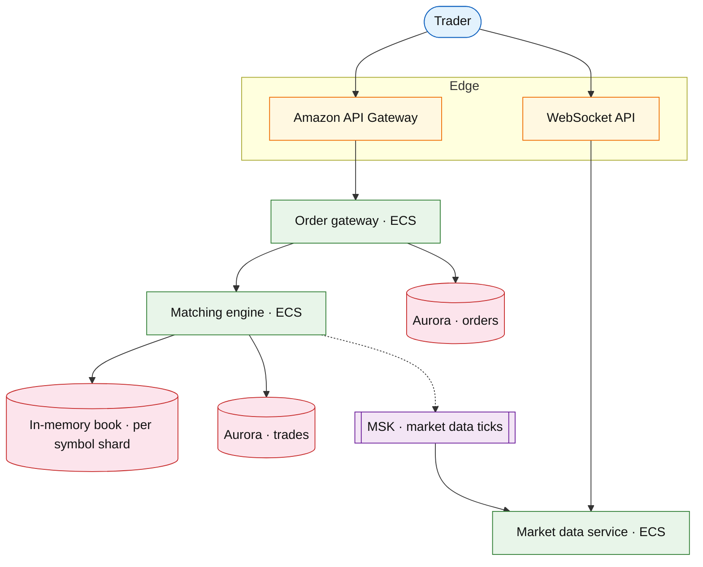

# Securities trading platform

## Introduction

A securities trading platform matches **buy/sell orders**, maintains an **order book**, streams **market data**, and settles trades — the stock-market / exchange interview shape (Robinhood, NYSE retail stack, crypto spot exchange).

**Primary users:** traders (place/cancel), market makers (quotes), compliance (halt, surveillance).

**Interview pacing:** [60-minute runbook](../../prep/interview-runbook-60m.md) — deep dive **order book + matching + market data fanout**.

Distinct from [core banking ledger](./core-banking-ledger.md) (post-trade balances) and [payment workflow](./payment-workflow-platform.md).

## Requirements discovery

### Interview Q&A cheat sheet

| Lock (target) |
| --- |
| 5M funded accounts |
| 50M orders / day |
| Matching p99 &lt; 10 ms in hot symbol shard |
| Market data: 1M concurrent websocket clients |
| Regulatory: trade halts, audit log |

## Architecture (user → database)

**Narrative:** **Order gateway** validates limits, routes to **symbol shard**. **Matcher** runs price-time priority in memory; persists **trades** to Aurora, publishes **ticks** to MSK. **Market data service** fans out L2/trades over WebSocket.

## Deep dive: matching engine

- **Shard key:** `symbol` — one active matcher process per symbol (leader election).
- **Order types:** market, limit, IOC; cancel replaces in book.
- **Fairness:** single-threaded match loop per shard avoids lock contention.
- **Settlement:** async batch to clearing (link ledger).

## Related

- [Stream processing platform](../event-driven/stream-processing-platform.md) (tick analytics)
- [MSK / Kinesis drill](../aws/msk-kinesis.md)
- [Core banking ledger](./core-banking-ledger.md)
- [Real-time delivery tracking](../logistics/real-time-delivery-tracking.md) (websocket patterns)
