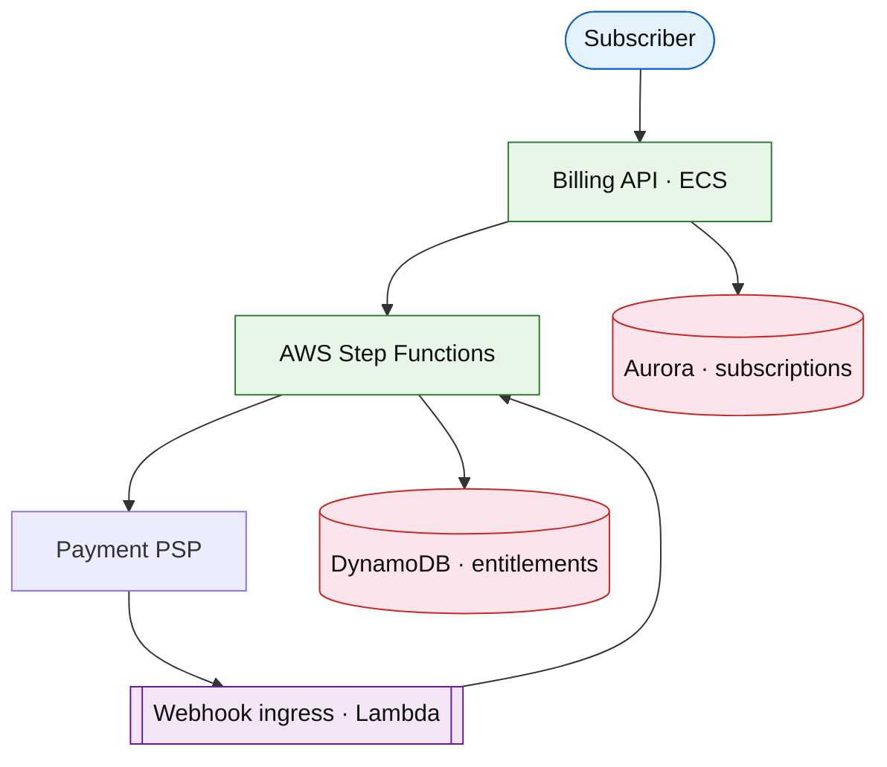

# Subscription billing

## Introduction

Subscription billing manages **plans**, **renewals**, **proration**, **dunning** (failed payment retry), and **entitlement** state for recurring revenue (SaaS, streaming).

**Primary users:** subscribers (upgrade/cancel), finance (MRR reports), support (credits/refunds).

**Interview pacing:** [60-minute runbook](../../prep/interview-runbook-60m.md) — deep dive **renewal state machine + idempotent webhooks**.

Complements [payment workflow](./payment-workflow-platform.md) (one-shot capture) — here **time-based billing cycles** dominate.

## Requirements discovery

### Interview Q&A cheat sheet

| Lock (target) |
| --- |
| 30M paying subs |
| Monthly + annual plans |
| 3-day dunning retries |
| Webhooks idempotent from PSP |
| Proration on mid-cycle upgrade |

## Architecture (user → database)

**Narrative:** **Step Functions** orchestrates renewals, retries, and proration. **PSP webhooks** advance state idempotently. **Entitlements** gate product access in near real time.

## Deep dive: renewal + dunning

- States: `ACTIVE → PAST_DUE → CANCELED`.
- **Idempotency-Key** per invoice period.
- **Ledger** optional link to [core banking ledger](./core-banking-ledger.md).

## Related

- [Payment workflow](./payment-workflow-platform.md)
- [Step Functions drill](../aws/step-functions.md)
- [Video on demand](../media/video-on-demand-platform.md)
