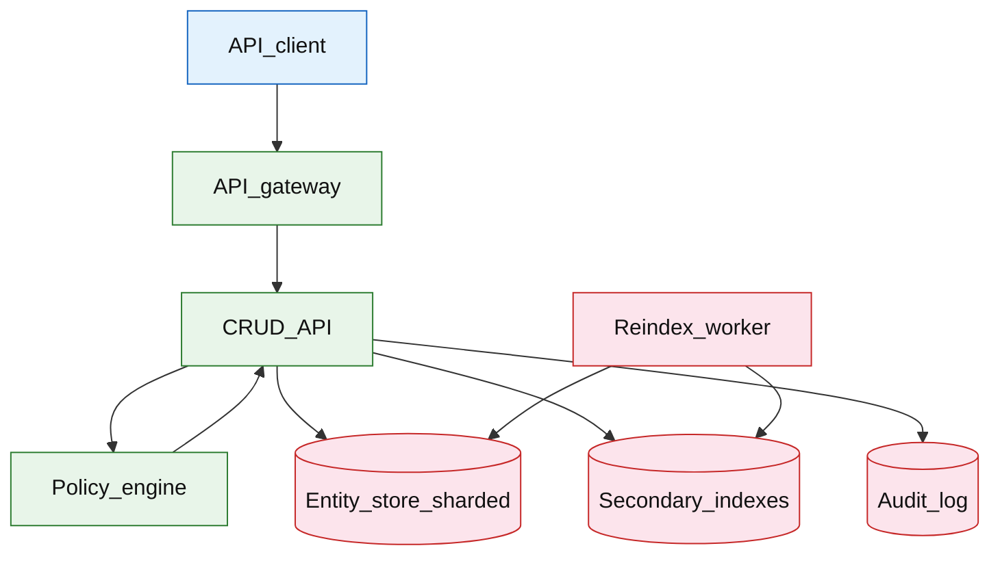

# CRUD data manager

## Introduction

A CRUD data manager is a **multi-tenant SaaS backend** for structured business records: create, read, update, delete, **filtered list queries**, and **audit history**. Customers define entity types (schemas); the platform enforces **tenant isolation**, **RBAC/row-level authz**, and **indexed queries** without giving each tenant a separate database.

**Primary users:** tenant admins (schema, roles), integrators (REST API), auditors (change history), platform operators (noisy-neighbor, reindex jobs).

**Interview pacing:** Use [60-minute runbook](../../topics/interview-runbook-60m.md) — ~10 min requirements theater (below), ~18–32 min diagram + API/DB, ~46–56 min deep dive on **multi-tenant authz + query/index model**.

Audit patterns: [cross-service audit logging](../platform/cross-service-audit-logging.md). API edge: [API gateway rate limiting](../platform/api-gateway-rate-limiting.md).

## Requirements discovery (interview theater)

### Question bank

| Topic | You ask | If they push back | Example answer (reasonable default) |
| --- | --- | --- | --- |
| Tenancy | Workspace vs org tree? | "Single tenant" | **Org → workspace** hierarchy; all data scoped `tenant_id` |
| Schema | Fixed tables or dynamic? | "Fixed CRM schema" | **Dynamic entity types** per tenant (`contact`, `deal`, custom) |
| Authz | RBAC only? | "Admin sees all" | **RBAC** + **row-level** rules (`owner_id`, team) |
| Queries | SQL arbitrary? | "Full SQL" | **Indexed filters** on declared fields; no arbitrary JOINs |
| Consistency | Lost updates? | "LWW" | **Optimistic locking** with `version` |
| Audit | Required? | "Optional" | Append-only **entity_audit** for compliance tenants |
| Out of scope | GraphQL, real-time sync? | "Add GraphQL" | REST CRUD; defer live sync (mention Webhooks) |

### Example dialogue

> **You:** Let's scope v1: one happy path and what's out of scope?
> **Them:** …
> **You:** For scale, prototype vs 12-month target?
> **Them:** …
> **You:** What does each actor do per day on the hot path?
> **Them:** …
> **You:** I'll lock the **target** column assumptions unless you want different numbers — next I'll map fleet totals to monthly AWS meters in **billable volume**.

### Parsed requirements

| Field | Source question | Parsed value (target) | Drives |
| --- | --- | --- | --- |
| `api_user_dau_u` | API user DAU (`U`) | **10M** | Scale tiers, input model, fleet totals |
| `active_tenants` | Active tenants | **50,000** | Scale tiers, input model, fleet totals |
| `entities_per_tenant_median` | Entities per tenant (median) | **10M** | Scale tiers, input model, fleet totals |
| `list/filter_reads_/_dau_/_day` | List/filter reads / DAU / day | **40** | Scale tiers, input model, fleet totals |
| `point_get_/_dau_/_day` | Point GET / DAU / day | **5** | Scale tiers, input model, fleet totals |
| `writes_/_dau_/_day` | Writes / DAU / day | **8** | Scale tiers, input model, fleet totals |
| `indexed_fields_per_entity_avg` | Indexed fields per entity (avg) | **5** | Scale tiers, input model, fleet totals |
| `entity_row_size_s_ent` | Entity row size (`S_ent`) | **8 KB** | Scale tiers, input model, fleet totals |
| `list_query_p99` | List query p99 | **indexed + cursor** | Hot path, deep dive |
| `payload_max` | Payload max | **64 KB** | Scale tiers, input model, fleet totals |

### Locked assumptions

| Assumption | Prototype (MVP) | Growth | Target (anchor) |
| --- | --- | --- | --- |
| API user DAU (`U`) | 10k | 1M | **10M** |
| Active tenants | 50 | 500 | **50,000** |
| Entities per tenant (median) | 100k | 1M | **10M** |
| List/filter reads / DAU / day | 40 | 40 | 40 |
| Point GET / DAU / day | 5 | 5 | 5 |
| Writes / DAU / day | 8 | 8 | 8 |
| Indexed fields per entity (avg) | 5 | 5 | 5 |
| Entity row size (`S_ent`) | 8 KB | 8 KB | 8 KB |
| List query p99 | &lt;150ms | same | indexed + cursor |
| Payload max | 64 KB | 64 KB | 64 KB |

*After ~10 minutes, proceed with the **target** column unless the interviewer changes scope.*

### Interview Q&A cheat sheet

Say aloud in order (~10 min). Write locks into **parsed requirements** before capacity math.

| Step | You ask | Lock if vague (target) |
| --- | --- | --- |
| 1 — Tenancy | Workspace vs org tree? | **Org → workspace** hierarchy; all data scoped `tenant_id` |
| 2 — Schema | Fixed tables or dynamic? | **Dynamic entity types** per tenant (`contact`, `deal`, custom) |
| 3 — Authz | RBAC only? | **RBAC** + **row-level** rules (`owner_id`, team) |
| 4 — Queries | SQL arbitrary? | **Indexed filters** on declared fields; no arbitrary JOINs |
| 5 — Consistency | Lost updates? | **Optimistic locking** with `version` |
| 6 — Audit | Required? | Append-only **entity_audit** for compliance tenants |
| 7 — Out of scope | GraphQL, real-time sync? | REST CRUD; defer live sync (mention Webhooks) |

## Capacity sketch

### User input model

| Action | % of DAU | Per user / day | API | ~Req size | Durable write / user / day |
| --- | --- | --- | --- | --- | --- |
| List / filter entities | 100% | 40 | `GET /v1/entities/{type}` | 20 KB resp | 0 |
| Point GET by id | 80% | 5 | `GET .../{id}` | 8 KB | 0 |
| Create entity | 60% | 3 | `POST ...` | 8 KB req | **~24 KB** (`3 × 8 KB`) |
| Update entity | 50% | 5 | `PATCH ...` | 4 KB | **~40 KB** (`5 × 8 KB`) |
| Delete (soft) | 10% | 0.5 | `DELETE ...` | 0.5 KB | tombstone |

### Fleet totals (target)

`U` = 10M API user DAU; **50k** tenants (anchor tier).

| Metric | Formula | Value |
| --- | --- | --- |
| API requests / day | `U × (40+4+8)` ≈ | **~520M** |
| Entity writes / day | `U × 8` | **~80M** |
| Entity bytes written / day | `80M × 8 KB` | **~640 GB** |
| Index write rows / day | `80M × 5` | **~400M** |
| Audit events / day | `80M` | **~24 GB** |
| Peak read RPS | 90% list | **~80k/s** |
| Peak write RPS | | **~8k/s** |

### Traffic profile (target tier)

| Metric | Value |
| --- | --- |
| **Read:write (API requests)** | **~5.5:1** (list/filter + GET vs entity writes) |
| **Read:write (durable bytes)** | Reads return **8 KB** entities; writes **~640 GB**/day + **~24 GB** audit |
| **Requests / day (fleet)** | **~520M** |
| **Avg RPS** | **~6,000/s** (`520M / 86,400`) |
| **Peak RPS** | **~80k/s** reads; **~8k/s** writes |

| User / actor | Action | R/W | Per user (or actor) / day | % of fleet requests |
| --- | --- | --- | --- | --- |
| API user | List / filter entities | R | 40 | **~77%** |
| API user | Point GET by id | R | 4 | **~8%** |
| API user | Create entity | W | 3 | **~6%** |
| API user | Update entity | W | 5 | **~10%** |
| API user | Soft delete | W | 0.5 | **~1%** |

*Per-user rates stay fixed across prototype → target; only `U` and tenant count scale fleet totals.*

### AWS service map (target deployment)

| AWS service | Role in this design |
| --- | --- |
| Amazon API Gateway | Tenant-scoped REST + rate limits |
| Application Load Balancer | CRUD API behind gateway |
| Amazon ECS on Fargate | CRUD API + policy engine |
| Amazon Aurora PostgreSQL | Sharded `entities` by `tenant_id` |
| Amazon DynamoDB | Secondary indexes for declared filter fields |
| Amazon Kinesis Data Firehose | Append-only `entity_audit` stream |
| Amazon S3 | Audit cold tier + large payload offload |
| Amazon ECS on Fargate / AWS Batch | Reindex worker (index drift repair) |
| Amazon ElastiCache for Redis | List-query cache `(tenant, filter_hash)` |
| AWS IAM / Amazon Cognito | Tenant auth + RBAC claims |
| Amazon CloudWatch | Noisy-neighbor, p99 list latency per tenant |
| Amazon VPC | Multi-tenant isolation at network edge |

### Scale tiers

| Tier | `U` | Tenants | Writes/day | Avg read RPS | Peak read RPS (×10) |
| --- | --- | --- | --- | --- | --- |
| Prototype | 10k | 50 | 80k | **~5** | **~50** |
| Growth | 1M | 500 | 8M | **~500** | **~5k** |
| Target | 10M | 50k | 80M | **~6k** | **~80k** |

### Symbols

| Symbol | Meaning |
| --- | --- |
| `U` | Daily active API users (integrator end-users) |
| `T` | Active tenants |
| `L_r` | List reads per DAU per day (40) |
| `L_w` | Entity writes per DAU per day (8) |
| `S_ent` | Average entity row bytes (8 KB) |
| `N_idx` | Index rows updated per write (5) |

### Derivation (traffic)

**Reads:** `U × (40 + 4)` ≈ **440M list+GET/day** → **~6k/s** avg, **~80k/s** peak (90% list/filter).

**Writes:** `U × 8` → **80M/day** → **~930/s** avg, **~8k/s** peak.

**Index amplification:** `8k × N_idx` → **~40k index writes/s** peak — co-locate with primary txn.

**Storage:** `T × 10M × 8 KB` theoretical upper **~4 EB** — power-law: top 100 tenants ≈ 50% data; shard by `tenant_id`.

### Storage and growth over time

| Table / store | ~Row size | New / day (target) | Retention | Steady-state (target) | Per tenant (median) |
| --- | --- | --- | --- | --- | --- |
| `entities` | 8 KB | 80M rows touched | customer policy | **petabyte fleet** | **~80 GB** (10M ents) |
| `entity_indexes` | 200 B | 400M | with entity | **~20%** of entity | **~16 GB** |
| `audit_events` | 300 B | 80M | 1 year | **~8.8 TB/yr** | — |
| `entity_schemas` | 2 KB | low | permanent | **~100 MB** | — |

**Median tenant:** `10M × 8 KB + indexes ≈ **96 GB**`.

**Long tail:** 49.9k small tenants ≈ **~250 TB** combined.

### Per-user economics (target)

| Metric | Value | Notes |
| --- | --- | --- |
| API requests / DAU / day | **~52** | 40 list + 4 GET + 8 writes |
| Entity write bytes / DAU / day | **~64 KB** | `8 × 8 KB` |
| Steady OLTP / DAU (fleet amortized) | **~40 KB** | power-law skew |
| Audit bytes / DAU / day | **~2.4 KB** | |

### Service footprint (instances)

| Service | Scales with | Prototype | Growth | Target |
| --- | --- | --- | --- | --- |
| CRUD API + gateway | read RPS | 2 | 30 | **~200** |
| Entity store shards | storage + write RPS | 1 | 16 | **~200** |
| Index store | 40k idx writes/s | 1 | 8 | **~80** |
| Audit pipeline | 24 GB/day | 1 | 3 | **~10** |
| Reindex workers | backfill | 0 | 2 | **~20** |

**First cliff:** **~1M API DAU** — single-shard hot tenant; per-tenant rate limits + dedicated shard for whales.

### Billable volume (target month)

Convert **fleet totals** to AWS billing meters before dollar math. *List-price ballparks — not a quote.*

| Design quantity (target) | Formula | Monthly billable unit |
| --- | --- | --- |
| API requests | `requests_day × 30` | **derive from fleet** (**~520M**) |
| OLTP storage steady | storage table | **___ GB-mo** |
| Cache / Redis RAM | footprint | **___ GB** (node tier) |
| Egress / CDN | `egress_day × 30` | **___ GB / mo** |
| Stream / queue events | `events_day × 30` | **___ million events / mo** |
| Log ingest (if full capture) | `log_GB_day × 30` | **___ GB ingest / mo** |
| **Per unit** | `total / scale driver` | **$…/unit/mo** |

*Reconcile rows in **Cloud cost ballpark** (9a) with these meters.*

### Cost at a glance

Interview sound bite — reconcile with **billable volume** and **cloud cost** below.

| Tier | Scale | ~Monthly $ (core) | Per unit |
| --- | --- | --- | --- |
| Prototype (MVP) | see locked assumptions | **~$2k** | platform tax dominates |
| Target (anchor) | `U` or `Q` = **see locked assumptions** | **see cloud cost** | **see cloud cost** |

**First payment block:** smallest prod footprint (load balancer + database + compute) before per-million traffic dominates.

### Cloud cost ballpark (target)

| Line item | Driver | ~Monthly |
| --- | --- | --- |
| API compute | 200 pods | **~$50k** |
| Entity OLTP (sharded) | PB fleet amortized | **~$200k** |
| Index storage | 20% overhead | **~$40k** |
| Audit + object offload | 24 GB/day | **~$15k** |
| **Total** | | **~$305k/mo** |
| **Per API user DAU** | `305k/10M` | **~$0.031/DAU/mo** |

Per-tenant pricing often **$50–500/mo** for median **96 GB** — different from per-DAU metric.

### Timeline (per-user rates fixed; `U` grows)

| Milestone | `U` | Writes/day | Fleet OLTP ingest/day | ~Monthly $ |
| --- | --- | --- | --- | --- |
| Launch | 10k | 80k | **~640 MB** | **~$2k** |
| Month 3 | 80k | 640k | **~5 GB** | **~$8k** |
| Month 6 | 320k | 2.6M | **~20 GB** | **~$25k** |
| Month 12 | 1.3M | 10M | **~80 GB** | **~$80k** |

Month 12 is **growth tier** — tenant sharding before **10M API DAU**.

### Sensitivity

- **10× reads** — read replicas + list-query cache keyed by `(tenant, filter_hash)`.
- **10× writes** — index amplification first; shard whales.
- **Ad-hoc SQL** — breaks tenant isolation — stay on declared indexes.
- **64 KB → 1 MB payloads** — offload blobs to object storage; entity holds URI.

## High-level design

### Architecture (user → database)



**Narrative:** Requests hit **API gateway** with tenant auth. **CRUD API** validates schema, runs **policy engine** (RBAC + row filters), executes point or list operations on **sharded entity store**, maintains **secondary indexes** for filters, appends **audit** on mutating calls. **Reindex worker** repairs index drift offline.

## User-visible surface

- **Integrator:** REST CRUD + cursor lists; `409` on version conflict; webhook on change (optional).
- **Admin:** define entity types and indexable fields; assign roles.
- **Auditor:** `GET .../history` change timeline for entity.

## API contract and input model

### UX → API traceability

| UX / UI action | User intent | API or event | Sync/async | Idempotent? | Validates |
| --- | --- | --- | --- | --- | --- |
| **Integrator:** REST CRUD + cursor lists; `409` on version c | Create | `POST` `/v1/entities/{type}` | sync | yes | domain rules |
| **Admin:** define entity types and indexable fields; assign | Read | `GET` `/v1/entities/{type}/{id}` | sync | read | domain rules |
| **Auditor:** `GET .../history` change timeline for entity. | Update (optimistic) | `PATCH` `/v1/entities/{type}/{id}` | sync | yes | domain rules |
| See user-visible surface | Soft delete | `DELETE` `/v1/entities/{type}/{id}` | sync | yes | domain rules |
| See user-visible surface | List/filter | `GET` `/v1/entities/{type}` | sync | read | domain rules |
| See user-visible surface | Audit trail | `GET` `/v1/entities/{type}/{id}/hist | sync | read | domain rules |
### Endpoints

| Method | Path | Purpose |
| --- | --- | --- |
| `POST` | `/v1/entities/{type}` | Create |
| `GET` | `/v1/entities/{type}/{id}` | Read |
| `PATCH` | `/v1/entities/{type}/{id}` | Update (optimistic) |
| `DELETE` | `/v1/entities/{type}/{id}` | Soft delete |
| `GET` | `/v1/entities/{type}` | List/filter |
| `GET` | `/v1/entities/{type}/{id}/history` | Audit trail |

### Example payloads

`POST /v1/entities/contact`

```http
X-Tenant-Id: tenant_acme
Authorization: Bearer <token>
```

```json
{
 "payload": {
 "name": "Ada Lovelace",
 "email": "ada@example.com",
 "status": "lead",
 "owner_id": "user_9912"
 }
}
```

Response `201 Created`:

```json
{
 "entity_id": "ent_8f2a1c",
 "type": "contact",
 "version": 1,
 "payload": { "...": "..." },
 "created_at": "2026-05-23T18:00:00Z"
}
```

`PATCH /v1/entities/contact/ent_8f2a1c`

```http
If-Match: 1
```

```json
{
 "payload": {
 "status": "customer"
 }
}
```

Response `200 OK` with `version: 2` or `409 Conflict` with current version.

`GET /v1/entities/contact?filter=status:eq:open&filter=owner_id:eq:user_9912&limit=50&cursor=eyJ...`

```json
{
 "items": [
 {
 "entity_id": "ent_8f2a1c",
 "version": 2,
 "payload": { "name": "Ada Lovelace", "status": "open", "owner_id": "user_9912" }
 }
 ],
 "next_cursor": "eyJrZXkiOiJlbnRfNzAwMCJ9"
}
```

Audit entry:

```json
{
 "entity_id": "ent_8f2a1c",
 "version": 2,
 "actor_id": "user_9912",
 "change_set": { "status": { "from": "lead", "to": "customer" } },
 "at": "2026-05-23T18:05:00Z"
}
```

### Input validation

- `type` registered per tenant schema; reject unknown fields or coerce types.
- Filters only on **indexed** fields; operators: `eq`, `in`, `gt`, `lt`, `contains` (defined per type).
- `If-Match` / `version` on PATCH and DELETE.
- Soft delete sets `deleted_at`; excluded from default lists.

## Database model

### Tables (logical — shard by `tenant_id`)

| Table | Key fields | Notes |
| --- | --- | --- |
| `entities` | `tenant_id`, `type`, `entity_id`, `payload`, `version`, `deleted_at`, `updated_at` | Primary |
| `entity_indexes` | `tenant_id`, `type`, `index_name`, `index_value`, `entity_id` | Inverted index rows |
| `entity_schemas` | `tenant_id`, `type`, `field_defs`, `index_defs` | Metadata |
| `entity_audit` | `tenant_id`, `entity_id`, `version`, `actor_id`, `change_set`, `at` | Append-only |
| `roles` / `bindings` | `tenant_id`, `role`, `permissions` | RBAC |

Primary key: `(tenant_id, type, entity_id)`

Index example for filter `owner_id + status`:

`(tenant_id, type, index_name='owner_status', index_value='user_9912|open', entity_id)`

### Read/write paths

1. **Create** — authz → insert `entities` v1 → write index rows for indexed fields → audit.
2. **Get by id** — authz row check → fetch `entities`.
3. **List** — authz injects mandatory filters (e.g. only `owner_id=self`) → query `entity_indexes` → hydrate entities by id (batch).
4. **Update** — `If-Match` → patch payload → recompute changed index entries txn → audit.
5. **Delete** — soft delete; remove from indexes (or tombstone index).
6. **Reindex** — worker scans `entities` slice → rebuild `entity_indexes`.

## Interview deep dive: Multi-tenant authz + query/index model

### Tenant isolation

| Layer | Enforcement |
| --- | --- |
| **Gateway** | `X-Tenant-Id` + token tenant claim must match |
| **Storage** | Every query includes `tenant_id` partition key |
| **Authz** | Policy cannot reference other tenants |

No cross-tenant indexes — shard migrations per large tenant optional.

### Authz model

1. **RBAC:** role `editor` allows `contact:write`.
2. **Row-level:** ABAC rules — `resource.owner_id == subject.id` OR `subject.team in resource.teams`.
3. **List queries:** policy **rewrites** filter — user never sees forbidden rows even if they omit filter param.

**Policy engine** evaluates on each request — cache policy per tenant 60s; cache decision **not** row data.

### Index design (not SQL)

| Need | Pattern |
| --- | --- |
| Point read | Primary key get |
| Equality filter | Inverted index rows |
| Sort | Index key encodes sort field + tie-breaker `entity_id` |
| Pagination | Cursor = last index key |

**Tradeoff:** new index field requires **backfill** job — state in interview.

**Anti-pattern:** scan all `entities` for tenant — fails at 10M rows.

### Optimistic concurrency

- `version` on entity; PATCH with stale `If-Match` → `409`.
- Audit stores per-version diff for compliance.

### vs generic document DB

Could use Mongo/Dynamo with GSIs — same access pattern discipline: every query must hit an index/GSI keyed by tenant.

## Scale and failure

### Correctness model

- No cross-tenant data in responses (hard partition).
- Authorized list returns only rows policy allows.
- Index eventually consistent with primary if async index — **prefer sync index in txn** for interview default.

### Failure cases

| Failure | Symptom | Mitigation |
| --- | --- | --- |
| Index drift | Missing rows in list | Reindex worker; compare counts |
| Hot tenant | SLA impact others | Per-tenant rate limit; dedicated shard |
| Large payload | Slow queries | Blob externalization |
| Policy bug | Data leak | Deny-by-default; audit policy changes |
| Version conflict storm | 409 rate high | UI refresh; merge strategy |
| Reindex lag | Stale filter results | Read-after-write from primary for GET by id; list flag “index rebuilding” |

### Key metrics

- Read/write RPS per tenant; p99 list latency
- Index write amplification factor
- 409 conflict rate; audit append lag
- Reindex backlog; policy eval time
- Storage per tenant; largest tenant QPS

### Interview deep dive talking points

- **tenant_id on every key** — isolation + noisy neighbor caps.
- RBAC + **row-level filter injection** on lists.
- Inverted indexes for filters — no full table scan.
- Optimistic `version` + audit trail.
- Reindex backfill when schema adds indexed field.

## Related

- [Examples hub](./README.md)
- [Cross-service audit logging](../platform/cross-service-audit-logging.md)
- [API gateway rate limiting](../platform/api-gateway-rate-limiting.md)
- [Feature flag platform](../platform/feature-flag-platform.md)
- [CRUD vs event-driven order pipeline](../event-driven/event-driven-order-pipeline.md)
- [60-minute runbook](../../topics/interview-runbook-60m.md)
