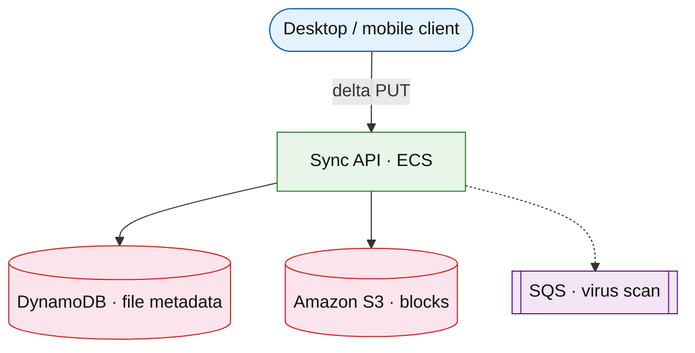

# Personal file sync cloud

## Introduction

File sync keeps **folders** consistent across devices with **delta uploads**, **conflict resolution**, and **version history** (Dropbox/iCloud class).

**Primary users:** consumers (sync clients), operators (storage cost, abuse).

**Interview pacing:** Deep dive **delta sync + conflict policy + metadata index**.

Complements [object storage](./object-storage.md) (S3 rebuild) — this is **product UX** on top of blobs.

## Requirements discovery

| Lock (target) |
| --- |
| 50M users; 100 GB average logical / paid tier |
| Block size 4 MB; dedupe by content hash |
| Conflict: last-writer-wins default + optional branch |

## Architecture (user → database)

**Narrative:** Clients send **only changed blocks** addressed by hash; **metadata** tracks file versions and paths. **S3** stores immutable blocks with lifecycle to IA/Glacier.

## Deep dive: sync protocol

- **Cursor / revision** per device folder.
- **Content-defined chunking** optional for large files.
- **Conflict copy** naming `file (conflict).ext`.

## Related

- [S3 drill](../aws/s3.md)
- [Object storage rebuild](./object-storage.md)
- [Collaborative document](../social/collaborative-document.md)
