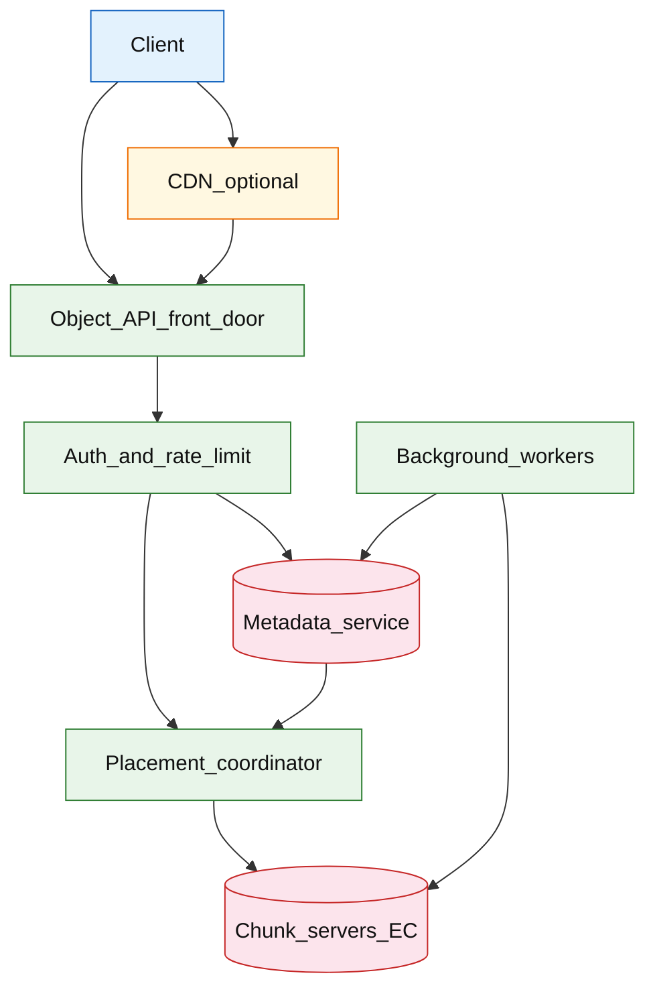

# Object storage (S3-class rebuild)

## Introduction

An object storage system stores **immutable blobs** addressed by **`bucket` + `key`**, with HTTP APIs for put/get/delete/list, **multipart** uploads for large objects, and **lifecycle** tiering for cost. The rebuild interview tests **metadata indexing** separate from **erasure-coded chunks**, plus durability and consistency tradeoffs.

**Primary users:** application services (SDK/HTTP), operators (capacity, rebalance), compliance (versioning, legal hold), CDN origins (pre-signed URLs).

**Interview pacing:** Use [60-minute runbook](../../topics/interview-runbook-60m.md) — ~10 min requirements theater (below), ~18–32 min diagram + API/DB, ~46–56 min deep dive on **metadata/chunk durability model**.

Provider mapping row: [cloud services by provider](../../topics/cloud-services.md). Pattern cousin: [AWS reference layout](../../topics/aws-reference-layout.md) (S3 boxes).

## Requirements discovery (interview theater)

### Question bank

| Topic | You ask | If they push back | Example answer (reasonable default) |
| --- | --- | --- | --- |
| Durability | Target nines? | "Three nines" | **11 nines** over a year via replication + erasure coding |
| Object size | Max object? | "Unlimited" | **5 TB** max; multipart required &gt; 100 MB |
| Consistency | List vs get? | "Always consistent" | **Read-after-write** for GET by key after successful PUT; **list prefix eventually consistent** |
| Versioning | Overwrite behavior? | "Replace silently" | Optional **version_id** per overwrite; delete = tombstone |
| Tenancy | Shared buckets? | "Single tenant" | Many buckets; IAM policy per bucket/prefix |
| Geography | Single DC or multi-AZ? | "One building" | **Multi-AZ** within region; optional cross-region replication (CRR) |
| Out of scope | POSIX filesystem, block storage? | "Add FUSE" | Object API only; no random write seek |

### Example dialogue

> **You:** Let's scope v1: one happy path and what's out of scope?
> **Them:** …
> **You:** For scale, prototype vs 12-month target?
> **Them:** …
> **You:** What does each actor do per day on the hot path?
> **Them:** …
> **You:** I'll lock the **target** column assumptions unless you want different numbers — next I'll map fleet totals to monthly AWS meters in **billable volume**.

### Parsed requirements

| Field | Source question | Parsed value (target) | Drives |
| --- | --- | --- | --- |
| `objects_stored_o` | Objects stored (`O`) | **500B** | Scale tiers, input model, fleet totals |
| `average_object_size_s_avg` | Average object size (`S_avg`) | **1.2 MB** | Scale tiers, input model, fleet totals |
| `peak_put_p_peak` | Peak PUT (`P_peak`) | **50k/s** | Scale tiers, input model, fleet totals |
| `peak_get_g_peak` | Peak GET (`G_peak`) | **500k/s** | Scale tiers, input model, fleet totals |
| `new_objects_/_day` | New objects / day | **60B** | Scale tiers, input model, fleet totals |
| `metadata_/_key_m` | Metadata / key (`M`) | **256 B** | Scale tiers, input model, fleet totals |
| `erasure_coding` | Erasure coding | **8+4** across AZs | Scale tiers, input model, fleet totals |
| `multipart_threshold` | Multipart threshold | **100 MB** | Scale tiers, input model, fleet totals |
| `versioned_overwrites` | Versioned overwrites | **10%** | Scale tiers, input model, fleet totals |

### Locked assumptions

Infra system — scale by **objects stored**, **PUT/GET RPS**, and **average object size** (not DAU). Use **target** in interviews.

| Assumption | Prototype (MVP) | Growth | Target (anchor) |
| --- | --- | --- | --- |
| Objects stored (`O`) | 500M | 50B | **500B** |
| Average object size (`S_avg`) | 256 KB | 800 KB | **1.2 MB** |
| Peak PUT (`P_peak`) | 500/s | 5k/s | **50k/s** |
| Peak GET (`G_peak`) | 5k/s | 50k/s | **500k/s** |
| New objects / day | 6M | 600M | **60B** |
| Metadata / key (`M`) | 256 B | 256 B | **256 B** |
| Erasure coding | 8+4 | 8+4 | **8+4** across AZs |
| Multipart threshold | 100 MB | 100 MB | **100 MB** |
| Versioned overwrites | 5% | 8% | **10%** |

*After ~10 minutes, proceed with the **target** column unless the interviewer narrows to single-region MVP.*

### Interview Q&A cheat sheet

Say aloud in order (~10 min). Write locks into **parsed requirements** before capacity math.

| Step | You ask | Lock if vague (target) |
| --- | --- | --- |
| 1 — Durability | Target nines? | **11 nines** over a year via replication + erasure coding |
| 2 — Object size | Max object? | **5 TB** max; multipart required &gt; 100 MB |
| 3 — Consistency | List vs get? | **Read-after-write** for GET by key after successful PUT; **list prefix eventually consistent** |
| 4 — Versioning | Overwrite behavior? | Optional **version_id** per overwrite; delete = tombstone |
| 5 — Tenancy | Shared buckets? | Many buckets; IAM policy per bucket/prefix |
| 6 — Geography | Single DC or multi-AZ? | **Multi-AZ** within region; optional cross-region replication (CRR) |
| 7 — Out of scope | POSIX filesystem, block storage? | Object API only; no random write seek |

## Capacity sketch

### User input model

| Action | Actor | Per day (target) | API | ~Size | Durable write |
| --- | --- | --- | --- | --- | --- |
| PUT object | service | 60B | `PUT /{bucket}/{key}` | 1.2 MB avg | **1.2 MB** + 256 B meta |
| GET object | service/user | **~43T** (500k/s peak-shaped) | `GET ...` | 1.2 MB | read chunks |
| DELETE / tombstone | service | 6B | `DELETE` | — | meta update |
| LIST prefix | admin | 100M | `LIST` | scan | index read |
| Multipart complete | service | 600M parts | `CompleteMultipart` | 100 MB+ | parts + meta |

### Fleet totals (target)

| Metric | Formula | Value |
| --- | --- | --- |
| Logical bytes stored | `O × S_avg` | **~600 EB** |
| Physical (EC 8+4) | ×1.5 overhead | **~900 EB–1.1 ZB** |
| New bytes / day (steady) | `60B × 1.2 MB` | **~72 PB/day** |
| Metadata rows / day | 60B × 256 B | **~15 TB/day** index |
| Peak PUT bandwidth | `50k × 1.2 MB` | **~60 GB/s** (burst) |

### Traffic profile (target tier)

Locked **target** assumptions: **500B** objects (`O`), **50k/s** PUT peak (`P_peak`), **500k/s** GET peak (`G_peak`).

| Metric | Value |
| --- | --- |
| **Read:write (API requests)** | **700:1** (GET : PUT+DELETE+LIST) |
| **Read:write (durable bytes)** | **500:1** (GET bytes : new PUT bytes **~72 PB/day**) |
| **Requests / day (fleet)** | **~43T** GET-shaped + **60B** PUT + **6B** DELETE + **100M** LIST |
| **Avg RPS** | **~500k/s** GET-class; **~700k/s** PUT-class (combined meta+data) |
| **Peak RPS** | **500k/s** GET; **50k/s** PUT (**~60 GB/s** burst bandwidth) |

| User / actor | Action | R/W | Per actor / day | % of fleet requests |
| --- | --- | --- | --- | --- |
| Service tenant | PUT object | W | — (**60B**/day fleet) | **&lt;0.01%** count; **100%** ingest bytes |
| Service / user | GET object | R | — (**~43T**/day shaped) | **~99%** |
| Service | DELETE / tombstone | W | — (**6B**/day) | **~0.01%** |
| Admin | LIST prefix | R | — (**100M**/day) | **&lt;0.01%** |
| System | Multipart complete | W | — (**600M** parts/day) | control plane |

*Request mix scales with stored objects `O`; per-object size (**1.2 MB** avg) anchors bandwidth.*

### AWS service map (target deployment)

| Diagram component | AWS service | Role in this design | Monthly meter (target) |
| --- | --- | --- | |
| Client | — (SDK / service) | SigV4-style auth; not AWS |
| Object_API_front_door | **Amazon API Gateway** + **Application Load Balancer** | S3-shaped HTTP; **550k** meta ops/s at target |
| Auth_and_rate_limit | **AWS IAM** + **Amazon API Gateway** usage plans | Tenant isolation; per-bucket rate limits |
| Metadata_service | **Amazon DynamoDB** (or sharded **Aurora**) | **500B** keys; **256 B**/object index |
| Placement_coordinator | **Amazon ECS on Fargate** | AZ-diverse chunk placement; rebalance jobs |
| Chunk_servers_EC | **Amazon EC2** + **Amazon EBS** | Erasure-coded blobs; hyperscale fleet |
| Background_workers | **Amazon ECS** + **Amazon SQS** | Multipart complete, lifecycle, repair, GC |
| CDN_optional | **Amazon CloudFront** | Pre-signed GET acceleration for hot objects |
| Observability | **Amazon CloudWatch**, **AWS X-Ray** | PUT/GET p99, incomplete multipart, AZ balance |

*Interview mapping: boxes mirror **Amazon S3** control + data plane semantics at rebuild scale.*

### Scale tiers

| Tier | `O` | `P_peak` | `G_peak` | New objects/day | Metadata steady |
| --- | --- | --- | --- | --- | --- |
| Prototype | 500M | 500/s | 5k/s | 6M | **~128 GB** |
| Growth | 50B | 5k/s | 50k/s | 600M | **~13 TB** |
| Target | 500B | 50k/s | 500k/s | 60B | **~128 TB** keys |

### Symbols

| Symbol | Meaning |
| --- | --- |
| `O` | Total objects |
| `S_avg` | Mean object bytes |
| `P_peak`, `G_peak` | Peak PUT/GET per second |
| `M` | Metadata bytes per key |
| `EC` | Erasure coding overhead factor (~1.5) |

### Derivation (traffic)

**PUT:** `P_peak = 50,000/s` → metadata + chunk pipeline; sequential log keys can hotspot.

**GET:** `G_peak = 500,000/s` → metadata lookup then chunk read; **CDN** for public hot objects.

**Metadata QPS:** dominated by GET/PUT — plan **~550k metadata ops/s** peak aggregate.

**List:** lower QPS but scan-heavy — isolate to secondary index tier.

**Chunk placement:** stripe across AZs; rebalance on node loss.

### Storage and growth over time

| Tier / store | ~Unit | New / day (target) | Retention | Steady-state (target) | Per object |
| --- | --- | --- | --- | --- | --- |
| Object bytes (chunks) | 1.2 MB | 72 PB | until delete | **600 EB** logical | 1.2 MB |
| Metadata index | 256 B | 60B keys | permanent | **128 TB** | 256 B |
| Version chains | +32 B | 10% writes | policy | **+13 TB** | — |
| Chunk map | 64 B/chunk | with object | with object | **~10%** of meta | — |

**Cumulative logical growth (20% annual):**

| Horizon | Objects (approx) | Logical size |
| --- | --- | --- |
| 1 year | +60B/day trend | **+26 EB/yr** ingest |
| 5 years | ~3× `O` | **~1.8 ZB** (tiering/GC) |

### Per-unit economics (target tier)

| Metric | Formula | Target value |
| --- | --- | --- |
| Logical bytes / object | `S_avg` | **1.2 MB** |
| Metadata / object | `M` | **256 B** |
| Physical bytes / object | `S_avg × EC` | **~1.8 MB** |
| PUT cost driver | metadata + 1.5× bytes | dominated by bytes |
| GET cost driver | metadata + egress | CDN for hot |

### Service footprint (instance count ballpark)

| Service | Scales with | Prototype | Growth | Target |
| --- | --- | --- | --- | --- |
| API front door | `G_peak` | 10 | 200 | **~2,000** |
| Metadata shards | keys + ops | 4 | 64 | **~512** |
| Chunk servers | EB stored | 20 | 2k | **~20k** nodes |
| Placement coordinator | rebalance | 2 | 6 | **~20** |
| Background GC | delete queue | 2 | 20 | **~100** |

**First scale cliff:** **Growth (50B objects)** — metadata shard count; small-object **10×** shifts bottleneck to index OPS.

### Billable volume (target month)

Convert **fleet totals** to AWS billing meters before dollar math. *List-price ballparks — not a quote.*

| Design quantity (target) | Formula | Monthly billable unit |
| --- | --- | --- |
| API requests | `requests_day × 30` | **derive from fleet** (**~43T** GET-shaped + **60B** PUT + **6B** DELETE + **100M** LIST) |
| OLTP storage steady | storage table | **___ GB-mo** |
| Cache / Redis RAM | footprint | **___ GB** (node tier) |
| Egress / CDN | `egress_day × 30` | **___ GB / mo** |
| Stream / queue events | `events_day × 30` | **___ million events / mo** |
| Log ingest (if full capture) | `log_GB_day × 30` | **___ GB ingest / mo** |
| **Per unit** | `total / scale driver` | **$…/unit/mo** |

*Reconcile rows in **Cloud cost ballpark** (9a) with these meters.*

### Cost at a glance

Interview sound bite — reconcile with **billable volume** and **cloud cost** below.

| Tier | Scale | ~Monthly $ (core) | Per unit |
| --- | --- | --- | --- |
| Prototype (MVP) | see locked assumptions | **~$5k** | platform tax dominates |
| Target (anchor) | `U` or `Q` = **see locked assumptions** | **see cloud cost** | **see cloud cost** |

**First payment block:** smallest prod footprint (load balancer + database + compute) before per-million traffic dominates.

### Cloud cost ballpark (target tier)

| Line item | Driver | ~Monthly |
| --- | --- | --- |
| Chunk storage (physical) | ~1 ZB @ $0.02/GB-mo list | **$20M+** (hyperscale discount) |
| Metadata store | 128 TB | **~$25k** |
| PUT/GET compute | 550k meta ops/s | **~$500k** |
| Cross-AZ replication | EC + RF | **~30%** of storage |
| **Interview slice (1 region, excl. full ZB)** | 600 EB logical | **~$8–15M/mo** order-of-magnitude |
| **Per TB logical/mo** | amortized | **~$0.01–0.02/TB** at scale |
| **Per million objects/mo** | meta+ops | **~$0.03/M objects** |

Use **$/GB-mo** and **metadata OPS** in interviews—not consumer DAU.

### Timeline (prototype → early growth)

| Milestone | `O` | PUT peak | Logical stored | ~Monthly $ |
| --- | --- | --- | --- | --- |
| Launch | 500M | 500/s | **120 GB** | **~$5k** |
| Month 3 | 2B | 1k/s | **0.5 PB** | **~$20k** |
| Month 6 | 10B | 2.5k/s | **12 PB** | **~$150k** |
| Month 12 | 50B | 5k/s | **60 PB** | **~$800k** |

Month 12 is **growth tier** — metadata federation before **500B** object scale.

### Sensitivity

| Change | Effect | Response |
| --- | --- | --- |
| **10× small objects** | Metadata OPS dominate | Merge keys; compound indexes |
| **Huge objects** | Multipart GC risk | Part objects + lifecycle abort |
| **10× GET** | Chunk egress | CDN; read-through cache |
| **Strong list consistency** | Index sync cost | Product choice: eventual list |

## High-level design

### Architecture (user → database)



**Narrative:** **Object API** authenticates (IAM/sigv4-style), resolves **metadata** for `bucket/key[/version]`, then reads/writes **erasure-coded chunks** on the storage fleet. **Placement coordinator** picks nodes satisfying AZ diversity. **Background workers** complete multipart uploads, lifecycle transitions, replication repair, and GC. Public reads may use **pre-signed URLs** via CDN.

## User-visible surface

- **Developer:** PUT/GET/DELETE/LIST via HTTP; SDK multipart upload; pre-signed URL for browser upload/download.
- **Operator:** capacity per AZ, rebalance progress, durability audit, incomplete multipart report.
- **Compliance:** versioning, object lock (WORM), legal hold flags on metadata.

## API contract and input model

### UX → API traceability

| UX / UI action | User intent | API or event | Sync/async | Idempotent? | Validates |
| --- | --- | --- | --- | --- | --- |
| Upload object | store blob | `PUT /{bucket}/{key}` | sync | yes (overwrite semantics) | authz, size, checksum |
| Download object | read blob | `GET /{bucket}/{key}` | sync | read | version id if enabled |
| List prefix | browse keys | `GET /{bucket}?prefix=` | sync | read | pagination cursor |
| Large upload | multipart | `POST ?uploads` + parts + complete | sync | yes per part | part sizes, ETag merge |
| Delete object | remove or tombstone | `DELETE /{bucket}/{key}` | sync | yes | versioning rules |
| Browser direct upload | offload bytes | pre-signed `PUT` URL | sync | yes | TTL + content-type |

### Core HTTP operations (S3-shaped)

| Operation | Method | Purpose |
| --- | --- | --- |
| PutObject | `PUT /{bucket}/{key}` | Single upload |
| GetObject | `GET /{bucket}/{key}` | Download |
| DeleteObject | `DELETE /{bucket}/{key}` | Tombstone / delete marker |
| ListObjectsV2 | `GET /{bucket}?prefix=` | Prefix listing |
| CreateMultipartUpload | `POST /{bucket}/{key}?uploads` | Start large upload |
| UploadPart | `PUT ...?partNumber=` | Upload part |
| CompleteMultipartUpload | `POST ...?uploadId=` | Finalize |

### Example: PutObject

```http
PUT /photos/bucket-prod/album/2026/cat.jpg HTTP/1.1
Content-Length: 2457600
Content-Type: image/jpeg
x-amz-meta-uploader: user_9912
```

Response `200 OK`:

```xml
<ETag>"d41d8cd98f00b204e9800998ecf8427e-1"</ETag>
<VersionId>v_3k2m9p</VersionId>
```

### Example: GetObject (JSON gateway variant)

```json
{
 "bucket": "bucket-prod",
 "key": "album/2026/cat.jpg",
 "version_id": "v_3k2m9p",
 "content_type": "image/jpeg",
 "content_length": 2457600,
 "checksum_sha256": "e3b0c44298fc1c149afb..."
}
```

Binary body streamed from chunk servers after metadata hit.

### Pre-signed URL (control plane response)

```json
{
 "method": "PUT",
 "url": "https://objects.example/bucket-prod/album/2026/cat.jpg?X-Amz-Signature=...",
 "expires_at": "2026-05-23T13:00:00Z"
}
```

### Multipart (large object)

`CreateMultipartUpload` → `upload_id` → N × `UploadPart` → `CompleteMultipartUpload` commits metadata pointing at ordered parts; incomplete uploads GC after 7 days.

### Input validation

- Bucket name DNS-compliant; key UTF-8 max 1024 bytes.
- Deny path traversal; enforce IAM policy on prefix.
- Part size 5 MB–5 GB; max 10,000 parts.

## Database model

### Metadata service

| Entity | Key fields | Notes |
| --- | --- | --- |
| `buckets` | `bucket_id`, `owner`, `region`, `policy`, `versioning_enabled` | Namespace |
| `objects` | `bucket`, `key`, `version_id`, `size`, `etag`, `storage_class`, `chunk_manifest_id`, `created_at` | Latest + history |
| `multipart_uploads` | `upload_id`, `bucket`, `key`, `parts`, `expires_at` | In-progress |
| `chunk_manifests` | `manifest_id`, `ec_scheme`, `shard_locations`, `checksum` | Points to chunks |

Indexes:

- Primary: `(bucket, key, version_id)`
- List: secondary index `(bucket, prefix_token, key)` — eventually consistent

### Chunk layer

| Entity | Notes |
| --- | --- |
| `chunks` | Erasure-coded stripes on `storage_node_id` |
| `node_capacity` | Free bytes per disk for placement |

### Read/write paths

1. **PUT small object** — allocate `manifest` → write EC stripes → commit metadata (atomic: manifest exists before key visible).
2. **GET** — metadata lookup → fetch chunks → verify checksum → stream.
3. **DELETE** — insert delete marker version or purge per policy.
4. **LIST** — query secondary index prefix — may lag new PUTs slightly.
5. **Lifecycle worker** — transition `storage_class` Cold; copy chunks or retier.
6. **Rebalancer** — move chunks when node crosses threshold.

## Interview deep dive: Metadata/chunk durability model

### Separation of concerns

| Layer | Responsibility | Failure isolation |
| --- | --- | --- |
| **Metadata** | Keys, ACLs, versions, manifests | Small, strongly consistent store (shardable SQL/KV) |
| **Chunks** | Bytes on disk | Large, optimized for throughput |

Interview anti-pattern: storing entire object inline in metadata DB.

### Erasure coding vs replication

| Approach | Storage overhead | Rebuild cost | Interview use |
| --- | --- | --- | --- |
| **3x replication** | 3× | Low CPU | Simple MVP |
| **8+4 EC** | ~1.5× | Higher CPU on rebuild | Exabyte scale |

**Durability:** survive AZ loss + correlated disk failures; **checksum** on read detects bitrot.

### Consistency statements (state explicitly)

- **PUT success → GET same key** returns object (read-after-write for key).
- **LIST** may omit very recent keys for seconds (secondary index lag).
- **Overwrite + immediate GET** — state assumption: new `version_id` visible on GET; list may lag.

### Multipart and GC

- Parts are **chunk objects** referenced only from `multipart_uploads` until complete.
- **GC** deletes orphan parts after TTL — prevents leak from abandoned uploads.

### Pre-signed URLs

- HMAC policy embeds method, bucket, key, expiry — **CDN/origin** offloads bytes without sharing root credentials.

## Scale and failure

### Correctness model

- No lost acknowledged PUT after metadata commit (durability via EC + repair).
- `etag` / checksum detects corruption on read.
- Versioning: DELETE without purge leaves delete marker; GET without version may 404.

### Failure cases

| Failure | Symptom | Mitigation |
| --- | --- | --- |
| Storage node loss | Rebuild stripes | EC reconstruction; rebalance |
| Metadata shard down | 503 on key ops | Replicas; failover |
| Hot key | Node hotspot | Hash prefix in key; spread chunks |
| Incomplete multipart | Storage leak | Lifecycle GC job |
| List inconsistency | Missing new key in UI | Document eventual list; retry |
| Cross-AZ partition | Write quorum fail | Quorum write policy; deny PUT |
| Bitrot | Checksum mismatch | Rebuild from other shards; alert |

### Key metrics

- Durability audit (logical vs physical bytes)
- PUT/GET p99; metadata vs chunk latency split
- EC rebuild bandwidth; nodes in repair
- Incomplete multipart count
- List lag (index delay histogram)
- Per-bucket request rate throttles

### Interview deep dive talking points

- Draw **metadata → manifest → chunks** before API details.
- **11 nines** via EC + AZ spread + background repair — not single disk.
- Read-after-write for key vs eventual **LIST** — say both.
- Multipart + GC for large objects.
- Compare to block storage / POSIX — wrong tool for random write files.

## Related

- [Examples hub](./README.md)
- [AWS reference layout](../../topics/aws-reference-layout.md)
- [Video on demand platform](../media/video-on-demand-platform.md)
- [Cloud services ](../../topics/cloud-services.md)
- [Data stores ](../../topics/data-stores.md)
- [60-minute runbook](../../topics/interview-runbook-60m.md)
