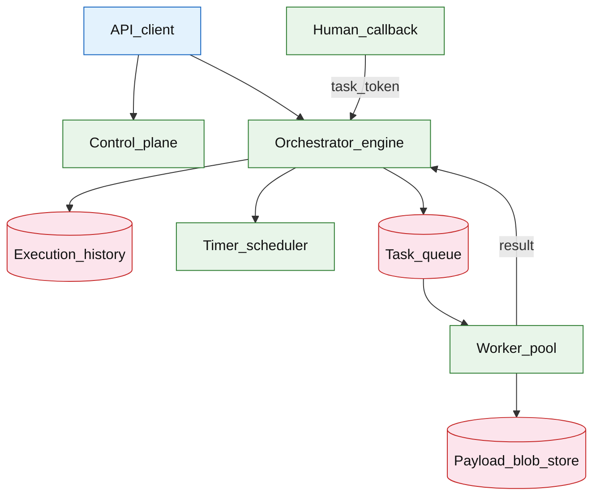

# Workflow orchestration (Step Functions–class rebuild)

## Introduction

A workflow orchestration engine runs **durable state machines**: each execution advances through **states** (tasks, choices, waits, parallels) with persisted **history**, **retries**, **timeouts**, and optional **compensation**. Workers execute individual tasks; the **orchestrator** is the source of truth for “what step comes next.”

**Primary users:** product engineers (workflow definitions), task workers (activity implementations), operators (stuck executions, replay), compliance (audit history).

**Interview pacing:** Use [60-minute runbook](../../prep/interview-runbook-60m.md) — ~10 min requirements theater (below), ~18–32 min diagram + API/DB, ~46–56 min deep dive on **durable state transitions + retries**.

Compare managed: [AWS reference layout](../../patterns/aws-reference-layout.md) (Step Functions box). Task leasing parallels [distributed job scheduler](../platform/distributed-job-scheduler.md). Business sagas: [payment workflow platform](../fintech/payment-workflow-platform.md).

## Requirements discovery (interview theater)

### Question bank

| Topic | You ask | If they push back | Example answer (reasonable default) |
| --- | --- | --- | --- |
| Duration | Max workflow length? | "Days" | **Standard:** up to **1 year**; **Express:** minutes, high volume |
| Throughput | Executions per second? | "Low" | **Standard:** 2k starts/s peak; **Express:** 100k/s short flows |
| Task types | Lambda only? | "HTTP only" | Sync task, async callback (task token), human approval |
| Semantics | Exactly-once steps? | "Required globally" | **Exactly-once state transition** in engine; tasks **at-least-once** with idempotency keys |
| Payload size | Large JSON? | "Megabytes inline" | Store payloads in **object storage**; history holds pointers |
| Human steps | Needed? | "No" | **Wait for callback** with external token (approve button) |
| Out of scope | General DAG data pipeline? | "Use Airflow" | Operational workflows with retries; batch ETL is different |

### Example dialogue

> **You:** Let's scope v1: one happy path and what's out of scope?
> **Them:** …
> **You:** For scale, prototype vs 12-month target?
> **Them:** …
> **You:** What does each actor do per day on the hot path?
> **Them:** …
> **You:** I'll lock the **target** column assumptions unless you want different numbers — next I'll map fleet totals to monthly AWS meters in **billable volume**.

### Parsed requirements

| Field | Source question | Parsed value (target) | Drives |
| --- | --- | --- | --- |
| `standard_executions_/_day` | Standard executions / day | **50M** | Scale tiers, input model, fleet totals |
| `standard_starts_peak_e_peak` | Standard starts peak (`E_peak`) | **5k/s** | Scale tiers, input model, fleet totals |
| `express_executions_peak` | Express executions peak | **100k/s** | Scale tiers, input model, fleet totals |
| `avg_states_/_execution` | Avg states / execution | **8** | Scale tiers, input model, fleet totals |
| `task_states_%_of_states` | Task states (% of states) | **60%** | Scale tiers, input model, fleet totals |
| `inline_history_event_s_evt` | Inline history event (`S_evt`) | **400 B** | Scale tiers, input model, fleet totals |
| `large_payload_offload` | Large payload offload | **S3 pointer** | Scale tiers, input model, fleet totals |
| `history_retention_standard` | History retention (Standard) | **90d** online | Storage steady-state |

### Locked assumptions

Infra system — scale by **execution starts/s** and **history append rate**, not end-user DAU. Use **target**; pick Standard vs Express lane per scenario.

| Assumption | Prototype (MVP) | Growth | Target (anchor) |
| --- | --- | --- | --- |
| Standard executions / day | 500k | 5M | **50M** |
| Standard starts peak (`E_peak`) | 50/s | 500/s | **5k/s** |
| Express executions peak | 1k/s | 10k/s | **100k/s** |
| Avg states / execution | 8 | 8 | **8** |
| Task states (% of states) | 60% | 60% | **60%** |
| Inline history event (`S_evt`) | 400 B | 400 B | **400 B** |
| Large payload offload | &gt;256 KB | same | **S3 pointer** |
| History retention (Standard) | 30d | 60d | **90d** online |

*After ~10 minutes, proceed with the **target** column unless the interviewer changes scope.*

### Interview Q&A cheat sheet

Say aloud in order (~10 min). Write locks into **parsed requirements** before capacity math.

| Step | You ask | Lock if vague (target) |
| --- | --- | --- |
| 1 — Duration | Max workflow length? | **Standard:** up to **1 year**; **Express:** minutes, high volume |
| 2 — Throughput | Executions per second? | **Standard:** 2k starts/s peak; **Express:** 100k/s short flows |
| 3 — Task types | Lambda only? | Sync task, async callback (task token), human approval |
| 4 — Semantics | Exactly-once steps? | **Exactly-once state transition** in engine; tasks **at-least-once** with idempotency keys |
| 5 — Payload size | Large JSON? | Store payloads in **object storage**; history holds pointers |
| 6 — Human steps | Needed? | **Wait for callback** with external token (approve button) |
| 7 — Out of scope | General DAG data pipeline? | Operational workflows with retries; batch ETL is different |

## Capacity sketch

### User input model

| Action | Actor | Per day (target) | API | ~Size | Durable write |
| --- | --- | --- | --- | --- | --- |
| Start Standard execution | client | 50M | `StartExecution` | 2 KB | **2 KB** row |
| State transition | engine | 400M | internal | 400 B | history event |
| Task dispatch | engine | 240M | queue msg | pointer | lease row |
| Task result | worker | 240M | callback | 50 KB (5% blob) | history |
| Express start | client | billions | `StartExpress` | 64 B | minimal hist |
| Timer / wait | engine | 50M | scheduler | 128 B | timer row |

### Fleet totals (target, Standard lane)

| Metric | Formula | Value |
| --- | --- | --- |
| Transitions / day | `50M × 8` | **400M** |
| History events / day | ≈ transitions | **400M** |
| Task dispatches / day | `400M × 0.6` | **240M** |
| History bytes / day | `400M × 400 B` | **~160 GB** |
| Peak transition rate | `5k × 8` | **~40k/s** |

### Traffic profile (target tier)

Locked **target** assumptions: **50M** Standard executions/day, **5k/s** start peak (`E_peak`), **100k/s** Express peak.

| Metric | Value |
| --- | --- |
| **Read:write (API requests)** | **1:5** (Describe/List : Start + task callbacks) |
| **Read:write (durable bytes)** | **1:3** (history append **~160 GB/day** : S3 payload **~125 TB/quarter**) |
| **Requests / day (fleet)** | **~530M** Standard lane (50M starts + 240M dispatches + 240M callbacks) |
| **Avg RPS** | **~6.1k/s** Standard transitions |
| **Peak RPS** | **5k/s** starts; **40k/s** transitions; **24k/s** task dispatches; **100k/s** Express |

| User / actor | Action | R/W | Per actor / day | % of fleet requests |
| --- | --- | --- | --- | --- |
| Client | Start Standard execution | W | — (**50M**/day) | **~9%** |
| Engine | State transition | W | 8 / execution | **~75%** (internal) |
| Worker | Task result callback | W | ~4.8 / execution | **~45%** |
| Client | Start Express | W | billions/day | separate lane |
| Operator | Describe / list / signal | R | low | **&lt;1%** |

*States-per-execution (**8**) fixed; fleet scales with execution starts and task fan-out.*

### AWS service map (target deployment)

| Diagram component | AWS service | Role in this design | Monthly meter (target) |
| --- | --- | --- | |
| Client | — (service SDK) | `StartExecution`, task token callbacks |
| Orchestrator (Standard) | **AWS Step Functions** (Standard) | Durable workflows; **5k/s** start peak |
| Orchestrator (Express) | **AWS Step Functions** (Express) | High-volume short flows; **100k/s** peak |
| History_store | **Amazon DynamoDB** (or **Aurora**) | Append-only history; **400M** events/day |
| Task_queue | **Amazon SQS** | Activity task dispatch; visibility timeout + heartbeats |
| Task_workers | **AWS Lambda** + **Amazon ECS on Fargate** | **240M** dispatches/day; idempotent handlers |
| Timer_service | **Amazon EventBridge** + **DynamoDB** | Long `wait` states; timer rows |
| Payload_offload | **Amazon S3** | Blobs &gt;256 KB; pointer in history events |
| Control_API | **Amazon API Gateway** + **Lambda** | Deploy definitions; replay; DLQ inspect |
| DLQ / poison | **Amazon SQS** (DLQ) | Failed tasks for operator replay |
| Observability | **Amazon CloudWatch**, **AWS X-Ray** | Execution failures, history shard heat, task backlog |

*This doc is the Step Functions–class rebuild; table names **AWS Step Functions** explicitly.*

### Scale tiers

| Tier | Standard / day | `E_peak` | `T_peak` (tasks) | History/day | Notes |
| --- | --- | --- | --- | --- | --- |
| Prototype | 500k | 50/s | 240/s | 4M events | single orchestrator |
| Growth | 5M | 500/s | 2.4k/s | 40M | sharded history |
| Target | 50M | 5k/s | 24k/s | 400M | + Express lane |

### Symbols

| Symbol | Meaning |
| --- | --- |
| `E_peak` | Peak Standard execution starts/s |
| `T_peak` | Peak task dispatches/s |
| `N_states` | Average states per execution (8) |
| `p_task` | Fraction of states that invoke tasks (0.6) |
| `S_evt` | Bytes per history event |

### Derivation (traffic)

**Transitions:** `E_peak × N_states = 5k × 8 = **40k transitions/s**` (engine + history append).

**Tasks:** `40k × p_task = **24k task dispatches/s**` to worker queue.

**Concurrent tasks:** 24k/s × 100ms avg ≈ **2,400** in flight — **10k** worker pool with headroom.

**History append:** `40k × 400 B = **16 MB/s**` (~**1.4 TB/day** at sustained peak; **~160 GB/day** at avg).

**Express lane:** **100k/s** × ms-level — separate pool; **minimal** durable history.

### Storage and growth over time

| Table / store | ~Row size | New / day (target) | Retention | Steady-state (target) | Per execution |
| --- | --- | --- | --- | --- | --- |
| `workflow_definitions` | 4 KB | 10 | permanent | **~20 MB** | — |
| `executions` | 2 KB | 50M | 90d | **~4.5B/quarter** | 1 row |
| `execution_history` | 400 B | 400M | 90d | **~14 TB/quarter** | ~8 events |
| Payload blobs (S3) | 50 KB | 5% exec | 90d | **~125 TB/quarter** | offload |

**Cumulative Standard (archive after 90d):**

| Horizon | Executions | History (rolling) |
| --- | --- | --- |
| 1 year | 18.25B | **~36 TB** cold archive |
| 5 years | 91B | **~180 TB** cold |

### Per-unit economics (target tier)

| Metric | Formula | Target value |
| --- | --- | --- |
| History bytes / Standard execution | `8 × 400 B` | **~3.2 KB** |
| Execution row / start | 2 KB | **2 KB** |
| Blob payload / execution (5%) | 50 KB × 0.05 | **~2.5 KB** amortized |
| Task dispatch / execution | 0.6 × 8 | **~4.8 tasks** |

### Service footprint (instance count ballpark)

| Service | Scales with | Prototype | Growth | Target |
| --- | --- | --- | --- | --- |
| Orchestrator (Standard) | transitions/s | 2 | 20 | **~80** |
| History store shards | append MB/s | 2 | 16 | **~64** |
| Task queue + workers | `T_peak` | 10 | 100 | **10k** workers |
| Timer service | long waits | 2 | 4 | **~10** |
| Express orchestrator | 100k/s | — | 10 | **~40** |

**First scale cliff:** **Growth (500/s starts)** — history shard hot spots; offload payloads before **5k/s**.

### Billable volume (target month)

Convert **fleet totals** to AWS billing meters before dollar math. *List-price ballparks — not a quote.*

| Design quantity (target) | Formula | Monthly billable unit |
| --- | --- | --- |
| API requests | `requests_day × 30` | **derive from fleet** (**~530M** Standard lane (50M starts + 240M dispatches + 240M callbacks)) |
| OLTP storage steady | storage table | **___ GB-mo** |
| Cache / Redis RAM | footprint | **___ GB** (node tier) |
| Egress / CDN | `egress_day × 30` | **___ GB / mo** |
| Stream / queue events | `events_day × 30` | **___ million events / mo** |
| Log ingest (if full capture) | `log_GB_day × 30` | **___ GB ingest / mo** |
| **Per unit** | `total / scale driver` | **$…/unit/mo** |

*Reconcile rows in **Cloud cost ballpark** (9a) with these meters.*

### Cost at a glance

Interview sound bite — reconcile with **billable volume** and **cloud cost** below.

| Tier | Scale | ~Monthly $ (core) | Per unit |
| --- | --- | --- | --- |
| Prototype (MVP) | see locked assumptions | **~$8k** | platform tax dominates |
| Target (anchor) | `U` or `Q` = **see locked assumptions** | **see cloud cost** | **see cloud cost** |

**First payment block:** smallest prod footprint (load balancer + database + compute) before per-million traffic dominates.

### Cloud cost ballpark (target tier)

| Line item | Driver | ~Monthly |
| --- | --- | --- |
| Orchestrator compute | 80 + 40 pods | **~$45k** |
| History OLTP / KV | 14 TB/quarter hot | **~$30k** |
| Task workers | 10k × 0.5 vCPU | **~$80k** |
| Payload S3 | 125 TB/quarter | **~$3k** |
| **Total (Standard + workers)** | | **~$160k/mo** |
| **Per million executions** | `160k / 50` | **~$3.2k/M exec/mo** |
| **Per execution** | `160k / (50M×30)` | **~$0.00011** |

### Timeline (prototype → early growth)

| Milestone | Standard/day | `E_peak` | History hot | ~Monthly $ |
| --- | --- | --- | --- | --- |
| Launch | 500k | 50/s | **0.5 TB** | **~$8k** |
| Month 3 | 1M | 100/s | **1 TB** | **~$15k** |
| Month 6 | 2.5M | 250/s | **2.5 TB** | **~$35k** |
| Month 12 | 5M | 500/s | **5 TB** | **~$70k** |

Month 12 is **growth tier** — history sharding before **50M executions/day**.

### Sensitivity

| Change | Effect | Response |
| --- | --- | --- |
| **Large payloads** | History bloat | S3 URIs only in events |
| **Human wait days** | Timer cardinality | Timer service + minimal hot state |
| **Map fan-out state** | Task multiplier | Cap parallelism; child executions |
| **10× Express** | Separate pool saturation | Autoscale Express; don’t mix with Standard |

## High-level design

### Architecture (user → database)



**Narrative:** Clients **start execution** via API; **orchestrator** loads workflow definition, appends **history events**, and schedules **tasks** on **task queue**. **Workers** lease tasks, read/write large payloads in **blob store**, return success/failure. **Timer scheduler** fires wait states. **Human callback** resumes execution with **task token**. Control plane registers definitions and RBAC.

## User-visible surface

- **Engineer:** define state machine JSON/ASL; start execution with input JSON; query status.
- **Worker:** poll `GetActivityTask` / receive push; report success/failure with output.
- **Human:** click approval link → callback completes wait state.
- **Operator:** list failed executions; redrive/replay from step; cancel running execution.

## API contract and input model

### UX → API traceability

| UX / UI action | User intent | API or event | Sync/async | Idempotent? | Validates |
| --- | --- | --- | --- | --- | --- |
| **Engineer:** define state machine JSON/ASL; start execution | Register definition | `PUT` `/v1/workflows/{name}` | sync | yes | domain rules |
| **Worker:** poll `GetActivityTask` / receive push; report su | Start execution | `POST` `/v1/executions` | sync | yes | domain rules |
| **Human:** click approval link → callback completes wait sta | Status + current state | `GET` `/v1/executions/{execution_id} | sync | read | domain rules |
| **Operator:** list failed executions; redrive/replay from st | Event log | `GET` `/v1/executions/{execution_id} | async | read | domain rules |
| See user-visible surface | Complete async/human task | `POST` `/v1/tasks/{task_token}/succes | sync | yes | domain rules |
| See user-visible surface | Fail task | `POST` `/v1/tasks/{task_token}/failur | sync | yes | domain rules |
| See user-visible surface | Replay from failure | `POST` `/v1/executions/{execution_id} | sync | yes | domain rules |
### Endpoints

| Method | Path | Purpose |
| --- | --- | --- |
| `PUT` | `/v1/workflows/{name}` | Register definition |
| `POST` | `/v1/executions` | Start execution |
| `GET` | `/v1/executions/{execution_id}` | Status + current state |
| `GET` | `/v1/executions/{execution_id}/history` | Event log |
| `POST` | `/v1/tasks/{task_token}/success` | Complete async/human task |
| `POST` | `/v1/tasks/{task_token}/failure` | Fail task |
| `POST` | `/v1/executions/{execution_id}/redrive` | Replay from failure |

### Example payloads

`POST /v1/executions`

```json
{
 "workflow_name": "order_fulfillment",
 "input": {
 "order_id": "ord_8f2a1c",
 "customer_id": "cust_9912"
 },
 "idempotency_key": "start-ord-8f2a1c"
}
```

Response `201 Created`:

```json
{
 "execution_id": "exec_7k2m9p",
 "status": "RUNNING",
 "started_at": "2026-05-23T14:00:00Z"
}
```

`GET /v1/executions/exec_7k2m9p`

```json
{
 "execution_id": "exec_7k2m9p",
 "workflow_name": "order_fulfillment",
 "status": "RUNNING",
 "current_state": "ChargePayment",
 "started_at": "2026-05-23T14:00:00Z"
}
```

History event (append-only)

```json
{
 "event_id": 42,
 "type": "TaskSucceeded",
 "state_name": "ValidateInventory",
 "output_ref": "s3://payloads/exec_7k2m9p/42.json",
 "at": "2026-05-23T14:00:05Z"
}
```

Worker lease (poll)

```json
{
 "task_token": "task_tok_9f2a",
 "activity_name": "ChargePayment",
 "input_ref": "s3://payloads/exec_7k2m9p/input-charge.json",
 "lease_expires_at": "2026-05-23T14:01:00Z"
}
```

Worker success:

```json
{
 "output": {
 "payment_id": "pay_7d3e9b",
 "status": "AUTHORIZED"
 }
}
```

### Input validation

- Workflow definition schema validated on register; immutable versions.
- `idempotency_key` on start → same `execution_id` within 24h.
- Task token single-use; expires with lease.
- Redrive only from `FAILED` or explicit operator permission.

## Database model

### Tables / stores

| Store | Key fields | Notes |
| --- | --- | --- |
| `workflow_definitions` | `name`, `version`, `definition_json`, `created_at` | Versioned |
| `executions` | `execution_id`, `workflow_name`, `version`, `status`, `current_state`, `input_ref`, `started_at` | Hot state |
| `execution_history` | `execution_id`, `event_id`, `type`, `state_name`, `details_ref`, `at` | Append-only |
| `task_leases` | `task_token`, `execution_id`, `worker_id`, `lease_expires_at` | In-flight tasks |
| `timers` | `timer_id`, `execution_id`, `fire_at`, `state_name` | Wake waits |
| `payload_blobs` | URI in object storage | Large I/O |

Indexes:

- `executions(status, started_at)` — ops dashboards
- `execution_history(execution_id, event_id)` — replay
- `timers(fire_at)` — scheduler scan

### Read/write paths

1. **Start** — dedupe idempotency → insert `executions` RUNNING → append `ExecutionStarted` → evaluate first transition.
2. **Schedule task** — append `TaskScheduled` → enqueue task queue with token + lease.
3. **Worker complete** — validate token → append `TaskSucceeded`/`Failed` → orchestrator chooses next state (Choice/Parallel/Retry).
4. **Timer fire** — append `TimerFired` → resume wait state.
5. **Fail workflow** — append `ExecutionFailed`; optional compensation states (saga).
6. **Redrive** — branch from history event; new events appended (non-destructive history).

## Interview deep dive: Durable state transitions + retries

### Transition durability

| Property | Meaning |
| --- | --- |
| **Append-only history** | Source of truth; replay reconstructs state |
| **Deterministic orchestrator** | Same history → same next state |
| **Exactly-once transition** | Event `event_id` monotonic; no duplicate transition without idempotency token |

On orchestrator crash: reload execution + replay unprocessed tail or use last committed `event_id`.

### Task retries vs state retries

| Layer | Retry policy | Idempotency |
| --- | --- | --- |
| **Task activity** | Exponential backoff, max 3 | Worker uses `task_token` + activity name |
| **State Retry block** | Catch `TaskFailed`, re-enter state | New task token each attempt |
| **Execution redrive** | Operator replay from checkpoint | Manual |

**At-least-once workers:** payment charge must use idempotent `payment_id` ([payment workflow](../fintech/payment-workflow-platform.md).

### Leases and heartbeats

Same pattern as [job scheduler](../platform/distributed-job-scheduler.md)

- Worker must **heartbeat** during long tasks or lease expires → task re-queued.
- Prevents stuck “RUNNING” forever.

### Standard vs Express

| Class | History | Duration | Throughput | Use |
| --- | --- | --- | --- | --- |
| **Standard** | Full, durable | Long | Moderate | Sagas, human steps |
| **Express** | Lighter | Short | Very high | Fan-out transforms, pre-processing |

Interview: pick Standard for **order fulfillment**; Express for **per-record enrichment** at 100k/s.

### Compensation (saga)

Definition includes `Catch` → `CompensatePayment` → `ReleaseInventory` on terminal failure. Orchestrator walks **backward** compensation states; each must be idempotent.

### Compare Temporal/Cadence

- **External event history** + worker polling — similar model.
- **Task queues** per activity type — scale workers independently.

## Scale and failure

### Correctness model

- Execution history never loses committed events after ack to client.
- Task side effects at-least-once; business idempotency required.
- Timer fires at-least-once; orchestrator dedupes duplicate `TimerFired` handling.

### Failure cases

| Failure | Symptom | Mitigation |
| --- | --- | --- |
| Orchestrator crash | Pause transitions | Replay from history; leader election |
| Worker crash | Task retry | Lease expiry; redispatch |
| Poison task | Infinite Retry | MaxAttempts → `FAILED`; DLQ execution |
| History bloat | Slow replay | Payload offloads; snapshot checkpoints (advanced) |
| Timer backlog | Late waits | Scale timer scanner; partition by time |
| Hot workflow | Queue depth | Per-workflow task queues; rate limits |
| Duplicate start | Two executions | Idempotency key on `POST /executions` |

### Key metrics

- Executions started/s; terminal success/fail rate
- Task schedule-to-start latency; heartbeat miss rate
- History append latency; storage growth
- Timer lag; redrive count
- Compensation invocation rate

### Interview deep dive talking points

- **Orchestrator vs workers** — brain vs hands; history is the audit trail.
- Append event → schedule task → worker result → next state loop.
- **Lease + idempotent activities** for at-least-once reality.
- Standard vs Express — say which you'd pick.
- Compensation path for saga without 2PC.

## Related

- [Examples hub](./README.md)
- [AWS reference layout](../../patterns/aws-reference-layout.md)
- [Distributed job scheduler](../platform/distributed-job-scheduler.md)
- [Event-driven order pipeline](../event-driven/event-driven-order-pipeline.md)
- [Payment workflow platform](../fintech/payment-workflow-platform.md)
- [Messaging and async ](../../topics/messaging-async.md)
- [60-minute runbook](../../prep/interview-runbook-60m.md)
