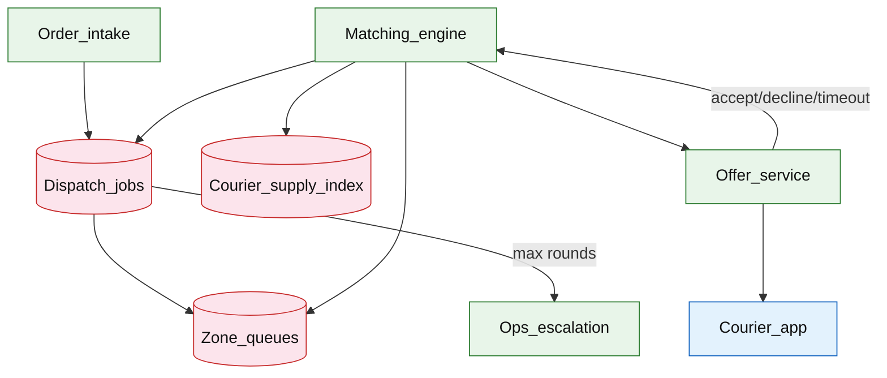

# Delivery dispatch matching

## Introduction

Delivery dispatch matching assigns **open delivery jobs** to available couriers by scoring candidates, sending **time-bound offers**, and **re-dispatching** when offers expire or are declined. The system balances assignment speed, courier fairness, and customer ETA under surge demand.

**Primary users:** customers/merchants (assignment status), couriers (accept/decline offers), dispatch operators (unmatched queue, manual assign), matching engineers (scoring weights).

**Interview pacing:** Use [60-minute runbook](../../topics/interview-runbook-60m.md) — ~10 min requirements theater (below), ~18–32 min diagram + API/DB, ~46–56 min deep dive on **assignment scoring + retry loop**.

Live map tracking after assign: [real-time delivery tracking](./real-time-delivery-tracking.md). ETA inputs: [ETA prediction service](./eta-prediction-service.md).

## Requirements discovery (interview theater)

### Question bank

| Topic | You ask | If they push back | Example answer (reasonable default) |
| --- | --- | --- | --- |
| SLA | Time to first offer? | "Instant" | **p90 &lt; 30s** to first offer; **p90 &lt; 3 min** to accepted assign |
| Offer timeout | How long courier has to accept? | "1 minute" | **45s** offer TTL; auto-decline on expiry |
| Redispatch | Max retries? | "Until matched" | Max **5** offer rounds per job; then escalation queue |
| Fairness | Starve idle couriers? | "Closest wins always" | Score blends distance, wait time, rating, batching efficiency |
| Surge | Dinner peak? | "Normal load" | Zone-level demand multiplier; widen search radius after round 2 |
| Supply signal | How know couriers free? | "GPS poll" | Courier app heartbeat + `AVAILABLE` state in supply store |
| Out of scope | Full route optimization, payroll? | "VRP solver" | Greedy scoring + optional batching hint; defer global VRP |

### Example dialogue

> **You:** Let's scope v1: one happy path and what's out of scope?
> **Them:** …
> **You:** For scale, prototype vs 12-month target?
> **Them:** …
> **You:** What does each actor do per day on the hot path?
> **Them:** …
> **You:** I'll lock the **target** column assumptions unless you want different numbers — next I'll map fleet totals to monthly AWS meters in **billable volume**.

### Parsed requirements

| Field | Source question | Parsed value (target) | Drives |
| --- | --- | --- | --- |
| `delivery_jobs_/_day_j_day` | Delivery jobs / day (`J_day`) | **8M** | Scale tiers, input model, fleet totals |
| `peak_new_jobs_j_peak` | Peak new jobs (`J_peak`) | **1,200/s** (dinner surge) | Scale tiers, input model, fleet totals |
| `couriers_online_peak` | Couriers online (peak) | **400k** | Scale tiers, input model, fleet totals |
| `couriers_available_peak` | Couriers `AVAILABLE` (peak) | **120k** | Scale tiers, input model, fleet totals |
| `geo_zones_z` | Geo zones (`Z`) | **2,000** | Scale tiers, input model, fleet totals |
| `offer_ttl` | Offer TTL | **45s** | Storage steady-state |
| `max_dispatch_rounds_r` | Max dispatch rounds (`R`) | **5** | Scale tiers, input model, fleet totals |
| `serial_offers_1_courier` | Serial offers (1 courier) | **yes** | Scale tiers, input model, fleet totals |
| `s_job_delivery_jobs_row` | `S_job` (`delivery_jobs` row) | **600 B** | Scale tiers, input model, fleet totals |

### Locked assumptions

Fleet system — scale by **delivery jobs/day** and **peak job intake**, not consumer DAU. Use **target** column in interviews.

| Assumption | Prototype (MVP) | Growth | Target (anchor) |
| --- | --- | --- | --- |
| Delivery jobs / day (`J_day`) | 80k | 800k | **8M** |
| Peak new jobs (`J_peak`) | 12/s | 120/s | **1,200/s** (dinner surge) |
| Couriers online (peak) | 4k | 40k | **400k** |
| Couriers `AVAILABLE` (peak) | 1.2k | 12k | **120k** |
| Geo zones (`Z`) | 20 | 200 | **2,000** |
| Offer TTL | 45s | 45s | **45s** |
| Max dispatch rounds (`R`) | 5 | 5 | **5** |
| Serial offers (1 courier) | yes | yes | yes |
| `S_job` (`delivery_jobs` row) | 600 B | 600 B | **600 B** |

*After ~10 minutes, proceed with the **target** column unless the interviewer changes scope.*

### Interview Q&A cheat sheet

Say aloud in order (~10 min). Write locks into **parsed requirements** before capacity math.

| Step | You ask | Lock if vague (target) |
| --- | --- | --- |
| 1 — SLA | Time to first offer? | **p90 &lt; 30s** to first offer; **p90 &lt; 3 min** to accepted assign |
| 2 — Offer timeout | How long courier has to accept? | **45s** offer TTL; auto-decline on expiry |
| 3 — Redispatch | Max retries? | Max **5** offer rounds per job; then escalation queue |
| 4 — Fairness | Starve idle couriers? | Score blends distance, wait time, rating, batching efficiency |
| 5 — Surge | Dinner peak? | Zone-level demand multiplier; widen search radius after round 2 |
| 6 — Supply signal | How know couriers free? | Courier app heartbeat + `AVAILABLE` state in supply store |
| 7 — Out of scope | Full route optimization, payroll? | Greedy scoring + optional batching hint; defer global VRP |

## Capacity sketch

### User input model

| Action | Actor | Per day (target) | API / work unit | ~Size | Durable write |
| --- | --- | --- | --- | --- | --- |
| Create dispatch job | merchant/intake | 8M | `POST /v1/dispatch/jobs` | 1 KB req | **600 B** job row |
| Match + score round | matcher | ~40M offers path | internal geo query | — | **250 B** per offer |
| Courier accept/decline | courier | ~8M outcomes | `POST .../accept` | 0.3 KB | update job + offer |
| Heartbeat + supply | courier | 400k × 720 | `POST .../heartbeat` | 0.2 KB | **200 B** supply row |
| Status poll (customer) | customer | 16M | `GET .../jobs/{id}` | 2 KB resp | read-mostly |

### Fleet totals (target)

| Metric | Formula | Value |
| --- | --- | --- |
| Jobs / day | `J_day` | **8M** |
| Offers created / day | `J_day × R` (avg ~5) | **~40M** |
| Scoring evaluations / day | geo top-K per round | **~40M** |
| Push notifications / day | ≈ offers | **~40M** |
| OLTP bytes / day (jobs + offers) | `8M×600B + 40M×250B` | **~15 GB** |

### Traffic profile (target tier)

Locked **target** assumptions: **8M** jobs/day, **1,200/s** peak job intake, **400k** couriers online (peak).

| Metric | Value |
| --- | --- |
| **Read:write (API requests)** | **1:19** (status polls : mutating + heartbeats) |
| **Read:write (durable bytes)** | **1:50** (OLTP reads ≪ job + offer writes) |
| **Requests / day (fleet)** | **~320M** (8M jobs + 8M outcomes + 288M heartbeats + 16M polls) |
| **Avg RPS** | **~3.7k/s** (`320M / 86,400`) |
| **Peak RPS** | **~12k/s** API (**1.2k/s** jobs + **~10k/s** heartbeats; matcher **~6k/s** internal) |

| User / actor | Action | R/W | Per user (or actor) / day | % of fleet requests |
| --- | --- | --- | --- | --- |
| Courier (online) | Heartbeat + supply | W | 720 | **~90%** |
| Merchant / intake | Create dispatch job | W | — (fleet **8M**) | **~2.5%** |
| Courier | Accept / decline offer | W | ~20 (fleet **8M**) | **~2.5%** |
| Customer | Status poll | R | ~2 (fleet **16M**) | **~5%** |
| Matcher (system) | Score + offer round | W | — (internal **~40M**) | OLTP, not client API |

*Per-courier heartbeat rate stays fixed; fleet scales with online couriers and `J_day`.*

### AWS service map (target deployment)

| Diagram component | AWS service | Role in this design | Monthly meter (target) |
| --- | --- | --- | |
| Order_intake | **Amazon API Gateway** + **Application Load Balancer** | HTTPS ingress for `POST /v1/dispatch/jobs` from merchants |
| Dispatch_jobs | **Amazon Aurora PostgreSQL** (or **RDS**) | Durable `delivery_jobs` + `dispatch_offers`; zone-sharded at target |
| Zone_queues | **Amazon SQS** (or **Amazon MSK**) | Per-zone job queue; matcher workers pull with visibility timeout |
| Matching_engine | **Amazon ECS on Fargate** | Zone-scoped workers: geo top-K score, serial offer rounds |
| Courier_supply_index | **Amazon ElastiCache for Redis** (GEO) | `AVAILABLE` couriers by H3 cell; sub-ms radius queries |
| Offer_service | **Amazon ECS on Fargate** + **Amazon SNS** (mobile push) | Create TTL offers; push to courier devices |
| Courier_app | — (mobile client) | Accept/decline; heartbeat; not AWS |
| Ops_escalation | **Amazon ECS** + internal dashboard | UNMATCHED queue after **5** rounds; manual assign |
| Observability | **Amazon CloudWatch**, **AWS X-Ray** | Matcher lag, offer timeout rate, zone backlog |

### Scale tiers

| Tier | `J_day` | `J_peak` | Offers/day | Matcher scoring/s (peak) | Notes |
| --- | --- | --- | --- | --- | --- |
| Prototype | 80k | 12 | 400k | **~60** | single zone worker |
| Growth | 800k | 120 | 4M | **~600** | zone sharding |
| Target | 8M | 1,200 | 40M | **~6,000** | 2k zones, serial offers |

### Symbols

| Symbol | Meaning |
| --- | --- |
| `J_day` | New dispatch jobs per day |
| `J_peak` | Peak new jobs per second |
| `Z` | Geo zones |
| `C_avail` | Available couriers at peak |
| `R` | Max redispatch rounds per job |
| `O_ttl` | Offer TTL (seconds) |
| `K` | Candidates scored per round (20) |
| `S_job`, `S_offer` | Row sizes |

### Derivation (traffic)

**Job intake:** `J_peak = 1,200/s` → writes `dispatch_jobs` + zone queue publish.

**Scoring (worst case):** `J_peak × R = 1,200 × 5 = **6,000 evaluations/s**` — top-`K=20` geo query per round, not full-fleet scan.

**Offer pushes:** serial mode → **`1,200 offers/s`** peak (FCM/APNs).

**Open offers:** `J_peak × O_ttl ≈ 1,200 × 45 = **54,000**` concurrent OPEN rows.

**Unmatched:** 2% after 5 rounds → **`~24 jobs/s`** to ops at peak.

**Avg job intake:** `8M / 86,400 ≈ **93/s**` — dinner peak **~13×** average.

### Storage and growth over time

| Table / store | ~Row size | New / day (target) | Retention | Steady-state (target) | Per job |
| --- | --- | --- | --- | --- | --- |
| `delivery_jobs` | 600 B | 8M | 90d hot | **~720M rows ≈ 430 GB** | 1 row |
| `dispatch_offers` | 250 B | 40M | 7d window | **~280M ≈ 70 GB** | ~5 offers |
| `courier_supply` | 200 B | 400k live | real-time | **~80 MB** | — |
| Geo index (Redis) | — | — | in-memory | **~2 GB** | H3 per zone |

**Cumulative jobs (metadata):**

| Horizon | Jobs | Size (`× 600 B`) |
| --- | --- | --- |
| 30 days | 240M | **~144 GB** |
| 1 year | 2.9B | **~1.7 TB** |

### Per-unit economics (target tier)

| Metric | Formula | Target value |
| --- | --- | --- |
| OLTP bytes / job | `600 B + 5×250 B` | **~1.85 KB** lifecycle |
| Matcher CPU / job (peak amortized) | scoring rounds | **~5 geo queries** |
| Supply row / courier | 200 B | **200 B** |
| Time to assign (p90 SLO) | product | **&lt; 3 min** |

### Service footprint (instance count ballpark)

| Service | Scales with | Prototype | Growth | Target |
| --- | --- | --- | --- | --- |
| Zone matcher workers | `Z`, `J_peak` | 2 | 20 | **~200** |
| Offer + push service | offer/s | 2 | 10 | **~40** |
| Supply geo index (Redis) | `C_avail` | 1 | 3 | **~10** shards |
| Jobs OLTP | `J_day` | 1 primary | 2 shards | **~8** shards |
| Ops escalation UI | UNMATCHED rate | 1 | 1 | **2** |

**First scale cliff:** **Growth (~800k jobs/day)** — single hot zone cannot sustain **120 jobs/s** without zone partitioning and matcher fleet.

### Billable volume (target month)

Convert **fleet totals** to AWS billing meters before dollar math. *List-price ballparks — not a quote.*

| Design quantity (target) | Formula | Monthly billable unit |
| --- | --- | --- |
| API requests | `requests_day × 30` | **derive from fleet** (**~320M** (8M jobs + 8M outcomes + 288M heartbeats + 16M polls)) |
| OLTP storage steady | storage table | **___ GB-mo** |
| Cache / Redis RAM | footprint | **___ GB** (node tier) |
| Egress / CDN | `egress_day × 30` | **___ GB / mo** |
| Stream / queue events | `events_day × 30` | **___ million events / mo** |
| Log ingest (if full capture) | `log_GB_day × 30` | **___ GB ingest / mo** |
| **Per unit** | `total / scale driver` | **$…/unit/mo** |

*Reconcile rows in **Cloud cost ballpark** (9a) with these meters.*

### Cost at a glance

Interview sound bite — reconcile with **billable volume** and **cloud cost** below.

| Tier | Scale | ~Monthly $ (core) | Per unit |
| --- | --- | --- | --- |
| Prototype (MVP) | see locked assumptions | **~$800** | platform tax dominates |
| Target (anchor) | `U` or `Q` = **see locked assumptions** | **see cloud cost** | **see cloud cost** |

**First payment block:** smallest prod footprint (load balancer + database + compute) before per-million traffic dominates.

### Cloud cost ballpark (target tier)

| Line item | Driver | ~Monthly |
| --- | --- | --- |
| Matcher + offer compute | ~240 pods | **~$25k** |
| Jobs + offers OLTP | ~500 GB hot | **~$8k** |
| Redis geo supply | 10 shards | **~$3k** |
| Push gateway (FCM) | 40M/day | **~$2k** (vendor) |
| **Total (dispatch slice)** | | **~$38k/mo** |
| **Per million jobs** | `38k / 8` | **~$4.8k/M jobs/mo** |
| **Per job** | `38k / (8M×30)` | **~$0.00016/job** |

### Timeline (prototype → early growth)

| Milestone | `J_day` | OLTP hot | `J_peak` | ~Monthly $ |
| --- | --- | --- | --- | --- |
| Launch | 80k | **~5 GB** | 12/s | **~$800** |
| Month 3 | 160k | **~10 GB** | 25/s | **~$1.5k** |
| Month 6 | 320k | **~20 GB** | 50/s | **~$3k** |
| Month 12 | 800k | **~50 GB** | 120/s | **~$12k** |

Month 12 is **growth tier** — zone sharding and serial-offer sweeper hardening before **8M jobs/day** target.

### Sensitivity

| Change | Effect | Response |
| --- | --- | --- |
| **10× jobs in one zone** | Matcher queue backlog | Finer zone cells; dedicated hot-zone pool |
| **Batch offers (N=3)** | Faster match | First-accept-wins CAS on job |
| **10× `J_day`** | Linear OLTP + scoring | Shard jobs by `zone_id`; scale Redis GEO |
| **Global VRP** | Different problem | Offline optimizer; keep greedy online path |

## High-level design

### Architecture (user → database)



**Narrative:** **Order intake** creates `dispatch_jobs` in a zone queue. **Matching engine** workers pull jobs, query **courier supply** geo index, score candidates, and create **offers** with TTL. **Courier app** accept/decline flows back; on success job → `ASSIGNED`. On timeout/decline, job re-enters matching with expanded radius or fairness boosts until `max rounds`, then **ops escalation**.

## User-visible surface

- **Customer/merchant:** status `SEARCHING` → `COURIER_OFFERED` → `ASSIGNED` with courier name/ETA.
- **Courier:** push offer with payout, distance, expiry countdown; accept/decline buttons.
- **Ops:** unmatched list; manual assign; surge toggles per zone.

## API contract and input model

### UX → API traceability

| UX / UI action | User intent | API or event | Sync/async | Idempotent? | Validates |
| --- | --- | --- | --- | --- | --- |
| **Customer/merchant:** status `SEARCHING` → `COURIER_OFFERED | Create dispatch job from order | `POST` `/v1/dispatch/jobs` | sync | yes | domain rules |
| **Courier:** push offer with payout, distance, expiry countd | Job status | `GET` `/v1/dispatch/jobs/{job_id}` | sync | read | domain rules |
| **Ops:** unmatched list; manual assign; surge toggles per zo | Courier accept | `POST` `/v1/dispatch/offers/{offer_id | sync | yes | domain rules |
| See user-visible surface | Courier decline | `POST` `/v1/dispatch/offers/{offer_id | sync | yes | domain rules |
| See user-visible surface | Location + availability | `POST` `/v1/couriers/{courier_id}/hea | sync | yes | domain rules |
| See user-visible surface | Manual assign | `POST` `/v1/admin/dispatch/jobs/{job_ | sync | yes | domain rules |
### Endpoints

| Method | Path | Purpose |
| --- | --- | --- |
| `POST` | `/v1/dispatch/jobs` | Create dispatch job from order |
| `GET` | `/v1/dispatch/jobs/{job_id}` | Job status |
| `POST` | `/v1/dispatch/offers/{offer_id}/accept` | Courier accept |
| `POST` | `/v1/dispatch/offers/{offer_id}/decline` | Courier decline |
| `POST` | `/v1/couriers/{courier_id}/heartbeat` | Location + availability |
| `POST` | `/v1/admin/dispatch/jobs/{job_id}/assign` | Manual assign |

### Example payloads

`POST /v1/dispatch/jobs`

```json
{
 "order_id": "ord_8f2a1c",
 "zone_id": "zone_sf_12",
 "pickup": { "lat": 37.7749, "lon": -122.4194 },
 "dropoff": { "lat": 37.7849, "lon": -122.4094 },
 "priority": "normal",
 "merchant_prep_minutes": 8
}
```

Response `201 Created`:

```json
{
 "job_id": "job_7k2m",
 "state": "SEARCHING",
 "round": 0,
 "created_at": "2026-05-22T22:00:00Z"
}
```

`POST /v1/dispatch/offers/off_9a1b/accept`

```json
{
 "courier_id": "drv_4412"
}
```

Response `200 OK`:

```json
{
 "job_id": "job_7k2m",
 "state": "ASSIGNED",
 "courier_id": "drv_4412",
 "assigned_at": "2026-05-22T22:00:38Z"
}
```

Offer push payload (to courier)

```json
{
 "offer_id": "off_9a1b",
 "job_id": "job_7k2m",
 "payout_cents": 850,
 "pickup_distance_m": 1200,
 "expires_at": "2026-05-22T22:01:23Z",
 "accept_url": "/v1/dispatch/offers/off_9a1b/accept"
}
```

`GET /v1/dispatch/jobs/job_7k2m`

```json
{
 "job_id": "job_7k2m",
 "order_id": "ord_8f2a1c",
 "state": "SEARCHING",
 "round": 2,
 "last_offer_id": "off_9a0f",
 "timeline": [
 { "state": "SEARCHING", "at": "2026-05-22T22:00:00Z" },
 { "state": "OFFERED", "courier_id": "drv_991", "at": "2026-05-22T22:00:15Z" },
 { "state": "OFFER_EXPIRED", "at": "2026-05-22T22:01:00Z" }
 ]
}
```

### Input validation

- One active `dispatch_job` per `order_id`.
- Accept only if `offer.state=OPEN` and `courier_id` matches; atomic CAS.
- Heartbeat: lat/lon required; stale &gt; 60s → `UNAVAILABLE` for matching.
- Manual assign requires ops role; closes open offers.

## Database model

### Tables / indexes

| Table / store | Key fields | Notes |
| --- | --- | --- |
| `dispatch_jobs` | `job_id`, `order_id`, `zone_id`, `state`, `round`, `priority`, `pickup`, `dropoff`, `created_at` | Lifecycle |
| `courier_supply` | `courier_id`, `zone_id`, `lat`, `lon`, `state`, `idle_since`, `updated_at` | Geo index per zone |
| `dispatch_offers` | `offer_id`, `job_id`, `courier_id`, `state`, `score`, `expires_at` | OPEN → ACCEPTED/DECLINED/EXPIRED |
| `dispatch_audit` | `job_id`, `round`, `candidates_json`, `chosen`, `at` | Debug scoring |

Indexes:

- `dispatch_jobs(zone_id, state, created_at)` — matcher pull
- `courier_supply(zone_id, state)` + geo (PostGIS/Redis GEO)
- `dispatch_offers(expires_at)` where `state=OPEN` — expiry sweeper

### Job state machine

```text
SEARCHING → OFFERED → ASSIGNED
 ↘ (timeout/decline) → SEARCHING (round++)
 ↘ round > max → UNMATCHED → ops / surge pricing
```

### Read/write paths

1. **Create job** — insert `dispatch_jobs` `SEARCHING` → publish to `zone_queue`.
2. **Match round** — fetch job → query top-K supply in radius → score → pick best → insert `dispatch_offers` OPEN → push notification.
3. **Accept** — txn: offer ACCEPTED, job ASSIGNED, courier `BUSY`, cancel other open offers for job.
4. **Decline/timeout** — offer terminal → increment `round` → job back to SEARCHING or widen params.
5. **Heartbeat** — update `courier_supply` geo; drives candidate queries.

## Interview deep dive: Assignment scoring + retry loop

### Scoring function (explain in interview)

Example weighted score (lower is better)

```text
score = w1 * pickup_distance_m
 + w2 * (-idle_seconds) # fairness: reward waiting couriers
 - w3 * courier_rating
 + w4 * detour_penalty_if_batching
```

| Round | Adjustment |
| --- | --- |
| 1 | Strict radius 1.5 km |
| 2–3 | Expand radius 2×; increase `w2` (fairness) |
| 4–5 | Allow lower-rated couriers; surge bonus in payout |
| &gt;5 | Escalate ops / raise dynamic payout |

**Batching:** optional — if courier has active delivery nearby, negative detour component; risk delay — mention tradeoff.

### Serial offers vs batch offers

| Mode | Pros | Cons |
| --- | --- | --- |
| **Serial (default)** | No double-assign race | Slower; many round trips |
| Batch to top-3 | Faster match | Need first-accept-wins atomic lock |
| Auction | Market efficiency | Complex UX |

### Retry loop safety

- **Exclude** couriers who declined this `job_id`.
- **Idempotent accept:** only one offer reaches `ASSIGNED` per job (`UNIQUE(job_id)` on assigned state).
- **Expiry sweeper** — cron flips `OPEN` → `EXPIRED` → triggers next round event.

### Zone partitioning

- Matcher workers own `zone_id` partitions — avoids global lock.
- Cross-zone only when job marked `radius_expanded` — prevents ping-pong.

## Scale and failure

### Correctness model

- At most one `ASSIGNED` courier per `job_id`.
- Offer accept is atomic CAS on `offer_id`.
- Courier cannot be `AVAILABLE` and assigned two full jobs if policy is one active delivery (enforce in accept txn).

### Failure cases

| Failure | Symptom | Mitigation |
| --- | --- | --- |
| Stale supply | Offers to offline courier | Heartbeat TTL; confirm push ack |
| Double accept race | Two couriers think they won | Single-offer serial mode or CAS job assign |
| Hot zone queue | p90 assign SLA miss | Shard zones; add couriers; dynamic payout |
| Matcher crash mid-round | Stuck OFFERED | Sweeper resets expired offers; job requeue |
| Notification delay | Late accept after expiry | Server-side expiry authoritative |
| Supply ghost | Courier shows available but busy | State machine on accept → BUSY |
| Surge unmatched | UNMATCHED rate spikes | Ops queue; customer ETA honesty |

### Key metrics

- Time to first offer; time to assign (p50/p90)
- Offer acceptance rate; decline vs timeout ratio
- Redispatch rounds distribution
- UNMATCHED rate by zone
- Courier idle time (fairness)
- Scoring evaluation latency

### Interview deep dive talking points

- **1,200 jobs/s peak**, zone-partitioned matchers, top-K geo queries.
- Write scoring formula with **fairness** term — not pure distance.
- Serial offer + 45s TTL + max 5 rounds → escalation story.
- Atomic accept txn — one assigned courier per job.
- Link to tracking/ETA docs for post-assign path.

## Related

- [Examples hub](./README.md)
- [Real-time delivery tracking](./real-time-delivery-tracking.md)
- [ETA prediction service](./eta-prediction-service.md)
- [Shopping cart checkout](../commerce/shopping-cart-checkout.md)
- [Distributed job scheduler](../platform/distributed-job-scheduler.md) (retry/lease analogy)
- [60-minute runbook](../../topics/interview-runbook-60m.md)
