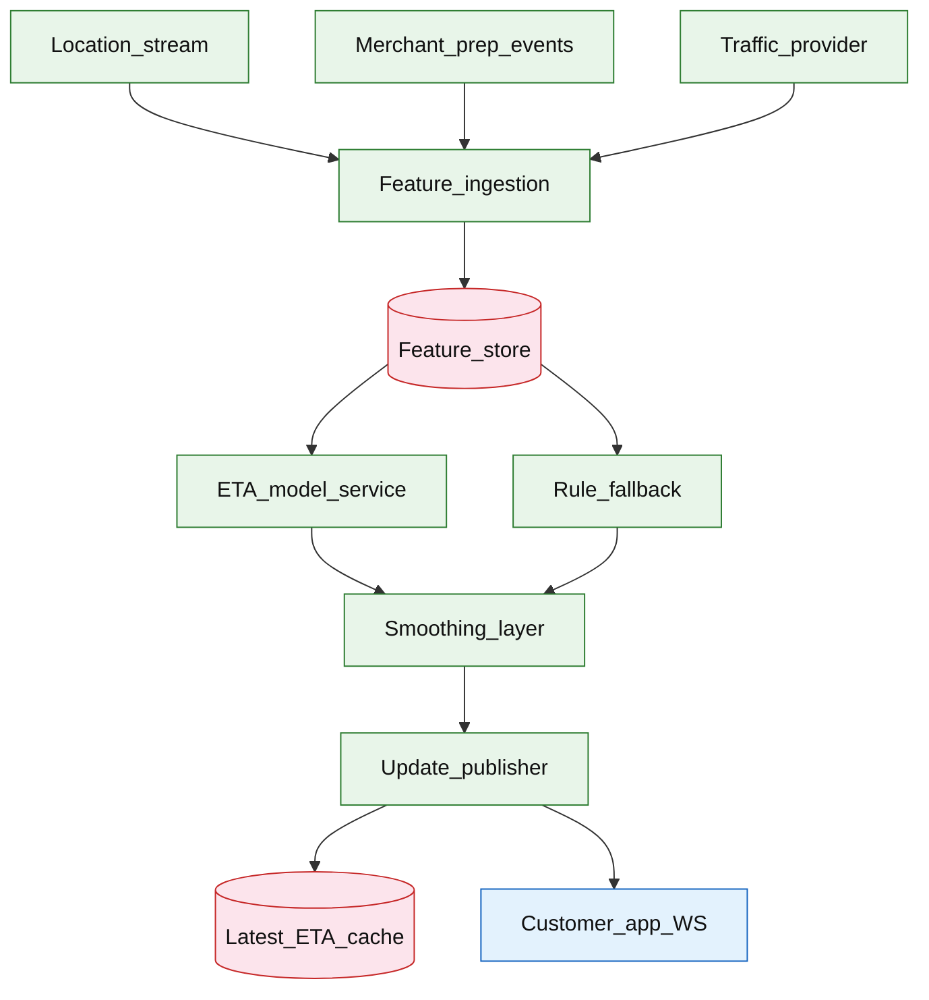

# ETA prediction service

## Introduction

An ETA prediction service estimates **remaining delivery time** for active trips and publishes **rolling updates** to customer apps, dispatch, and partner systems. It ingests live features (courier position, traffic, prep status), runs **model inference**, applies **smoothing** so the UI does not jitter, and falls back to **rule-based ETAs** when models are unavailable.

**Primary users:** customers (countdown UI), dispatch matching (prioritization), operators (model health, error dashboards), data science (model versions).

**Interview pacing:** Use [60-minute runbook](../../prep/interview-runbook-60m.md) — ~10 min requirements theater (below), ~18–32 min diagram + API/DB, ~46–56 min deep dive on **prediction pipeline + smoothing**.

Location stream: [real-time delivery tracking](./real-time-delivery-tracking.md). Assignment context: [delivery dispatch matching](./delivery-dispatch-matching.md).

## Requirements discovery (interview theater)

### Question bank

| Topic | You ask | If they push back | Example answer (reasonable default) |
| --- | --- | --- | --- |
| Accuracy | MAE target? | "Perfect ETA" | **MAE &lt; 3 min** urban; **P95 error &lt; 8 min**; report by segment |
| Update cadence | How often refresh? | "Every second" | Recompute on **significant movement** (&gt;100m) or **30s** heartbeat; publish UI max **1/30s** after smooth |
| Model | ML required? | "Rules only" | **GBDT/ML serving** primary; **haversine + traffic multiplier** fallback |
| Signals | Traffic/weather? | "GPS only" | GPS + road graph distance + live traffic index + merchant prep signal |
| Cold start | Before courier assigned? | "Hide ETA" | Pre-assign: prep + historical zone median; post-assign: full model |
| Failure | Model down? | "Show nothing" | Fallback rules + widen confidence band; never blank if trip active |
| Out of scope | Full route solver, autonomous fleet? | "Google Maps API" | Use routing provider distance matrix as feature; defer VRP |

### Example dialogue

> **You:** Let's scope v1: one happy path and what's out of scope?
> **Them:** …
> **You:** For scale, prototype vs 12-month target?
> **Them:** …
> **You:** What does each actor do per day on the hot path?
> **Them:** …
> **You:** I'll lock the **target** column assumptions unless you want different numbers — next I'll map fleet totals to monthly AWS meters in **billable volume**.

### Parsed requirements

| Field | Source question | Parsed value (target) | Drives |
| --- | --- | --- | --- |
| `concurrent_deliveries_d` | Concurrent deliveries (`D`) | **200k** | Scale tiers, input model, fleet totals |
| `location_pings_peak_upstream` | Location pings peak (upstream) | **250k/s** | Scale tiers, input model, fleet totals |
| `predict_invocations_peak_p_peak` | Predict invocations peak (`P_peak`) | **50k/s** | Scale tiers, input model, fleet totals |
| `movement_filter_→_predict` | Movement filter → predict | **20%** of pings | Scale tiers, input model, fleet totals |
| `model_batch_size` | Model batch size | **32**; p99 inference **&lt; 20ms | Scale tiers, input model, fleet totals |
| `ui_publish_rate` | UI publish rate | **same (after smooth)** | Scale tiers, input model, fleet totals |
| `feature_staleness_slo` | Feature staleness SLO | **&lt; 5s** | Scale tiers, input model, fleet totals |
| `shadow_traffic` | Shadow traffic | **5%** | Scale tiers, input model, fleet totals |

### Locked assumptions

Fleet system — scale by **concurrent active deliveries** and **predict QPS**, aligned with [tracking](./real-time-delivery-tracking.md). Use **target** in interviews.

| Assumption | Prototype (MVP) | Growth | Target (anchor) |
| --- | --- | --- | --- |
| Concurrent deliveries (`D`) | 2k | 20k | **200k** |
| Location pings peak (upstream) | 2.5k/s | 25k/s | **250k/s** |
| Predict invocations peak (`P_peak`) | 500/s | 5k/s | **50k/s** |
| Movement filter → predict | 20% | 20% | **20%** of pings |
| Model batch size | 32 | 32 | **32**; p99 inference **&lt; 20ms** |
| UI publish rate | 1/30s per delivery | same | same (after smooth) |
| Feature staleness SLO | 10s | 5s | **&lt; 5s** |
| Shadow traffic | 0% | 5% | **5%** |

*After ~10 minutes, proceed with the **target** column unless the interviewer changes scope.*

### Interview Q&A cheat sheet

Say aloud in order (~10 min). Write locks into **parsed requirements** before capacity math.

| Step | You ask | Lock if vague (target) |
| --- | --- | --- |
| 1 — Accuracy | MAE target? | **MAE &lt; 3 min** urban; **P95 error &lt; 8 min**; report by segment |
| 2 — Update cadence | How often refresh? | Recompute on **significant movement** (&gt;100m) or **30s** heartbeat; publish UI max **1/30s** after smooth |
| 3 — Model | ML required? | **GBDT/ML serving** primary; **haversine + traffic multiplier** fallback |
| 4 — Signals | Traffic/weather? | GPS + road graph distance + live traffic index + merchant prep signal |
| 5 — Cold start | Before courier assigned? | Pre-assign: prep + historical zone median; post-assign: full model |
| 6 — Failure | Model down? | Fallback rules + widen confidence band; never blank if trip active |
| 7 — Out of scope | Full route solver, autonomous fleet? | Use routing provider distance matrix as feature; defer VRP |

## Capacity sketch

### User input model

| Action | Actor | Per day (target) | Trigger | ~Work unit | Durable write |
| --- | --- | --- | --- | --- | --- |
| Location ping (upstream) | driver | **~4.3B** raw fleet | stream | 120 B | not ETA OLTP |
| Predict (internal) | system | **~4.3B** filtered | `POST /v1/eta/predict` | 3–5 KB features | optional history |
| Publish smoothed ETA | system | **~580M** | WS + cache | 128 B | `eta_latest` |
| Customer read ETA | customer | **~50M** | `GET .../eta` | 0.5 KB | read cache |
| Arrival label (offline) | system | 8M trips end | batch | 80 B | training row |

### Fleet totals (target, `D` = 200k concurrent)

| Metric | Formula | Value |
| --- | --- | --- |
| Predict calls / day | movement + periodic | **~4.3B/day** (order-of-magnitude) |
| Publish / day | `D × (86400/30)` at full fleet | **~580M/day** (~6.7k/s) |
| Hot `eta_latest` RAM | `D × 128 B` | **~25 MB** |
| Feature read bandwidth (peak) | `50k × 4 KB` | **~200 MB/s** |
| Analytics rollup ingest | 5-min buckets | **~1–5 GB/day** |

### Traffic profile (target tier)

Locked **target** assumptions: **200k** concurrent deliveries (`D`), **50k/s** predict peak (`P_peak`), **~6.7k/s** publish (`D × 1/30s`).

| Metric | Value |
| --- | --- |
| **Read:write (API requests)** | **1:12** (customer `GET` : publish + internal predict path) |
| **Read:write (durable bytes)** | **1:8** (feature reads **~200 MB/s** vs **~8 GB/day** rollup writes) |
| **Requests / day (fleet)** | **~630M** equiv. (**50M** customer reads + **~580M** publishes + filtered predicts) |
| **Avg RPS** | **~7.3k/s** (publish + read weighted) |
| **Peak RPS** | **50k/s** predict/filter; **6.7k/s** publish; customer read **~580/s** avg |

| User / actor | Action | R/W | Per user (or actor) / day | % of fleet requests |
| --- | --- | --- | --- | --- |
| Driver (upstream) | Location ping | — | ~21,500 (fleet **~4.3B**) | ingested via tracking, not ETA API |
| System | Predict + smooth | W | ~90–180 / delivery-hour | **~90%** (internal) |
| System | Publish ETA (WS + cache) | W | ~120 / delivery-hour | **~9%** |
| Customer | Read ETA | R | ~0.25 (fleet **50M**) | **~8%** |
| System | Arrival label (batch) | W | 1 / completed trip | training path |

*Concurrent deliveries `D` scales fleet publish rate; per-delivery publish interval (~30s) stays fixed.*

### AWS service map (target deployment)

| Diagram component | AWS service | Role in this design | Monthly meter (target) |
| --- | --- | --- | |
| Location_stream | **Amazon MSK** (or **Amazon Kinesis**) | Courier GPS from [real-time delivery tracking](./real-time-delivery-tracking.md) |
| Merchant_prep_events | **Amazon MSK** / **Amazon EventBridge** | Prep-time signals for feature joins |
| Traffic_provider | — (third party) | External traffic tiles; cache in feature store |
| Feature_ingestion | **Amazon ECS on Fargate** (or **AWS Lambda**) | Join GPS + trip + traffic into feature vectors |
| Feature_store | **Amazon ElastiCache for Redis** + **Amazon DynamoDB** | Low-latency feature reads (~4 KB/predict) |
| ETA_model_service | **Amazon ECS on EC2** (GPU) or **Amazon SageMaker** | ML inference at **50k/s** peak (batched) |
| Rule_fallback | **AWS Lambda** / **Amazon ECS** | Baseline ETA when model times out |
| Smoothing_layer | **Amazon ECS on Fargate** | Damp jumps; monotonic policy; confidence band |
| Update_publisher | **Amazon ECS on Fargate** | Write `eta_latest`; fan-out updates |
| Latest_ETA_cache | **Amazon ElastiCache for Redis** | **~25 MB** hot `eta_latest` per `delivery_id` |
| Customer_app_WS | **Amazon API Gateway** (WebSocket API) | Push smoothed ETA to subscribed customers |
| Observability | **Amazon CloudWatch**, **AWS X-Ray** | MAE, fallback rate, publish lag |

### Scale tiers

| Tier | `D` (concurrent) | `P_peak` | Publish/s | Model replicas (ballpark) |
| --- | --- | --- | --- | --- |
| Prototype | 2k | 500/s | **~67** | **2–4** |
| Growth | 20k | 5k/s | **~670** | **~16** |
| Target | 200k | 50k/s | **~6.7k** | **~32–64** (batched) |

### Symbols

| Symbol | Meaning |
| --- | --- |
| `D` | Concurrent active deliveries |
| `P_peak` | Peak predict invocations/s |
| `L_pub` | Publish interval per delivery (30s) |
| `f_move` | Fraction of pings triggering predict (0.2) |
| `M` | Model inference latency (ms) |
| `B_feat` | Feature read bytes per predict (~4 KB) |

### Derivation (traffic)

**Predict QPS:** `P_peak = 50,000/s` from `250k pings/s × f_move ≈ 20%`.

**Inference capacity:** serial `50k × 20ms = 1M ms/s` → **~1,000 cores**; batch-32 → **~32–64** replicas (interview ballpark).

**Publish rate:** `D / L_pub = 200k / 30 ≈ **6,700/s**` smoothed WS/cache updates.

**Feature reads:** `P_peak × B_feat ≈ **200 MB/s**` peak from Redis/feature store.

**Fallback share:** design for **&lt; 5%** steady state; spike to **30%** on model outage.

### Storage and growth over time

| Table / store | ~Row size | New / day (target) | Retention | Steady-state (target) | Per delivery |
| --- | --- | --- | --- | --- | --- |
| `eta_latest` | 128 B | 200k churn | live | **~25 MB** | 1 row |
| `eta_history` (rollup) | 80 B | 5-min buckets | 90d | **~1–5 GB/day** ingest | not full stream |
| Feature cache | 2 KB | 200k keys | minutes | **~400 MB** | 2 KB |
| Model registry | 50 MB | rare | versions | **&lt; 5 GB** | — |

**Raw publish stream (if stored — avoid on hot path):**

| Horizon | Publishes | Size (`× 80 B`) |
| --- | --- | --- |
| 1 day | 580M | **~46 GB** |
| 1 year | 212B | **~17 TB** → rollups only |

### Per-unit economics (target tier)

| Metric | Formula | Target value |
| --- | --- | --- |
| Hot cache / concurrent delivery | 128 B | **128 B** |
| Predicts / delivery-hour (active) | movement + periodic | **~90–180** |
| Publishes / delivery-hour | `3600/30` | **~120** |
| Warehouse rollup / delivery-day | aggregated | **~5 KB** |
| Feature bytes / predict | `B_feat` | **~4 KB** read |

### Service footprint (instance count ballpark)

| Service | Scales with | Prototype | Growth | Target |
| --- | --- | --- | --- | --- |
| Model inference pods | `P_peak` | 2 | 16 | **32–64** |
| Feature ingestion | ping rate | 2 | 10 | **~40** |
| Smoothing + publisher | publish/s | 2 | 5 | **~20** |
| `eta_latest` Redis | `D` | 1 | 3 | **~6** nodes |
| Rules fallback pool | outage | 2 | 4 | **~10** |

**First scale cliff:** **Growth (`P_peak ≈ 5k/s`)** — single GPU pool saturates; add batching + movement threshold tuning before **50k/s**.

### Billable volume (target month)

Convert **fleet totals** to AWS billing meters before dollar math. *List-price ballparks — not a quote.*

| Design quantity (target) | Formula | Monthly billable unit |
| --- | --- | --- |
| API requests | `requests_day × 30` | **derive from fleet** (**~630M** equiv. (**50M** customer reads + **~580M** publishes + filtered predicts)) |
| OLTP storage steady | storage table | **___ GB-mo** |
| Cache / Redis RAM | footprint | **___ GB** (node tier) |
| Egress / CDN | `egress_day × 30` | **___ GB / mo** |
| Stream / queue events | `events_day × 30` | **___ million events / mo** |
| Log ingest (if full capture) | `log_GB_day × 30` | **___ GB ingest / mo** |
| **Per unit** | `total / scale driver` | **$…/unit/mo** |

*Reconcile rows in **Cloud cost ballpark** (9a) with these meters.*

### Cost at a glance

Interview sound bite — reconcile with **billable volume** and **cloud cost** below.

| Tier | Scale | ~Monthly $ (core) | Per unit |
| --- | --- | --- | --- |
| Prototype (MVP) | see locked assumptions | **~$2k** | platform tax dominates |
| Target (anchor) | `U` or `Q` = **see locked assumptions** | **see cloud cost** | **see cloud cost** |

**First payment block:** smallest prod footprint (load balancer + database + compute) before per-million traffic dominates.

### Cloud cost ballpark (target tier)

| Line item | Driver | ~Monthly |
| --- | --- | --- |
| GPU/CPU inference | 48 pods × 4 vCPU | **~$35k** |
| Feature Redis | 400 MB + read IOPS | **~$2k** |
| Publisher + WS fan-in | 6.7k/s | **~$5k** (shared with tracking) |
| Analytics rollups | 5 GB/day | **~$1k** |
| **Total (ETA slice)** | | **~$43k/mo** |
| **Per concurrent delivery** | `43k / 200k` | **~$0.22/D-mo** |
| **Per predict** | amortized | **~$0.000003** |

### Timeline (prototype → early growth)

| Milestone | `D` | `P_peak` | Model pods | ~Monthly $ |
| --- | --- | --- | --- | --- |
| Launch | 2k | 500/s | 4 | **~$2k** |
| Month 3 | 4k | 1k/s | 8 | **~$4k** |
| Month 6 | 10k | 2.5k/s | 16 | **~$10k** |
| Month 12 | 20k | 5k/s | 16–24 | **~$18k** |

Month 12 is **growth tier** — batched inference fleet before **200k** concurrent deliveries.

### Sensitivity

| Change | Effect | Response |
| --- | --- | --- |
| **10× predict triggers** | Inference queue lag | Scale replicas; raise movement threshold |
| **Sub-10ms inference** | Lower replica count | Distilled model; linear hot path |
| **10× `D`** | Publish + cache linear | Partition by `delivery_id` |
| **Traffic provider down** | MAE degrades | Rules + wide confidence band |

## High-level design

### Architecture (user → database)



**Narrative:** **Feature ingestion** joins courier GPS (from tracking), trip metadata, and traffic tiles into **feature store**. **ETA model service** scores remaining seconds; on timeout/error **rule fallback** computes baseline. **Smoothing layer** damps jumps, enforces optional monotonic policy, attaches **confidence**. **Update publisher** writes latest to cache and pushes WS/SSE to clients subscribed per `delivery_id`.

## User-visible surface

- **Customer:** countdown “Arriving in 14 min” updates smoothly; confidence band optional (“12–18 min”).
- **Dispatch:** ETA percentile for prioritization (late-risk jobs).
- **Operator:** model version, error MAE dashboard, fallback rate spike alerts.

## API contract and input model

### UX → API traceability

| UX / UI action | User intent | API or event | Sync/async | Idempotent? | Validates |
| --- | --- | --- | --- | --- | --- |
| **Customer:** countdown “Arriving in 14 min” updates smoothl | On-demand/scoring (internal) | `POST` `/v1/eta/predict` | sync | yes | domain rules |
| **Dispatch:** ETA percentile for prioritization (late-risk j | Latest public ETA | `GET` `/v1/deliveries/{delivery_id}/ | sync | read | domain rules |
| **Operator:** model version, error MAE dashboard, fallback r | Pushed updates | `WS` `/v1/deliveries/{delivery_id}/ | async | yes | domain rules |
| See user-visible surface | Model rollout status | `GET` `/v1/admin/models/versions` | sync | read | domain rules |
### Endpoints

| Method | Path | Purpose |
| --- | --- | --- |
| `POST` | `/v1/eta/predict` | On-demand/scoring (internal) |
| `GET` | `/v1/deliveries/{delivery_id}/eta` | Latest public ETA |
| `WS` | `/v1/deliveries/{delivery_id}/eta-stream` | Pushed updates |
| `GET` | `/v1/admin/models/versions` | Model rollout status |

### Example payloads

`POST /v1/eta/predict` (internal)

```json
{
 "delivery_id": "del_9f2a1c",
 "courier_id": "drv_4412",
 "trip_phase": "en_route_dropoff",
 "features_ref": "feat_01HZXK9Q",
 "model_version": "eta_v12"
}
```

Response `200 OK`:

```json
{
 "delivery_id": "del_9f2a1c",
 "eta_seconds": 840,
 "confidence": 0.82,
 "source": "model",
 "predicted_at": "2026-05-22T22:10:00Z"
}
```

`GET /v1/deliveries/del_9f2a1c/eta`

```json
{
 "delivery_id": "del_9f2a1c",
 "eta_minutes": 14,
 "eta_seconds_raw": 840,
 "eta_seconds_smoothed": 860,
 "confidence": 0.82,
 "lower_bound_minutes": 12,
 "upper_bound_minutes": 18,
 "updated_at": "2026-05-22T22:10:02Z",
 "model_version": "eta_v12"
}
```

WebSocket push:

```json
{
 "type": "eta_update",
 "delivery_id": "del_9f2a1c",
 "eta_minutes": 13,
 "confidence": 0.80,
 "updated_at": "2026-05-22T22:10:32Z"
}
```

Rule fallback response (`source: "rules"`)

```json
{
 "delivery_id": "del_9f2a1c",
 "eta_seconds": 900,
 "confidence": 0.45,
 "source": "rules",
 "reason": "model_timeout"
}
```

### Input validation

- `delivery_id` must be active trip; reject terminal deliveries with last ETA snapshot.
- Feature vector freshness: reject predict if position older than 120s → use rules + low confidence.
- `model_version` pin for shadow/compare traffic.

## Database model

### Stores

| Store | Key fields | Notes |
| --- | --- | --- |
| `eta_features` | `delivery_id`, `feature_vector_ref`, `observed_at` | Optional archival |
| `eta_predictions` | `delivery_id`, `eta_seconds`, `confidence`, `source`, `model_version`, `predicted_at` | Time series |
| `eta_latest` (cache) | `delivery_id` → smoothed payload | Hot read path |
| `eta_model_versions` | `version_id`, `status`, `deployed_at`, `metrics` | Rollout |
| `eta_error_labels` | `delivery_id`, `actual_arrival_at` | Offline MAE training |

Indexes:

- `eta_latest(delivery_id)` PK
- `eta_predictions(delivery_id, predicted_at DESC)` — history API

### Read/write paths

1. **Location event** — ingest features → if movement threshold → `POST predict` (async queue).
2. **Model path** — load features → inference → write raw prediction → smoothing → update `eta_latest` → publish.
3. **Fallback path** — `distance_remaining / avg_speed × traffic_multiplier` + prep buffer.
4. **Customer read** — `GET eta` from `eta_latest` only (no sync model call).
5. **Arrival** — record actual for offline evaluation; stop publishes.

## Interview deep dive: Prediction pipeline + smoothing

### Pipeline stages

| Stage | Output |
| --- | --- |
| Feature join | Vector: distance left, speed trailing avg, traffic tile, prep lag, time-of-day |
| Model inference | `eta_seconds`, `confidence` |
| Fallback | Coarse ETA if model SLA miss |
| **Smoothing** | UI-stable value |
| Publish | WS + cache |

### Smoothing policies (UX)

| Policy | Purpose |
| --- | --- |
| **EMA** | `smooth = α×raw + (1-α)×prev` — reduces GPS jitter |
| **Max decrease rate** | ETA cannot drop more than 2 min per update — prevents “teleporting closer” |
| **Optional monotonic** | Last 10 min only decrease — avoids customer confusion (can harm accuracy — discuss) |
| **Confidence band** | `±(1-confidence)×base` for display range |

Interview: trade **accuracy** vs **perceived stability** — always show confidence when smoothing aggressively.

### Model serving

- **Online:** REST/gRPC to GPU pods; circuit breaker → rules.
- **Shadow:** 5% traffic to `eta_v13` compare metrics before promote.
- **Batch refresh:** not on critical path — mention for training only.

### External signals scope

- **Traffic:** tile-level multiplier refreshed every 5 min — stale traffic better than none.
- **Weather:** optional feature flag — skip deep dive unless interviewer asks.
- **Routing provider:** distance remaining feature, not full solver in loop.

## Scale and failure

### Correctness model

- `eta_latest` is eventually consistent with stream; bounded lag &lt; 5s features + inference + smooth.
- Fallback always returns a value for active trips (degraded confidence).
- Published ETA never references wrong `delivery_id` (partition keys on stream).

### Failure cases

| Failure | Symptom | Mitigation |
| --- | --- | --- |
| Model timeout | Fallback spike | Rules path; auto-scale replicas; latency SLO alert |
| Stale GPS | ETA stuck | Detect stale features; widen confidence; prompt “updating” |
| Traffic provider down | Bias error | Default multiplier 1.0; historical prior |
| Over-smoothing | Under-reaction to courier speed | Cap EMA α; min update when raw Δ &gt; 5 min |
| WS disconnect | Stale UI | Client snapshot `GET /eta` on resume |
| Model version skew | A/B error | Pin version per delivery for trip lifetime |
| Hot shard | Many predicts one zone | Partition by `delivery_id` |

### Key metrics

- MAE / P50 / P95 error vs actual arrival (offline)
- Predict QPS; model p99 latency; fallback rate
- Smoothing delta distribution (raw vs published)
- Confidence average; degradation events
- Publish rate; end-to-end feature staleness

### Interview deep dive talking points

- **50k predict/s, 200k concurrent** — feature store + batched inference.
- Three-path: features → model → **smooth** → publish; rules fallback with low confidence.
- Explain **EMA + max decrease** without lying to users — show bands.
- Shadow deploy + per-trip version pin.
- Tie to [tracking](./real-time-delivery-tracking.md) as feature source, not duplicate stream design.

## Related

- [Examples hub](./README.md)
- [Real-time delivery tracking](./real-time-delivery-tracking.md)
- [Delivery dispatch matching](./delivery-dispatch-matching.md)
- [Maps navigation routing](./maps-navigation-routing.md)
- [Stream processing platform](../event-driven/stream-processing-platform.md)
- [60-minute runbook](../../prep/interview-runbook-60m.md)
