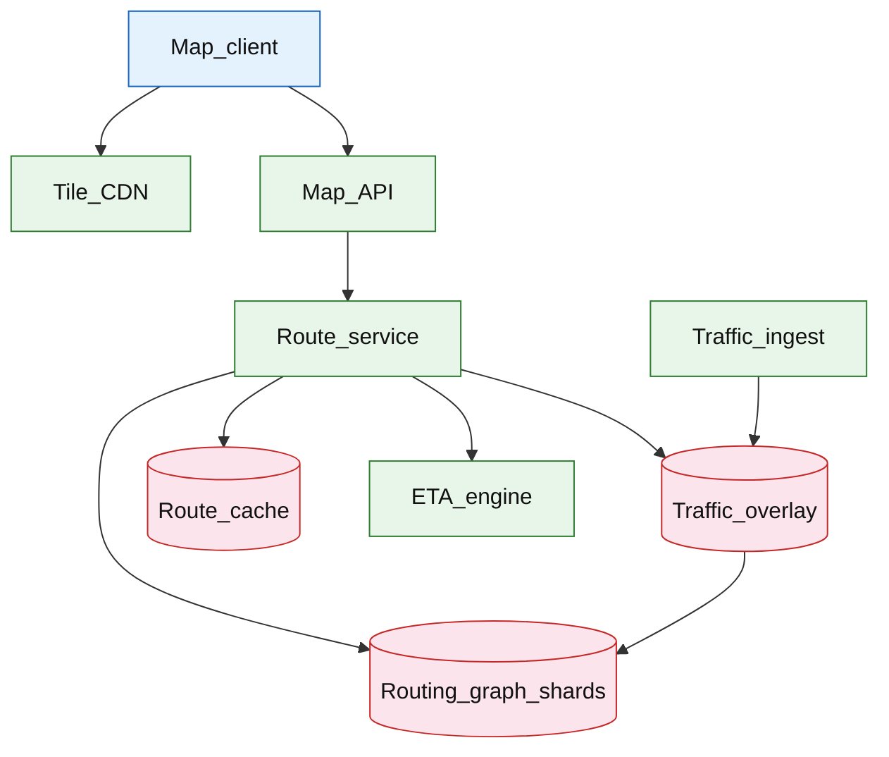

# Maps navigation and routing

## Introduction

A maps navigation service computes **driving routes** over a **road graph**, applies **live traffic** weights, returns turn-by-turn guidance, and **reroutes** when conditions change. **Map tiles** are served separately from **routing compute** to scale each path independently.

**Primary users:** drivers (navigation clients), logistics apps (route API), operators (graph updates, traffic feed health), map data teams (segment closures).

**Interview pacing:** Use [60-minute runbook](../../topics/interview-runbook-60m.md) — ~10 min requirements theater (below), ~18–32 min diagram + API/DB, ~46–56 min deep dive on **routing graph + traffic updates**.

ETA along an active route: [ETA prediction service](./eta-prediction-service.md). Geo discovery: [dating discovery matching](../social/dating-discovery-matching.md).

## Requirements discovery (interview theater)

### Question bank

| Topic | You ask | If they push back | Example answer (reasonable default) |
| --- | --- | --- | --- |
| Mode | Drive only or multimodal? | "Everything" | **Driving** v1; mention walking/transit as separate graphs |
| Graph size | City vs global? | "Global day one" | **Regional shards** (metro + highway corridor); continental coverage via federation |
| Traffic freshness | How stale? | "Real-time" | **1–2 min** probe/incident refresh on hot corridors |
| Reroute | How often? | "Never" | Recompute when delay &gt; **3 min** vs current ETA or road closure event |
| Accuracy | ETA error? | "Perfect" | **P50 &lt; 10%** error urban driving with live traffic |
| Tiles | In scope? | "Routing only" | **Vector/raster tiles** CDN path separate from routing cluster |
| Out of scope | Full map editing, street view? | "Include POI search" | POI geocode mention; focus route + tiles |

### Example dialogue

> **You:** Let's scope v1: one happy path and what's out of scope?
> **Them:** …
> **You:** For scale, prototype vs 12-month target?
> **Them:** …
> **You:** What does each actor do per day on the hot path?
> **Them:** …
> **You:** I'll lock the **target** column assumptions unless you want different numbers — next I'll map fleet totals to monthly AWS meters in **billable volume**.

### Parsed requirements

| Field | Source question | Parsed value (target) | Drives |
| --- | --- | --- | --- |
| `route_requests_peak_r_peak` | Route requests peak (`R_peak`) | **50k/s** | Scale tiers, input model, fleet totals |
| `active_navigations_n_active` | Active navigations (`N_active`) | **20M** | Scale tiers, input model, fleet totals |
| `route_cache_hit_rate` | Route cache hit rate | **35%** | Scale tiers, input model, fleet totals |
| `uncached_pathfinding_r_uncached` | Uncached pathfinding (`R_uncached`) | **32.5k/s** | Scale tiers, input model, fleet totals |
| `traffic_segment_updates/min` | Traffic segment updates/min | **500k** | Scale tiers, input model, fleet totals |
| `reroute_/_traffic_poll_interval` | Reroute / traffic poll interval | **60s** | Scale tiers, input model, fleet totals |
| `road_graph_one_region` | Road graph (one region) | **50M** segments | Scale tiers, input model, fleet totals |
| `s_route_cache` | `S_route_cache` | **2 KB** | Scale tiers, input model, fleet totals |

### Locked assumptions

Fleet system — scale by **route RPS** and **concurrent navigations**, not social DAU. Tile CDN is out of routing CPU path. Use **target** in interviews.

| Assumption | Prototype (MVP) | Growth | Target (anchor) |
| --- | --- | --- | --- |
| Route requests peak (`R_peak`) | 500/s | 5k/s | **50k/s** |
| Active navigations (`N_active`) | 200k | 2M | **20M** |
| Route cache hit rate | 25% | 30% | **35%** |
| Uncached pathfinding (`R_uncached`) | 375/s | 3.5k/s | **32.5k/s** |
| Traffic segment updates/min | 50k | 250k | **500k** |
| Reroute / traffic poll interval | 60s | 60s | **60s** |
| Road graph (one region) | 5M segs | 20M | **50M** segments |
| `S_route_cache` | 2 KB | 2 KB | **2 KB** |

*After ~10 minutes, proceed with the **target** column unless the interviewer changes scope.*

### Interview Q&A cheat sheet

Say aloud in order (~10 min). Write locks into **parsed requirements** before capacity math.

| Step | You ask | Lock if vague (target) |
| --- | --- | --- |
| 1 — Mode | Drive only or multimodal? | **Driving** v1; mention walking/transit as separate graphs |
| 2 — Graph size | City vs global? | **Regional shards** (metro + highway corridor); continental coverage via federation |
| 3 — Traffic freshness | How stale? | **1–2 min** probe/incident refresh on hot corridors |
| 4 — Reroute | How often? | Recompute when delay &gt; **3 min** vs current ETA or road closure event |
| 5 — Accuracy | ETA error? | **P50 &lt; 10%** error urban driving with live traffic |
| 6 — Tiles | In scope? | **Vector/raster tiles** CDN path separate from routing cluster |
| 7 — Out of scope | Full map editing, street view? | POI geocode mention; focus route + tiles |

## Capacity sketch

### User input model

| Action | Actor | Per day (target) | API | ~Size | Durable write |
| --- | --- | --- | --- | --- | --- |
| Route request (new path) | client | **~4.3B** | `POST /v1/routes` | 1 KB req | cache entry 2 KB |
| Traffic overlay tick | system | **~1.7T** poll-equivalent | internal | 32 B | overlay RAM |
| Active trip state | client | 20M concurrent | `PUT trip` | 400 B | **400 B**/trip |
| Tile fetch | client | CDN path | `GET /tiles` | 15 KB | CDN only |
| Reroute event | system | **~29B**/day | internal | 300 B | log (optional) |

### Fleet totals (target)

| Metric | Formula | Value |
| --- | --- | --- |
| Route requests / day | `50k × 86,400` peak-shaped avg lower | **~4.3B/day** (use **~1B** realistic avg) |
| Uncached pathfinding peak | `R_peak × (1-hit)` | **32.5k/s** |
| Traffic overlay updates / day | `500k/min × 1440` | **~720M** patches |
| Active trip OLTP | `N_active × 400 B` | **~8 GB** live |
| Route cache RAM (1h TTL) | churn at 50k/s | **~180 GB** ephemeral |

### Traffic profile (target tier)

Locked **target** assumptions: **50k/s** route peak (`R_peak`), **20M** active trips, **~90%** route cache hit at target.

| Metric | Value |
| --- | --- |
| **Read:write (API requests)** | **10:1** (query/read path : route POST + trip PUT) |
| **Read:write (durable bytes)** | N/A — **~180 GB** route cache + **~8 GB** trips are ephemeral/hot |
| **Requests / day (fleet)** | **~1B** route API (realistic avg); **~720M** traffic patches (internal) |
| **Avg RPS** | **~11.6k/s** routes (avg); tiles via **CloudFront** (separate) |
| **Peak RPS** | **50k/s** route API; **32.5k/s** uncached pathfinding |

| User / actor | Action | R/W | Per user (or actor) / day | % of fleet requests |
| --- | --- | --- | --- | --- |
| Map client | Route request | R/W | ~33 (1B fleet / 30M DAU proxy) | **~70%** (POST; mostly cache hit) |
| Map client | Tile fetch | R | ~200+ (CDN) | **CDN** (not routing OLTP) |
| Active driver | Trip state update | W | ~50 reroutes/day | **~20%** |
| System | Traffic overlay tick | W | — (**720M** patches/day) | internal |
| System | Reroute event | W | ~1,450/trip/day (fleet **29B**) | internal log |

*Per-driver reroute rate fixed; fleet scales with `N_active` and route request volume.*

### AWS service map (target deployment)

| Diagram component | AWS service | Role in this design | Monthly meter (target) |
| --- | --- | --- | |
| Map_client | — (mobile / web) | Tiles + Routes API consumer |
| Tile_CDN | **Amazon CloudFront** | Vector/raster map tiles; **PB-scale** egress (separate cost line) |
| Map_API | **Amazon API Gateway** + **Application Load Balancer** | Trip CRUD, search, reroute subscription |
| Route_service | **Amazon ECS on Fargate** | Cache-aside routing; **50k/s** peak |
| Routing_graph_shards | **Amazon ECS** on **EC2** (memory-optimized) | CH-style graph shards; **6–10** at target |
| Traffic_overlay | **Amazon ElastiCache for Redis** | **~1.6 GB** hot segment speeds; 15 min TTL |
| Route_cache | **Amazon ElastiCache for Redis** | **~180 GB** OD-pair cache; 1h TTL |
| ETA_engine | **Amazon ECS on Fargate** | Segment integration along returned polyline |
| Traffic_ingest | **Amazon Kinesis** + **Amazon ECS** | Probe/incident stream → overlay patches |
| Active_trips store | **Amazon DynamoDB** (or **Aurora**) | **20M** live trips; **400 B**/row |
| Graph snapshots | **Amazon S3** | Versioned routing graph bundles for rollout |
| Observability | **Amazon CloudWatch**, **AWS X-Ray** | Cache hit %, uncached p99, overlay lag |

### Scale tiers

| Tier | `R_peak` | `N_active` | Uncached RPS | Routing shards | Notes |
| --- | --- | --- | --- | --- | --- |
| Prototype | 500/s | 200k | 375/s | **1–2** | single metro |
| Growth | 5k/s | 2M | 3.5k/s | **4–6** | regional |
| Target | 50k/s | 20M | 32.5k/s | **6–10** CH | + CDN tiles |

### Symbols

| Symbol | Meaning |
| --- | --- |
| `R_peak` | Peak route requests/s |
| `N_active` | Concurrent active navigations |
| `h` | Route cache hit ratio (0.35) |
| `T` | Traffic segment updates/min |
| `S` | Segments per graph shard |
| `L_reroute` | Reroute check interval (60s) |

### Derivation (traffic)

**Uncached routing:** `R_peak × (1-h) = 50k × 0.65 = **32,500/s**` full pathfinding.

**Shard capacity:** CH metro **~3k–6k QPS**/beefy node → **~6–10** routing shards + headroom.

**Active navigation overlay:** `N_active / L_reroute = 20M/60 ≈ **330k/s**` lightweight weight refresh (not full route).

**Traffic ingest:** `T = 500k/min ≈ **8.3k/s**` segment patches → in-memory overlay per shard.

**Tile CDN:** **millions/s** — never through routing CPUs ([live video](../media/live-video-streaming.md) lesson).

### Storage and growth over time

| Table / store | ~Row size | Rate (target) | Retention | Steady-state (target) | Per trip |
| --- | --- | --- | --- | --- | --- |
| Road graph (static) | — | weekly build | years | **0.5–2 TB**/country | shared |
| Traffic overlay | 32 B/seg | 500k/min | 15 min | **~1.6 GB** hot | — |
| `route_cache` | 2 KB | 50k/s churn | 1h TTL | **~180 GB** | 1 OD |
| `active_trips` | 400 B | 20M live | live | **~8 GB** | 1 row |
| Reroute log | 300 B | 20M/min | 7d | **~3 TB/week** | optional |

**Traffic durable patches / day:** `500k × 32 B × 1440 ≈ **23 GB/day**`.

### Per-unit economics (target tier)

| Metric | Formula | Target value |
| --- | --- | --- |
| OLTP bytes / active trip | 400 B | **400 B** |
| Route cache bytes / route request (miss) | 2 KB | **2 KB** (ephemeral) |
| Traffic bytes / segment-update | 32 B | **32 B** |
| Graph amortization / MAU | shared TB | discuss **¢/user** not per-trip |

### Service footprint (instance count ballpark)

| Service | Scales with | Prototype | Growth | Target |
| --- | --- | --- | --- | --- |
| Routing CH shards | `R_uncached` | 2 | 6 | **6–10** |
| Route cache cluster | 180 GB | 1 | 3 | **~12** nodes |
| Traffic ingest | `T` | 2 | 6 | **~20** |
| Active trip store | `N_active` | 1 | 4 | **~8** shards |
| Tile CDN | separate | CloudFront | CDN | **CDN** |

**First scale cliff:** **Growth (5k route/s)** — cache hit rate and CH replica count; federation before single-graph memory blow-up.

### Billable volume (target month)

Convert **fleet totals** to AWS billing meters before dollar math. *List-price ballparks — not a quote.*

| Design quantity (target) | Formula | Monthly billable unit |
| --- | --- | --- |
| API requests | `requests_day × 30` | **derive from fleet** (**~1B** route API (realistic avg); **~720M** traffic patches (internal)) |
| OLTP storage steady | storage table | **___ GB-mo** |
| Cache / Redis RAM | footprint | **___ GB** (node tier) |
| Egress / CDN | `egress_day × 30` | **___ GB / mo** |
| Stream / queue events | `events_day × 30` | **___ million events / mo** |
| Log ingest (if full capture) | `log_GB_day × 30` | **___ GB ingest / mo** |
| **Per unit** | `total / scale driver` | **$…/unit/mo** |

*Reconcile rows in **Cloud cost ballpark** (9a) with these meters.*

### Cost at a glance

Interview sound bite — reconcile with **billable volume** and **cloud cost** below.

| Tier | Scale | ~Monthly $ (core) | Per unit |
| --- | --- | --- | --- |
| Prototype (MVP) | see locked assumptions | **~$5k** | platform tax dominates |
| Target (anchor) | `U` or `Q` = **see locked assumptions** | **see cloud cost** | **see cloud cost** |

**First payment block:** smallest prod footprint (load balancer + database + compute) before per-million traffic dominates.

### Cloud cost ballpark (target tier)

| Line item | Driver | ~Monthly |
| --- | --- | --- |
| Routing compute | 10 × 32 vCPU | **~$80k** |
| Route cache RAM | 180 GB | **~$9k** |
| Traffic ingest + overlay | 8.3k/s | **~$15k** |
| Graph storage (EBS) | 2 TB | **~$200** |
| Tile CDN (excl.) | PB egress | **$100k+** separate |
| **Core routing (excl. tiles)** | | **~$105k/mo** |
| **Per million route reqs** | `105k / 4.3M×30` | **~$0.0008/M routes** |
| **Per active navigation** | `105k / 20M` | **~$0.0053/nav-mo** |

### Timeline (prototype → early growth)

| Milestone | `R_peak` | `N_active` | Route cache | ~Monthly $ (routing) |
| --- | --- | --- | --- | --- |
| Launch | 500/s | 200k | 2 GB | **~$5k** |
| Month 3 | 1k/s | 500k | 10 GB | **~$12k** |
| Month 6 | 2.5k/s | 1M | 40 GB | **~$30k** |
| Month 12 | 5k/s | 2M | 80 GB | **~$55k** |

Month 12 is **growth tier** — multi-region graph federation before **50k/s** global peak.

### Sensitivity

| Change | Effect | Response |
| --- | --- | --- |
| **10× route peak** | CH CPU saturation | Raise cache hit; add shards |
| **Uncached long-distance** | Latency spikes | Highway hierarchy precompute |
| **Traffic feed down** | ETA error ↑ | Historical speeds; widen band |
| **10× `N_active`** | Overlay poll CPU | Cheaper incremental edge updates |

## High-level design

### Architecture (user → database)



**Narrative:** **Map client** loads **tiles** from CDN. **Route service** checks **route cache** for `(origin, dest, profile, time_bucket)`; on miss, runs pathfinding on **routing graph shard** with weights from **traffic overlay**. Returns polyline + maneuvers. **ETA engine** integrates segment speeds along path. **Traffic ingest** streams GPS/probe/incidents into overlay. Active trips poll for reroute deltas.

## User-visible surface

- **Driver:** search → pick among 2–3 alternates → start nav → voice/text turns; reroute banner on jam.
- **Developer:** Routes API with departure_time; embed tiles separately.
- **Operator:** traffic feed lag map; graph version rollout canary.

## API contract and input model

### UX → API traceability

| UX / UI action | User intent | API or event | Sync/async | Idempotent? | Validates |
| --- | --- | --- | --- | --- | --- |
| **Driver:** search → pick among 2–3 alternates → start nav → | Compute route(s) | `POST` `/v1/routes` | sync | yes | domain rules |
| **Developer:** Routes API with departure_time; embed tiles s | Fetch cached route + updates | `GET` `/v1/routes/{route_id}` | sync | read | domain rules |
| **Operator:** traffic feed lag map; graph version rollout ca | Active trip reroute | `POST` `/v1/navigations/{id}/reroute` | sync | yes | domain rules |
| See user-visible surface | Vector tiles (CDN) | `GET` `/v1/tiles/{z}/{x}/{y}.mvt` | sync | read | domain rules |
| See user-visible surface | Address → lat/lon (sketch) | `GET` `/v1/geocode` | sync | read | domain rules |
### Endpoints

| Method | Path | Purpose |
| --- | --- | --- |
| `POST` | `/v1/routes` | Compute route(s) |
| `GET` | `/v1/routes/{route_id}` | Fetch cached route + updates |
| `POST` | `/v1/navigations/{id}/reroute` | Active trip reroute |
| `GET` | `/v1/tiles/{z}/{x}/{y}.mvt` | Vector tiles (CDN) |
| `GET` | `/v1/geocode` | Address → lat/lon (sketch) |

### Example payloads

`POST /v1/routes`

```json
{
 "origin": { "lat": 37.7749, "lon": -122.4194 },
 "destination": { "lat": 37.7849, "lon": -122.4094 },
 "profile": "driving",
 "departure_time": "2026-05-23T20:00:00Z",
 "alternatives": 2
}
```

Response `200 OK`:

```json
{
 "route_id": "route_8f2a1c",
 "routes": [
 {
 "route_id": "route_8f2a1c_alt0",
 "distance_m": 4200,
 "duration_sec": 720,
 "polyline": "encoded_polyline...",
 "legs": [
 {
 "maneuver": "turn-right",
 "instruction": "Turn right onto Market St",
 "distance_m": 200
 }
 ]
 }
 ],
 "traffic_model": "live",
 "expires_at": "2026-05-23T20:15:00Z"
}
```

`POST /v1/navigations/nav_7k2m/reroute`

```json
{
 "current_position": { "lat": 37.7760, "lon": -122.4180 },
 "route_id": "route_8f2a1c_alt0"
}
```

Response when faster path found:

```json
{
 "reroute": true,
 "new_route_id": "route_9b3d",
 "time_saved_sec": 180,
 "reason": "incident_closure"
}
```

`GET /v1/tiles/14/2621/6332.mvt` — served from CDN (Cache-Control long TTL for basemap; shorter for traffic overlay layer if composite).

### Input validation

- Snap origin/destination to nearest drivable segment.
- Reject profiles not supported.
- `route_id` bound to graph version — invalidate cache on graph deploy.

## Database model

### Stores

| Store | Key fields | Notes |
| --- | --- | --- |
| `road_segments` | `segment_id`, `geometry`, `speed_limit`, `flags` | Static graph |
| `graph_shards` | `shard_id`, `bbox`, `version` | Regional partition |
| `traffic_updates` | `segment_id`, `speed_mps`, `incident`, `observed_at` | Overlay |
| `route_cache` | `origin_cell`, `dest_cell`, `profile`, `time_bucket`, `route_blob`, `expires_at` | OD cache |
| `navigations` | `nav_id`, `user_id`, `route_id`, `state` | Active trips |

Indexes:

- `traffic_updates(segment_id)` latest timestamp
- Geospatial: segment spatial index for map-matching GPS probes

### Read/write paths

1. **Route** — geocode snap → cache lookup → if miss, CH query on shard graph with traffic weights → store cache → return.
2. **Traffic ingest** — stream updates → apply to overlay → affected segments flag reroute candidates.
3. **Active nav** — every 60s: compare remaining path weights → if delta &gt; threshold, partial reroute from current position.
4. **Tiles** — CDN fetch static layers; optional dynamic traffic tile layer from overlay snapshot.
5. **Graph update** — versioned release; dual-run canary; invalidate route cache keys tagged old version.

## Interview deep dive: Routing graph + traffic updates

### Graph representation

| Approach | Query time | Update cost | Interview |
| --- | --- | --- | --- |
| Raw adjacency Dijkstra | Slow | Easy | Too slow continent-scale |
| **Contraction Hierarchies (CH)** | Fast query | Preprocess on graph change | Default driving |
| A* with landmarks | Good metro | Medium | Acceptable city-only |

**Sharding:** highway graph + city subgraph; long trips use hierarchy **highway → local**.

### Traffic overlay vs static graph

- **Static:** topology, speed limits, one-ways.
- **Dynamic overlay:** live speeds, incidents, closures — **does not** re-cut graph every minute.
- Edge weight = `length / effective_speed` from overlay or historical profile by time-of-day.

**Freshness:** probes aggregated per segment every 1–2 min; incidents push immediate closure (infinite weight).

### Caching

- Cache key: quantized origin/dest cells (geohash level 7) + profile + 15-min time bucket.
- **35% hit** in urban commutes — huge CPU savings.
- Invalidate on graph version bump or major incident corridor flag.

### Reroute policy

- Do not recompute full path every GPS tick — expensive.
- Trigger: ETA slip &gt; 3 min, user off-route, closure on upcoming segment.
- **Partial reroute:** A* from current node to destination on same shard.

### Tile vs route separation

| Path | Scale mechanism |
| --- | --- |
| **Tiles** | CDN cache immutable z/x/y |
| **Routes** | Stateful CPU cluster + cache |

Mixing tile generation into route servers causes noisy neighbor on navigation spikes.

### Fallback when traffic feed degrades

- Use **historical speed profiles** (Sunday 8pm pattern).
- Widen ETA confidence band; surface “traffic data limited” in client.

## Scale and failure

### Correctness model

- Route never traverses known closed segment after closure event applied (eventual seconds lag).
- Cached route tagged with graph version — never mix versions in reroute.
- Map-matching snaps GPS to drivable graph for reroute start.

### Failure cases

| Failure | Symptom | Mitigation |
| --- | --- | --- |
| Traffic feed stale | ETA drift | Fallback historical; alert feed lag |
| Graph shard wrong | No route | Federated cross-shard boundary nodes |
| Cache stampede | CPU spike | Request coalescing per OD key |
| Over-reroute | UX annoyance | Hysteresis threshold |
| Tile CDN miss | Slow map paint | Origin shield |
| CH preprocess lag | Delayed deploy | Prebuilt nightly + delta incidents |
| Hot corridor incident | Everyone reroutes | Capacity plan reroute shards |

### Key metrics

- Route compute p50/p99; cache hit ratio
- Traffic overlay age per segment
- Reroute rate per active nav; ETA error distribution
- Tile CDN hit ratio (separate)
- Graph version rollout success
- Cross-shard route failure rate

### Interview deep dive talking points

- **50k route RPS** — CH + 35% cache; tiles on CDN not routing CPUs.
- Static graph + **traffic overlay** — don’t rebuild graph every minute.
- Shard by region; highway hierarchy for long trips.
- Reroute triggers with hysteresis — not every GPS update.
- Traffic down → historical speeds + honest ETA confidence.

## Related

- [Examples hub](./README.md)
- [ETA prediction service](./eta-prediction-service.md)
- [Real-time delivery tracking](./real-time-delivery-tracking.md)
- [Dating discovery matching](../social/dating-discovery-matching.md)
- [AWS reference layout](../../topics/aws-reference-layout.md) (CDN)
- [60-minute runbook](../../topics/interview-runbook-60m.md)
