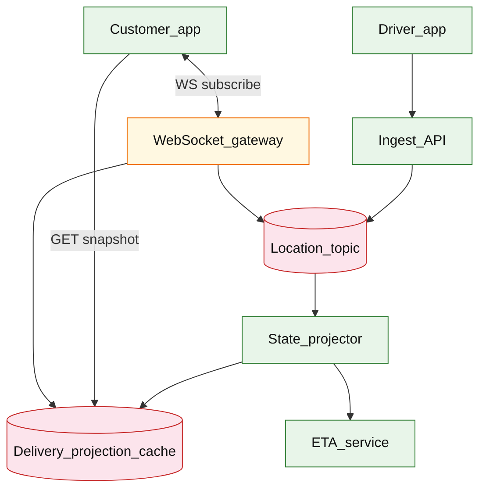

# Real-time delivery tracking

## Introduction

Real-time delivery tracking shows customers a **live map position** and ETA for an active delivery. Driver phones emit **high-frequency location pings**; a stream pipeline projects **latest state**; customer apps subscribe over **WebSocket** with **snapshot + resume** after network drops.

**Primary users:** customers (track order on map), drivers (background location upload), dispatch ops (stale-location alerts), support (replay last known position).

**Interview pacing:** Use [60-minute runbook](../../topics/interview-runbook-60m.md) — ~10 min requirements theater (below), ~18–32 min diagram + API/DB, ~46–56 min deep dive on **stream projection + reconnect semantics**.

Assignment timing lives in [delivery dispatch matching](./delivery-dispatch-matching.md); ETA modeling in [ETA prediction service](./eta-prediction-service.md).

## Requirements discovery (interview theater)

### Question bank

| Topic | You ask | If they push back | Example answer (reasonable default) |
| --- | --- | --- | --- |
| Users & scale | Active deliveries? Concurrent viewers? | "Food delivery scale" | 2M active deliveries/day; **~200k concurrent** customer streams at dinner peak |
| Update latency | How fresh must the dot be? | "Real-time" | **p99 &lt; 3s** customer-visible lag from driver ping to UI |
| Driver ping rate | Every second? | "Battery matters" | **5–15s** adaptive interval; burst to 3s near drop-off |
| Precision | GPS noise? | "Exact path" | 10–50m accuracy OK; **smooth** display; store raw + filtered |
| Reconnect | App backgrounded? | "Reload page" | Snapshot + `resume_token`; miss at-most **30s** of trail optional |
| History | Full breadcrumb forever? | "Live only" | Hot trail **2 hours** in stream store; cold archive async |
| Out of scope | Route optimization, fraud? | "Add chat" | Defer driver-customer chat, dispatch reassignment UI |

### Example dialogue

> **You:** Let's scope v1: one happy path and what's out of scope?
> **Them:** …
> **You:** For scale, prototype vs 12-month target?
> **Them:** …
> **You:** What does each actor do per day on the hot path?
> **Them:** …
> **You:** I'll lock the **target** column assumptions unless you want different numbers — next I'll map fleet totals to monthly AWS meters in **billable volume**.

### Parsed requirements

| Field | Source question | Parsed value (target) | Drives |
| --- | --- | --- | --- |
| `deliveries_/_day` | Deliveries / day | **8M** | Scale tiers, input model, fleet totals |
| `concurrent_active_deliveries_d` | Concurrent active deliveries (`D`) | **200k** | Scale tiers, input model, fleet totals |
| `customer_ws_streams_peak_s_peak` | Customer WS streams peak (`S_peak`) | **200k** | Scale tiers, input model, fleet totals |
| `driver_pings_peak_p_peak` | Driver pings peak (`P_peak`) | **250k/s** | Scale tiers, input model, fleet totals |
| `ping_payload_b` | Ping payload `B` | **120 B** | Scale tiers, input model, fleet totals |
| `customer_lag_p99` | Customer lag p99 | **3s** E2E | Hot path, deep dive |
| `stream_partition_key` | Stream partition key | **same** | Scale tiers, input model, fleet totals |
| `ui_emit_throttle` | UI emit throttle | **max 1/2s** | Storage steady-state |
| `viewers_per_delivery_e` | Viewers per delivery `E` | **1** (default) | Scale tiers, input model, fleet totals |

### Locked assumptions

Fleet system — scale by **concurrent deliveries**, **ping rate**, and **live streams** (not shopper DAU). Aligns with [dispatch](./delivery-dispatch-matching.md) **8M deliveries/day**. Use **target** in interviews.

| Assumption | Prototype (MVP) | Growth | Target (anchor) |
| --- | --- | --- | --- |
| Deliveries / day | 80k | 800k | **8M** |
| Concurrent active deliveries (`D`) | 2k | 20k | **200k** |
| Customer WS streams peak (`S_peak`) | 2k | 20k | **200k** |
| Driver pings peak (`P_peak`) | 2.5k/s | 25k/s | **250k/s** |
| Ping payload `B` | 120 B | 120 B | **120 B** |
| Customer lag p99 | 5s | 4s | **3s** E2E |
| Stream partition key | `delivery_id` | same | same |
| UI emit throttle | 1/2s | 1/2s | **max 1/2s** |
| Viewers per delivery `E` | 1 | 1 | **1** (default) |

*After ~10 minutes, proceed with the **target** column unless the interviewer changes scope.*

### Interview Q&A cheat sheet

Say aloud in order (~10 min). Write locks into **parsed requirements** before capacity math.

| Step | You ask | Lock if vague (target) |
| --- | --- | --- |
| 1 — Users & scale | Active deliveries? Concurrent viewers? | 2M active deliveries/day; **~200k concurrent** customer streams at dinner peak |
| 2 — Update latency | How fresh must the dot be? | **p99 &lt; 3s** customer-visible lag from driver ping to UI |
| 3 — Driver ping rate | Every second? | **5–15s** adaptive interval; burst to 3s near drop-off |
| 4 — Precision | GPS noise? | 10–50m accuracy OK; **smooth** display; store raw + filtered |
| 5 — Reconnect | App backgrounded? | Snapshot + `resume_token`; miss at-most **30s** of trail optional |
| 6 — History | Full breadcrumb forever? | Hot trail **2 hours** in stream store; cold archive async |
| 7 — Out of scope | Route optimization, fraud? | Defer driver-customer chat, dispatch reassignment UI |

## Capacity sketch

### User input model

| Action | Actor | Per day (target) | Unit | ~Size | Durable write |
| --- | --- | --- | --- | --- | --- |
| Driver location ping | driver | **~4.3B** (avg lower) | `POST /v1/driver/location` | 120 B | stream only |
| Project latest state | system | ≈ pings | consumer | 300 B | Redis projection |
| Customer WS update | system | **~8.6M** active hours | WS push | 200 B | ephemeral |
| Snapshot on connect | customer | **~20M** | `GET .../snapshot` | 300 B | read cache |
| Delivery header OLTP | intake | 8M | create row | 500 B | **500 B**/delivery |

### Fleet totals (target)

| Metric | Formula | Value |
| --- | --- | --- |
| Pings / day (avg ~50k/s) | `50k × 86,400` | **~4.3B** |
| Stream ingress / day (compressed) | `× 120 B` | **~150–500 GB** |
| WS egress avg | `S_peak / 2s × 200 B` | **~20 MB/s** at peak viewers |
| OLTP delivery headers / day | 8M × 500 B | **~4 GB** |
| Projection RAM | `D × 300 B` | **~60 MB** |

### Traffic profile (target tier)

Locked **target** assumptions: **200k** concurrent deliveries (`D`), **250k/s** location ping peak (`P_peak`), **200k** peak WS subscribers (`S_peak`).

| Metric | Value |
| --- | --- |
| **Read:write (API requests)** | **1:216** (snapshots : location POSTs) |
| **Read:write (durable bytes)** | **1:40** (OLTP headers **~4 GB/day** : stream **~150–500 GB/day**) |
| **Requests / day (fleet)** | **~4.33B** (**~4.3B** pings + **20M** snapshots + **8M** headers) |
| **Avg RPS** | **~50k/s** (ping-dominated) |
| **Peak RPS** | **250k/s** ingest; **~100k/s** WS fan-out at **200k** viewers |

| User / actor | Action | R/W | Per user (or actor) / day | % of fleet requests |
| --- | --- | --- | --- | --- |
| Driver | Location ping | W | ~21,500 (active 2h) | **~99%** |
| Customer | WS live map | R | ~1,800 updates/hour viewed | ephemeral egress |
| Customer | Snapshot on connect | R | ~2.5 (fleet **20M**) | **&lt;1%** |
| Intake | Delivery header create | W | — (fleet **8M**) | **&lt;1%** |
| Projector (system) | Consume + project | W | ≈ pings | internal |

*Ping interval (~5s) fixed per driver; fleet scales with active deliveries and viewer multiplexing.*

### AWS service map (target deployment)

| Diagram component | AWS service | Role in this design | Monthly meter (target) |
| --- | --- | --- | |
| Driver_app | — (mobile client) | `POST /v1/driver/location`; not AWS |
| Ingest_API | **Application Load Balancer** + **Amazon ECS on Fargate** | Validate + append to log at **250k/s** peak |
| Location_topic | **Amazon MSK** (Kafka) | Durable location stream; partition by `delivery_id` |
| State_projector | **Amazon ECS on Fargate** (MSK consumer) | Latest-value projection; **~128** consumers at target |
| Delivery_projection_cache | **Amazon ElastiCache for Redis** | **~60 MB** hot `delivery:{id}` snapshot |
| WebSocket_gateway | **Amazon API Gateway** (WebSocket API) + **ECS** | **200k** subscriber fan-out; **~20 MB/s** peak egress |
| Customer_app | — (mobile / web) | WS subscribe + snapshot read |
| ETA_service | **Amazon ECS** (see [ETA prediction](./eta-prediction-service.md) | Downstream consumer of location topic |
| Deliveries OLTP | **Amazon Aurora PostgreSQL** | **8M** headers/day; **~500 B**/row |
| Observability | **Amazon CloudWatch**, **AWS X-Ray** | Consumer lag, WS connect count, ingest p99 |

### Scale tiers

| Tier | `D` | `P_peak` | `S_peak` | WS egress (peak) | Stream GB/day |
| --- | --- | --- | --- | --- | --- |
| Prototype | 2k | 2.5k/s | 2k | **~0.2 MB/s** | **~15 GB** |
| Growth | 20k | 25k/s | 20k | **~2 MB/s** | **~80 GB** |
| Target | 200k | 250k/s | 200k | **~20 MB/s** | **~150–500 GB** |

### Symbols

| Symbol | Meaning |
| --- | --- |
| `D` | Concurrent active deliveries |
| `P_peak` | Peak driver pings/s |
| `S_peak` | Peak customer WebSocket streams |
| `B` | Bytes per ping on wire |
| `E` | Viewers per delivery (default 1) |
| `L_ui` | UI update interval (2s) |

### Derivation (traffic)

**Driver ingest:** `P_peak = 250k/s`; `P_peak × B ≈ **30 MB/s**` (+ TLS → plan **~50 MB/s** ingress).

**Partitions:** 256 partitions → **~1k msgs/s/partition** at peak.

**Projection writes:** latest-value cache **~250k writes/s** (not OLTP per ping).

**WebSocket egress:** `S_peak / L_ui × 200 B ≈ **100k msgs/s** → **~20 MB/s** (+ TLS).

**Reconnect storm:** 5%/min of `S_peak` → **~10k snapshot reads/s** — serve from Redis.

**End-to-end lag budget:** ingest 0.5s + consumer 1s + gateway 0.5s + client smooth 1s ≈ **3s p99**.

### Storage and growth over time

| Table / store | ~Row size | Rate (target) | Retention | Steady-state (target) | Per delivery |
| --- | --- | --- | --- | --- | --- |
| `deliveries` | 500 B | 8M/day | 1y | **~1.5 TB** | 1 row |
| Location topic | 120 B/ping | 250k/s peak | 2h | **~180 GB** window | ~900 pings/2h |
| `delivery_projection` | 300 B | 200k keys | live | **~60 MB** | latest |
| `stream_offsets` | 100 B | 200k WS | minutes | **~20 MB** | resume |

**Stream volume:**

| Horizon | Raw pings (order-of-magnitude) | Compressed topic |
| --- | --- | --- |
| 1 day | 4.3B | **~150–500 GB** |
| 30 days | — | retention-bound, not cumulative |

### Per-unit economics (target tier)

| Metric | Formula | Target value |
| --- | --- | --- |
| OLTP bytes / delivery-day | header only | **~500 B** |
| Stream bytes / active delivery (2h) | 900 × 120 B | **~108 KB** |
| WS bytes / viewer-hour | 1800 updates × 200 B | **~360 KB** |
| Projection RAM / concurrent delivery | 300 B | **~300 B** |

### Service footprint (instance count ballpark)

| Service | Scales with | Prototype | Growth | Target |
| --- | --- | --- | --- | --- |
| Ingest API | `P_peak` | 2 | 15 | **~80** |
| Kafka / topic brokers | ingress GB/s | 3 | 9 | **~30** |
| Projector consumers | partitions | 4 | 32 | **~128** |
| WS gateway | `S_peak`, egress | 2 | 20 | **~150** |
| Projection Redis | `D` | 1 | 3 | **~6** |

**First scale cliff:** **Growth (25k pings/s)** — projector consumer lag; add partitions before **250k/s**.

### Billable volume (target month)

Convert **fleet totals** to AWS billing meters before dollar math. *List-price ballparks — not a quote.*

| Design quantity (target) | Formula | Monthly billable unit |
| --- | --- | --- |
| API requests | `requests_day × 30` | **derive from fleet** (**~4.33B** (**~4.3B** pings + **20M** snapshots + **8M** headers)) |
| OLTP storage steady | storage table | **___ GB-mo** |
| Cache / Redis RAM | footprint | **___ GB** (node tier) |
| Egress / CDN | `egress_day × 30` | **___ GB / mo** |
| Stream / queue events | `events_day × 30` | **___ million events / mo** |
| Log ingest (if full capture) | `log_GB_day × 30` | **___ GB ingest / mo** |
| **Per unit** | `total / scale driver` | **$…/unit/mo** |

*Reconcile rows in **Cloud cost ballpark** (9a) with these meters.*

### Cost at a glance

Interview sound bite — reconcile with **billable volume** and **cloud cost** below.

| Tier | Scale | ~Monthly $ (core) | Per unit |
| --- | --- | --- | --- |
| Prototype (MVP) | see locked assumptions | **~$1k** | platform tax dominates |
| Target (anchor) | `U` or `Q` = **see locked assumptions** | **see cloud cost** | **see cloud cost** |

**First payment block:** smallest prod footprint (load balancer + database + compute) before per-million traffic dominates.

### Cloud cost ballpark (target tier)

| Line item | Driver | ~Monthly |
| --- | --- | --- |
| Stream cluster | 500 GB/day × RF | **~$25k** |
| Ingest + projector compute | ~200 pods | **~$20k** |
| WS gateway + egress | 20 MB/s peak | **~$15k** |
| Redis projection | 60 MB + IOPS | **~$2k** |
| Deliveries OLTP | 1.5 TB | **~$4k** |
| **Total (tracking slice)** | | **~$66k/mo** |
| **Per concurrent delivery** | `66k / 200k` | **~$0.33/D-mo** |
| **Per delivery-day** | `66k / (8M×30)` | **~$0.00028** |

### Timeline (prototype → early growth)

| Milestone | `D` | `P_peak` | Stream/day | ~Monthly $ |
| --- | --- | --- | --- | --- |
| Launch | 2k | 2.5k/s | 15 GB | **~$1k** |
| Month 3 | 5k | 6k/s | 40 GB | **~$3k** |
| Month 6 | 12k | 15k/s | 100 GB | **~$8k** |
| Month 12 | 20k | 25k/s | 80 GB | **~$15k** |

Month 12 is **growth tier** — partition + gateway autoscale before **200k** concurrent viewers.

### Sensitivity

| Change | Effect | Response |
| --- | --- | --- |
| **10× viewers (`E`)** | WS egress × E | Multiplex gateway; cap shared links |
| **1s ping interval** | 3× ingest + projection | Adaptive interval near drop-off only |
| **10× `P_peak`** | Broker + projector lag | More partitions; latest-value cache |
| **Sub-second SLO** | Smoothing vs lag | Colocate gateway + projector; less smooth window |

## High-level design

### Architecture (user → database)



**Narrative:** `Ingest_API` validates driver session, assigns monotonic `seq`, publishes to `Location_topic` keyed by `delivery_id`. `State_projector` updates `Delivery_projection_cache` (latest lat/lon, heading, smoothed point) and may call `ETA_service` on significant movement. `WebSocket_gateway` pushes deltas to subscribed customers; on connect, clients fetch **snapshot** then attach stream with `resume_token` to fill gaps.

## User-visible surface

- **Customer:** map marker moves smoothly; ETA updates; badge when connection “catching up” after reconnect.
- **Driver:** background upload with adaptive interval; visible upload failures with retry queue.
- **Support:** read last snapshot and recent trail from ops API.

## API contract and input model

### UX → API traceability

| UX / UI action | User intent | API or event | Sync/async | Idempotent? | Validates |
| --- | --- | --- | --- | --- | --- |
| **Customer:** map marker moves smoothly; ETA updates; badge | Ingest ping (driver auth) | `POST` `/v1/driver/location` | sync | yes | domain rules |
| **Driver:** background upload with adaptive interval; visibl | Bootstrap map state | `GET` `/v1/deliveries/{delivery_id}/ | sync | read | domain rules |
| **Support:** read last snapshot and recent trail from ops AP | Live updates + resume | `WS` `/v1/deliveries/{delivery_id}/ | async | yes | domain rules |
| See user-visible surface | Optional recent breadcrumb (ops/support) | `GET` `/v1/deliveries/{delivery_id}/ | sync | read | domain rules |
### Endpoints

| Method | Path | Purpose |
| --- | --- | --- |
| `POST` | `/v1/driver/location` | Ingest ping (driver auth) |
| `GET` | `/v1/deliveries/{delivery_id}/snapshot` | Bootstrap map state |
| `WS` | `/v1/deliveries/{delivery_id}/stream` | Live updates + resume |
| `GET` | `/v1/deliveries/{delivery_id}/trail` | Optional recent breadcrumb (ops/support) |

### Example payloads

`POST /v1/driver/location`

```json
{
 "delivery_id": "del_9f2a1c",
 "driver_id": "drv_4412",
 "seq": 1842,
 "observed_at": "2026-05-22T18:00:00.123Z",
 "lat": 37.7749,
 "lon": -122.4194,
 "accuracy_m": 12.5,
 "speed_mps": 8.2,
 "heading_deg": 145
}
```

Response `202 Accepted`:

```json
{
 "accepted_seq": 1842
}
```

`GET /v1/deliveries/del_9f2a1c/snapshot`

```json
{
 "delivery_id": "del_9f2a1c",
 "status": "IN_TRANSIT",
 "latest": {
 "seq": 1842,
 "lat": 37.7749,
 "lon": -122.4194,
 "smoothed_lat": 37.7751,
 "smoothed_lon": -122.4190,
 "observed_at": "2026-05-22T18:00:00.123Z"
 },
 "eta_minutes": 14,
 "stream_resume_token": "rt_01HZXK9Q2M3N4P5Q6R7S8T9U0",
 "as_of": "2026-05-22T18:00:00.200Z"
}
```

WebSocket message (server → client)

```json
{
 "type": "location_update",
 "delivery_id": "del_9f2a1c",
 "seq": 1843,
 "smoothed_lat": 37.7753,
 "smoothed_lon": -122.4186,
 "observed_at": "2026-05-22T18:00:05.100Z",
 "eta_minutes": 13
}
```

Client reconnect (query param or first frame)

```json
{
 "type": "resume",
 "resume_token": "rt_01HZXK9Q2M3N4P5Q6R7S8T9U0",
 "last_seen_seq": 1840
}
```

Server may replay gap events with `seq > 1840` then live stream.

### Input validation

- Driver token must match `delivery_id` assignment.
- `seq` monotonic per `delivery_id`; reject `seq <= last_accepted` (idempotent retry OK).
- `lat/lon` within valid ranges; drop pings with `accuracy_m > 200` (interview tunable).
- Customer subscribe: auth customer owns order linked to `delivery_id`.
- Rate limit driver ingest: max 1 ping / 2s unless `near_dropoff` flag.

## Database model

### Stores

| Store | Key fields | Notes |
| --- | --- | --- |
| `location_topic` | partition=`delivery_id`, `seq`, payload | Ordered log; retention 24–48h |
| `delivery_projection` | `delivery_id`, `latest_seq`, smoothed lat/lon, `eta_minutes`, `updated_at` | Hot read for snapshot |
| `driver_locations` (cold) | `delivery_id`, `seq`, lat, lon, `observed_at` | Optional analytics trail |
| `stream_offsets` | `client_id`, `delivery_id`, `resume_token`, `last_seq`, `updated_at` | Gateway reconnect aid |

Indexes:

- `delivery_projection(delivery_id)` PK
- `driver_locations(delivery_id, seq)` for trail queries
- `stream_offsets(resume_token)` UNIQUE

### Read/write paths

1. **Ingest** — auth driver → validate `seq` → publish to `location_topic` → return 202 (async projection).
2. **Project** — consumer reads topic → smooth point → `SET delivery_projection` → if moved &gt; threshold, refresh ETA → fanout to gateway channel.
3. **Snapshot** — read `delivery_projection` + generate `stream_resume_token` bound to current log offset.
4. **Subscribe** — gateway registers WS → pushes updates from projection pub/sub or topic tailer.
5. **Resume** — map `resume_token` → offset → replay `seq > last_seen_seq` from topic buffer → switch to live.

## Interview deep dive: Stream projection + reconnect semantics

### Why topic + projection

| Approach | Pros | Cons |
| --- | --- | --- |
| Write pings directly to DB | Simple | 250k writes/s to OLTP is painful |
| **Log + projection** | Durable ordering; replay | Extra consumer lag to monitor |
| CRDT location merge | Partition tolerant | Overkill for single driver per delivery |

**Ordering:** partition by `delivery_id` guarantees **per-delivery total order** of `seq`. Cross-delivery order irrelevant.

### Projection lag budget

`ingest → topic → projector → cache → gateway → client`

- Target p99 **3s**: budget ~500ms ingest, ~1s consumer lag, ~500ms gateway, ~1s client smoothing buffer.
- Metric: **lag = now - observed_at** at customer device.

### Reconnect protocol

1. **Snapshot first** — always render map from `GET snapshot` (avoid blank map).
2. **Resume token** — encodes topic offset or `(delivery_id, seq)` cursor with HMAC.
3. **Replay gap** — server sends missed events `seq ∈ (last_seen, latest]` from topic retention.
4. **Retention bound** — if gap &gt; retention, snapshot only + live forward (tell client trail incomplete).

**Stale token:** return snapshot + fresh token; do not error hard.

### Smoothing vs freshness

- Store **raw** ping; project **smoothed** point for UI.
- Throttle UI emits to **2 Hz** even if pings arrive 1 Hz — reduces WS egress.
- Near drop-off: increase ping rate + reduce smoothing window.

### Fanout variants

| Pattern | When |
| --- | --- |
| 1:1 customer stream | Default |
| Shared link (family tracking) | `E` viewers per delivery — gateway multiplexes; egress × E |
| Poll fallback | `GET snapshot` every 10s if WS blocked — higher load, worse UX |

## Scale and failure

### Correctness model

- Per `delivery_id`, customers never see `seq` go backwards after reconnect replay.
- Snapshot reflects **committed projection** at read time (may be slightly behind tail).
- Duplicate driver pings with same `seq` are idempotent no-ops.
- ETA is **best effort** — eventual refresh; not transactional with location.

### Failure cases

| Failure | Symptom | Mitigation |
| --- | --- | --- |
| Projector lag | Stale dot on map | Scale consumers; alert on lag p99; temporary poll snapshot |
| Topic retention miss | Gap on resume | Snapshot + live only; extend retention for peak hours |
| Gateway overload | WS disconnect storm | Autoscale gateway; backoff reconnect jitter |
| GPS noise | Jittery marker | Smoothing filter; accuracy threshold |
| Driver offline | Dot frozen | Show “last updated Xm ago”; gray marker |
| Hot delivery viral | Many viewers | Cap viewers; CDN not applicable to WS — shard gateway |
| Ingest auth bypass | Spoofed location | mTLS driver token; rate limit per driver |

### Key metrics

- End-to-end lag p50/p99 (`observed_at` → client render)
- Projector consumer lag; projection update rate
- Active WebSocket streams; egress Mbps
- Reconnect rate; resume success vs snapshot-only fallback
- Driver ping interval distribution; upload error rate
- Stale location incidents (&gt; 60s without update while IN_TRANSIT)

### Interview deep dive talking points

- Walk **200k streams / 250k pings/s** before architecture boxes.
- Defend **log + projection** vs writing every ping to MySQL.
- Specify **snapshot → resume → replay → live** reconnect sequence.
- Trade **smoothing** vs **3s SLO** explicitly.
- Close with gateway scaling and shared-link fanout multiplier.

## Related

- [Examples hub](./README.md)
- [Delivery dispatch matching](./delivery-dispatch-matching.md)
- [ETA prediction service](./eta-prediction-service.md)
- [Shopping cart checkout](../commerce/shopping-cart-checkout.md)
- [Stream processing platform](../event-driven/stream-processing-platform.md)
- [60-minute runbook](../../topics/interview-runbook-60m.md)
