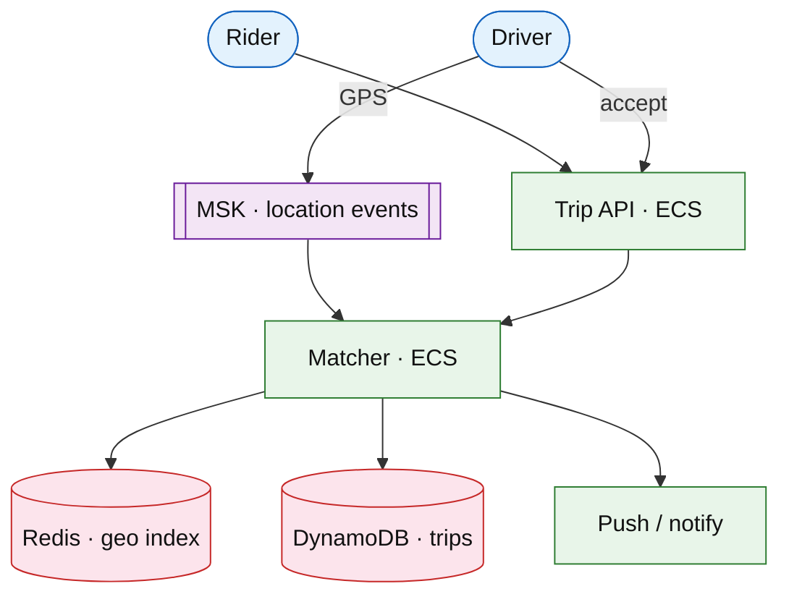

# Rideshare on-demand matching

## Introduction

Rideshare matches **riders** to nearby **drivers**. **Nowadays** interviews expect geo indexing plus **experiment-flagged matchers**, **push offers**, **cell-level SLOs**, **OTel** on match latency, and **auto-scale / auto-pause** from lag alarms—not only a Redis geo set sketch.

**Primary users:** riders, drivers, operators (surge, supply).

**Interview pacing:** [60-minute runbook](../../topics/interview-runbook-60m.md) — deep dive **supply/demand matching + surge**.

Distinct from [delivery dispatch](./delivery-dispatch-matching.md): both sides are consumers; **geo-indexed supply** dominates.

## Requirements discovery

### Interview Q&A cheat sheet

| Step | Lock (target) |
| --- | --- |
| Scale | 20M trips/day; peak city 50k online drivers |
| Match latency | Match p99 &lt; 15 s (offer accepted or re-offer) |
| Location | Driver GPS every 3–5 s; drop stale points &gt; 15 s |
| Pricing | Surge by geohash cell; fairness constraints |
| Mobile | Push offer + thin poll fallback ([notifications](../../topics/notifications.md)) |
| Out of scope | Autonomous fleet routing |

### Parsed requirements

| Field | Target |
| --- | --- |
| Peak request RPS (global) | ~30k/s |
| Offer TTL | 15 s |
| Location events | ~50k drivers × 0.25 Hz ≈ 12.5k events/s/city peak |

## Capacity sketch

| AWS service | Role |
| --- | --- |
| DynamoDB | Trips, offers, driver session state |
| ElastiCache | Geo supply index, surge multipliers |
| Amazon MSK | Location + trip events |
| ECS Fargate | Trip API, matcher, pricing |
| API Gateway + ALB | Mobile APIs |
| SNS / push providers | Driver/rider offers |

### Store comparison

| Store | Why |
| --- | --- |
| Redis geo | Hot radius queries; TTL on presence |
| DynamoDB | Durable trip/offer state; conditional writes |
| MSK | Ordered location stream per driver partition key |

## Architecture (user → database)

**Narrative:** Location events land on **MSK** (partition `driver_id`). Matcher updates **Redis geo**, scores candidates (ETA, rating, cancel rate), sends **time-bound offers** via push. Accept uses **conditional write** on trip state. Surge reads demand/supply per cell (cached).

## API contract

| UX | API |
| --- | --- |
| Request trip | `POST /v1/trips` (idempotency key) |
| Driver location | `POST /v1/drivers/location` or MQTT/gateway → stream |
| Accept offer | `POST /v1/offers/{id}/accept` |
| Trip status | `GET /v1/trips/{id}` + push/WS updates |

## Deep dive: matching + surge

- **Geohash cells**; cap candidates evaluated (budget for p99).
- **Top-K batch offers**; first accept wins; others expire.
- **Surge:** `multiplier = f(wait, density)` per cell; clamp + fairness.
- **Experiments:** matcher weights behind [feature flags](../platform/feature-flag-platform.md); shadow score without affecting assign.
- **Never** call push providers on the synchronous accept path—enqueue notification intent ([notifications](../../topics/notifications.md)).

## Scale, failure, and modern ops

| Failure | Detection | Mitigation |
| --- | --- | --- |
| Match p99 burn | SLO burn alarm | Scale matcher; widen cell; page if automation fails |
| Location lag | Consumer lag | Auto-scale consumers; shed noncritical telemetry |
| Redis geo hot city | CPU / latency | Shard by city; local cache |
| Bad surge experiment | Flag metric | Kill switch without redeploy |
| Post-deploy 5xx | Canary | Auto-rollback ([deployment](../../topics/deployment.md)) |

**Observability:** OTel spans `request → match → offer → accept`; cell-level match rate SLI ([observability](../../topics/observability.md), [on-call](../../topics/oncall-operations.md)).

## Related

- [Delivery dispatch](./delivery-dispatch-matching.md)
- [Maps routing](./maps-navigation-routing.md)
- [Real-time tracking](./real-time-delivery-tracking.md)
- [Notifications](../../topics/notifications.md)
- [MSK drill](../aws/msk-kinesis.md)
- [Topics index](../../topics-index.md)
