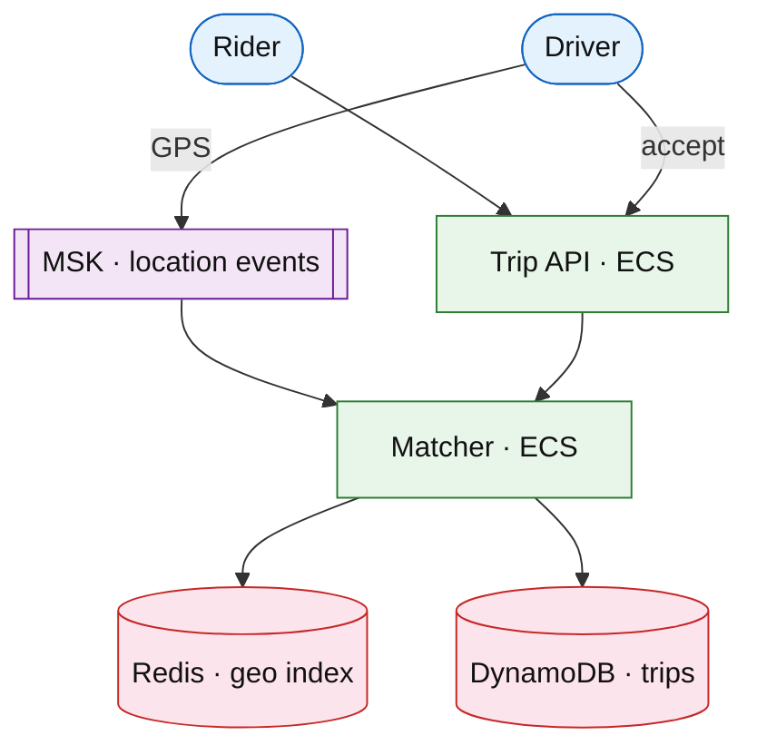

# Rideshare on-demand matching

## Introduction

Rideshare matches **riders** requesting trips to **drivers** with supply nearby. The system optimizes **time-to-match**, **surge pricing**, and **offer timeouts** while keeping location updates fresh.

**Primary users:** riders (request trip), drivers (accept offers), operators (surge, supply dashboards).

**Interview pacing:** [60-minute runbook](../../prep/interview-runbook-60m.md) — deep dive **supply/demand matching + surge**.

Distinct from [delivery dispatch](./delivery-dispatch-matching.md) (courier jobs): here both sides are mobile consumers and **geo-indexed supply** dominates.

## Requirements discovery

### Interview Q&A cheat sheet

| Lock (target) |
| --- |
| 20M trips/day peak regions |
| Match p99 &lt; 15 s |
| Driver location update every 3–5 s |
| Surge by geohash cell |
| Out of scope: autonomous fleet routing |

### Parsed requirements

| Field | Target |
| --- | --- |
| Active drivers (peak city) | 50k online |
| Rider request RPS (peak) | ~30k/s global |
| Offer TTL | 15 s before re-offer |

## AWS service map

| Service | Role |
| --- | --- |
| DynamoDB | Trips, offers, driver state |
| ElastiCache | Geo supply index, surge multipliers |
| Amazon MSK | Location stream |
| ECS Fargate | Matcher + pricing |
| API Gateway + ALB | Mobile APIs |

## Architecture (user → database)

**Narrative:** Drivers publish location to **MSK**; **matcher** maintains **geo index** in Redis, scores candidates, sends **time-bound offers**. **Surge** reads demand/supply ratio per cell.

## Deep dive: matching + surge

- **Geohash** cells with cap on candidates evaluated.
- **Batch offers** to top-K drivers; first accept wins (optimistic locking on trip).
- **Surge:** `multiplier = f(wait_time, supply_density)` cached per cell.

## Related

- [Delivery dispatch](./delivery-dispatch-matching.md)
- [Maps routing](./maps-navigation-routing.md)
- [Real-time tracking](./real-time-delivery-tracking.md)
- [MSK drill](../aws/msk-kinesis.md)
